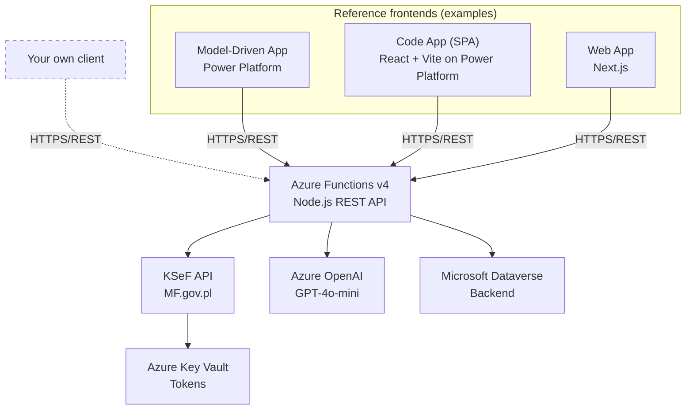
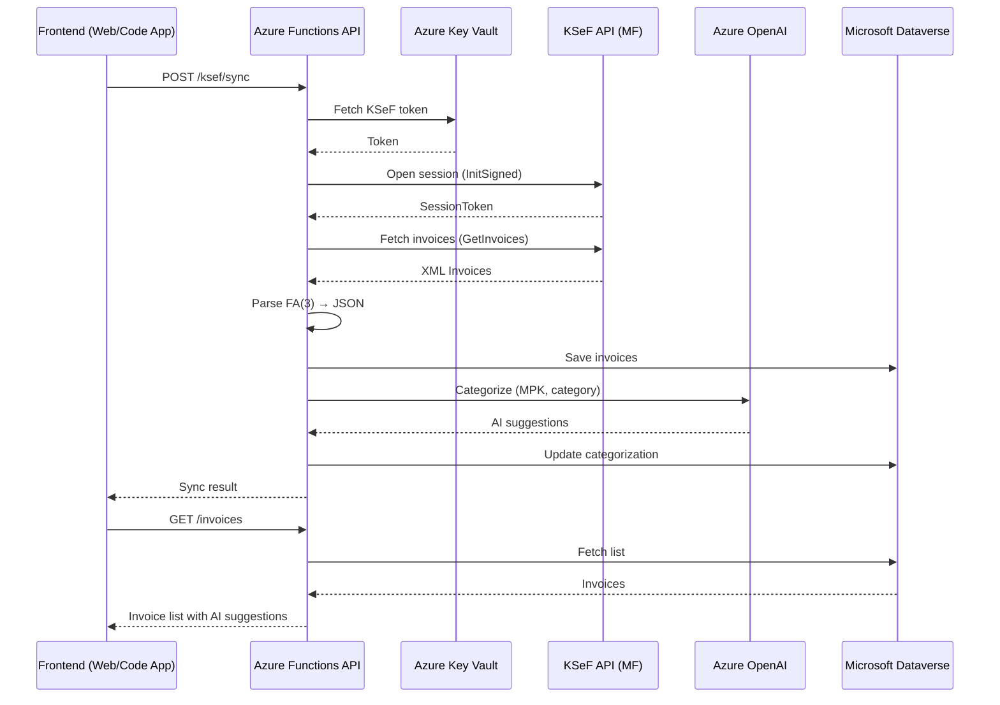

# KSeF Copilot

🇵🇱 [Wersja polska](README.md)

[](https://opensource.org/licenses/MIT)
[](https://nodejs.org/)
[](https://azure.microsoft.com/en-us/products/functions)
[](https://www.typescriptlang.org/)
[](https://www.npmjs.com/)

> Open-source **API-First** solution for integrating with Poland's National e-Invoice System (KSeF). The REST API (Azure Functions) is the core product — any HTTP client can consume it. The repository includes reference frontend implementations (Next.js, React SPA, Model-Driven App), but the real product is the API. The architectural priority is **Power Platform and Microsoft Dataverse** as the backend. Cloud-ready for Azure deployment.

## 🎯 Features

### Basic
- ✅ Synchronize purchase invoices from KSeF (session + selective import)
- ✅ Manual and automatic categorization (MPK, category, project)
- ✅ Payment status tracking (pending/paid/overdue)
- ✅ Web dashboard with interactive analytics
- ✅ RBAC: Admin + Reader roles
- ✅ Secure token storage (Azure Key Vault)
- ✅ Multi-currency support (PLN/EUR/USD) with NBP exchange rates
- ✅ Corrective invoices — full support with parent linkage

### MPK Management & Budgets
- 🏢 **Cost Centers (MPK)** — full CRUD, dedicated Dataverse table instead of OptionSet
- 💰 **MPK Budgeting** — monthly/quarterly budgets, utilization status, threshold alerts
- 👥 **MPK Approvers** — assign approvers to cost centers

### Invoice Approval Workflow
- ✅ **Approve/reject** invoices with comments
- ✅ **Bulk approve** multiple invoices at once
- ✅ **Approval SLA** — hourly timer trigger, overdue notifications
- ✅ **Cancel approval** (Admin only)
- ✅ **Refresh approver list** per invoice

### Notifications
- 🔔 **Notification system** — list, mark as read, dismiss
- 🔔 **Unread counter** — per user

### Reports
- 📊 **Budget utilization** — report per MPK
- 📊 **Approval history** — with filters (date, MPK, status)
- 📊 **Approver performance** — stats per approver
- 📊 **Invoice processing** — invoice pipeline

### Extended
- 🤖 AI-powered automatic categorization (Azure OpenAI) with auto-apply after sync
- 🏢 Multi-tenant support (multiple companies)
- 📊 Export to CSV/Excel
- 🔍 Expense forecasting (5 algorithms)
- ⚠️ Anomaly detection (5 detection rules)
- 📄 AI document scanning (OCR)
- 🔗 Supplier verification — White List VAT (replaced GUS)

## 🏗️ Architecture




<details>
<summary>ASCII fallback</summary>

```
                 Reference frontends (examples)
    ┌─────────────┐  ┌─────────────┐  ┌─────────────┐
    │ Model-Driven│  │  Code App   │  │   Web App   │
    │     App     │  │ (React SPA) │  │  (Next.js)  │
    └──────┬──────┘  └──────┬──────┘  └──────┬──────┘
           │                │                │
           └────────────────┼────────────────┘
                            │ HTTPS/REST
                            ▼
┌─────────────────────────────────────────────────────────┐
│         Azure Functions v4 (Node.js) — REST API         │
│             ★ Core product (API-First) ★                │
└─────────────────────────────────────────────────────────┘
        │                │                │
        ▼                ▼                ▼
┌─────────────┐  ┌─────────────┐  ┌─────────────┐
│   KSeF API  │  │ Azure OpenAI│  │  Dataverse  │
│  (MF.gov.pl)│  │ (GPT-4o)    │  │  (Backend)  │
└─────────────┘  └─────────────┘  └─────────────┘
        │
        ▼
┌─────────────┐
│ Key Vault   │
│ (Tokens)    │
└─────────────┘
```

</details>

## 📦 Project Structure

```
KSeFCopilot/
├── api/                 # Azure Functions (REST API) — core product
│   ├── src/
│   │   ├── functions/   # HTTP triggers (endpoints)
│   │   ├── lib/         # Core libraries (ksef, dataverse, auth)
│   │   └── types/       # TypeScript types
│   └── tests/
├── web/                 # Reference implementation: Next.js
│   ├── app/             # App router pages
│   ├── components/      # React components
│   └── lib/             # Client utilities
├── code-app/            # Reference implementation: React SPA (Power Platform, npm workspace)
├── docs/                # Documentation
└── deployment/          # IaC (Bicep)
```

## � Demo

> Screenshots coming soon. Watch the [webinar (Polish)](https://youtu.be/MDGhP9tcLQk) to see the system in action.

<!-- TODO: Add screenshots from docs/screenshots/ -->

## 🤖 Copilot Studio Agent

KSeF Copilot includes a ready-to-use agent for **Microsoft Copilot Studio**, running in Microsoft Teams. The agent uses the Custom Connector and exposes **14 tools**:

| Tool | Description |
|------|-------------|
| Search Invoices | Filter by date, vendor, NIP, status |
| Invoice Details | Full invoice data from KSeF |
| Expense Reports | Summaries by MPK, category, vendor |
| Anomaly Detection | Identify suspicious amounts and duplicates |
| Expense Forecasts | Predicted costs for next months |
| VAT Verification | Check vendors against the VAT Whitelist |
| Payment Status | Overview of pending/overdue invoices |
| Dashboard Stats | Company KPIs in a single query |
| KSeF Sync | Trigger invoice synchronization |
| Invoice Notes | Add and read internal notes |
| Cost Centers | MPK management |
| Invoice Approval | Approve / reject with comments |
| MPK Budgets | Budget utilization status |
| Notifications | View alerts and notifications |

More: [Agent documentation](docs/en/COPILOT_AGENT.md)

## 🔄 KSeF Synchronization Flow



## 💼 Use Cases

| Scenario | Description |
|----------|-------------|
| **Software House** | Automatic categorization of cost invoices (hosting, licenses, subcontractors) via AI. Expense dashboard per project. |
| **Corporate Group** | Central invoice approval across subsidiaries. Approval workflow with amount thresholds per MPK. Consolidated reports. |
| **Accounting Firm** | Multi-tenant: manage multiple clients from a single panel. Copilot Agent for quick invoice status checks per client. |
| **Mid-size Company with Multiple MPKs** | Monthly/quarterly budgeting per cost center. Budget overflow alerts. Approver performance reports. |
| **Sole Proprietorship** | Simple KSeF sync + dashboard with anomaly detection and forecasting. No workflow — direct invoice view. |

## 📦 Power Platform Artifacts

| Artifact | Description | Version | Path |
|----------|-------------|---------|------|
| **Dataverse Solution** | Tables, Model-Driven App, Code Component, Security Roles, Option Sets | 0.2.0 | [`deployment/powerplatform/`](deployment/powerplatform/) |
| **Custom Connector** | OpenAPI connector to REST API | 0.2.0 | [`deployment/powerplatform/`](deployment/powerplatform/) |
| **Swagger (OpenAPI)** | API endpoint definitions | 1.0 | [`deployment/powerplatform/connector/`](deployment/powerplatform/connector/) |

> Import guide: [Power Platform README](deployment/powerplatform/README.md)


### Prerequisites

- Node.js 20+
- npm 10+
- Azure subscription
- Dataverse environment
- KSeF account (test/demo/prod)
- Azure Entra ID app registration

### Installation

```bash
# Clone the repository
git clone https://github.com/Developico/KSeFCopilot.git
cd KSeFCopilot

# Install dependencies
npm install
```

### API Configuration

```bash
# Navigate to API directory
cd api

# Copy environment template
cp local.settings.example.json local.settings.json

# Edit local.settings.json with your configuration:
# - AZURE_TENANT_ID
# - AZURE_CLIENT_ID
# - AZURE_CLIENT_SECRET
# - DATAVERSE_URL
# - AZURE_KEYVAULT_URL
# - KSEF_ENVIRONMENT (test/demo/prod)
# - KSEF_NIP
```

### Web App Configuration

```bash
# Navigate to Web directory
cd web

# Copy environment template
cp .env.example .env.local

# Edit .env.local:
# - NEXT_PUBLIC_AZURE_CLIENT_ID - Azure app registration client ID
# - NEXT_PUBLIC_AZURE_TENANT_ID - Azure tenant ID
# - NEXT_PUBLIC_API_BASE_URL - API URL (default: http://localhost:7071/api)
```

### Azure Entra ID Setup

1. Create App Registration in Azure Portal
2. Add redirect URI: `http://localhost:3000` (development)
3. Enable "ID tokens" under Authentication
4. Add API permissions for Microsoft Dataverse
5. Copy Client ID and Tenant ID to environment files

### Development

```bash
# Start both API and Web in development mode
npm run dev

# Or run separately:
npm run dev --workspace=api      # API on http://localhost:7071
npm run dev --workspace=web      # Web on http://localhost:3000
```

### Testing

```bash
# Run all tests
npm test

# Type checking
npm run typecheck

# Linting
npm run lint
```

## ⚙️ Configuration

### Environment Variables

| Variable | Description | Required |
|----------|-------------|----------|
| `AZURE_TENANT_ID` | Azure Entra ID tenant | ✅ |
| `AZURE_CLIENT_ID` | App registration client ID | ✅ |
| `AZURE_CLIENT_SECRET` | App registration secret | ✅ |
| `DATAVERSE_URL` | Dataverse environment URL | ✅ |
| `AZURE_KEYVAULT_URL` | Key Vault URL for tokens | ✅ |
| `KSEF_ENVIRONMENT` | KSeF env: test/demo/prod | ✅ |
| `KSEF_NIP` | Company NIP (10 digits) | ✅ |

See [.env.example](.env.example) for full list.

### KSeF Token Setup

1. Log in to [KSeF Portal](https://ap-demo.ksef.mf.gov.pl/) (use demo for testing)
2. Authenticate as company representative
3. Generate authorization token (INVOICE_READ permission)
4. Store token in Azure Key Vault

## 📚 Documentation

- [Architecture](docs/en/ARCHITECTURE.md) — System design details
- [API Reference](docs/en/API.md) — REST API documentation
- [Dataverse Schema](docs/en/DATAVERSE_SCHEMA.md) — Data model reference
- [Environment Variables](docs/en/ENVIRONMENT_VARIABLES.md) — Configuration reference
- [Troubleshooting](docs/en/TROUBLESHOOTING.md) — Common issues & solutions
- [Local Development](docs/en/LOCAL_DEVELOPMENT.md) — Local setup instructions
- [Cost Analysis](docs/en/COST_ANALYSIS.md) — Azure cost breakdown
- [Deployment Guide](deployment/README.md) — Full deployment walkthrough (13 steps)
- [API Deployment](deployment/azure/API_DEPLOYMENT.md) — Azure Functions deployment
- [Web Deployment](deployment/azure/WEB_DEPLOYMENT.md) — App Service deployment

## 🤝 Contributing

Contributions are welcome! Please read our [Contributing Guide](CONTRIBUTING.md) for details.

1. Fork the repository
2. Create your feature branch (`git checkout -b feature/amazing-feature`)
3. Commit your changes (`git commit -m 'feat: description'`)
4. Push to the branch (`git push origin feature/amazing-feature`)
5. Open a Pull Request

## 💼 Commercial Support

Need help deploying KSeF in your organization? We offer:

- Solution deployment and configuration
- Customization to your specific needs
- Integration with existing systems
- Training and technical support

📧 **contact@developico.com**

## 📄 License

This project is licensed under the MIT License — see the [LICENSE](LICENSE) file for details.

## 🙏 Acknowledgments

- [Ministerstwo Finansów](https://www.podatki.gov.pl/ksef/) — KSeF API documentation
- [Microsoft Dataverse](https://docs.microsoft.com/en-us/power-apps/developer/data-platform/) — Backend platform
- [Azure Functions](https://docs.microsoft.com/en-us/azure/azure-functions/) — Serverless compute

---

Created by **[Developico Sp. z o.o.](https://developico.com)** | Łukasz Falaciński

📍 Hajoty 53/1, 01-821 Warsaw, Poland | 📧 contact@developico.com
