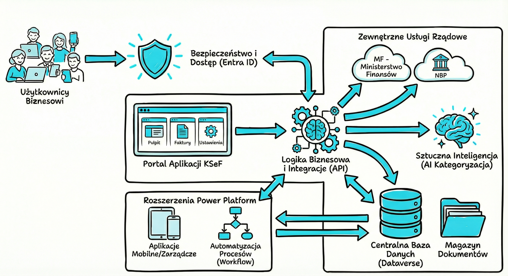
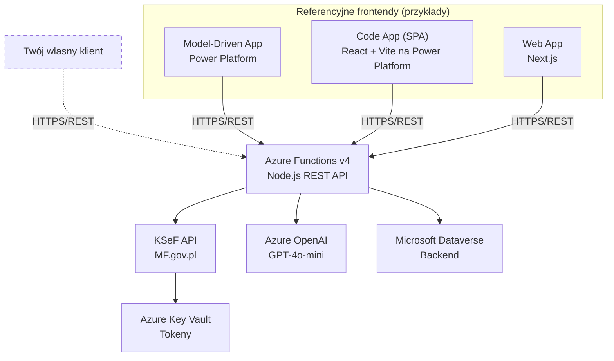

# KSeF Copilot

EN [English version](README.en.md)

[](https://opensource.org/licenses/MIT)
[](https://nodejs.org/)
[](https://azure.microsoft.com/en-us/products/functions)
[](https://www.typescriptlang.org/)
[](https://www.npmjs.com/)

## 🎬 Webinar — demonstracja rozwiązania

[](https://youtu.be/MDGhP9tcLQk)

---

> Otwarte rozwiązanie do integracji z Krajowym Systemem e-Faktur (KSeF), zbudowane w filozofii **API-First**. REST API (Azure Functions) stanowi rdzeń produktu — każdy klient HTTP może z niego korzystać. Repozytorium zawiera referencyjne implementacje frontendowe (Next.js, React SPA, Model-Driven App), ale prawdziwym produktem jest API. Priorytetem architektonicznym jest wykorzystanie **Power Platform i Microsoft Dataverse** jako backendu. Gotowe do wdrożenia w chmurze Azure.

## 🎯 Funkcje

### Podstawowe
- ✅ Synchronizacja faktur zakupowych z KSeF
- ✅ Ręczna kategoryzacja (MPK, kategoria, projekt)
- ✅ Śledzenie statusu płatności (oczekująca/zapłacona)
- ✅ Dashboard webowy
- ✅ RBAC: role Administrator + Czytelnik
- ✅ Bezpieczne przechowywanie tokenów (Azure Key Vault)

### Rozszerzone
- 🤖 Automatyczna kategoryzacja AI (Azure OpenAI)
- 🏢 Obsługa wielu firm (multi-tenant)
- 📊 Eksport do CSV/Excel


## 🏗️ Architektura





<details>
<summary>ASCII fallback</summary>

```
                Referencyjne frontendy (przykłady)
    ┌─────────────┐  ┌─────────────┐  ┌─────────────┐
    │ Model-Driven│  │  Code App   │  │   Web App   │
    │     App     │  │ (React SPA) │  │  (Next.js)  │
    └──────┬──────┘  └──────┬──────┘  └──────┬──────┘
           │                │                │
           └────────────────┼────────────────┘
                            │ HTTPS/REST
                            ▼
┌─────────────────────────────────────────────────────────┐
│         Azure Functions v4 (Node.js) — REST API         │
│              ★ Rdzeń produktu (API-First) ★             │
└─────────────────────────────────────────────────────────┘
        │                │                │
        ▼                ▼                ▼
┌─────────────┐  ┌─────────────┐  ┌─────────────┐
│   KSeF API  │  │ Azure OpenAI│  │  Dataverse  │
│  (MF.gov.pl)│  │ (GPT-4o)    │  │  (Backend)  │
└─────────────┘  └─────────────┘  └─────────────┘
        │
        ▼
┌─────────────┐
│ Key Vault   │
│ (Tokeny)    │
└─────────────┘
```

</details>

```
KSeFCopilot/
├── api/                 # Azure Functions (REST API) — rdzeń produktu
│   ├── src/
│   │   ├── functions/   # HTTP triggers (endpointy)
│   │   ├── lib/         # Biblioteki (ksef, dataverse, auth)
│   │   └── types/       # Typy TypeScript
│   └── tests/
├── web/                 # Implementacja referencyjna: Next.js
│   ├── app/             # App router (strony)
│   ├── components/      # Komponenty React
│   └── lib/             # Narzędzia klienckie
├── code-app/            # Implementacja referencyjna: React SPA (Power Platform)
├── docs/                # Dokumentacja
└── deployment/          # IaC (Bicep)
```

## 🚀 Szybki start

### Wymagania wstępne

- Node.js 20+
- npm 10+
- Subskrypcja Azure
- Środowisko Dataverse
- Konto KSeF (test/demo/prod)
- Rejestracja aplikacji Azure Entra ID

### Instalacja

```bash
# Klonowanie repozytorium
git clone https://github.com/Developico/KSeFCopilot.git
cd KSeFCopilot

# Instalacja zależności
npm install
```

### Konfiguracja API

```bash
# Przejdź do katalogu API
cd api

# Skopiuj szablon konfiguracji
cp local.settings.example.json local.settings.json

# Uzupełnij local.settings.json:
# - AZURE_TENANT_ID
# - AZURE_CLIENT_ID
# - AZURE_CLIENT_SECRET
# - DATAVERSE_URL
# - AZURE_KEYVAULT_URL
# - KSEF_ENVIRONMENT (test/demo/prod)
# - KSEF_NIP
```

### Konfiguracja aplikacji webowej

```bash
# Przejdź do katalogu Web
cd web

# Skopiuj szablon zmiennych środowiskowych
cp .env.example .env.local

# Uzupełnij .env.local:
# - NEXT_PUBLIC_AZURE_CLIENT_ID - Client ID rejestracji aplikacji
# - NEXT_PUBLIC_AZURE_TENANT_ID - Tenant ID Azure
# - NEXT_PUBLIC_API_BASE_URL - URL API (domyślnie: http://localhost:7071/api)
```

### Konfiguracja Azure Entra ID

1. Utwórz App Registration w Azure Portal
2. Dodaj redirect URI: `http://localhost:3000` (rozwój)
3. Włącz „ID tokens" w sekcji Authentication
4. Dodaj uprawnienia API dla Microsoft Dataverse
5. Skopiuj Client ID i Tenant ID do plików konfiguracyjnych

### Uruchamianie

```bash
# Uruchom API i aplikację webową w trybie deweloperskim
npm run dev

# Lub osobno:
npm run dev --workspace=api      # API: http://localhost:7071
npm run dev --workspace=web      # Web: http://localhost:3000
```

### Testy

```bash
# Uruchom wszystkie testy
npm test

# Sprawdzenie typów
npm run typecheck

# Linting
npm run lint
```

## ⚙️ Konfiguracja

### Zmienne środowiskowe

| Zmienna | Opis | Wymagana |
|---------|------|----------|
| `AZURE_TENANT_ID` | Tenant ID Azure Entra ID | ✅ |
| `AZURE_CLIENT_ID` | Client ID rejestracji aplikacji | ✅ |
| `AZURE_CLIENT_SECRET` | Client Secret rejestracji aplikacji | ✅ |
| `DATAVERSE_URL` | URL środowiska Dataverse | ✅ |
| `AZURE_KEYVAULT_URL` | URL Key Vault do przechowywania tokenów | ✅ |
| `KSEF_ENVIRONMENT` | Środowisko KSeF: test/demo/prod | ✅ |
| `KSEF_NIP` | NIP firmy (10 cyfr) | ✅ |

Pełna lista w pliku [.env.example](.env.example).

### Konfiguracja tokenu KSeF

1. Zaloguj się do [Portalu KSeF](https://ap-demo.ksef.mf.gov.pl/) (użyj demo do testów)
2. Uwierzytelnij się jako przedstawiciel firmy
3. Wygeneruj token autoryzacyjny (uprawnienie INVOICE_READ)
4. Zapisz token w Azure Key Vault

## 📚 Dokumentacja

### Dokumentacja techniczna (`docs/`)

- [Architektura](docs/pl/ARCHITEKTURA.md) — Szczegóły architektury systemu
- [API Reference (PL)](docs/pl/API.md) — Dokumentacja REST API
- [Schemat Dataverse](docs/pl/DATAVERSE_SCHEMAT.md) — Model danych
- [Zmienne środowiskowe](docs/pl/ZMIENNE_SRODOWISKOWE.md) — Opis konfiguracji
- [Rozwiązywanie problemów](docs/pl/ROZWIAZYWANIE_PROBLEMOW.md) — Troubleshooting
- [Nawigacja po dokumentacji](docs/README.md) — Pełny spis dokumentów

### Wdrożenie produkcyjne (`deployment/`)

- [**Przewodnik wdrożenia**](deployment/README.md) — Kompletny przewodnik 13 kroków
- [Lista kontrolna](deployment/CHECKLIST.md) — Interaktywna checklist z polami danych
- [Wdrożenie API](deployment/azure/API_DEPLOYMENT.md) — Deploy Azure Functions (Flex Consumption)
- [Wdrożenie Web](deployment/azure/WEB_DEPLOYMENT.md) — Deploy Azure App Service (Next.js standalone)
- [Entra ID](deployment/azure/ENTRA_ID_KONFIGURACJA.md) — Konfiguracja App Registration
- [Tokeny KSeF](deployment/azure/TOKEN_SETUP_GUIDE.md) — Tokeny w Key Vault
- [Solucja Power Platform](deployment/powerplatform/README.md) — Import solucji, schemat Dataverse
- [Custom Connector](deployment/powerplatform/connector/README.md) — Konfiguracja konektora
- [Historia zmian API](CHANGELOG.md) — Wersje i zmiany w API oraz Power Platform
  - [Historia zmian Web App](web/public/changelog.md)
  - [Historia zmian Code App](code-app/public/changelog.md)
- [Analiza kosztów](docs/pl/ANALIZA_KOSZTOW.md) — Koszty rozwiązania w Azure

## 🤝 Współpraca

Zapraszamy do współtworzenia projektu! Przeczytaj [Contributing Guide](CONTRIBUTING.md) (EN).

1. Zrób fork repozytorium
2. Utwórz branch (`git checkout -b feature/nowa-funkcja`)
3. Zatwierdź zmiany (`git commit -m 'feat: opis zmian'`)
4. Wypchnij branch (`git push origin feature/nowa-funkcja`)
5. Otwórz Pull Request

## 💼 Wsparcie komercyjne

Potrzebujesz pomocy we wdrożeniu KSeF w swojej organizacji? Oferujemy:

- Wdrożenie i konfigurację rozwiązania
- Dostosowanie do indywidualnych potrzeb
- Integrację z istniejącymi systemami
- Szkolenia i wsparcie techniczne

📧 **contact@developico.com**

## 📄 Licencja

Projekt udostępniony na licencji MIT — szczegóły w pliku [LICENSE](LICENSE).


Stworzone przez **[Developico Sp. z o.o.](https://developico.com)** | Łukasz Falaciński

📍 Hajoty 53/1, 01-821 Warszawa, Polska | 📧 contact@developico.com


