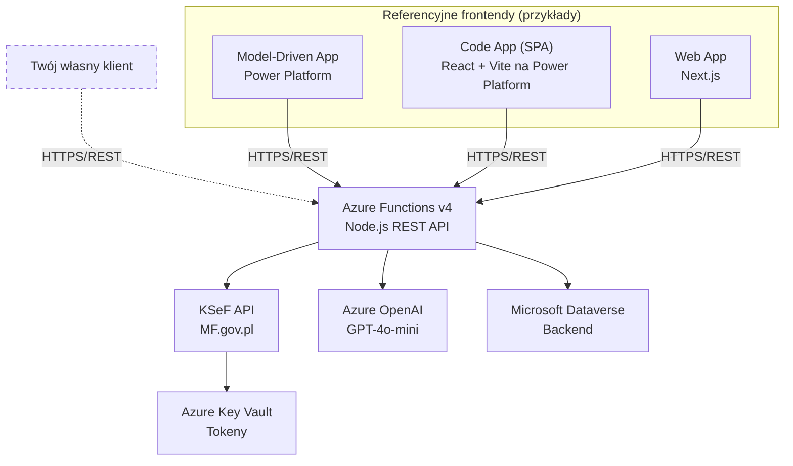
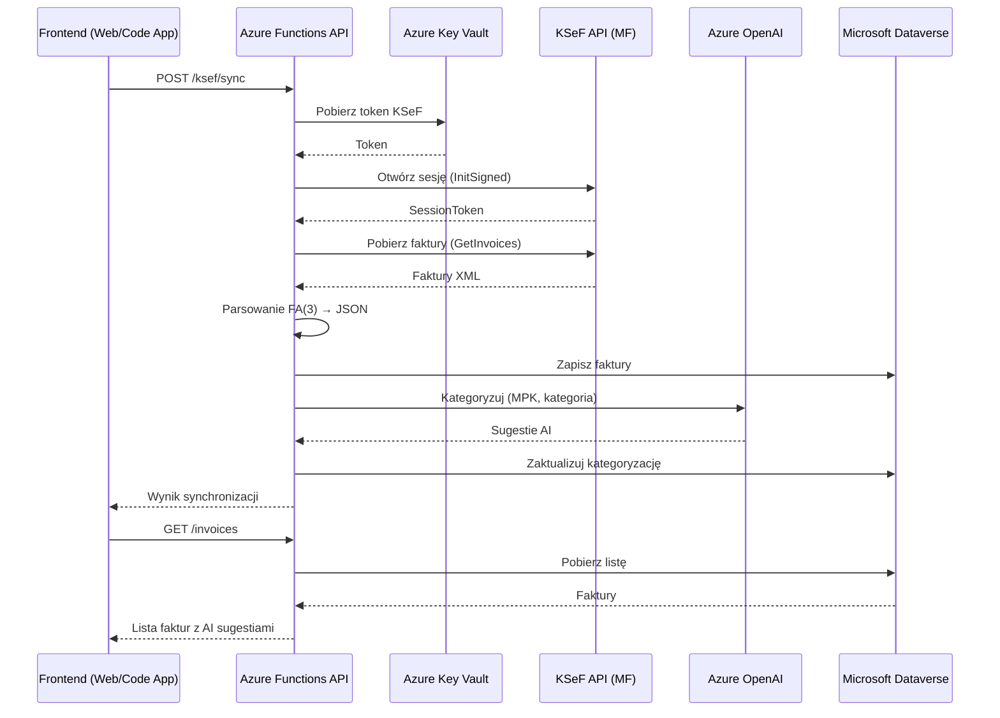

# KSeF Copilot

EN [English version](README.en.md)

[](https://opensource.org/licenses/MIT)
[](https://nodejs.org/)
[](https://azure.microsoft.com/en-us/products/functions)
[](https://www.typescriptlang.org/)
[](https://www.npmjs.com/)

## 🎬 Webinar — demonstracja rozwiązania

[](https://youtu.be/MDGhP9tcLQk)

## 🎬 Co nowego w v0.2.0

[](https://youtu.be/dzGFUU8Y_JE)

## 🎬 Co nowego w v0.3.0

[](https://youtu.be/JXMyhx1slTY)

---

> Otwarte rozwiązanie do integracji z Krajowym Systemem e-Faktur (KSeF), zbudowane w filozofii **API-First**. REST API (Azure Functions) stanowi rdzeń produktu — każdy klient HTTP może z niego korzystać. Repozytorium zawiera referencyjne implementacje frontendowe (Next.js, React SPA, Model-Driven App), ale prawdziwym produktem jest API. Priorytetem architektonicznym jest wykorzystanie **Power Platform i Microsoft Dataverse** jako backendu. Gotowe do wdrożenia w chmurze Azure.

## 🎯 Funkcje

### Podstawowe
- ✅ Synchronizacja faktur zakupowych z KSeF (sesja + import selektywny)
- ✅ Ręczna i automatyczna kategoryzacja (MPK, kategoria, projekt)
- ✅ Śledzenie statusu płatności (oczekująca/zapłacona/przeterminowana)
- ✅ Dashboard webowy z interaktywną analityką
- ✅ RBAC: role Administrator + Czytelnik
- ✅ Bezpieczne przechowywanie tokenów (Azure Key Vault)
- ✅ Wielowalutowość (PLN/EUR/USD) z kursami NBP
- ✅ Faktury korygujące — pełna obsługa z powiązaniami

### Zarządzanie MPK i budżety
- 🏢 **Centra kosztowe (MPK)** — pełne CRUD, dedykowana tabela Dataverse zamiast OptionSet
- 💰 **Budżetowanie MPK** — miesięczne/kwartalne budżety, status wykorzystania, alerty przekroczeń
- 👥 **Akceptanci MPK** — przypisywanie akceptantów do centrów kosztowych

### Workflow zatwierdzania faktur
- ✅ **Zatwierdzanie/odrzucanie** faktur z komentarzem
- ✅ **Masowe zatwierdzanie** (bulk approve)
- ✅ **SLA akceptacji** — Timer trigger co godzinę, powiadomienia o przekroczeniach
- ✅ **Anulowanie akceptacji** (Admin)
- ✅ **Odświeżanie listy akceptantów** per faktura

### Powiadomienia
- 🔔 **System powiadomień** — lista, oznaczanie jako przeczytane, odrzucanie
- 🔔 **Licznik nieprzeczytanych** — per użytkownik

### Raporty
- 📊 **Wykorzystanie budżetu** — raport per MPK
- 📊 **Historia akceptacji** — z filtrami (data, MPK, status)
- 📊 **Wydajność akceptantów** — statystyki per akceptant
- 📊 **Przetwarzanie faktur** — pipeline faktur

### Rozszerzone
- 🤖 Automatyczna kategoryzacja AI (Azure OpenAI) z auto-apply po synchronizacji
- 🏢 Obsługa wielu firm (multi-tenant)
- 📊 Eksport do CSV/Excel
- 🔍 Prognozowanie wydatków (5 algorytmów)
- ⚠️ Wykrywanie anomalii (5 reguł detekcji)
- 📄 Skanowanie dokumentów AI (OCR)
- 🔗 Weryfikacja dostawców — Biała Lista VAT (zastąpiło GUS)

### Samofakturowanie (Self-Billing)
- 🧾 **Zarządzanie dostawcami** — lista, szczegóły, dodawanie z rejestru VAT, statystyki
- 📝 **Umowy SB** — pełne CRUD, terminacja, powiązanie z dostawcą
- 📋 **Szablony SB** — CRUD, duplikowanie
- 🧾 **Faktury samofakturowania** — generowanie, podgląd, zatwierdzanie, odrzucanie z powodem
- 📤 **Wysyłka do KSeF** — integracja ze statusami KSeF
- 📥 **Import faktur** — import z CSV/Excel z walidacją i podglądem
- 🔄 **Workflow statusów** — Draft → PendingSeller → SellerApproved → SentToKsef
- 📄 **Zgodność XML z interpretacją KIS** *(v0.3.5)* — zatwierdzanie na podstawie pliku XML, metadane DodatkowyOpis, podgląd faktury w formacie tabelarycznym, druk/PDF, auto-approve

### Dokumenty kosztowe *(v1.0.0)*
- 📄 **7 typów dokumentów** — Paragon, Pokwitowanie, Pro forma, Nota księgowa, Rachunek, Umowa zlecenie/o dzieło, Inne
- ✏️ **Pełne CRUD** — lista z filtrami (typ, status, data, wyszukiwanie), tworzenie, edycja, usuwanie
- ✅ **Operacje grupowe** — zatwierdzanie, odrzucanie, oznaczanie jako opłacone (batch)
- 🤖 **AI kategoryzacja** — automatyczna klasyfikacja MPK + kategoria via Azure OpenAI
- 📷 **OCR** — ekstrakcja danych z paragonów i rachunków (Azure OpenAI Vision)
- 📥 **Import CSV/XLSX** — podgląd, walidacja, potwierdzenie, szablon do pobrania
- 📎 **Notatki i załączniki** — per dokument kosztowy
- 🔔 **Powiadomienia** — 3 nowe typy (wniosek o zatwierdzenie, decyzja, ostrzeżenie budżetowe)
- 💰 **Integracja z budżetami** — koszty z faktur i dokumentów kosztowych uwzględnione łącznie
- 📊 **Raport rozkładu kosztów** — KPI, wykres kołowy, top kategorie, stacked bar chart, tabela szczegółów


## 🏗️ Architektura




<details>
<summary>ASCII fallback</summary>

```
                Referencyjne frontendy (przykłady)
    ┌─────────────┐  ┌─────────────┐  ┌─────────────┐
    │ Model-Driven│  │  Code App   │  │   Web App   │
    │     App     │  │ (React SPA) │  │  (Next.js)  │
    └──────┬──────┘  └──────┬──────┘  └──────┬──────┘
           │                │                │
           └────────────────┼────────────────┘
                            │ HTTPS/REST
                            ▼
┌─────────────────────────────────────────────────────────┐
│         Azure Functions v4 (Node.js) — REST API         │
│              ★ Rdzeń produktu (API-First) ★             │
└─────────────────────────────────────────────────────────┘
        │                │                │
        ▼                ▼                ▼
┌─────────────┐  ┌─────────────┐  ┌─────────────┐
│   KSeF API  │  │ Azure OpenAI│  │  Dataverse  │
│  (MF.gov.pl)│  │ (GPT-4o)    │  │  (Backend)  │
└─────────────┘  └─────────────┘  └─────────────┘
        │
        ▼
┌─────────────┐
│ Key Vault   │
│ (Tokeny)    │
└─────────────┘
```

</details>

```
KSeFCopilot/
├── api/                 # Azure Functions (REST API) — rdzeń produktu
│   ├── src/
│   │   ├── functions/   # HTTP triggers (endpointy)
│   │   ├── lib/         # Biblioteki (ksef, dataverse, auth)
│   │   └── types/       # Typy TypeScript
│   └── tests/
├── web/                 # Implementacja referencyjna: Next.js
│   ├── app/             # App router (strony)
│   ├── components/      # Komponenty React
│   └── lib/             # Narzędzia klienckie
├── code-app/            # Implementacja referencyjna: React SPA (Power Platform, npm workspace)
├── docs/                # Dokumentacja
└── deployment/          # IaC (Bicep)
```

## � Demo

> Zrzuty ekranu zostaną dodane wkrótce. Obejrzyj [webinar](https://youtu.be/MDGhP9tcLQk) aby zobaczyć system w akcji.

<!-- TODO: Dodać screenshoty z docs/screenshots/ -->

## 🤖 Copilot Studio Agent

KSeF Copilot zawiera gotowego agenta dla **Microsoft Copilot Studio**, działającego w Microsoft Teams. Agent korzysta z Custom Connector i udostępnia **14 narzędzi**:

| Narzędzie | Opis |
|-----------|------|
| Wyszukiwanie faktur | Filtrowanie po dacie, dostawcy, NIP, statusie |
| Szczegóły faktury | Pełne dane faktury z KSeF |
| Raporty wydatków | Podsumowania per MPK, kategoria, dostawca |
| Wykrywanie anomalii | Identyfikacja podejrzanych kwot i duplikatów |
| Prognozy wydatków | Przewidywane koszty na następne miesiące |
| Weryfikacja VAT | Sprawdzanie dostawców na białej liście |
| Status płatności | Przegląd faktur oczekujących/przeterminowanych |
| Statystyki dashboard | KPI firmy w jednym zapytaniu |
| Synchronizacja KSeF | Uruchamianie pobierania faktur |
| Notatki do faktur | Dodawanie i odczyt notatek wewnętrznych |
| Centra kosztowe | Zarządzanie MPK |
| Zatwierdzanie faktur | Akceptacja / odrzucenie z komentarzem |
| Budżety MPK | Status wykorzystania budżetu |
| Powiadomienia | Przegląd alertów i powiadomień |

Więcej: [Dokumentacja agenta](docs/pl/COPILOT_AGENT.md)

## 🔄 Przepływ synchronizacji KSeF



## 💼 Scenariusze użycia

| Scenariusz | Opis |
|------------|------|
| **Software house** | Automatyczna kategoryzacja faktur kosztowych (hosting, licencje, podwykonawcy) przez AI. Dashboard wydatków per projekt. |
| **Grupa kapitałowa** | Centralna akceptacja faktur z wielu spółek-córek. Workflow zatwierdzania z progami kwotowymi per MPK. Skonsolidowane raporty. |
| **Biuro rachunkowe** | Multi-tenant: obsługa wielu klientów z jednego panelu. Copilot Agent dla szybkiego wglądu w status faktur każdego klienta. |
| **Średnia firma z wieloma MPK** | Budżetowanie miesięczne/kwartalne per centrum kosztowe. Alerty przekroczenia budżetu. Raporty wydajności akceptantów. |
| **Jednoosobowa firma** | Prosta synchronizacja KSeF + dashboard z wykrywaniem anomalii i prognozami. Bez workflow — bezpośredni podgląd faktur. |

## 📦 Artefakty Power Platform

| Artefakt | Opis | Wersja | Ścieżka |
|----------|------|--------|---------|
| **Solucja Dataverse** | Tabele, Model-Driven App, Code Component, Security Roles, Option Sets | 1.0.0.1 | [`deployment/powerplatform/DevelopicoKSeF_1_0_0_1.zip`](deployment/powerplatform/DevelopicoKSeF_1_0_0_1.zip) |
| **Custom Connector** | Konektor OpenAPI do REST API (faktury, koszty, samofakturowanie) | 1.0.0.1 | [`deployment/powerplatform/KSeFCopilotCustomConnectorbyDevelopico_1_0_0_1.zip`](deployment/powerplatform/KSeFCopilotCustomConnectorbyDevelopico_1_0_0_1.zip) |
| **Swagger (OpenAPI)** | Definicja endpointów API | 1.0 | [`deployment/powerplatform/connector/`](deployment/powerplatform/connector/) |

> Instrukcja importu: [Power Platform README](deployment/powerplatform/README.md)


### Wymagania wstępne

- Node.js 20+
- npm 10+
- Subskrypcja Azure
- Środowisko Dataverse
- Konto KSeF (test/demo/prod)
- Rejestracja aplikacji Azure Entra ID

### Instalacja

```bash
# Klonowanie repozytorium
git clone https://github.com/Developico/KSeFCopilot.git
cd KSeFCopilot

# Instalacja zależności
npm install
```

### Konfiguracja API

```bash
# Przejdź do katalogu API
cd api

# Skopiuj szablon konfiguracji
cp local.settings.example.json local.settings.json

# Uzupełnij local.settings.json:
# - AZURE_TENANT_ID
# - AZURE_CLIENT_ID
# - AZURE_CLIENT_SECRET
# - DATAVERSE_URL
# - AZURE_KEYVAULT_URL
# - KSEF_ENVIRONMENT (test/demo/prod)
# - KSEF_NIP
```

### Konfiguracja aplikacji webowej

```bash
# Przejdź do katalogu Web
cd web

# Skopiuj szablon zmiennych środowiskowych
cp .env.example .env.local

# Uzupełnij .env.local:
# - NEXT_PUBLIC_AZURE_CLIENT_ID - Client ID rejestracji aplikacji
# - NEXT_PUBLIC_AZURE_TENANT_ID - Tenant ID Azure
# - NEXT_PUBLIC_API_BASE_URL - URL API (domyślnie: http://localhost:7071/api)
```

### Konfiguracja Azure Entra ID

1. Utwórz App Registration w Azure Portal
2. Dodaj redirect URI: `http://localhost:3000` (rozwój)
3. Włącz „ID tokens" w sekcji Authentication
4. Dodaj uprawnienia API dla Microsoft Dataverse
5. Skopiuj Client ID i Tenant ID do plików konfiguracyjnych

### Uruchamianie

```bash
# Uruchom API i aplikację webową w trybie deweloperskim
npm run dev

# Lub osobno:
npm run dev --workspace=api      # API: http://localhost:7071
npm run dev --workspace=web      # Web: http://localhost:3000
```

### Testy

```bash
# Uruchom wszystkie testy
npm test

# Sprawdzenie typów
npm run typecheck

# Linting
npm run lint
```

## ⚙️ Konfiguracja

### Zmienne środowiskowe

| Zmienna | Opis | Wymagana |
|---------|------|----------|
| `AZURE_TENANT_ID` | Tenant ID Azure Entra ID | ✅ |
| `AZURE_CLIENT_ID` | Client ID rejestracji aplikacji | ✅ |
| `AZURE_CLIENT_SECRET` | Client Secret rejestracji aplikacji | ✅ |
| `DATAVERSE_URL` | URL środowiska Dataverse | ✅ |
| `AZURE_KEYVAULT_URL` | URL Key Vault do przechowywania tokenów | ✅ |
| `KSEF_ENVIRONMENT` | Środowisko KSeF: test/demo/prod | ✅ |
| `KSEF_NIP` | NIP firmy (10 cyfr) | ✅ |

Pełna lista w pliku [.env.example](.env.example).

### Konfiguracja tokenu KSeF

1. Zaloguj się do [Portalu KSeF](https://ap-demo.ksef.mf.gov.pl/) (użyj demo do testów)
2. Uwierzytelnij się jako przedstawiciel firmy
3. Wygeneruj token autoryzacyjny (uprawnienie INVOICE_READ)
4. Zapisz token w Azure Key Vault

## 📚 Dokumentacja

### Dokumentacja techniczna (`docs/`)

- [Architektura](docs/pl/ARCHITEKTURA.md) — Szczegóły architektury systemu
- [API Reference (PL)](docs/pl/API.md) — Dokumentacja REST API
- [Schemat Dataverse](docs/pl/DATAVERSE_SCHEMAT.md) — Model danych
- [Zmienne środowiskowe](docs/pl/ZMIENNE_SRODOWISKOWE.md) — Opis konfiguracji
- [Rozwiązywanie problemów](docs/pl/ROZWIAZYWANIE_PROBLEMOW.md) — Troubleshooting
- [Nawigacja po dokumentacji](docs/README.md) — Pełny spis dokumentów

### Wdrożenie produkcyjne (`deployment/`)

- [**Przewodnik wdrożenia**](deployment/README.md) — Kompletny przewodnik 13 kroków
- [Lista kontrolna](deployment/CHECKLIST.md) — Interaktywna checklist z polami danych
- [Wdrożenie API](deployment/azure/API_DEPLOYMENT.md) — Deploy Azure Functions (Flex Consumption)
- [Wdrożenie Web](deployment/azure/WEB_DEPLOYMENT.md) — Deploy Azure App Service (Next.js standalone)
- [Entra ID](deployment/azure/ENTRA_ID_KONFIGURACJA.md) — Konfiguracja App Registration
- [Tokeny KSeF](deployment/azure/TOKEN_SETUP_GUIDE.md) — Tokeny w Key Vault
- [Solucja Power Platform](deployment/powerplatform/README.md) — Import solucji, schemat Dataverse
- [Custom Connector](deployment/powerplatform/connector/README.md) — Konfiguracja konektora
- [Historia zmian API](CHANGELOG.md) — Wersje i zmiany w API oraz Power Platform
  - [Historia zmian Web App](web/public/changelog.md)
  - [Historia zmian Code App](code-app/public/changelog.md)
- [Analiza kosztów](docs/pl/ANALIZA_KOSZTOW.md) — Koszty rozwiązania w Azure

## 🤝 Współpraca

Zapraszamy do współtworzenia projektu! Przeczytaj [Contributing Guide](CONTRIBUTING.md) (EN).

1. Zrób fork repozytorium
2. Utwórz branch (`git checkout -b feature/nowa-funkcja`)
3. Zatwierdź zmiany (`git commit -m 'feat: opis zmian'`)
4. Wypchnij branch (`git push origin feature/nowa-funkcja`)
5. Otwórz Pull Request

## 💼 Wsparcie komercyjne

Potrzebujesz pomocy we wdrożeniu KSeF w swojej organizacji? Oferujemy:

- Wdrożenie i konfigurację rozwiązania
- Dostosowanie do indywidualnych potrzeb
- Integrację z istniejącymi systemami
- Szkolenia i wsparcie techniczne

📧 **contact@developico.com**

## 📄 Licencja

Projekt udostępniony na licencji MIT — szczegóły w pliku [LICENSE](LICENSE).


Stworzone przez **[Developico Sp. z o.o.](https://developico.com)** | Łukasz Falaciński

📍 Hajoty 53/1, 01-821 Warszawa, Polska | 📧 contact@developico.com


