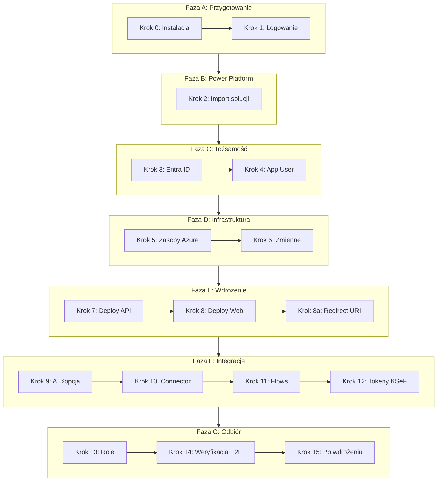
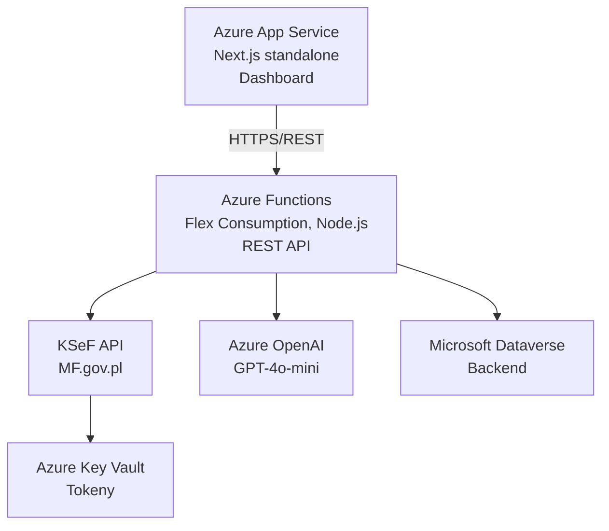

# Przewodnik wdrożenia — KSeF Integration

> Kompletny, krok po kroku przewodnik wdrożenia rozwiązania KSeF Copilot w chmurze Azure i Power Platform.

**Ostatnia aktualizacja:** 2026-02-21
**Wersja:** 4.0
**Szacowany czas wdrożenia:** ~7–8 godzin (bez kroków opcjonalnych)

---

## Słownik pojęć

Jeśli natkniesz się na nieznany termin, sprawdź tutaj:

| Pojęcie | Wyjaśnienie |
|---------|-------------|
| **Azure Entra ID** (dawniej Azure AD) | Usługa tożsamości Microsoft — zarządza kontami użytkowników, logowaniem i uprawnieniami aplikacji. |
| **App Registration** | „Dowód osobisty" aplikacji w Entra ID — nadaje jej unikalny identyfikator (Client ID) i pozwala uwierzytelniać się w usługach Azure. |
| **Service Principal** | Konto usługowe powiązane z App Registration — używane przez API do automatycznego logowania (bez interakcji użytkownika). |
| **Flex Consumption** | Plan hostingowy Azure Functions z automatycznym skalowaniem i rozliczaniem za faktyczne zużycie (pay-per-execution). |
| **MDA App** (Model-Driven App) | Aplikacja Power Platform generowana automatycznie na podstawie struktury tabel Dataverse. |
| **Solucja (Solution)** | Paczka Power Platform (.zip) zawierająca tabele, aplikacje, procesy i role — umożliwia przenoszenie konfiguracji między środowiskami. |
| **Managed / Unmanaged** | Managed = zablokowana do edycji (produkcja). Unmanaged = edytowalna (dev). |
| **RBAC** (Role-Based Access Control) | Model uprawnień oparty na rolach — użytkownik otrzymuje rolę (np. Admin, Reader), a rola definiuje co wolno robić. |
| **Custom Connector** | Komponent Power Platform pozwalający Power Automate i Power Apps komunikować się z zewnętrznym API (tu: Azure Functions). |
| **Key Vault** | Magazyn sekretów Azure — bezpieczne przechowywanie haseł, kluczy API i tokenów (np. tokeny KSeF). |
| **Dataverse** | Baza danych Power Platform — przechowuje tabele z danymi (faktury, ustawienia, logi). |
| **Bicep** | Język Infrastructure as Code (IaC) Microsoftu — pozwala definiować zasoby Azure w plikach tekstowych zamiast klikać w portalu. |
| **Placeholder `<...>`** | Wartość szablonowa do zastąpienia (np. `<AZURE_CLIENT_ID>`) — wstaw swoją własną wartość z tabeli danych zebranych w trakcie wdrożenia. |

---

## Diagram zależności kroków

Poniższy diagram pokazuje kolejność kroków i zależności między nimi:



<details>
<summary>ASCII fallback</summary>

```
Faza A: Przygotowanie
  [Krok 0: Instalacja] → [Krok 1: Logowanie i weryfikacja]
          │
          ▼
Faza B: Power Platform
  [Krok 2: Import solucji]
          │
          ▼
Faza C: Tożsamość i bezpieczeństwo
  [Krok 3: Entra ID] → [Krok 4: App User w Dataverse]
          │
          ▼
Faza D: Infrastruktura Azure
  [Krok 5: Zasoby Azure] → [Krok 6: Zmienne środowiskowe]
          │
          ▼
Faza E: Wdrożenie aplikacji
  [Krok 7: Deploy API] → [Krok 8: Deploy Web] → [Krok 8a: Redirect URI]
          │
          ▼
Faza F: Integracje
  [Krok 9: AI ⚡opcja] → [Krok 10: Connector] → [Krok 11: Flows] → [Krok 12: Tokeny KSeF]
          │
          ▼
Faza G: Odbiór i uruchomienie
  [Krok 13: Role] → [Krok 14: Weryfikacja E2E] → [Krok 15: Po wdrożeniu]
```

</details>

> **Zasada:** Każdy krok zależy od poprzedniego. Nie przeskakuj kroków — wartości z wcześniejszych kroków są potrzebne w kolejnych.

---

## Spis treści

- [Słownik pojęć](#słownik-pojęć)
- [Diagram zależności kroków](#diagram-zależności-kroków)
- [Architektura docelowa](#architektura-docelowa)
- [Struktura katalogu deployment/](#struktura-katalogu-deployment)
- [Dane do zebrania przed startem](#dane-do-zebrania-przed-startem)
- [Uruchomienie lokalne (opcjonalne)](#uruchomienie-lokalne-opcjonalne)

**Faza A — Przygotowanie** (⏱ ~50 min)
1. [Krok 0 — Instalacja narzędzi i rozszerzeń](#krok-0--instalacja-narzędzi-i-rozszerzeń) ⏱ ~30 min
2. [Krok 1 — Logowanie i weryfikacja dostępów](#krok-1--logowanie-i-weryfikacja-dostępów) ⏱ ~20 min

**Faza B — Power Platform** (⏱ ~20 min)
3. [Krok 2 — Import solucji Power Platform](#krok-2--import-solucji-power-platform) ⏱ ~15 min

**Faza C — Tożsamość i bezpieczeństwo** (⏱ ~40 min)
4. [Krok 3 — Entra ID: App Registration](#krok-3--entra-id-app-registration) ⏱ ~25 min
5. [Krok 4 — Application User w Dataverse](#krok-4--application-user-w-dataverse) ⏱ ~10 min

**Faza D — Infrastruktura Azure** (⏱ ~45 min)
6. [Krok 5 — Infrastruktura Azure](#krok-5--infrastruktura-azure) ⏱ ~30 min
7. [Krok 6 — Zmienne środowiskowe (Function App)](#krok-6--zmienne-środowiskowe-function-app) ⏱ ~15 min

**Faza E — Wdrożenie aplikacji** (⏱ ~1h 10 min)
8. [Krok 7 — Deploy API (Azure Functions)](#krok-7--deploy-api-azure-functions) ⏱ ~30 min
9. [Krok 8 — Deploy Web (App Service)](#krok-8--deploy-web-app-service) ⏱ ~30 min
10. [Krok 8a — Redirect URI w Entra ID](#krok-8a--redirect-uri-w-entra-id) ⏱ ~10 min

**Faza F — Integracje** (⏱ ~1h 30 min)
11. [Krok 9 — AI Categorization (Azure OpenAI)](#krok-9--ai-categorization-azure-openai) ⏱ ~45 min *(opcjonalne)*
12. [Krok 10 — Custom Connector](#krok-10--custom-connector) ⏱ ~20 min
13. [Krok 11 — Connection References i Power Automate](#krok-11--connection-references-i-power-automate) ⏱ ~15 min
14. [Krok 12 — Tokeny KSeF](#krok-12--tokeny-ksef) ⏱ ~15 min

**Faza G — Odbiór i uruchomienie** (⏱ ~1h 20 min)
15. [Krok 13 — Role i uprawnienia](#krok-13--role-i-uprawnienia) ⏱ ~20 min
16. [Krok 14 — Weryfikacja końcowa](#krok-14--weryfikacja-końcowa) ⏱ ~30 min
17. [Krok 15 — Po wdrożeniu](#krok-15--po-wdrożeniu) ⏱ ~30 min

**Dodatki**
- [Rozwiązywanie problemów](#rozwiązywanie-problemów)
- [Cheat sheet — ściągawka po wdrożeniu](#cheat-sheet--ściągawka-po-wdrożeniu)
- [Powiązane dokumenty](#powiązane-dokumenty)

---

## Architektura docelowa



<details>
<summary>ASCII fallback</summary>

```
┌─────────────────────────────────────────────────────────┐
│           Azure App Service (Next.js standalone)        │
│  Dashboard do zarządzania fakturami i kategoryzacji     │
└─────────────────────────────────────────────────────────┘
                          │
                          ▼
┌─────────────────────────────────────────────────────────┐
│        Azure Functions — Flex Consumption (Node.js)     │
│  REST API: synchronizacja, import, kategoryzacja        │
└─────────────────────────────────────────────────────────┘
        │                │                │
        ▼                ▼                ▼
┌─────────────┐  ┌─────────────┐  ┌─────────────┐
│   KSeF API  │  │ Azure OpenAI│  │  Dataverse  │
│  (MF.gov.pl)│  │ (GPT-4o)    │  │  (Backend)  │
└─────────────┘  └─────────────┘  └─────────────┘
        │
        ▼
┌─────────────┐
│ Key Vault   │
│ (Tokeny)    │
└─────────────┘
```

</details>

**Kluczowe technologie:**

| Warstwa | Technologia | Model |
|---------|------------|-------|
| Web Frontend | Azure App Service | Next.js (standalone output) |
| REST API | Azure Functions | Flex Consumption, Node.js 20 |
| Baza danych | Microsoft Dataverse | Power Platform |
| Magazyn secretów | Azure Key Vault | Standard |
| AI | Azure OpenAI | gpt-4o-mini |
| Monitoring | Application Insights | Log Analytics Workspace |
| IaC | Bicep | ARM deployment |
| Power Platform | MDA App, Code App, Custom Connector, Power Automate | Dataverse |

> **Ważne:** Web frontend to **App Service** (nie Static Web App). API to **Flex Consumption** (nie klasyczny Consumption plan).

---

## Struktura katalogu deployment/

```
deployment/
├── README.md                        ← Ten plik (przewodnik wdrożenia)
├── CHECKLIST.md                     # Interaktywna lista kontrolna
│
├── azure/                           # Wszystko co dotyczy Azure
│   ├── main.bicep                   # Szablon IaC (infrastruktura)
│   ├── main.bicepparam              # Parametry — szablon
│   ├── main.test.bicepparam         # Parametry — środowisko test
│   ├── main.prod.bicepparam         # Parametry — środowisko prod
│   ├── helpers/                     # Moduły Bicep (Key Vault, Functions, etc.)
│   ├── Install-KSeF.ps1            # Główny skrypt wdrożenia (Bicep)
│   ├── Setup-EntraId.ps1           # Konfiguracja App Registration
│   ├── Configure-Azure.ps1         # Konfiguracja zasobów Azure
│   ├── API_DEPLOYMENT.md           # Instrukcja deploy Azure Functions
│   ├── WEB_DEPLOYMENT.md           # Instrukcja deploy App Service
│   ├── AZURE_RESOURCES_SETUP.md    # Opis zasobów Azure
│   ├── ENTRA_ID_KONFIGURACJA.md   # Konfiguracja Entra ID
│   ├── TOKEN_SETUP_GUIDE.md       # Zarządzanie tokenami KSeF
│   └── AI_CATEGORIZATION_SETUP.md # Setup kategoryzacji AI
│
├── powerplatform/                   # Wszystko co dotyczy Power Platform
│   ├── README.md                    # Opis solucji i schemat Dataverse
│   ├── DevelopicoKSeF_*.zip         # Pliki solucji (managed + unmanaged)
│   ├── CODE_APPS_DEPLOYMENT.md     # Plan wdrożenia Code Apps
│   ├── CODE_APPS_WDROZENIE.md     # Instrukcja wdrożenia Code Apps
│   ├── welcome.html                # Strona powitalna Code App
│   └── connector/                   # Custom Connector
│       ├── README.md               # Dokumentacja konektora
│       ├── swagger.yaml            # Definicja OpenAPI (produkcja)
│       └── swagger.local.yaml     # Definicja OpenAPI (dev)
│
└── local/                           # Lokalne uruchomienie
    └── LOCAL_DEVELOPMENT.md        # Instrukcja uruchomienia deweloperskiego
```

---

## Dane do zebrania przed startem

Zanim zaczniesz wdrożenie, zbierz poniższe informacje. Wpisuj wartości w miarę ich uzyskiwania:

| # | Parametr | Wartość | Krok |
|---|----------|---------|------|
| 1 | `AZURE_SUBSCRIPTION_ID` | _do uzupełnienia_ | 1 |
| 2 | `AZURE_TENANT_ID` | _do uzupełnienia_ | 3 |
| 3 | `AZURE_CLIENT_ID` | _do uzupełnienia_ | 3 |
| 4 | `AZURE_CLIENT_SECRET` | _do uzupełnienia_ | 3 |
| 5 | `RESOURCE_GROUP_NAME` | _do uzupełnienia_ | 5 |
| 6 | `LOCATION` (Azure region) | _do uzupełnienia_ | 5 |
| 7 | `FUNCTION_APP_NAME` | _do uzupełnienia_ | 5 |
| 8 | `WEB_APP_NAME` | _do uzupełnienia_ | 5 |
| 9 | `KEY_VAULT_NAME` | _do uzupełnienia_ | 5 |
| 10 | `DATAVERSE_URL` | _do uzupełnienia_ | 2 |
| 11 | `KSEF_ENVIRONMENT` (test/demo/prod) | _do uzupełnienia_ | 12 |
| 12 | `KSEF_NIP` | _do uzupełnienia_ | 12 |
| 13 | `OPENAI_RESOURCE_NAME` (opcjonalne) | _do uzupełnienia_ | 9 |
| 14 | `AZURE_OPENAI_ENDPOINT` (opcjonalne) | _do uzupełnienia_ | 9 |
| 15 | `FUNCTION_APP_URL` | _do uzupełnienia_ | 7 |
| 16 | `WEB_APP_URL` | _do uzupełnienia_ | 8 |
| 17 | `APP_INSIGHTS_CONNECTION_STRING` | _do uzupełnienia_ | 5 |
| 18 | `KEY_VAULT_URL` | _do uzupełnienia_ | 5 |

> **Tip:** Skopiuj tę tabelkę do CHECKLIST.md lub issue trackera i uzupełniaj w trakcie wdrożenia.

---

## Uruchomienie lokalne (opcjonalne)

Przed wdrożeniem do chmury możesz uruchomić rozwiązanie lokalnie, aby przetestować konfigurację.

Szczegółowa instrukcja: [`deployment/local/LOCAL_DEVELOPMENT.md`](local/LOCAL_DEVELOPMENT.md)

**Skrót:**

```powershell
# Klon i instalacja
git clone https://github.com/Developico/KSeFCopilot.git
cd KSeFCopilot
npm install

# Konfiguracja API
cd api
Copy-Item local.settings.example.json local.settings.json
# Uzupełnij wartości w local.settings.json (patrz szablon poniżej)

# Uruchom API
npm run dev --workspace=api      # http://localhost:7071

# W nowym terminalu — uruchom web
npm run dev --workspace=web      # http://localhost:3000
```

### Szablon `api/local.settings.json`

```json
{
  "IsEncrypted": false,
  "Values": {
    "AzureWebJobsStorage": "",
    "FUNCTIONS_WORKER_RUNTIME": "node",
    "AzureWebJobsFeatureFlags": "EnableWorkerIndexing",
    "FUNCTIONS_NODE_BLOCK_ON_ENTRY_POINT_ERROR": "true",
    "AZURE_TENANT_ID": "<AZURE_TENANT_ID>",
    "AZURE_CLIENT_ID": "<AZURE_CLIENT_ID>",
    "AZURE_CLIENT_SECRET": "<AZURE_CLIENT_SECRET>",
    "DATAVERSE_URL": "https://<org>.crm4.dynamics.com",
    "DATAVERSE_ENTITY_INVOICE": "dvlp_ksefinvoice",
    "DATAVERSE_ENTITY_SETTING": "dvlp_ksefsetting",
    "DATAVERSE_ENTITY_SESSION": "dvlp_ksefsession",
    "DATAVERSE_ENTITY_SYNCLOG": "dvlp_ksefsynclog",
    "AZURE_KEYVAULT_URL": "https://<vault-name>.vault.azure.net/",
    "KSEF_ENVIRONMENT": "test",
    "KSEF_NIP": "<NIP>",
    "FEATURE_AI_CATEGORIZATION": "false",
    "AZURE_OPENAI_DEPLOYMENT": "gpt-4o-mini",
    "AZURE_OPENAI_API_VERSION": "2024-10-21"
  },
  "Host": {
    "CORS": "*"
  }
}
```

> **Uwaga:** Zamknij lokalne instancje (`Ctrl+C`) przed rozpoczęciem deployu do chmury — unikniesz konfliktów portów i tokenów.

---

---

# Faza A — Przygotowanie (⏱ ~50 min)

---

## Krok 0 — Instalacja narzędzi i rozszerzeń (⏱ ~30 min)

**Cel:** Zainstalować wszystkie wymagane narzędzia i rozszerzenia VS Code. Zaplanować konfiguracje specyficzne dla klienta (np. centra kosztów).

### Wymagane narzędzia

| Narzędzie | Wersja | Instalacja |
|-----------|--------|------------|
| PowerShell | 7+ | [Instalacja](https://learn.microsoft.com/powershell/scripting/install/installing-powershell-on-windows) |
| Azure CLI | 2.60+ | [Instalacja](https://learn.microsoft.com/cli/azure/install-azure-cli) |
| Azure Functions Core Tools | 4.x | [Instalacja](https://learn.microsoft.com/azure/azure-functions/functions-run-local) |
| Node.js | 20 LTS | [Instalacja](https://nodejs.org/) |
| npm | 10+ | Instaluje się z Node.js |
| Power Platform CLI | najnowsze | [Instalacja](https://learn.microsoft.com/power-platform/developer/cli/introduction) |
| Git | najnowsze | [Instalacja](https://git-scm.com/) |

> **Ważne:** Używamy **npm** (nie pnpm). Projekt korzysta z npm workspaces (api/ i web/).

> **Nie masz zainstalowanego narzędzia?** Kliknij link w kolumnie „Instalacja" powyżej i postępuj według instrukcji na stronie.
> Nie masz Node.js? → [Pobierz ze strony nodejs.org](https://nodejs.org/) — npm zainstaluje się automatycznie razem z Node.js.

### Rekomendowane rozszerzenia VS Code

Otwórz projekt w VS Code — rozszerzenia z `.vscode/extensions.json` zostaną zasugerowane automatycznie.

| Rozszerzenie | ID | Opis |
|--------------|----|------|
| Azure Functions | `ms-azuretools.vscode-azurefunctions` | Deploy i zarządzanie Functions |
| Azure App Service | `ms-azuretools.vscode-azureappservice` | Deploy i zarządzanie App Service |
| Azure Resources | `ms-azuretools.vscode-azureresourcegroups` | Przeglądanie zasobów Azure |
| Bicep | `ms-azuretools.vscode-bicep` | Edycja szablonów IaC |
| PowerShell | `ms-vscode.powershell` | Skrypty wdrożeniowe |
| Power Platform Tools | `microsoft.powerplatform-vscode` | Power Platform CLI w VS Code |
| ESLint | `dbaeumer.vscode-eslint` | Linting TypeScript |
| Prettier | `esbenp.prettier-vscode` | Formatowanie kodu |
| Tailwind CSS | `bradlc.vscode-tailwindcss` | IntelliSense dla Tailwind (web/) |
| Azure Tools | `ms-vscode.vscode-node-azure-pack` | Pakiet narzędzi Azure |

### Centra kosztów (MPK) — konfiguracja per klient

Rozwiązanie używa **centrów kosztów (MPK)** do kategoryzacji faktur. Wartości MPK to **Dataverse Choice (optionset)** o nazwie `dvlp_costcenter`.

> **⚠️ WAŻNE:** Wartości MPK muszą być **spójne** w 4 miejscach. Domyślne wartości (poniżej) odpowiadają jednej firmie — przy wdrożeniu u nowego klienta mogą wymagać modyfikacji.

#### Domyślne wartości MPK

| Klucz | Wartość Dataverse | Opis |
|-------|-------------------|------|
| Consultants | 100000000 | Konsultanci |
| BackOffice | 100000001 | Back Office |
| Management | 100000002 | Zarząd |
| Cars | 100000003 | Samochody |
| Marketing | 100000005 | Marketing |
| Sales | 100000006 | Sprzedaż |
| Delivery | 100000007 | Dostawa |
| Finance | 100000008 | Finanse |
| Other | 100000009 | Inne |
| Legal | 100000100 | Dział prawny |

> **Uwaga:** Wartość `100000004` nie istnieje w Dataverse (celowa luka). Wartość `100000100` (Legal) ma niestandardowy numer.

#### 4 lokalizacje wymagające synchronizacji MPK

Jeżeli klient potrzebuje innych wartości MPK, zmień je we **wszystkich** poniższych lokalizacjach:

| # | Lokalizacja | Plik | Co zmienić |
|---|-------------|------|------------|
| 1 | **Dataverse optionset** | Power Platform → `dvlp_costcenter` | Dodaj/usuń opcje w Choice |
| 2 | **API — mapowanie** | `api/src/lib/dataverse/entities.ts` → `MpkValues` | Zaktualizuj klucze i wartości numeryczne |
| 3 | **Web — UI** | `web/src/components/invoices/invoice-detail-content.tsx` → `MPK_OPTIONS` | Zaktualizuj opcje w dropdown |
| 4 | **AI — prompt** | `api/src/lib/openai-service.ts` → system prompt | Zaktualizuj listę MPK w prompcie AI |

> **Procedura zmiany MPK:**
> 1. Najpierw zmień optionset w Dataverse (Maker Portal → Tables → dvlp_ksefinvoice → dvlp_costcenter)
> 2. Zaktualizuj `MpkValues` w `entities.ts` — wartości muszą odpowiadać Dataverse
> 3. Zaktualizuj `MPK_OPTIONS` w UI — etykiety wyświetlane użytkownikowi
> 4. Zaktualizuj prompt AI — lista dostępnych centrum kosztów
> 5. Przetestuj end-to-end: AI categorization → zapis do Dataverse → wyświetlanie w UI

---

## Krok 1 — Logowanie i weryfikacja dostępów (⏱ ~20 min)

**Cel:** Zalogować się do Azure i Power Platform, zweryfikować uprawnienia i potwierdzić że narzędzia z kroku 0 działają poprawnie.

### Wymagane uprawnienia i role

| Zasób | Wymagana rola | Weryfikacja |
|-------|---------------|-------------|
| Subskrypcja Azure | **Contributor** lub **Owner** | `az account show` |
| Azure Entra ID | **Application Administrator** | Azure Portal → Entra ID → Roles |
| Power Platform | **System Administrator** | Power Platform Admin Center |
| Dataverse | **System Administrator** lub **System Customizer** | PP Admin Center → Environments → Users |
| Repozytorium Git | Read | `git clone` |

> **Nie masz subskrypcji Azure?** → [Utwórz darmową](https://azure.microsoft.com/free/) (obejmuje $200 na 30 dni).
> **Nie masz uprawnień?** → Poproś administratora IT o nadanie odpowiedniej roli.
> **Nie masz dostępu do Power Platform?** → Poproś admina o rolę System Administrator w Power Platform Admin Center.

### Instrukcja

```powershell
# 1. Wersje narzędzi
Write-Host "=== Wersje narzędzi ==="
Write-Host "PowerShell: $($PSVersionTable.PSVersion)"
Write-Host "Azure CLI:  $(az --version | Select-String 'azure-cli')"
Write-Host "Functions:  $(func --version)"
Write-Host "Node.js:    $(node --version)"
Write-Host "npm:        $(npm --version)"
Write-Host "PAC CLI:    $(pac --version 2>$null || 'NOT INSTALLED')"

# 2. Zaloguj się do Azure
az login
az account list --output table
az account set --subscription "<AZURE_SUBSCRIPTION_ID>"

# 3. Zaloguj się do Power Platform
pac auth create --environment "<DATAVERSE_URL>"

# 4. Zweryfikuj uprawnienia Azure
az role assignment list `
    --assignee (az ad signed-in-user show --query id -o tsv) `
    --output table
```

### Weryfikacja ról Dataverse

1. Przejdź do **Power Platform Admin Center** → Environments → wybierz środowisko
2. **Users** → znajdź swoje konto → **Manage roles**
3. Upewnij się, że masz przypisaną rolę **System Administrator** lub **System Customizer**

> **Bez roli System Administrator** nie będziesz mógł importować solucji (krok 2) ani tworzyć Application User (krok 4).

### Walidacja

- [ ] `az account show` — zwraca poprawną subskrypcję
- [ ] `func --version` — zwraca 4.x
- [ ] `pac auth list` — widoczne aktywne połączenie z Dataverse
- [ ] `node --version` — Node 20+
- [ ] Rola Dataverse: System Administrator ✓

> **🛑 STOP — Nie przechodź dalej** dopóki wszystkie powyższe checkboxy nie są zaznaczone. Bez pozytywnej weryfikacji kolejne kroki nie zadziałają.

---

---

# Faza B — Power Platform (⏱ ~20 min)

---

## Krok 2 — Import solucji Power Platform (⏱ ~15 min)

**Cel:** Zaimportować solucję Power Platform do środowiska Dataverse, co utworzy tabele, aplikację MDA, role, Custom Connector i procesy.

> **Dlaczego przed Entra ID?** Import solucji nie wymaga App Registration — tworzy strukturę Dataverse,
> która będzie potrzebna w następnych krokach. Wykonanie tego kroku wcześniej pozwala zweryfikować
> środowisko Power Platform niezależnie od konfiguracji Azure.

**Wejście:** Plik `DevelopicoKSeF_*_managed.zip` (produkcja) lub `DevelopicoKSeF_*.zip` (dev)

**Wyjście:** Tabele Dataverse, MDA App, Custom Connector, Cloud Flows, Security Roles

### Szczegółowa dokumentacja

→ [`deployment/powerplatform/README.md`](powerplatform/README.md)

### Pliki solucji

```
deployment/powerplatform/
├── DevelopicoKSeF_1_0_0_6.zip            # Unmanaged (dev)
└── DevelopicoKSeF_1_0_0_6_managed.zip    # Managed (produkcja/UAT)
```

### Instrukcja

**Opcja A — Power Platform CLI:**

```powershell
# Import managed solution (produkcja)
pac solution import `
    --path "deployment\powerplatform\DevelopicoKSeF_1_0_0_6_managed.zip" `
    --activate-plugins

# Sprawdź status
pac solution list
```

**Opcja B — Maker Portal:**

1. [make.powerapps.com](https://make.powerapps.com) → Solutions → Import solution
2. Wybierz plik `.zip` → Next → Import
3. Poczekaj na zakończenie (może potrwać 2-5 min)

### Walidacja

- [ ] Solucja widoczna w Solutions (`pac solution list`)
- [ ] 4 tabele Dataverse utworzone:
  - [ ] `dvlp_ksefinvoice` — faktury
  - [ ] `dvlp_ksefsetting` — ustawienia firmy
  - [ ] `dvlp_ksefsession` — sesje KSeF
  - [ ] `dvlp_ksefsynclog` — logi synchronizacji
- [ ] MDA App widoczna w Apps
- [ ] Custom Connector widoczny w Data → Custom connectors
- [ ] Cloud Flows widoczne w Cloud flows

> **🛑 STOP — Nie przechodź dalej** dopóki wszystkie powyższe checkboxy nie są zaznaczone.

> **❌ Najczęstszy błąd:** Import solucji kończy się błędem uprawnień → Upewnij się, że masz rolę **System Administrator** w Dataverse (nie System Customizer). Sprawdź w Power Platform Admin Center → Environments → Users → Manage roles.

---

---

# Faza C — Tożsamość i bezpieczeństwo (⏱ ~40 min)

---

## Krok 3 — Entra ID: App Registration (⏱ ~25 min)

**Cel:** Utworzyć rejestrację aplikacji w Azure Entra ID, która będzie tożsamością aplikacji (API + Custom Connector + Frontend).

**Wejście:** `AZURE_TENANT_ID`, `AZURE_SUBSCRIPTION_ID`

**Wyjście:** `AZURE_CLIENT_ID`, `AZURE_CLIENT_SECRET`

### Szczegółowa dokumentacja

→ [`deployment/azure/ENTRA_ID_KONFIGURACJA.md`](azure/ENTRA_ID_KONFIGURACJA.md)

### Instrukcja

**Opcja A — skrypt automatyczny (zalecane):**

```powershell
cd deployment\azure
.\Setup-EntraId.ps1 -TenantId "<AZURE_TENANT_ID>" -AppName "KSeF-Integration"
```

Skrypt utworzy App Registration, Service Principal, Client Secret i wypisze wartości do zapisania.

**Opcja B — ręcznie w Azure Portal:**

1. Azure Portal → Entra ID → App registrations → **+ New registration**
2. Nazwa: `KSeF-Integration`
3. Supported account types: **Single tenant**
4. Redirect URI: `https://global.consent.azure-apim.net/redirect` (Web)
5. Po utworzeniu — zapisz `Application (client) ID` i `Directory (tenant) ID`
6. Certificates & secrets → **+ New client secret** → zapisz wartość
7. **API permissions** → Add a permission → Dynamics CRM → `user_impersonation` → Grant admin consent

> **⚠️ KRYTYCZNE — „Expose an API":**
>
> W zakładce **Expose an API** ustaw **Application ID URI** na:
> ```
> api://{AZURE_CLIENT_ID}
> ```
> Dodaj scope: `api://{AZURE_CLIENT_ID}/access_as_user`
>
> **Bez tego Custom Connector zwróci błąd AADSTS90009** — autentykacja OAuth 2.0 nie zadziała.

### Zapisz wartości

```
AZURE_TENANT_ID:     __________
AZURE_CLIENT_ID:     __________
AZURE_CLIENT_SECRET: __________
```

### Walidacja

- [ ] App Registration widoczna w Entra ID
- [ ] Client Secret wygenerowany (wartość bezpiecznie zapisana!)
- [ ] Uprawnienia Dataverse (`user_impersonation`) z Admin Consent
- [ ] **Expose an API** → Application ID URI = `api://{CLIENT_ID}`
- [ ] Scope `access_as_user` dodany

> **🛑 STOP — Nie przechodź dalej** dopóki wszystkie powyższe checkboxy nie są zaznaczone.

> **❌ Najczęstszy błąd:** `AADSTS90009` w Custom Connector (krok 10) → Sprawdź, czy w sekcji **Expose an API** ustawiłeś Application ID URI na `api://{CLIENT_ID}` i dodałeś scope `access_as_user`.

---

## Krok 4 — Application User w Dataverse (⏱ ~10 min)

**Cel:** Utworzyć Application User w Dataverse, aby API (Azure Functions) mogło komunikować się z Dataverse za pomocą Service Principal (bez konta użytkownika).

**Wejście:** `AZURE_CLIENT_ID`, `DATAVERSE_URL`

### Instrukcja

1. **Power Platform Admin Center** → Environments → wybierz środowisko → Settings
2. **Users + permissions** → **Application users** → **+ New app user**
3. **Add an app** → wyszukaj po `AZURE_CLIENT_ID` → wybierz App Registration
4. **Business unit** → domyślna
5. **Security roles** → przypisz: **System Administrator** (lub niestandardową rolę z uprawnieniami CRUD na tabelach `dvlp_ksef*`)
6. **Create**

### Alternatywnie — Power Platform CLI

```powershell
# Sprawdź obecnych Application Users
pac admin list-app-users --environment "<DATAVERSE_URL>"
```

> **Uwaga:** Bez Application User API zwróci błąd 403 przy próbie odczytu/zapisu danych Dataverse.

### Walidacja

- [ ] Application User widoczny w Power Platform Admin Center
- [ ] Rola bezpieczeństwa przypisana
- [ ] API potrafi odczytać dane z Dataverse (weryfikacja w kroku 14)

> **🛑 STOP — Nie przechodź dalej** dopóki Application User nie jest aktywny z przypisaną rolą.

> **❌ Najczęstszy błąd:** API zwraca 403 z Dataverse → Application User nie istnieje lub nie ma przypisanej roli bezpieczeństwa. Wróć do tego kroku i utwórz go.

---

---

# Faza D — Infrastruktura Azure (⏱ ~45 min)

---

## Krok 5 — Infrastruktura Azure (⏱ ~30 min)

**Cel:** Utworzyć zasoby Azure za pomocą szablonu Bicep lub ręcznie w Azure Portal.

**Wejście:** `AZURE_SUBSCRIPTION_ID`, `RESOURCE_GROUP_NAME`, `LOCATION`, parametry z pliku `.bicepparam`

**Wyjście:** `FUNCTION_APP_NAME`, `WEB_APP_NAME`, `KEY_VAULT_NAME`, `KEY_VAULT_URL`, `APP_INSIGHTS_CONNECTION_STRING`

> **🇵🇱 Rekomendowany region:** **Poland Central** (`polandcentral`) — najniższe latencje dla polskich klientów,
> pełne wsparcie dla wymaganych usług (Functions Flex Consumption, App Service, Key Vault, Application Insights).
>
> **Uwaga:** Jeśli Azure OpenAI nie jest dostępny w Poland Central, sprawdź [dostępność modeli](https://learn.microsoft.com/azure/ai-services/openai/concepts/models) i wybierz najbliższy region.

### Pliki IaC

```
deployment/azure/
├── main.bicep              # Główny szablon
├── main.bicepparam         # Parametry — szablon
├── main.test.bicepparam    # Parametry — test
├── main.prod.bicepparam    # Parametry — produkcja
└── helpers/                # Moduły pomocnicze
```

### Opcja A — Bicep (zalecane)

**A1. Skrypt automatyczny:**

```powershell
cd deployment\azure
.\Install-KSeF.ps1 `
    -ResourceGroupName "<RESOURCE_GROUP_NAME>" `
    -Location "polandcentral" `
    -ParameterFile "main.prod.bicepparam"
```

**A2. Azure CLI:**

```powershell
# 1. Utwórz grupę zasobów
az group create `
    --name "<RESOURCE_GROUP_NAME>" `
    --location "polandcentral"

# 2. Wdroż Bicep
az deployment group create `
    --resource-group "<RESOURCE_GROUP_NAME>" `
    --template-file "deployment\azure\main.bicep" `
    --parameters "deployment\azure\main.prod.bicepparam"

# 3. Sprawdź wynik
az deployment group show `
    --resource-group "<RESOURCE_GROUP_NAME>" `
    --name "main" `
    --query "properties.outputs"
```

### Opcja B — Ręcznie w Azure Portal (krok po kroku)

Jeśli nie chcesz używać Bicep, utwórz zasoby ręcznie w Azure Portal. Utwórz je w podanej kolejności (niektóre zasoby zależą od wcześniejszych).

> **Uwaga:** Tę opcję stosuj głównie dla celów edukacyjnych lub gdy Bicep nie jest dostępny.
> Bicep zapewnia powtarzalność i wersjonowanie infrastruktury.

#### B1. Resource Group

1. Azure Portal → **Resource groups** → **+ Create**
2. Subscription: twoja subskrypcja
3. Resource group name: `<RESOURCE_GROUP_NAME>` (np. `rg-ksef-prod`)
4. Region: **Poland Central**
5. **Review + create** → **Create**

#### B2. Log Analytics Workspace

1. **+ Create a resource** → wyszukaj **Log Analytics workspace**
2. Resource group: `<RESOURCE_GROUP_NAME>`
3. Name: np. `log-ksef-prod`
4. Region: **Poland Central**
5. Pricing tier: **Pay-as-you-go**
6. **Create**

#### B3. Application Insights

1. **+ Create a resource** → wyszukaj **Application Insights**
2. Resource group: `<RESOURCE_GROUP_NAME>`
3. Name: np. `appi-ksef-prod`
4. Region: **Poland Central**
5. Resource Mode: **Workspace-based** → wybierz Log Analytics z B2
6. **Create**
7. Zapisz **Connection String** → `APP_INSIGHTS_CONNECTION_STRING`

#### B4. Storage Account

1. **+ Create a resource** → **Storage account**
2. Resource group: `<RESOURCE_GROUP_NAME>`
3. Name: np. `stksef prod` (bez myślników, max 24 znaki, lowercase)
4. Region: **Poland Central**
5. Performance: **Standard**
6. Redundancy: **LRS** (lokalna redundancja)
7. **Create**

#### B5. Key Vault

1. **+ Create a resource** → **Key Vault**
2. Resource group: `<RESOURCE_GROUP_NAME>`
3. Name: `<KEY_VAULT_NAME>` (np. `kv-ksef-prod`)
4. Region: **Poland Central**
5. Pricing tier: **Standard**
6. Permission model: **Azure role-based access control (RBAC)**
7. **Create**
8. Zapisz **Vault URI** → `KEY_VAULT_URL`

#### B6. App Service Plan (dla Web App)

1. **+ Create a resource** → **App Service Plan**
2. Resource group: `<RESOURCE_GROUP_NAME>`
3. Name: np. `asp-ksef-prod`
4. Region: **Poland Central**
5. Pricing plan: **Basic B1** (lub **Standard S1** dla produkcji)
6. **Create**

#### B7. App Service (Web App)

1. **+ Create a resource** → **Web App**
2. Resource group: `<RESOURCE_GROUP_NAME>`
3. Name: `<WEB_APP_NAME>` (np. `app-ksef-web-prod`)
4. Runtime stack: **Node 20 LTS**
5. Region: **Poland Central**
6. App Service Plan: wybierz z B6
7. **Create**
8. Zapisz URL → `WEB_APP_URL`

#### B8. Function App (Flex Consumption)

1. **+ Create a resource** → **Function App**
2. Resource group: `<RESOURCE_GROUP_NAME>`
3. Name: `<FUNCTION_APP_NAME>` (np. `func-ksef-api-prod`)
4. Runtime stack: **Node.js 20**
5. Region: **Poland Central**
6. **Hosting plan:** Flex Consumption
7. Storage account: wybierz z B4
8. Application Insights: wybierz z B3
9. **Create**
10. Zapisz URL → `FUNCTION_APP_URL`

### Szczegółowa dokumentacja

→ [`deployment/azure/AZURE_RESOURCES_SETUP.md`](azure/AZURE_RESOURCES_SETUP.md)

### Utworzone zasoby (podsumowanie)

| Zasób | Typ | Opis |
|-------|-----|------|
| Function App | `Microsoft.Web/sites` (Flex Consumption) | REST API |
| App Service Plan | `Microsoft.Web/serverfarms` | Plan dla Web App |
| App Service | `Microsoft.Web/sites` | Frontend Next.js (standalone) |
| Key Vault | `Microsoft.KeyVault/vaults` | Tokeny KSeF, secrety |
| Storage Account | `Microsoft.Storage/storageAccounts` | Wymagane przez Functions |
| Application Insights | `Microsoft.Insights/components` | Monitoring i logi |
| Log Analytics | `Microsoft.OperationalInsights/workspaces` | Backend dla App Insights |

### Zapisz wartości z outputs

```
FUNCTION_APP_NAME:              __________
FUNCTION_APP_URL:               https://__________. azurewebsites.net
WEB_APP_NAME:                   __________
WEB_APP_URL:                    https://__________.azurewebsites.net
KEY_VAULT_NAME:                 __________
KEY_VAULT_URL:                  https://__________.vault.azure.net
APP_INSIGHTS_CONNECTION_STRING: __________
```

### Walidacja

```powershell
# Sprawdź zasoby
az resource list --resource-group "<RESOURCE_GROUP_NAME>" --output table
```

- [ ] Function App istnieje (Flex Consumption)
- [ ] App Service istnieje
- [ ] Key Vault istnieje
- [ ] Storage Account istnieje
- [ ] Application Insights istnieje

> **🛑 STOP — Nie przechodź dalej** dopóki wszystkie zasoby nie są widoczne w Azure Portal.

> **❌ Najczęstszy błąd:** Deployment Bicep nie przechodzi → Sprawdź, czy masz rolę Contributor na subskrypcji i czy wybrany region obsługuje Flex Consumption (`az functionapp list-flexconsumption-locations`).

---

## Krok 6 — Zmienne środowiskowe (Function App) (⏱ ~15 min)

**Cel:** Ustawić App Settings na Function App, tak aby API mogło łączyć się z Dataverse, KSeF, Key Vault i OpenAI.

**Wejście:** Wartości z kroków 3 i 5

### Zmienne Function App (API)

```powershell
az functionapp config appsettings set `
    --resource-group "<RESOURCE_GROUP_NAME>" `
    --name "<FUNCTION_APP_NAME>" `
    --settings `
        "AZURE_TENANT_ID=<AZURE_TENANT_ID>" `
        "AZURE_CLIENT_ID=<AZURE_CLIENT_ID>" `
        "AZURE_CLIENT_SECRET=<AZURE_CLIENT_SECRET>" `
        "DATAVERSE_URL=<DATAVERSE_URL>" `
        "DATAVERSE_ENTITY_INVOICE=dvlp_ksefinvoice" `
        "DATAVERSE_ENTITY_SETTING=dvlp_ksefsetting" `
        "DATAVERSE_ENTITY_SESSION=dvlp_ksefsession" `
        "DATAVERSE_ENTITY_SYNCLOG=dvlp_ksefsynclog" `
        "AZURE_KEYVAULT_URL=<KEY_VAULT_URL>" `
        "KSEF_ENVIRONMENT=<test|demo|prod>" `
        "KSEF_NIP=<NIP>" `
        "AzureWebJobsFeatureFlags=EnableWorkerIndexing" `
        "FUNCTIONS_NODE_BLOCK_ON_ENTRY_POINT_ERROR=true"
```

> **⚠️ KRYTYCZNE:** `AzureWebJobsFeatureFlags=EnableWorkerIndexing` jest **wymagane** dla Azure Functions v4 z modelem programowania v4 (Node.js). Bez tego żadne funkcje HTTP nie będą wystawione.

> **Uwaga:** Zmiennych AI (OpenAI) nie ustawiamy tutaj — zostaną dodane w kroku 9 po konfiguracji Azure OpenAI.

### Pełna dokumentacja zmiennych

→ [`docs/ZMIENNE_SRODOWISKOWE.md`](../docs/ZMIENNE_SRODOWISKOWE.md)

### Walidacja

```powershell
# Function App settings
az functionapp config appsettings list `
    --resource-group "<RESOURCE_GROUP_NAME>" `
    --name "<FUNCTION_APP_NAME>" `
    --output table
```

- [ ] `AZURE_TENANT_ID` — poprawne
- [ ] `AZURE_CLIENT_ID` — poprawne
- [ ] `AZURE_CLIENT_SECRET` — poprawne
- [ ] `DATAVERSE_URL` — poprawne (np. `https://org.crm4.dynamics.com`)
- [ ] `AZURE_KEYVAULT_URL` — poprawne
- [ ] `AzureWebJobsFeatureFlags` = `EnableWorkerIndexing`
- [ ] `FUNCTIONS_NODE_BLOCK_ON_ENTRY_POINT_ERROR` = `true`

> **🛑 STOP — Nie przechodź dalej** dopóki wszystkie zmienne nie są poprawnie ustawione.

> **❌ Najczęstszy błąd:** Żadne funkcje HTTP nie są widoczne po deployu → Brak zmiennej `AzureWebJobsFeatureFlags=EnableWorkerIndexing`. Dodaj ją i zrestartuj Function App.

---

---

# Faza E — Wdrożenie aplikacji (⏱ ~1h 10 min)

---

## Krok 7 — Deploy API (Azure Functions) (⏱ ~30 min)

**Cel:** Zbudować i wdrożyć Azure Functions (REST API) na Function App.

**Wejście:** `FUNCTION_APP_NAME`, `RESOURCE_GROUP_NAME`

**Wyjście:** Działające API pod `https://<FUNCTION_APP_NAME>.azurewebsites.net/api`

### Szczegółowa dokumentacja

→ [`deployment/azure/API_DEPLOYMENT.md`](azure/API_DEPLOYMENT.md)

### Instrukcja

```powershell
# 1. Przejdź do katalogu API
cd api

# 2. Instalacja zależności (WAŻNE: --omit=dev zmniejsza paczkę)
npm install --omit=dev --no-workspaces --ignore-scripts

# 3. Build
npm run build

# 4. Utwórz paczkę ZIP
Compress-Archive -Path .\* -DestinationPath ..\api-deploy.zip -Force

# 5. Deploy
az functionapp deployment source config-zip `
    --resource-group "<RESOURCE_GROUP_NAME>" `
    --name "<FUNCTION_APP_NAME>" `
    --src "..\api-deploy.zip"

# 6. Sprawdź listę funkcji
func azure functionapp list-functions "<FUNCTION_APP_NAME>"
```

> **⚠️ npm workspaces:**
> Flagi `--no-workspaces --ignore-scripts` są konieczne, aby npm zainstalował zależności
> wyłącznie dla pakietu `api/` bez próby hoistingu do roota monorepo.
> Bez nich paczka ZIP będzie za duża lub budowanie nie zadziała.

> **Info:** Przy pierwszym deployu możesz zobaczyć **EROFS warnings** w logach — to jest normalne zachowanie
> Flex Consumption i nie wpływa na działanie funkcji.

> **Cold start:** Flex Consumption wymaga ok. 30-60 sekund na pierwszy request po deployu (cold start).
> Poczekaj chwilę po deployu przed testowaniem health endpointu.

### Walidacja

```powershell
# Health check (poczekaj 30-60s po deployu)
Invoke-RestMethod "https://<FUNCTION_APP_NAME>.azurewebsites.net/api/health"
```

- [ ] Deploy zakończony bez błędów
- [ ] `func azure functionapp list-functions` — lista funkcji widoczna
- [ ] `GET /api/health` → `{ "status": "healthy", ... }`

> **🛑 STOP — Nie przechodź dalej** dopóki health endpoint nie zwraca `healthy`.

> **❌ Najczęstszy błąd:** ZIP za duży (>500 MB) lub brak funkcji po deployu → Użyj flag `--no-workspaces --ignore-scripts` przy `npm install`. Jeśli health endpoint nie odpowiada, poczekaj 30-60 sekund (cold start Flex Consumption).

---

## Krok 8 — Deploy Web (App Service) (⏱ ~30 min)

**Cel:** Zbudować i wdrożyć aplikację webową (Next.js standalone) na Azure App Service.

**Wejście:** `WEB_APP_NAME`, `RESOURCE_GROUP_NAME`

**Wyjście:** Dashboard pod `https://<WEB_APP_NAME>.azurewebsites.net`

### Szczegółowa dokumentacja

→ [`deployment/azure/WEB_DEPLOYMENT.md`](azure/WEB_DEPLOYMENT.md)

### Zmienne App Service (Web)

Przed deployem ustaw zmienne środowiskowe na App Service:

```powershell
az webapp config appsettings set `
    --resource-group "<RESOURCE_GROUP_NAME>" `
    --name "<WEB_APP_NAME>" `
    --settings `
        "NEXT_PUBLIC_AZURE_CLIENT_ID=<AZURE_CLIENT_ID>" `
        "NEXT_PUBLIC_AZURE_TENANT_ID=<AZURE_TENANT_ID>" `
        "NEXT_PUBLIC_API_BASE_URL=https://<FUNCTION_APP_NAME>.azurewebsites.net/api" `
        "NEXT_PUBLIC_API_SCOPE=api://<AZURE_CLIENT_ID>/.default"
```

| Zmienna | Opis | Przykład |
|---------|------|---------|
| `NEXT_PUBLIC_AZURE_CLIENT_ID` | Client ID z Entra ID (krok 3) | `xxxxxxxx-xxxx-xxxx-xxxx-xxxxxxxxxxxx` |
| `NEXT_PUBLIC_AZURE_TENANT_ID` | Tenant ID z Entra ID (krok 3) | `xxxxxxxx-xxxx-xxxx-xxxx-xxxxxxxxxxxx` |
| `NEXT_PUBLIC_API_BASE_URL` | URL do Function App | `https://func-ksef-api-prod.azurewebsites.net/api` |
| `NEXT_PUBLIC_API_SCOPE` | Scope OAuth dla API | `api://{CLIENT_ID}/.default` |

> **⚠️ WAŻNE:** `NEXT_PUBLIC_API_SCOPE` jest **wymagane** do poprawnego działania uwierzytelniania OAuth 2.0 w przeglądarce. Bez tego frontend nie uzyska tokenu do komunikacji z API.

### Instrukcja deploy

```powershell
# 1. Przejdź do katalogu Web
cd web

# 2. Instalacja (z root, workspace=web)
cd ..
npm install --workspace=web

# 3. Build (standalone)
npm run build --workspace=web

# 4. Przygotuj folder wdrożeniowy
# Build tworzy web/.next/standalone/ z server.js

# 5. Utwórz paczkę ZIP ze standalone
cd web\.next\standalone
Compress-Archive -Path .\* -DestinationPath ..\..\..\web-deploy.zip -Force
cd ..\..\..

# 6. Deploy do App Service
az webapp deploy `
    --resource-group "<RESOURCE_GROUP_NAME>" `
    --name "<WEB_APP_NAME>" `
    --src-path "web-deploy.zip" `
    --type zip

# 7. Ustaw komendę startową
az webapp config set `
    --resource-group "<RESOURCE_GROUP_NAME>" `
    --name "<WEB_APP_NAME>" `
    --startup-file "node server.js"
```

### Walidacja

- [ ] Zmienne App Service ustawione (`az webapp config appsettings list`)
- [ ] Deploy zakończony bez błędów
- [ ] `https://<WEB_APP_NAME>.azurewebsites.net` — strona ładuje się
- [ ] Zalogowanie do dashboardu działa (redirect do Entra ID)

> **🛑 STOP — Nie przechodź dalej** dopóki strona nie ładuje się poprawnie.

> **❌ Najczęstszy błąd:** Frontend nie uzyskuje tokenu i nie może komunikować się z API → Sprawdź zmienną `NEXT_PUBLIC_API_SCOPE` na App Service (musi być: `api://{CLIENT_ID}/.default`).

---

## Krok 8a — Redirect URI w Entra ID (⏱ ~10 min)

**Cel:** Dodać URL wdrożonej aplikacji webowej jako dozwolony Redirect URI w rejestracji aplikacji Entra ID.

> **⚠️ WAŻNE:** Ten krok jest **krytyczny** — bez Redirect URI logowanie z przeglądarki zwróci błąd
> `AADSTS50011: The reply URL specified in the request does not match the reply URLs configured for the application`.

**Wejście:** `WEB_APP_URL` (z kroku 8), `AZURE_CLIENT_ID` (z kroku 3)

### Instrukcja

1. Azure Portal → **Entra ID** → **App registrations** → wybierz `KSeF-Integration`
2. **Authentication** → **Platform configurations** → **+ Add a platform** → **Web**
3. Redirect URI: `https://<WEB_APP_NAME>.azurewebsites.net`
4. Dodaj również: `https://<WEB_APP_NAME>.azurewebsites.net/api/auth/callback/azure-ad` (jeśli używasz NextAuth.js)
5. **Configure**

Upewnij się, że na liście Redirect URIs widoczne są:

| URI | Cel |
|-----|-----|
| `https://global.consent.azure-apim.net/redirect` | Custom Connector (dodane w kroku 3) |
| `https://<WEB_APP_NAME>.azurewebsites.net` | Web App — logowanie |
| `https://<WEB_APP_NAME>.azurewebsites.net/api/auth/callback/azure-ad` | Web App — callback NextAuth |
| `http://localhost:3000` | Lokalne dev (opcjonalnie) |

### Alternatywnie — Azure CLI

```powershell
# Dodaj Redirect URI
az ad app update `
    --id "<AZURE_CLIENT_ID>" `
    --web-redirect-uris `
        "https://global.consent.azure-apim.net/redirect" `
        "https://<WEB_APP_NAME>.azurewebsites.net" `
        "https://<WEB_APP_NAME>.azurewebsites.net/api/auth/callback/azure-ad" `
        "http://localhost:3000"
```

> **Uwaga:** Komenda `az ad app update --web-redirect-uris` **nadpisuje** wszystkie URI — podaj pełną listę.

### Walidacja

- [ ] Redirect URI dodane w App Registration → Authentication
- [ ] Web App → logowanie → redirect → powrót do dashboardu działa
- [ ] Brak błędu AADSTS50011

> **🛑 STOP — Nie przechodź dalej** dopóki logowanie nie działa poprawnie (redirect → powrót do dashboardu).

> **❌ Najczęstszy błąd:** `AADSTS50011` przy logowaniu → Brak Redirect URI. Dodaj URL Web App w App Registration → Authentication. Komenda `az ad app update --web-redirect-uris` **nadpisuje** wszystkie URI — podaj pełną listę.

---

---

# Faza F — Integracje (⏱ ~1h 30 min)

---

## Krok 9 — AI Categorization (Azure OpenAI) (⏱ ~45 min)

**Cel:** Skonfigurować Azure OpenAI do automatycznej kategoryzacji faktur (centrum kosztów, kategoria, opis).

> **Opcjonalne:** Ten krok można pominąć, jeśli klient nie potrzebuje kategoryzacji AI. W takim przypadku
> pozostaw `FEATURE_AI_CATEGORIZATION=false` i przejdź do kroku 10.

**Wyjście:** Działająca kategoryzacja AI dostępna przez API endpoint

### Szczegółowa dokumentacja

→ [`deployment/azure/AI_CATEGORIZATION_SETUP.md`](azure/AI_CATEGORIZATION_SETUP.md)

### 9a. Utworzenie zasobu Azure OpenAI

**Azure Portal:**

1. **+ Create a resource** → wyszukaj **Azure OpenAI** → **Create**
2. Wypełnij:

| Pole | Wartość |
|------|---------|
| Subscription | (Twoja subskrypcja) |
| Resource group | `<RESOURCE_GROUP_NAME>` |
| Region | `Poland Central` (zalecany; sprawdź [dostępność modeli](https://learn.microsoft.com/azure/ai-services/openai/concepts/models)) |
| Name | np. `oai-ksef-prod` |
| Pricing tier | `Standard S0` |

3. **Review + create** → **Create**

**Azure CLI:**

```powershell
az cognitiveservices account create `
    --name "oai-ksef-prod" `
    --resource-group "<RESOURCE_GROUP_NAME>" `
    --location "polandcentral" `
    --kind OpenAI `
    --sku S0 `
    --yes

# Pobierz endpoint
$endpoint = az cognitiveservices account show `
    --name "oai-ksef-prod" `
    --resource-group "<RESOURCE_GROUP_NAME>" `
    --query "properties.endpoint" -o tsv

# Pobierz klucz
$apiKey = az cognitiveservices account keys list `
    --name "oai-ksef-prod" `
    --resource-group "<RESOURCE_GROUP_NAME>" `
    --query "key1" -o tsv
```

> **Region:** Jeśli `Poland Central` nie obsługuje wybranego modelu, sprawdź [dostępność modeli](https://learn.microsoft.com/azure/ai-services/openai/concepts/models) i wybierz najbliższy region z pełnym wsparciem.

### 9b. Wdrożenie modelu

**Azure AI Foundry (portal):**

1. Przejdź do [ai.azure.com](https://ai.azure.com)
2. Wybierz zasób OpenAI → **Deployments** → **Create deployment**
3. Model: **gpt-4o-mini** / Deployment name: `gpt-4o-mini` / Type: Standard / TPM: 30K

**Azure CLI:**

```powershell
az cognitiveservices account deployment create `
    --name "oai-ksef-prod" `
    --resource-group "<RESOURCE_GROUP_NAME>" `
    --deployment-name "gpt-4o-mini" `
    --model-name "gpt-4o-mini" `
    --model-version "2024-07-18" `
    --model-format OpenAI `
    --sku-capacity 30 `
    --sku-name Standard
```

### 9c. Sekrety w Key Vault

Przechowuj endpoint i klucz API w Key Vault (nie w App Settings!):

```powershell
az keyvault secret set `
    --vault-name "<KEY_VAULT_NAME>" `
    --name "AZURE-OPENAI-API-KEY" `
    --value "$apiKey"

az keyvault secret set `
    --vault-name "<KEY_VAULT_NAME>" `
    --name "AZURE-OPENAI-ENDPOINT" `
    --value "$endpoint"
```

### 9d. Zmienne środowiskowe i feature flag

Dodaj zmienne AI do Function App:

```powershell
az functionapp config appsettings set `
    --resource-group "<RESOURCE_GROUP_NAME>" `
    --name "<FUNCTION_APP_NAME>" `
    --settings `
        "FEATURE_AI_CATEGORIZATION=true" `
        "AZURE_OPENAI_DEPLOYMENT=gpt-4o-mini" `
        "AZURE_OPENAI_API_VERSION=2024-10-21"
```

> **Uwaga:** Endpoint i API Key są pobierane z Key Vault w runtime — NIE dodawaj ich jako App Settings!

| App Setting | Wartość | Opis |
|-------------|---------|------|
| `FEATURE_AI_CATEGORIZATION` | `true` | Włączenie kategoryzacji AI |
| `AZURE_OPENAI_DEPLOYMENT` | `gpt-4o-mini` | Nazwa deployment modelu |
| `AZURE_OPENAI_API_VERSION` | `2024-10-21` | Wersja API |
| ~~`AZURE_OPENAI_API_KEY`~~ | **Key Vault** | Pobierany z Key Vault |
| ~~`AZURE_OPENAI_ENDPOINT`~~ | **Key Vault** | Pobierany z Key Vault |

### Modyfikacja promptu AI

Prompt AI jest zdefiniowany w `api/src/lib/openai-service.ts`. Domyślna lista centrów kosztów:

```
Consultants, BackOffice, Management, Cars, Legal, Marketing, Sales, Delivery, Finance, Other
```

> **Przy wdrożeniu u nowego klienta:** Zaktualizuj listę MPK w prompcie AI, aby odpowiadała optionsetowi klienta (patrz krok 0 → „Centra kosztów MPK").

### Walidacja

```powershell
# Test połączenia z OpenAI
Invoke-RestMethod -Method POST `
    -Uri "$endpoint/openai/deployments/gpt-4o-mini/chat/completions?api-version=2024-10-21" `
    -Headers @{ "api-key" = $apiKey; "Content-Type" = "application/json" } `
    -Body '{"messages":[{"role":"user","content":"Test"}],"max_tokens":10}'
```

- [ ] Zasób Azure OpenAI utworzony
- [ ] Model `gpt-4o-mini` wdrożony
- [ ] Sekrety w Key Vault (`AZURE-OPENAI-API-KEY`, `AZURE-OPENAI-ENDPOINT`)
- [ ] `FEATURE_AI_CATEGORIZATION=true` w App Settings
- [ ] Test połączenia → odpowiedź od modelu

> **🛑 STOP — Nie przechodź dalej** dopóki test połączenia z modelem nie zwraca odpowiedzi (jeśli realizujesz ten krok).

---

## Krok 10 — Custom Connector (⏱ ~20 min)

**Cel:** Skonfigurować Custom Connector w Power Platform, aby Power Automate i Power Apps mogły komunikować się z API.

**Wejście:** `FUNCTION_APP_URL`, `AZURE_CLIENT_ID`, `AZURE_CLIENT_SECRET`, `AZURE_TENANT_ID`

### Szczegółowa dokumentacja

→ [`deployment/powerplatform/connector/README.md`](powerplatform/connector/README.md)

### Instrukcja

> **Uwaga:** Custom Connector został zaimportowany razem z solucją w kroku 2.
> Teraz trzeba go **zaktualizować** — ustawić URL hosta i autentykację.

1. **Maker Portal** → Data → Custom connectors → KSeF Integration → ✏️ Edit
2. **General** tab:
   - Scheme: `HTTPS`
   - Host: `<FUNCTION_APP_NAME>.azurewebsites.net`
   - Base URL: `/api`
3. **Security** tab:
   - Authentication type: `OAuth 2.0`
   - Identity Provider: `Azure Active Directory`
   - Client ID: `<AZURE_CLIENT_ID>`
   - Client Secret: `<AZURE_CLIENT_SECRET>`
   - Tenant ID: `<AZURE_TENANT_ID>`
   - Resource URL: `api://<AZURE_CLIENT_ID>`
   - Scope: `api://<AZURE_CLIENT_ID>/.default`
4. **Update connector**
5. **Test** tab → Create connection → test `HealthCheck`

> **⚠️ Błąd AADSTS90009:** Jeśli test zwraca ten błąd, wróć do kroku 3 i upewnij się,
> że w App Registration sekcja **Expose an API** ma ustawione Application ID URI = `api://{CLIENT_ID}`
> oraz dodany scope `access_as_user`.

### Alternatywnie — import definicji OpenAPI ręcznie

Jeśli Custom Connector nie został zaimportowany z solucją:

1. Data → Custom connectors → **+ New** → **Import an OpenAPI file**
2. Nazwa: `KSeF Integration`
3. Plik: [`deployment/powerplatform/connector/swagger.yaml`](powerplatform/connector/swagger.yaml)
4. Kontynuuj konfigurację jak wyżej (host, security)

### Walidacja

- [ ] Custom Connector zaktualizowany (host, security)
- [ ] Test `HealthCheck` → `{ "status": "healthy" }`
- [ ] Test `ListCompanies` → zwraca listę firm
- [ ] Connection utworzone i aktywne

> **🛑 STOP — Nie przechodź dalej** dopóki test `HealthCheck` w Custom Connector nie zwraca `healthy`.

> **❌ Najczęstszy błąd:** `AADSTS90009` → Wróć do kroku 3 i upewnij się, że w sekcji **Expose an API** ustawiono Application ID URI = `api://{CLIENT_ID}` oraz dodano scope `access_as_user`.

---

## Krok 11 — Connection References i Power Automate (⏱ ~15 min)

**Cel:** Skonfigurować Connection References w solucji i włączyć procesy Power Automate.

**Wejście:** Działający Custom Connector (krok 10), połączenie z Dataverse

### Instrukcja

1. **Solutions** → DevelopicoKSeF → Connection References:
   - **KSeF API** → wybierz connection do Custom Connector (z kroku 10)
   - **Dataverse** → wybierz istniejące connection (lub utwórz nowe)
2. **Cloud flows** → dla każdego flow:
   - Otwórz → **Turn on**
   - Zweryfikuj, że Connection References są skonfigurowane

### Procesy Power Automate

| Flow | Opis | Trigger |
|------|------|---------|
| KSeF Sync | Synchronizacja faktur z KSeF | Harmonogram / Manual |
| KSeF AI Categorize | Kategoryzacja AI | Przy imporcie faktury |
| KSeF Alert | Powiadomienia | Błąd synchronizacji |

### Walidacja

- [ ] Connection References skonfigurowane (brak warnings)
- [ ] Wszystkie Cloud Flows włączone (Turn on)
- [ ] Ręczny test flow przechodzi

> **🛑 STOP — Nie przechodź dalej** dopóki wszystkie Cloud Flows nie są włączone i ręczny test nie przechodzi.

---

## Krok 12 — Tokeny KSeF (⏱ ~15 min)

**Cel:** Dodać tokeny autoryzacyjne KSeF do Azure Key Vault, aby API mogło komunikować się z systemem MF.

**Wejście:** `KEY_VAULT_NAME`, tokeny KSeF (jeden per firma/NIP)

### Szczegółowa dokumentacja

→ [`deployment/azure/TOKEN_SETUP_GUIDE.md`](azure/TOKEN_SETUP_GUIDE.md)

### Instrukcja

Dla **każdej firmy** (NIP), dodaj secret do Key Vault:

```powershell
# Dodaj token KSeF
az keyvault secret set `
    --vault-name "<KEY_VAULT_NAME>" `
    --name "ksef-token-<NIP>" `
    --value "<TOKEN_KSEF>"
```

**Skąd wziąć token:**

1. Portal KSeF: [https://ksef-test.mf.gov.pl/](https://ksef-test.mf.gov.pl/) (test) lub [https://ksef.mf.gov.pl/](https://ksef.mf.gov.pl/) (prod)
2. Zaloguj się (profil zaufany / certyfikat / pieczęć)
3. Zarządzanie tokenami → Generuj token → uprawnienie **INVOICE_READ**
4. Skopiuj wygenerowany token

### Walidacja

```powershell
# Lista secretów w Key Vault
az keyvault secret list --vault-name "<KEY_VAULT_NAME>" --output table

# Sprawdzenie konkretnego tokenu (pokaże metadane, nie wartość)
az keyvault secret show --vault-name "<KEY_VAULT_NAME>" --name "ksef-token-<NIP>"
```

- [ ] Secret `ksef-token-<NIP>` istnieje w Key Vault dla każdej firmy
- [ ] Function App ma uprawnienia do odczytu (Key Vault access policy / RBAC)
- [ ] `GET /api/settings/companies` → firmy widoczne

> **🛑 STOP — Nie przechodź dalej** dopóki tokeny nie są widoczne w Key Vault i endpoint `/api/settings/companies` nie zwraca listy firm.

> **❌ Najczęstszy błąd:** Token wyświetla status „missing" → Sprawdź format nazwy secretu w Key Vault: `ksef-token-{NIP}` (bez spacji, bez myślników w NIP, np. `ksef-token-5272976789`).

---

---

# Faza G — Odbiór i uruchomienie (⏱ ~1h 20 min)

---

## Krok 13 — Role i uprawnienia (⏱ ~20 min)

**Cel:** Skonfigurować role bezpieczeństwa (RBAC) w Entra ID i Dataverse.

### A) Entra ID — role aplikacyjne

W App Registration (krok 3) → **App roles**:

| Rola | Value | Opis |
|------|-------|------|
| Administrator | `Admin` | Pełne uprawnienia (CRUD, sync, config) |
| Czytelnik | `Reader` | Tylko odczyt faktur i dashboardu |

**Przypisanie użytkowników:**

Azure Portal → Enterprise applications → KSeF-Integration → Users and groups → **+ Add user/group**

### B) Dataverse — Security Roles

Security Roles zaimportowane z solucją (krok 2):

| Rola | Opis |
|------|------|
| **KSeF Admin** | Pełne CRUD na wszystkich tabelach `dvlp_ksef*`, zarządzanie ustawieniami |
| **KSeF Reader** | Odczyt faktur, podgląd dashboardu |

**Przypisanie:**

1. Power Platform Admin Center → Environments → Users
2. Wybierz użytkownika → **Manage roles** → przypisz odpowiednią rolę

### Walidacja

- [ ] Role zdefiniowane w App Registration
- [ ] Użytkownicy przypisani do ról w Enterprise applications
- [ ] Dataverse Security Roles przypisane
- [ ] Test: Admin ma pełne CRUD
- [ ] Test: Reader widzi tylko odczyt
- [ ] Test: Nieautoryzowany request → 401
- [ ] Test: Brak roli → 403

> **🛑 STOP — Nie przechodź dalej** dopóki testy RBAC nie potwierdzą poprawnego działania ról (Admin = CRUD, Reader = odczyt, brak roli = 403).

---

## Krok 14 — Weryfikacja końcowa (⏱ ~30 min)

**Cel:** End-to-end weryfikacja, że wszystkie komponenty współpracują poprawnie.

### A) API Health

```powershell
$apiUrl = "https://<FUNCTION_APP_NAME>.azurewebsites.net/api"

# Health Check — powinien zwrócić status wszystkich serwisów
Invoke-RestMethod "$apiUrl/health" | ConvertTo-Json -Depth 5
```

Oczekiwany wynik:

```json
{
  "status": "healthy",
  "services": {
    "dataverse": "healthy",
    "keyVault": "healthy",
    "ksef": "healthy"
  }
}
```

### B) API Endpoints

```powershell
# Lista firm
Invoke-RestMethod "$apiUrl/settings/companies"

# Lista faktur (wymaga tokenu Bearer)
# Invoke-RestMethod "$apiUrl/invoices" -Headers @{ Authorization = "Bearer $token" }
```

### C) Web Dashboard

1. Otwórz `https://<WEB_APP_NAME>.azurewebsites.net`
2. Zaloguj się przez Entra ID
3. Sprawdź:
   - [ ] Dashboard ładuje się
   - [ ] Lista firm widoczna
   - [ ] Faktury wyświetlają się
   - [ ] Filtrowanie/sortowanie działa

### D) Power Platform

1. **Custom Connector** → Test:
   - [ ] `HealthCheck` → healthy
   - [ ] `ListCompanies` → lista firm
   - [ ] `GetInvoices` → faktury
2. **MDA App** → otwórz:
   - [ ] Aplikacja się ładuje
   - [ ] Dane widoczne w widokach
3. **Power Automate** → ręczny test:
   - [ ] Flow synchronizacji → uruchomiony i zakończony
   - [ ] Faktury zaimportowane do Dataverse

### E) AI Categorization (jeśli krok 9 wykonany)

- [ ] `POST /api/invoices/categorize` → zwraca sugestię MPK i kategorii
- [ ] Sugestia AI zapisana w polach `dvlp_aimmpksuggestion`, `dvlp_aicategorysuggestion`
- [ ] UI wyświetla sugestie AI
- [ ] Poprawka użytkownika zapisana w cache

### F) Redirect URI (krok 8a)

- [ ] Logowanie z Web App → redirect → powrót do dashboardu (bez AADSTS50011)
- [ ] Logowanie z localhost:3000 → działa (jeśli dodano)

### G) Bezpieczeństwo

- [ ] Admin — pełne uprawnienia (potwierdzone)
- [ ] Reader — tylko odczyt (potwierdzone)
- [ ] Nieautoryzowany request → 401
- [ ] Brak roli → 403

---

## Krok 15 — Po wdrożeniu (⏱ ~30 min)

**Cel:** Skonfigurować monitoring, backup, dokumentację i plan utrzymania po zakończeniu wdrożenia.

### 15a. Monitoring i alerty

- **Application Insights** → Live Metrics, Failures, Performance
- **Azure Monitor** → ustaw alerty na:
  - Function App errors > 0
  - Response time > 5s
  - Key Vault access failures
  - HTTP 5xx count > 3 w ciągu 5 minut

```powershell
# Przykład: alert na błędy Function App
az monitor metrics alert create `
    --name "ksef-api-errors" `
    --resource-group "<RESOURCE_GROUP_NAME>" `
    --scopes "/subscriptions/<SUB_ID>/resourceGroups/<RG>/providers/Microsoft.Web/sites/<FUNCTION_APP_NAME>" `
    --condition "count requests/failed > 3" `
    --window-size 5m `
    --evaluation-frequency 1m
```

### 15b. Strategia backup

- [ ] Backup środowiska Dataverse (Power Platform Admin Center → Environments → Backup)
- [ ] ARM template export jako snapshot infrastruktury (`az group export`)
- [ ] Harmonogram automatycznych backupów Dataverse (co 24h)

### 15c. Dokumentacja dla użytkowników końcowych

- [ ] Instrukcja obsługi dashboardu (logowanie, przeglądanie faktur, filtrowanie)
- [ ] Instrukcja obsługi MDA App (dla użytkowników Power Platform)
- [ ] FAQ — najczęstsze pytania i problemy

### 15d. CI/CD Pipeline (opcjonalnie)

Rozważ automatyzację deployu:

- **API:** GitHub Actions → build → ZIP → `az functionapp deployment`
- **Web:** GitHub Actions → build → ZIP → `az webapp deploy`
- **Infrastructure:** GitHub Actions → Bicep → `az deployment group create`

### 15e. Harmonogram utrzymania

| Zadanie | Częstotliwość | Odpowiedzialny |
|---------|---------------|----------------|
| Rotacja `AZURE_CLIENT_SECRET` | Co 24 miesiące | Admin Azure |
| Rotacja tokenów KSeF | Wg polityki firmy | Admin KSeF |
| Aktualizacja modelu AI | Kwartalnie | DevOps |
| Przegląd alertów Application Insights | Tygodniowo | DevOps |
| Backup Dataverse | Automatycznie (24h) | Power Platform |
| Przegląd logów Power Automate | Tygodniowo | Admin PP |

### Rotacja secretów — szczegóły

| Secret | Jak często | Jak |
|--------|-----------|-----|
| `AZURE_CLIENT_SECRET` | Co 24 miesiące | Entra ID → App Registration → Certificates & secrets |
| Tokeny KSeF | Wg polityki firmy | Portal KSeF → nowy token → aktualizacja w Key Vault |
| `AZURE-OPENAI-API-KEY` | Wg polityki | Azure Portal → OpenAI → Regenerate key → aktualizacja w Key Vault |

---

## Rozwiązywanie problemów

### Typowe problemy

| Problem | Przyczyna | Rozwiązanie |
|---------|-----------|-------------|
| `AADSTS90009` w Custom Connector | Brak „Expose an API" | Krok 3 → ustaw Application ID URI i dodaj scope |
| `AADSTS50011` przy logowaniu Web | Brak Redirect URI | Krok 8a → dodaj URL Web App |
| Brak funkcji HTTP po deployu | Brak `AzureWebJobsFeatureFlags` | Krok 6 → dodaj `EnableWorkerIndexing` |
| 403 z Dataverse | Brak Application User | Krok 4 → utwórz Application User |
| ZIP za duży (>500 MB) | npm hoisting z root | Krok 7 → użyj `--no-workspaces --ignore-scripts` |
| EROFS warnings w logach | Normalne dla Flex Consumption | Ignoruj — nie wpływa na działanie |
| Cold start 30-60s | Flex Consumption model | Normalne — po pierwszym requeście czasy spadną |
| AI categorization nie działa | `FEATURE_AI_CATEGORIZATION=false` | Krok 9 → ustaw `true` |
| AI zwraca złe MPK | Prompt nie odpowiada klientowi | Krok 9 → zaktualizuj prompt w `openai-service.ts` |
| Local instances conflict | Lokalne dev server działa | Zamknij `Ctrl+C` lub `npx kill-port 7071` |
| Frontend nie uzyskuje tokenu | Brak `NEXT_PUBLIC_API_SCOPE` | Krok 8 → dodaj zmienną do App Service |

### Szczegółowa diagnostyka

→ [`docs/ROZWIAZYWANIE_PROBLEMOW.md`](../docs/ROZWIAZYWANIE_PROBLEMOW.md)

### Logi

```powershell
# Function App logs (Application Insights)
az monitor app-insights query `
    --app "<APP_INSIGHTS_NAME>" `
    --analytics-query "traces | where timestamp > ago(1h) | order by timestamp desc | take 50"

# Function App streaming logs
func azure functionapp logstream "<FUNCTION_APP_NAME>"
```

---

## Cheat sheet — ściągawka po wdrożeniu

Jednostronicowe podsumowanie najważniejszych informacji po zakończeniu wdrożenia. Wydrukuj lub zapisz pod ręką.

### URL-e środowiska

| Serwis | URL |
|--------|-----|
| API (Azure Functions) | `https://<FUNCTION_APP_NAME>.azurewebsites.net/api` |
| Web Dashboard | `https://<WEB_APP_NAME>.azurewebsites.net` |
| Key Vault | `https://<KEY_VAULT_NAME>.vault.azure.net` |
| Dataverse | `https://<org>.crm4.dynamics.com` |
| Azure Portal | `https://portal.azure.com` |
| Power Platform | `https://make.powerapps.com` |
| KSeF (test) | `https://ksef-test.mf.gov.pl` |
| KSeF (prod) | `https://ksef.mf.gov.pl` |

### Szybki health check

```powershell
# Sprawdź czy API działa
Invoke-RestMethod "https://<FUNCTION_APP_NAME>.azurewebsites.net/api/health"

# Sprawdź listę firm
Invoke-RestMethod "https://<FUNCTION_APP_NAME>.azurewebsites.net/api/settings/companies"
```

### Redeploy API (po zmianach w kodzie)

```powershell
cd api
npm install --omit=dev --no-workspaces --ignore-scripts
npm run build
Compress-Archive -Path .\* -DestinationPath ..\api-deploy.zip -Force
az functionapp deployment source config-zip `
    --resource-group "<RESOURCE_GROUP_NAME>" `
    --name "<FUNCTION_APP_NAME>" `
    --src "..\api-deploy.zip"
```

### Redeploy Web (po zmianach w kodzie)

```powershell
npm install --workspace=web
npm run build --workspace=web
cd web\.next\standalone
Compress-Archive -Path .\* -DestinationPath ..\..\..\web-deploy.zip -Force
cd ..\..\..
az webapp deploy `
    --resource-group "<RESOURCE_GROUP_NAME>" `
    --name "<WEB_APP_NAME>" `
    --src-path "web-deploy.zip" --type zip
```

### Kluczowe zmienne środowiskowe

| Gdzie | Zmienna | Wartość / Opis |
|-------|---------|----------------|
| Function App | `AzureWebJobsFeatureFlags` | **MUSI** = `EnableWorkerIndexing` |
| Function App | `FEATURE_AI_CATEGORIZATION` | `true` / `false` |
| Function App | `KSEF_ENVIRONMENT` | `test` / `demo` / `prod` |
| App Service | `NEXT_PUBLIC_API_SCOPE` | `api://{CLIENT_ID}/.default` |
| App Service | `NEXT_PUBLIC_API_BASE_URL` | URL do Function App |

### Rotacja sekretów — przypomnienie

| Co | Kiedy | Jak |
|----|-------|-----|
| `AZURE_CLIENT_SECRET` | Co 24 mies. | Entra ID → Certificates & secrets → nowy secret → zaktualizuj w Function App |
| Tokeny KSeF | Wg polityki firmy | Portal KSeF → nowy token → zaktualizuj w Key Vault |
| `AZURE-OPENAI-API-KEY` | Wg polityki | Azure Portal → OpenAI → Regenerate key → zaktualizuj w Key Vault |

### Kontakt i eskalacja

| Problem | Gdzie szukać pomocy |
|---------|---------------------|
| Problemy z Azure | Azure Portal → **Support + Troubleshooting** |
| Problemy z Power Platform | Power Platform Admin Center → **Help + Support** |
| Problemy z KSeF API | [podatki.gov.pl/ksef](https://www.podatki.gov.pl/ksef/) |
| Dokumentacja projektu | Ten plik (`deployment/README.md`) + katalog `docs/` |

---

## Powiązane dokumenty

| Dokument | Opis |
|----------|------|
| [`CHECKLIST.md`](CHECKLIST.md) | Interaktywna lista kontrolna wdrożenia |
| [`azure/API_DEPLOYMENT.md`](azure/API_DEPLOYMENT.md) | Szczegóły deploy Azure Functions |
| [`azure/WEB_DEPLOYMENT.md`](azure/WEB_DEPLOYMENT.md) | Szczegóły deploy App Service |
| [`azure/ENTRA_ID_KONFIGURACJA.md`](azure/ENTRA_ID_KONFIGURACJA.md) | Entra ID configuration |
| [`azure/TOKEN_SETUP_GUIDE.md`](azure/TOKEN_SETUP_GUIDE.md) | Tokeny KSeF w Key Vault |
| [`azure/AI_CATEGORIZATION_SETUP.md`](azure/AI_CATEGORIZATION_SETUP.md) | Setup kategoryzacji AI |
| [`powerplatform/README.md`](powerplatform/README.md) | Solucja Power Platform |
| [`powerplatform/connector/README.md`](powerplatform/connector/README.md) | Custom Connector |
| [`local/LOCAL_DEVELOPMENT.md`](local/LOCAL_DEVELOPMENT.md) | Lokalne uruchomienie |
| [`docs/ZMIENNE_SRODOWISKOWE.md`](../docs/ZMIENNE_SRODOWISKOWE.md) | Pełna lista zmiennych |
| [`docs/ROZWIAZYWANIE_PROBLEMOW.md`](../docs/ROZWIAZYWANIE_PROBLEMOW.md) | Troubleshooting |
| [`docs/ANALIZA_KOSZTÓW.md`](../docs/ANALIZA_KOSZTÓW.md) | Analiza kosztów rozwiązania |

---

*Wersja 4.0 — 2025-06-21 — 16 kroków (0-15 + 8a) w 7 fazach (A-G).*
*Zmiany vs 3.0: grupowanie w fazy, szacowane czasy, słowniczek, diagram zależności, bramki STOP, inline troubleshooting, cheat sheet, region Poland Central jako domyślny.*
