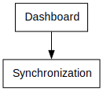

# Power App Documentation \- KSeF Dashboard

| Property                   | Value                        |
| -------------------------- | ---------------------------- |
| App Name                   | KSeF Dashboard               |
| Documentation generated at | sobota, 21 lutego 2026 11:30 |

- [Overview](index-KSeF-Dashboard.md)
- [App Details](appdetails-KSeF-Dashboard.md)
- [Variables](variables-KSeF-Dashboard.md)
- [DataSources](datasources-KSeF-Dashboard.md)
- [Resources](resources-KSeF-Dashboard.md)
- [Controls](controls-KSeF-Dashboard.md)

## Controls Overview

A total of 2 Screens are located in the app.

A total of 138 Controls are located in the app.

### [Screen: Dashboard](screen-Dashboard-KSeF-Dashboard.md)

- [ Dashboard](screen-Dashboard-KSeF-Dashboard.md)
- - [ conMain](screen-Dashboard-KSeF-Dashboard.md)
  - - [ conBody](screen-Dashboard-KSeF-Dashboard.md)
    - - [ conRecentActivity](screen-Dashboard-KSeF-Dashboard.md)
      - - [ Button1SC](screen-Dashboard-KSeF-Dashboard.md)
      - - [ galRecentActivity](screen-Dashboard-KSeF-Dashboard.md)
        - - [ Container13](screen-Dashboard-KSeF-Dashboard.md)
          - - [ Container14](screen-Dashboard-KSeF-Dashboard.md)
            - - [ TextCanvas3](screen-Dashboard-KSeF-Dashboard.md)
            - - [ TextCanvas4](screen-Dashboard-KSeF-Dashboard.md)
          - - [ Container15](screen-Dashboard-KSeF-Dashboard.md)
            - - [ TextCanvas5](screen-Dashboard-KSeF-Dashboard.md)
            - - [ TextCanvas6](screen-Dashboard-KSeF-Dashboard.md)
          - - [ Icon2](screen-Dashboard-KSeF-Dashboard.md)
        - - [ galleryTemplate3](screen-Dashboard-KSeF-Dashboard.md)
      - - [ TextCanvas1\_2](screen-Dashboard-KSeF-Dashboard.md)
      - - [ TextCanvas1\_3](screen-Dashboard-KSeF-Dashboard.md)
    - - [ conTotalsGrid](screen-Dashboard-KSeF-Dashboard.md)
      - - [ crdAllInvoices](screen-Dashboard-KSeF-Dashboard.md)
      - - [ crdPending](screen-Dashboard-KSeF-Dashboard.md)
      - - [ crdTotalGross](screen-Dashboard-KSeF-Dashboard.md)
      - - [ crdTotalPaid](screen-Dashboard-KSeF-Dashboard.md)
    - - [ galNavigationTabs](screen-Dashboard-KSeF-Dashboard.md)
      - - [ conNavigationTab](screen-Dashboard-KSeF-Dashboard.md)
        - - [ Button1](screen-Dashboard-KSeF-Dashboard.md)
        - - [ conNavigationTabHeader](screen-Dashboard-KSeF-Dashboard.md)
          - - [ Icon1](screen-Dashboard-KSeF-Dashboard.md)
          - - [ TextCanvas1](screen-Dashboard-KSeF-Dashboard.md)
        - - [ TextCanvas1SC](screen-Dashboard-KSeF-Dashboard.md)
      - - [ galleryTemplate2](screen-Dashboard-KSeF-Dashboard.md)
  - - [ conHeader](screen-Dashboard-KSeF-Dashboard.md)
    - - [ hdrHeader](screen-Dashboard-KSeF-Dashboard.md)
  - - [ conSelectEnvironments](screen-Dashboard-KSeF-Dashboard.md)
    - - [ ComboboxCanvas3](screen-Dashboard-KSeF-Dashboard.md)
      - - [ Company Name4](screen-Dashboard-KSeF-Dashboard.md)
      - - [ Created On4](screen-Dashboard-KSeF-Dashboard.md)
      - - [ Environment4](screen-Dashboard-KSeF-Dashboard.md)
      - - [ Invoice Prefix4](screen-Dashboard-KSeF-Dashboard.md)
      - - [ Is Active4](screen-Dashboard-KSeF-Dashboard.md)
      - - [ Key Vault Secret Name4](screen-Dashboard-KSeF-Dashboard.md)
      - - [ Last Sync At4](screen-Dashboard-KSeF-Dashboard.md)
      - - [ Last Sync Status4](screen-Dashboard-KSeF-Dashboard.md)
      - - [ NIP4](screen-Dashboard-KSeF-Dashboard.md)
  - - [ shpDivider](screen-Dashboard-KSeF-Dashboard.md)
- - [ Gallery1](screen-Dashboard-KSeF-Dashboard.md)
  - - [ ButtonCanvas2](screen-Dashboard-KSeF-Dashboard.md)
  - - [ galleryTemplate1](screen-Dashboard-KSeF-Dashboard.md)

### [Screen: Synchronization](screen-Synchronization-KSeF-Dashboard.md)

- [ Synchronization](screen-Synchronization-KSeF-Dashboard.md)
- - [ conMainSC](screen-Synchronization-KSeF-Dashboard.md)
  - - [ conBodySC](screen-Synchronization-KSeF-Dashboard.md)
    - - [ conFetchInvoicesSC](screen-Synchronization-KSeF-Dashboard.md)
      - - [ Container3](screen-Synchronization-KSeF-Dashboard.md)
        - - [ Icon3\_2](screen-Synchronization-KSeF-Dashboard.md)
        - - [ TextCanvas2\_2](screen-Synchronization-KSeF-Dashboard.md)
      - - [ Container5](screen-Synchronization-KSeF-Dashboard.md)
        - - [ Container6](screen-Synchronization-KSeF-Dashboard.md)
          - - [ Container2\_8](screen-Synchronization-KSeF-Dashboard.md)
            - - [ Icon3\_3](screen-Synchronization-KSeF-Dashboard.md)
            - - [ TextCanvas2\_3](screen-Synchronization-KSeF-Dashboard.md)
          - - [ DatePickerCanvas1](screen-Synchronization-KSeF-Dashboard.md)
        - - [ Container6\_1](screen-Synchronization-KSeF-Dashboard.md)
          - - [ Container2\_9](screen-Synchronization-KSeF-Dashboard.md)
            - - [ Icon3\_4](screen-Synchronization-KSeF-Dashboard.md)
            - - [ TextCanvas2\_4](screen-Synchronization-KSeF-Dashboard.md)
          - - [ DatePickerCanvas1\_1](screen-Synchronization-KSeF-Dashboard.md)
        - - [ Container6\_2](screen-Synchronization-KSeF-Dashboard.md)
          - - [ ButtonCanvas3\_2](screen-Synchronization-KSeF-Dashboard.md)
          - - [ Container2\_10](screen-Synchronization-KSeF-Dashboard.md)
      - - [ Container7](screen-Synchronization-KSeF-Dashboard.md)
        - - [ Container3\_1](screen-Synchronization-KSeF-Dashboard.md)
          - - [ Icon3\_5](screen-Synchronization-KSeF-Dashboard.md)
          - - [ TextCanvas2\_5](screen-Synchronization-KSeF-Dashboard.md)
        - - [ TextCanvas7\_11](screen-Synchronization-KSeF-Dashboard.md)
      - - [ TextCanvas7\_10](screen-Synchronization-KSeF-Dashboard.md)
    - - [ conRecentActivitySC](screen-Synchronization-KSeF-Dashboard.md)
      - - [ galRecentActivitySC](screen-Synchronization-KSeF-Dashboard.md)
        - - [ c96ad052\-649f\-4433\-be55\-1487ce871efe](screen-Synchronization-KSeF-Dashboard.md)
        - - [ Container13SC](screen-Synchronization-KSeF-Dashboard.md)
          - - [ ButtonCanvas4](screen-Synchronization-KSeF-Dashboard.md)
          - - [ Container14SC](screen-Synchronization-KSeF-Dashboard.md)
            - - [ TextCanvas3SC](screen-Synchronization-KSeF-Dashboard.md)
            - - [ TextCanvas4SC](screen-Synchronization-KSeF-Dashboard.md)
          - - [ Container15SC](screen-Synchronization-KSeF-Dashboard.md)
            - - [ TextCanvas5SC](screen-Synchronization-KSeF-Dashboard.md)
            - - [ TextCanvas6SC](screen-Synchronization-KSeF-Dashboard.md)
          - - [ Icon2SC](screen-Synchronization-KSeF-Dashboard.md)
      - - [ TextCanvas1\_6](screen-Synchronization-KSeF-Dashboard.md)
      - - [ TextCanvas1\_7](screen-Synchronization-KSeF-Dashboard.md)
    - - [ conTotalsGridSC](screen-Synchronization-KSeF-Dashboard.md)
      - - [ conKSeFConnStatusSC](screen-Synchronization-KSeF-Dashboard.md)
        - - [ ButtonCanvas3\_1](screen-Synchronization-KSeF-Dashboard.md)
        - - [ Container2](screen-Synchronization-KSeF-Dashboard.md)
          - - [ Icon3](screen-Synchronization-KSeF-Dashboard.md)
          - - [ TextCanvas2](screen-Synchronization-KSeF-Dashboard.md)
        - - [ Container2\_1](screen-Synchronization-KSeF-Dashboard.md)
          - - [ Button2](screen-Synchronization-KSeF-Dashboard.md)
          - - [ TextCanvas7](screen-Synchronization-KSeF-Dashboard.md)
        - - [ Container2\_2](screen-Synchronization-KSeF-Dashboard.md)
          - - [ TextCanvas7\_1](screen-Synchronization-KSeF-Dashboard.md)
          - - [ TextCanvas7\_2](screen-Synchronization-KSeF-Dashboard.md)
        - - [ Container2\_3](screen-Synchronization-KSeF-Dashboard.md)
          - - [ TextCanvas7\_3](screen-Synchronization-KSeF-Dashboard.md)
          - - [ TextCanvas7\_4](screen-Synchronization-KSeF-Dashboard.md)
      - - [ conKSeFSessionSC](screen-Synchronization-KSeF-Dashboard.md)
        - - [ ButtonCanvas3](screen-Synchronization-KSeF-Dashboard.md)
        - - [ Container2\_4](screen-Synchronization-KSeF-Dashboard.md)
          - - [ Icon3\_1](screen-Synchronization-KSeF-Dashboard.md)
          - - [ TextCanvas2\_1](screen-Synchronization-KSeF-Dashboard.md)
        - - [ Container2\_5](screen-Synchronization-KSeF-Dashboard.md)
          - - [ Button2\_1](screen-Synchronization-KSeF-Dashboard.md)
          - - [ TextCanvas7\_5](screen-Synchronization-KSeF-Dashboard.md)
        - - [ Container2\_6](screen-Synchronization-KSeF-Dashboard.md)
          - - [ TextCanvas7\_6](screen-Synchronization-KSeF-Dashboard.md)
          - - [ TextCanvas7\_7](screen-Synchronization-KSeF-Dashboard.md)
        - - [ Container2\_7](screen-Synchronization-KSeF-Dashboard.md)
          - - [ TextCanvas7\_8](screen-Synchronization-KSeF-Dashboard.md)
          - - [ TextCanvas7\_9](screen-Synchronization-KSeF-Dashboard.md)
  - - [ conHeaderSC](screen-Synchronization-KSeF-Dashboard.md)
    - - [ hdrHeaderSC](screen-Synchronization-KSeF-Dashboard.md)
  - - [ conSelectEnvironmentsSC](screen-Synchronization-KSeF-Dashboard.md)
    - - [ ButtonCanvas1](screen-Synchronization-KSeF-Dashboard.md)
    - - [ ComboboxCanvas3SC](screen-Synchronization-KSeF-Dashboard.md)
      - - [ Company Name4SC](screen-Synchronization-KSeF-Dashboard.md)
      - - [ Created On4SC](screen-Synchronization-KSeF-Dashboard.md)
      - - [ Environment4SC](screen-Synchronization-KSeF-Dashboard.md)
      - - [ Invoice Prefix4SC](screen-Synchronization-KSeF-Dashboard.md)
      - - [ Is Active4SC](screen-Synchronization-KSeF-Dashboard.md)
      - - [ Key Vault Secret Name4SC](screen-Synchronization-KSeF-Dashboard.md)
      - - [ Last Sync At4SC](screen-Synchronization-KSeF-Dashboard.md)
      - - [ Last Sync Status4SC](screen-Synchronization-KSeF-Dashboard.md)
      - - [ NIP4SC](screen-Synchronization-KSeF-Dashboard.md)
  - - [ shpDividerSC](screen-Synchronization-KSeF-Dashboard.md)
- - [ Gallery1SC](screen-Synchronization-KSeF-Dashboard.md)
  - - [ 5e92db0b\-2c40\-4acb\-a6fb\-e7128b41468f](screen-Synchronization-KSeF-Dashboard.md)
  - - [ ButtonCanvas2SC](screen-Synchronization-KSeF-Dashboard.md)
- - [ Spinner1](screen-Synchronization-KSeF-Dashboard.md)

## Screen Navigation

The following diagram shows the navigation between the different screens.

