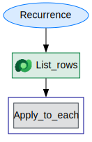
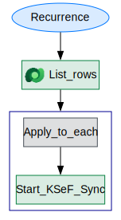

# Flow Documentation \- 03\_KSeF\_Sync\_Invoices\_Per\_Day\-C9D640E8\-E20C\-F111\-8406\-000D3AD7F86D

| Flow Name                  | 03\_KSeF\_Sync\_Invoices\_Per\_Day\-C9D640E8\-E20C\-F111\-8406\-000D3AD7F86D |
| -------------------------- | ---------------------------------------------------------------------------- |
| Flow Name                  | 03\_KSeF\_Sync\_Invoices\_Per\_Day\-C9D640E8\-E20C\-F111\-8406\-000D3AD7F86D |
| Documentation generated at | sobota, 21 lutego 2026 11:30                                                 |
| Number of Variables        | 0                                                                            |
| Number of Actions          | 3                                                                            |

- [Overview](index-03_KSeF_Sync_Invoices_Per_Day-C9D640E8-E20C-F111-8406-000D3AD7F86D.md)
- [Connection References](connections-03_KSeF_Sync_Invoices_Per_Day-C9D640E8-E20C-F111-8406-000D3AD7F86D.md)
- [Variables](variables-03_KSeF_Sync_Invoices_Per_Day-C9D640E8-E20C-F111-8406-000D3AD7F86D.md)
- [Triggers & Actions](triggersactions-03_KSeF_Sync_Invoices_Per_Day-C9D640E8-E20C-F111-8406-000D3AD7F86D.md)

## Flow Overview

The following chart shows the top level layout of the Flow. For a detailed view, please visit the section called Detailed Flow Diagram

## Detailed Flow Diagram

The following chart shows the detailed layout of the Flow

