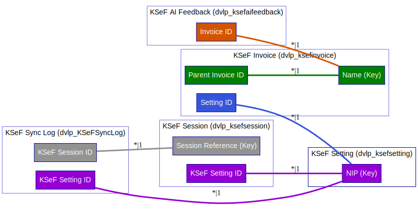

# DevelopicoKSeF

| Property | Details   |
| -------- | --------- |
| Status   | Unmanaged |
| Version  | 1.0.0.6   |

## Publisher Details

| Publisher                      | Details                  |
| ------------------------------ | ------------------------ |
| Name                           | Developico               |
| Email                          | contact@developico.com   |
| CustomizationPrefix            | dvlp                     |
| CustomizationOptionValuePrefix | 10000                    |
| SupportingWebsiteUrl           | https:\/\/developico.com |

Descriptions:

| Language Code | Description                                                                             |
| ------------- | --------------------------------------------------------------------------------------- |
| 1033          | Developico Sp. z o.o. \| Hajoty 53\/1, 01\-821 Warsaw, POLAND \| Power Platform Experts |

Localized Names:

| Language Code | Description |
| ------------- | ----------- |
| 1033          | Developico  |

Addresses:

| Property           | Value        |
| ------------------ | ------------ |
| AddressNumber      | 1            |
| AddressTypeCode    | 1            |
| City               | Warsaw       |
| Country            | Poland       |
| Line1              | Hajoty 53\/1 |
| PostalCode         | 01\-821      |
| ShippingMethodCode | 1            |
| StateOrProvince    | MAZ          |

| Property           | Value |
| ------------------ | ----- |
| AddressNumber      | 2     |
| AddressTypeCode    | 1     |
| ShippingMethodCode | 1     |

## Statistics

| Component Type | Number of Components |
| -------------- | -------------------- |
| App Module     | 1                    |
| Canvas App     | 3                    |
| Entity         | 5                    |
| Option Set     | 14                   |
| Role           | 1                    |
| Site Map       | 1                    |
| Web Resource   | 7                    |
| Workflow       | 3                    |

## Solution Components

This solution contains the following components

### Environment Variables

#### MDA Invoices Link

| Property          | Value                                                         |
| ----------------- | ------------------------------------------------------------- |
| Internal Name     | dvlp\_MDAInvoicesLink                                         |
| Type              | String                                                        |
| Default Value     |                                                               |
| Description       | Link copied directly from MDA directing to Invoices main view |
| IntroducedVersion | 1.0.0.2                                                       |

### App Module

| App Module       |
| ---------------- |
| dvlp\_CLevelKSeF |

### Canvas App

| Canvas App               |
| ------------------------ |
| KSeF Dashboard           |
| KSeF Copilot (Code Apps) |
| Synchronization          |

### Tables

#### KSeF AI Feedback (dvlp\_ksefaifeedback)

| Property       | Value                                                                      |
| -------------- | -------------------------------------------------------------------------- |
| Primary Column | Name                                                                       |
| Description    | Historia poprawek użytkowników do sugestii AI \- używana do uczenia modelu |
| Auditing       | Disabled                                                                   |

| Display Name                  | Name                       | Data type           | Auditing | Customizable | Required | Searchable |
| ----------------------------- | -------------------------- | ------------------- | -------- | ------------ | -------- | ---------- |
| AI Category Suggestion        | dvlp\_aicategorysuggestion | Single line of text | Enabled  | True         | False    | False      |
| AI Confidence                 | dvlp\_aiconfidence         | Decimal             | Enabled  | True         | False    | False      |
| AI MPK Suggestion             | dvlp\_aimpksuggestion      | Single line of text | Enabled  | True         | False    | False      |
| Created By                    | CreatedBy                  | Lookup              | Disabled | True         | False    | False      |
| Created By (Delegate)         | CreatedOnBehalfBy          | Lookup              | Disabled | True         | False    | False      |
| Created On                    | CreatedOn                  | Date and time       | Disabled | True         | False    | False      |
| Feedback Type                 | dvlp\_feedbacktype         | picklist            | Enabled  | True         | False    | False      |
| Import Sequence Number        | ImportSequenceNumber       | Whole number        | Enabled  | True         | False    | False      |
| Invoice Description           | dvlp\_invoicedescription   | Single line of text | Enabled  | True         | False    | False      |
| Invoice ID                    | dvlp\_invoiceid            | Lookup              | Disabled | True         | False    | False      |
| KSeF AI Feedback              | dvlp\_ksefaifeedbackId     | Primary Key         | Disabled | True         | False    | False      |
| Modified By                   | ModifiedBy                 | Lookup              | Disabled | True         | False    | False      |
| Modified By (Delegate)        | ModifiedOnBehalfBy         | Lookup              | Disabled | True         | False    | False      |
| Modified On                   | ModifiedOn                 | Date and time       | Disabled | True         | False    | False      |
| Name (Primary name column)    | dvlp\_Name                 | Single line of text | Enabled  | True         | True     | True       |
| Owner                         | OwnerId                    | Owner               | Enabled  | True         | False    | False      |
| Owning Business Unit          | OwningBusinessUnit         | Lookup              | Disabled | True         | False    | False      |
| Owning Team                   | OwningTeam                 | Lookup              | Disabled | True         | False    | False      |
| Owning User                   | OwningUser                 | Lookup              | Disabled | True         | False    | False      |
| Record Created On             | OverriddenCreatedOn        | Date and time       | Enabled  | True         | False    | False      |
| Status                        | statecode                  | Choice              | Enabled  | True         | False    | False      |
| Status Reason                 | statuscode                 | Choice              | Enabled  | True         | False    | False      |
| Supplier Name                 | dvlp\_suppliername         | Single line of text | Enabled  | True         | False    | False      |
| Supplier NIP                  | dvlp\_suppliernip          | Single line of text | Enabled  | True         | False    | False      |
| Tenant NIP                    | dvlp\_tenantnip            | Single line of text | Enabled  | True         | False    | False      |
| Time Zone Rule Version Number | TimeZoneRuleVersionNumber  | Whole number        | Disabled | True         | False    | False      |
| User Category                 | dvlp\_usercategory         | Single line of text | Enabled  | True         | False    | False      |
| User MPK                      | dvlp\_usermpk              | Single line of text | Enabled  | True         | False    | False      |
| UTC Conversion Time Zone Code | UTCConversionTimeZoneCode  | Whole number        | Disabled | True         | False    | False      |

#### KSeF Invoice (dvlp\_ksefinvoice)

| Property       | Value                                                         |
| -------------- | ------------------------------------------------------------- |
| Primary Column | Name                                                          |
| Description    | Faktury kosztowe pobrane z Krajowego Systemu e\-Faktur (KSeF) |
| Auditing       | Disabled                                                      |

| Display Name                  | Name                       | Data type              | Auditing | Customizable | Required | Searchable |
| ----------------------------- | -------------------------- | ---------------------- | -------- | ------------ | -------- | ---------- |
| AI Category Suggestion        | dvlp\_aicategorysuggestion | Single line of text    | Enabled  | True         | False    | False      |
| AI Confidence                 | dvlp\_aiconfidence         | Decimal                | Enabled  | True         | False    | False      |
| AI Description                | dvlp\_aidescription        | Single line of text    | Enabled  | True         | False    | False      |
| AI MPK Suggestion             | dvlp\_aimpksuggestion      | picklist               | Enabled  | True         | False    | False      |
| AI Processed At               | dvlp\_aiprocessedat        | Date and time          | Enabled  | True         | False    | False      |
| Buyer Address                 | dvlp\_buyeraddress         | Single line of text    | Enabled  | True         | False    | False      |
| Buyer Country                 | dvlp\_buyercountry         | Single line of text    | Enabled  | True         | False    | False      |
| Buyer Name                    | dvlp\_buyername            | Single line of text    | Enabled  | True         | False    | False      |
| Buyer NIP                     | dvlp\_buyernip             | Single line of text    | Enabled  | True         | False    | False      |
| Category                      | dvlp\_category             | Single line of text    | Enabled  | True         | False    | False      |
| Cost Center                   | dvlp\_costcenter           | picklist               | Enabled  | True         | False    | False      |
| Created By                    | CreatedBy                  | Lookup                 | Disabled | True         | False    | False      |
| Created By (Delegate)         | CreatedOnBehalfBy          | Lookup                 | Disabled | True         | False    | False      |
| Created On                    | CreatedOn                  | Date and time          | Disabled | True         | False    | False      |
| Currency                      | dvlp\_currency             | picklist               | Enabled  | True         | False    | False      |
| Description                   | dvlp\_description          | Single line of text    | Enabled  | True         | False    | False      |
| Direction                     | dvlp\_direction            | picklist               | Enabled  | True         | False    | False      |
| Document                      | dvlp\_doc                  | File                   | Enabled  | True         | False    | False      |
| Downloaded At                 | dvlp\_downloadedat         | Date and time          | Enabled  | True         | False    | False      |
| Due Date                      | dvlp\_duedate              | Date and time          | Enabled  | True         | False    | False      |
| Exchange Rate                 | dvlp\_exchangerate         | Decimal                | Enabled  | True         | False    | False      |
| Gross Amount                  | dvlp\_grossamount          | Decimal                | Enabled  | True         | False    | False      |
| Gross Amount PLN              | dvlp\_grossamountpln       | Decimal                | Enabled  | True         | False    | False      |
| Import Sequence Number        | ImportSequenceNumber       | Whole number           | Enabled  | True         | False    | False      |
| Invoice Date                  | dvlp\_invoicedate          | Date and time          | Enabled  | True         | False    | False      |
| Invoice Number                | dvlp\_invoicenumber        | Single line of text    | Enabled  | True         | False    | False      |
| Invoice Status                | dvlp\_invoicestatus        | Single line of text    | Enabled  | True         | False    | False      |
| Invoice Type                  | dvlp\_invoicetype          | picklist               | Enabled  | True         | False    | False      |
| Is Overdue                    | dvlp\_isoverdue            | Yes\/No                | Enabled  | True         | False    | False      |
| KSeF Invoice                  | dvlp\_ksefinvoiceId        | Primary Key            | Disabled | True         | False    | False      |
| KSeF Raw XML                  | dvlp\_ksefrawxml           | Multiple lines of text | Enabled  | True         | False    | False      |
| KSeF Reference Number         | dvlp\_ksefreferencenumber  | Single line of text    | Enabled  | True         | False    | False      |
| Modified By                   | ModifiedBy                 | Lookup                 | Disabled | True         | False    | False      |
| Modified By (Delegate)        | ModifiedOnBehalfBy         | Lookup                 | Disabled | True         | False    | False      |
| Modified On                   | ModifiedOn                 | Date and time          | Disabled | True         | False    | False      |
| Name (Primary name column)    | dvlp\_name                 | Single line of text    | Enabled  | True         | True     | True       |
| Net Amount                    | dvlp\_netamount            | Decimal                | Enabled  | True         | False    | False      |
| Owner                         | OwnerId                    | Owner                  | Enabled  | True         | False    | False      |
| Owning Business Unit          | OwningBusinessUnit         | Lookup                 | Disabled | True         | False    | False      |
| Owning Team                   | OwningTeam                 | Lookup                 | Disabled | True         | False    | False      |
| Owning User                   | OwningUser                 | Lookup                 | Disabled | True         | False    | False      |
| Paid Amount                   | dvlp\_paidamount           | Decimal                | Enabled  | True         | False    | False      |
| Paid At                       | dvlp\_paidat               | Date and time          | Enabled  | True         | False    | False      |
| Parent Invoice ID             | dvlp\_parentinvoiceid      | Lookup                 | Disabled | True         | False    | False      |
| Payment Method                | dvlp\_paymentmethod        | picklist               | Disabled | True         | False    | False      |
| Payment Reference             | dvlp\_paymentreference     | Single line of text    | Enabled  | True         | False    | False      |
| Payment Status                | dvlp\_paymentstatus        | picklist               | Enabled  | True         | False    | False      |
| Record Created On             | OverriddenCreatedOn        | Date and time          | Enabled  | True         | False    | False      |
| Sale Date                     | dvlp\_saledate             | Date and time          | Enabled  | True         | False    | False      |
| Seller Address                | dvlp\_selleraddress        | Single line of text    | Enabled  | True         | False    | False      |
| Seller Bank                   | dvlp\_sellerbank           | Single line of text    | Enabled  | True         | False    | False      |
| Seller Country                | dvlp\_sellercountry        | Single line of text    | Enabled  | True         | False    | False      |
| Seller Email                  | dvlp\_selleremail          | Single line of text    | Enabled  | True         | False    | False      |
| Seller Name                   | dvlp\_sellername           | Single line of text    | Enabled  | True         | False    | False      |
| Seller NIP                    | dvlp\_sellernip            | Single line of text    | Enabled  | True         | False    | False      |
| Seller Phone                  | dvlp\_sellerphone          | Single line of text    | Enabled  | True         | False    | False      |
| Setting ID                    | dvlp\_settingid            | Lookup                 | Disabled | True         | False    | False      |
| Source                        | dvlp\_source               | picklist               | Enabled  | True         | False    | False      |
| Status                        | statecode                  | Choice                 | Enabled  | True         | False    | False      |
| Status Reason                 | statuscode                 | Choice                 | Enabled  | True         | False    | False      |
| Time Zone Rule Version Number | TimeZoneRuleVersionNumber  | Whole number           | Disabled | True         | False    | False      |
| UTC Conversion Time Zone Code | UTCConversionTimeZoneCode  | Whole number           | Disabled | True         | False    | False      |
| VAT 0 Amount                  | dvlp\_vat0amount           | Decimal                | Enabled  | True         | False    | False      |
| VAT 23 Amount                 | dvlp\_vat23amount          | Decimal                | Enabled  | True         | False    | False      |
| VAT 5 Amount                  | dvlp\_vat5amount           | Decimal                | Enabled  | True         | False    | False      |
| VAT 8 Amount                  | dvlp\_vat8amount           | Decimal                | Enabled  | True         | False    | False      |
| VAT Amount                    | dvlp\_vatamount            | Decimal                | Enabled  | True         | False    | False      |
| VAT ZW Amount                 | dvlp\_vatzwaAmount         | Decimal                | Enabled  | True         | False    | False      |

#### KSeF Session (dvlp\_ksefsession)

| Property       | Value                        |
| -------------- | ---------------------------- |
| Primary Column | Session Reference            |
| Description    | Sesje komunikacji z API KSeF |
| Auditing       | Disabled                     |

| Display Name                            | Name                      | Data type              | Auditing | Customizable | Required | Searchable |
| --------------------------------------- | ------------------------- | ---------------------- | -------- | ------------ | -------- | ---------- |
| Created By                              | CreatedBy                 | Lookup                 | Disabled | True         | False    | False      |
| Created By (Delegate)                   | CreatedOnBehalfBy         | Lookup                 | Disabled | True         | False    | False      |
| Created On                              | CreatedOn                 | Date and time          | Disabled | True         | False    | False      |
| Error Message                           | dvlp\_errormessage        | Multiple lines of text | Enabled  | True         | False    | False      |
| Expires At                              | dvlp\_expiresat           | Date and time          | Enabled  | True         | False    | False      |
| Import Sequence Number                  | ImportSequenceNumber      | Whole number           | Enabled  | True         | False    | False      |
| Invoices Processed                      | dvlp\_invoicesprocessed   | Whole number           | Enabled  | True         | False    | False      |
| KSeF Session                            | dvlp\_ksefsessionId       | Primary Key            | Disabled | True         | False    | False      |
| KSeF Setting ID                         | dvlp\_ksefsettingid       | Lookup                 | Disabled | True         | False    | False      |
| Modified By                             | ModifiedBy                | Lookup                 | Disabled | True         | False    | False      |
| Modified By (Delegate)                  | ModifiedOnBehalfBy        | Lookup                 | Disabled | True         | False    | False      |
| Modified On                             | ModifiedOn                | Date and time          | Disabled | True         | False    | False      |
| NIP                                     | dvlp\_nip                 | Single line of text    | Enabled  | True         | False    | False      |
| Owner                                   | OwnerId                   | Owner                  | Enabled  | True         | False    | False      |
| Owning Business Unit                    | OwningBusinessUnit        | Lookup                 | Enabled  | True         | False    | False      |
| Owning Team                             | OwningTeam                | Lookup                 | Disabled | True         | False    | False      |
| Owning User                             | OwningUser                | Lookup                 | Disabled | True         | False    | False      |
| Record Created On                       | OverriddenCreatedOn       | Date and time          | Enabled  | True         | False    | False      |
| Session Reference (Primary name column) | dvlp\_sessionreference    | Single line of text    | Enabled  | True         | True     | True       |
| Session Status                          | dvlp\_sessionstatus       | picklist               | Enabled  | True         | False    | False      |
| Session Token                           | dvlp\_sessiontoken        | Single line of text    | Enabled  | True         | False    | False      |
| Session Type                            | dvlp\_sessiontype         | picklist               | Enabled  | True         | False    | False      |
| Started At                              | dvlp\_startedat           | Date and time          | Enabled  | True         | False    | False      |
| Status                                  | statecode                 | Choice                 | Enabled  | True         | False    | False      |
| Status Reason                           | statuscode                | Choice                 | Enabled  | True         | False    | False      |
| Terminated At                           | dvlp\_terminatedat        | Date and time          | Enabled  | True         | False    | False      |
| Time Zone Rule Version Number           | TimeZoneRuleVersionNumber | Whole number           | Disabled | True         | False    | False      |
| UTC Conversion Time Zone Code           | UTCConversionTimeZoneCode | Whole number           | Disabled | True         | False    | False      |

#### KSeF Setting (dvlp\_ksefsetting)

| Property       | Value                                               |
| -------------- | --------------------------------------------------- |
| Primary Column | NIP                                                 |
| Description    | Konfiguracja integracji KSeF dla każdej firmy (NIP) |
| Auditing       | Disabled                                            |

| Display Name                  | Name                      | Data type           | Auditing | Customizable | Required | Searchable |
| ----------------------------- | ------------------------- | ------------------- | -------- | ------------ | -------- | ---------- |
| Auto Sync                     | dvlp\_autosync            | Yes\/No             | Enabled  | True         | False    | False      |
| Company Name                  | dvlp\_companyname         | Single line of text | Enabled  | True         | False    | False      |
| Created By                    | CreatedBy                 | Lookup              | Disabled | True         | False    | False      |
| Created By (Delegate)         | CreatedOnBehalfBy         | Lookup              | Disabled | True         | False    | False      |
| Created On                    | CreatedOn                 | Date and time       | Disabled | True         | False    | False      |
| Environment                   | dvlp\_environment         | picklist            | Enabled  | True         | False    | False      |
| Import Sequence Number        | ImportSequenceNumber      | Whole number        | Enabled  | True         | False    | False      |
| Invoice Prefix                | dvlp\_invoiceprefix       | Single line of text | Enabled  | True         | False    | False      |
| Is Active                     | dvlp\_isactive            | Yes\/No             | Enabled  | True         | False    | False      |
| Key Vault Secret Name         | dvlp\_keyvaultsecretname  | Single line of text | Enabled  | True         | False    | False      |
| KSeF Setting                  | dvlp\_ksefsettingId       | Primary Key         | Disabled | True         | False    | False      |
| Last Sync At                  | dvlp\_lastsyncat          | Date and time       | Enabled  | True         | False    | False      |
| Last Sync Status              | dvlp\_lastsyncstatus      | picklist            | Enabled  | True         | False    | False      |
| Modified By                   | ModifiedBy                | Lookup              | Disabled | True         | False    | False      |
| Modified By (Delegate)        | ModifiedOnBehalfBy        | Lookup              | Disabled | True         | False    | False      |
| Modified On                   | ModifiedOn                | Date and time       | Disabled | True         | False    | False      |
| NIP (Primary name column)     | dvlp\_nip                 | Single line of text | Enabled  | True         | True     | True       |
| Owner                         | OwnerId                   | Owner               | Enabled  | True         | False    | False      |
| Owning Business Unit          | OwningBusinessUnit        | Lookup              | Enabled  | True         | False    | False      |
| Owning Team                   | OwningTeam                | Lookup              | Disabled | True         | False    | False      |
| Owning User                   | OwningUser                | Lookup              | Disabled | True         | False    | False      |
| Record Created On             | OverriddenCreatedOn       | Date and time       | Enabled  | True         | False    | False      |
| Status                        | statecode                 | Choice              | Enabled  | True         | False    | False      |
| Status Reason                 | statuscode                | Choice              | Enabled  | True         | False    | False      |
| Sync Interval                 | dvlp\_syncinterval        | Whole number        | Enabled  | True         | False    | False      |
| Time Zone Rule Version Number | TimeZoneRuleVersionNumber | Whole number        | Disabled | True         | False    | False      |
| Token Expires At              | dvlp\_tokenexpiresat      | Date and time       | Enabled  | True         | False    | False      |
| UTC Conversion Time Zone Code | UTCConversionTimeZoneCode | Whole number        | Disabled | True         | False    | False      |

#### KSeF Sync Log (dvlp\_KSeFSyncLog)

| Property       | Value                                   |
| -------------- | --------------------------------------- |
| Primary Column | Name                                    |
| Description    | Historia operacji synchronizacji z KSeF |
| Auditing       | Disabled                                |

| Display Name                  | Name                      | Data type              | Auditing | Customizable | Required | Searchable |
| ----------------------------- | ------------------------- | ---------------------- | -------- | ------------ | -------- | ---------- |
| Completed At                  | dvlp\_completedat         | Date and time          | Enabled  | True         | False    | False      |
| Created By                    | CreatedBy                 | Lookup                 | Disabled | True         | False    | False      |
| Created By (Delegate)         | CreatedOnBehalfBy         | Lookup                 | Disabled | True         | False    | False      |
| Created On                    | CreatedOn                 | Date and time          | Disabled | True         | False    | False      |
| Direction                     | dvlp\_direction           | picklist               | Enabled  | True         | False    | False      |
| Error Message                 | dvlp\_errormessage        | Multiple lines of text | Enabled  | True         | False    | False      |
| Import Sequence Number        | ImportSequenceNumber      | Whole number           | Enabled  | True         | False    | False      |
| Invoices Created              | dvlp\_invoicescreated     | Whole number           | Enabled  | True         | False    | False      |
| Invoices Failed               | dvlp\_invoicesfailed      | Whole number           | Enabled  | True         | False    | False      |
| Invoices Processed            | dvlp\_invoicesprocessed   | Whole number           | Enabled  | True         | False    | False      |
| Invoices Updated              | dvlp\_invoicesupdated     | Whole number           | Enabled  | True         | False    | False      |
| KSeF Session ID               | dvlp\_ksefsessionid       | Lookup                 | Disabled | True         | False    | False      |
| KSeF Setting ID               | dvlp\_ksefsettingid       | Lookup                 | Disabled | True         | False    | False      |
| KSeF Sync Log                 | dvlp\_KSeFSyncLogId       | Primary Key            | Disabled | True         | False    | False      |
| Modified By                   | ModifiedBy                | Lookup                 | Disabled | True         | False    | False      |
| Modified By (Delegate)        | ModifiedOnBehalfBy        | Lookup                 | Disabled | True         | False    | False      |
| Modified On                   | ModifiedOn                | Date and time          | Disabled | True         | False    | False      |
| Name (Primary name column)    | dvlp\_name                | Single line of text    | Enabled  | True         | True     | True       |
| Operation Type                | dvlp\_operationtype       | picklist               | Enabled  | True         | False    | False      |
| Owner                         | OwnerId                   | Owner                  | Enabled  | True         | False    | False      |
| Owning Business Unit          | OwningBusinessUnit        | Lookup                 | Disabled | True         | False    | False      |
| Owning Team                   | OwningTeam                | Lookup                 | Disabled | True         | False    | False      |
| Owning User                   | OwningUser                | Lookup                 | Disabled | True         | False    | False      |
| Page from                     | dvlp\_pagefrom            | Whole number           | Enabled  | True         | False    | False      |
| Page To                       | dvlp\_pageto              | Whole number           | Enabled  | True         | False    | False      |
| Record Created On             | OverriddenCreatedOn       | Date and time          | Enabled  | True         | False    | False      |
| Request Payload               | dvlp\_requestpayload      | Multiple lines of text | Enabled  | True         | False    | False      |
| Response Payload              | dvlp\_responsepayload     | Multiple lines of text | Enabled  | True         | False    | False      |
| Started At                    | dvlp\_startedat           | Date and time          | Enabled  | True         | False    | False      |
| Status                        | statecode                 | Choice                 | Enabled  | True         | False    | False      |
| Status Reason                 | statuscode                | Choice                 | Enabled  | True         | False    | False      |
| Sync Log Status               | dvlp\_synclogstatus       | picklist               | Enabled  | True         | False    | False      |
| Time Zone Rule Version Number | TimeZoneRuleVersionNumber | Whole number           | Disabled | True         | False    | False      |
| UTC Conversion Time Zone Code | UTCConversionTimeZoneCode | Whole number           | Disabled | True         | False    | False      |

#### Table Relationships

### Option Set

| Option Set               |
| ------------------------ |
| dvlp\_currencyksef       |
| dvlp\_directionksef      |
| dvlp\_environmentksef    |
| dvlp\_feedbacktypeksef   |
| dvlp\_invoicetypeksef    |
| dvlp\_lastsyncstatusksef |
| dvlp\_mpkplanner         |
| dvlp\_operationtypeksef  |
| dvlp\_paymentmethodksef  |
| dvlp\_paymentstatusksef  |
| dvlp\_sessionstatusksef  |
| dvlp\_sessiontypeksef    |
| dvlp\_sourceksef         |
| dvlp\_synclogstatusksef  |

### Security Roles

#### DVLP\-KSeF Application ({ca5178fb\-82fb\-f011\-8406\-7ced8d765deb})

| Table                         | Create                                                     | Read                                                       | Write                                                      | Delete                                                     | Append                                                     | Append To                                                  | Assign                                                     | Share                                                      |
| ----------------------------- | ---------------------------------------------------------- | ---------------------------------------------------------- | ---------------------------------------------------------- | ---------------------------------------------------------- | ---------------------------------------------------------- | ---------------------------------------------------------- | ---------------------------------------------------------- | ---------------------------------------------------------- |
|                               |      |      |      |      |      |      |      |      |
| AppConfigMaster               |      |  |      |      |      |      |      |      |
| AppModule                     |      |  |      |      |      |      |      |      |
| AsyncOperation                |      |    |    |      |      |    |    |      |
| Attribute                     |      |  |      |      |      |      |      |      |
| AttributeMap                  |      |  |      |      |      |      |      |      |
| BusinessUnit                  |      |  |      |      |      |      |      |      |
| ComplexControl                |      |  |      |      |      |      |      |      |
| Customization                 |      |  |      |      |      |      |      |      |
| dvlp\_ksefaifeedback          |  |  |  |  |  |  |  |  |
| dvlp\_ksefinvoice             |  |  |  |  |  |  |  |  |
| dvlp\_ksefsession             |  |  |  |  |  |  |  |  |
| dvlp\_ksefsetting             |  |  |  |  |  |  |  |  |
| dvlp\_KSeFSyncLog             |  |  |  |  |  |  |  |  |
| Entity                        |      |  |      |      |      |      |      |      |
| EntityKey                     |      |  |      |      |      |      |      |      |
| EntityMap                     |      |  |      |      |      |      |      |      |
| HierarchyRule                 |      |  |      |      |      |      |      |      |
| NewProcess                    |  |  |  |  |  |  |      |      |
| Note                          |  |  |  |  |  |  |  |  |
| OptionSet                     |      |  |      |      |      |      |      |      |
| Organization                  |      |  |      |      |      |      |      |      |
| PluginAssembly                |      |  |      |      |      |      |      |      |
| PluginTraceLog                |      |  |      |      |      |      |      |      |
| PluginType                    |      |  |      |      |      |      |      |      |
| Query                         |      |  |      |      |      |      |      |      |
| Relationship                  |      |  |      |      |      |      |      |      |
| Report                        |      |    |      |      |      |      |      |      |
| Role                          |      |  |      |      |      |      |      |      |
| SavedQueryVisualizations      |      |  |      |      |      |      |      |      |
| SdkMessage                    |      |  |      |      |      |      |      |      |
| SdkMessageProcessingStep      |      |  |      |      |      |      |      |      |
| SdkMessageProcessingStepImage |      |  |      |      |      |      |      |      |
| SharePointData                |  |  |  |      |      |      |      |      |
| SharePointDocument            |      |  |      |      |      |      |      |      |
| SystemApplicationMetadata     |      |  |      |      |      |      |      |      |
| SystemForm                    |      |  |      |      |      |      |      |      |
| Team                          |      |  |      |      |      |      |      |      |
| TraceLog                      |      |  |      |      |      |      |      |      |
| TransactionCurrency           |      |  |      |      |      |      |      |      |
| TranslationProcess            |  |  |  |  |  |  |      |      |
| User                          |      |  |      |      |      |      |      |      |
| UserApplicationMetadata       |    |    |    |    |      |      |      |      |
| UserEntityUISettings          |    |    |    |    |      |      |      |    |
| UserQuery                     |      |    |      |      |      |      |      |      |
| UserSettings                  |      |  |      |      |      |      |      |      |
| WebResource                   |      |  |      |      |      |      |      |      |
| Workflow                      |    |  |    |    |    |  |    |    |
| WorkflowSession               |    |  |    |    |    |    |    |    |

Miscellaneous Privileges associated with this role:

| Miscellaneous Privilege        | Level                                                      |
| ------------------------------ | ---------------------------------------------------------- |
| prvActivateSynchronousWorkflow |    |
| prvWorkflowExecution           |  |

### Site Map

| Site Map         |
| ---------------- |
| dvlp\_CLevelKSeF |

### Web Resource

| Web Resource                        |
| ----------------------------------- |
| dvlp\_\/Images\/Table\/Feedback.svg |
| dvlp\_\/Images\/Table\/Invoice.svg  |
| dvlp\_\/Images\/Table\/Session.svg  |
| dvlp\_\/Images\/Table\/Settings.svg |
| dvlp\_\/Images\/Table\/SyncLog.svg  |
| dvlp\_DevelopicoSygnet              |
| dvlp\_welcome                       |

### Workflow

| Workflow                                                                                                                                                               |
| ---------------------------------------------------------------------------------------------------------------------------------------------------------------------- |
| 02\_KSeF\_Create\_a\_note\_based\_on\_attachment\-AA0471F3\-C10C\-F111\-8406\-000D3AD7F86D (When\_a\_row\_is\_added,\_modified\_or\_deleted: OpenApiConnectionWebhook) |
| 03\_KSeF\_Sync\_Invoices\_Per\_Day\-C9D640E8\-E20C\-F111\-8406\-000D3AD7F86D (Recurrence: Recurrence)                                                                  |
| 01\_KSeF\_Send\_direct\_MDA\_Invoices\_view\_link\_to\_app\-E72F4C8B\-490B\-F111\-8407\-7CED8D493CB7 (manual: Request)                                                 |

## Solution Component Dependencies

This solution has the following dependencies

### Solution: Active

| Property     | Required Component                       | Required By                              |
| ------------ | ---------------------------------------- | ---------------------------------------- |
| Display Name | DVLP\-KSeF\-PP\-Connector                | 03\_KSeF\_Sync\_Invoices\_Per\_Day       |
| Type         | Connector                                | Workflow                                 |
| Schema Name  | dvlp\_5Fdvlp\-2Dksef\-2Dpp\-2Dconnector  |                                          |
| Solution     | Active                                   |                                          |
| ID           | c639803d\-e8fe\-4832\-a9f2\-88ad93ee35b6 | c9d640e8\-e20c\-f111\-8406\-000d3ad7f86d |

| Property     | Required Component                       | Required By                |
| ------------ | ---------------------------------------- | -------------------------- |
| Display Name | DVLP\-KSeF\-PP\-Connector                | KSeF Dashboard             |
| Type         | Connector                                | Canvas App                 |
| Schema Name  | dvlp\_5Fdvlp\-2Dksef\-2Dpp\-2Dconnector  | dvlp\_dashboardpage\_ac5d7 |
| Solution     | Active                                   |                            |
| ID           | c639803d\-e8fe\-4832\-a9f2\-88ad93ee35b6 |                            |

| Property     | Required Component                       | Required By                      |
| ------------ | ---------------------------------------- | -------------------------------- |
| Display Name | DVLP\-KSeF\-PP\-Connector                | KSeF Copilot (Code Apps)         |
| Type         | Connector                                | Canvas App                       |
| Schema Name  | dvlp\_5Fdvlp\-2Dksef\-2Dpp\-2Dconnector  | dvlp\_ksefcopilotcodeapps\_33288 |
| Solution     | Active                                   |                                  |
| ID           | c639803d\-e8fe\-4832\-a9f2\-88ad93ee35b6 |                                  |

| Property     | Required Component                       | Required By                  |
| ------------ | ---------------------------------------- | ---------------------------- |
| Display Name | DVLP\-KSeF\-PP\-Connector                | Synchronization              |
| Type         | Connector                                | Canvas App                   |
| Schema Name  | dvlp\_5Fdvlp\-2Dksef\-2Dpp\-2Dconnector  | dvlp\_synchronization\_850c2 |
| Solution     | Active                                   |                              |
| ID           | c639803d\-e8fe\-4832\-a9f2\-88ad93ee35b6 |                              |

| Property     | Required Component                       | Required By                                                          |
| ------------ | ---------------------------------------- | -------------------------------------------------------------------- |
| Display Name | DVLP\-KSeF\-PP\-Connector                | dvlp\_shareddvlp5fdvlp2dksef2dpp2dconnector5f0ad1af9befb93b50\_02199 |
| Type         | Connector                                | Connection Reference                                                 |
| Schema Name  | dvlp\_5Fdvlp\-2Dksef\-2Dpp\-2Dconnector  |                                                                      |
| Solution     | Active                                   |                                                                      |
| ID           | c639803d\-e8fe\-4832\-a9f2\-88ad93ee35b6 |                                                                      |

| Property     | Required Component                       | Required By                                                          |
| ------------ | ---------------------------------------- | -------------------------------------------------------------------- |
| Display Name | DVLP\-KSeF\-PP\-Connector                | dvlp\_shareddvlp5fdvlp2dksef2dpp2dconnector5f0ad1af9befb93b50\_0ed96 |
| Type         | Connector                                | Connection Reference                                                 |
| Schema Name  | dvlp\_5Fdvlp\-2Dksef\-2Dpp\-2Dconnector  |                                                                      |
| Solution     | Active                                   |                                                                      |
| ID           | c639803d\-e8fe\-4832\-a9f2\-88ad93ee35b6 |                                                                      |

| Property     | Required Component                       | Required By                                                          |
| ------------ | ---------------------------------------- | -------------------------------------------------------------------- |
| Display Name | DVLP\-KSeF\-PP\-Connector                | dvlp\_shareddvlp5fdvlp2dksef2dpp2dconnector5f0ad1af9befb93b50\_865d2 |
| Type         | Connector                                | Connection Reference                                                 |
| Schema Name  | dvlp\_5Fdvlp\-2Dksef\-2Dpp\-2Dconnector  |                                                                      |
| Solution     | Active                                   |                                                                      |
| ID           | c639803d\-e8fe\-4832\-a9f2\-88ad93ee35b6 |                                                                      |

### Solution: AppNotifications (10.0.0.16)

| Property     | Required Component            | Required By                                                                                                  |
| ------------ | ----------------------------- | ------------------------------------------------------------------------------------------------------------ |
| Display Name | AllowNotificationsEarlyAccess | parentappmoduleid.uniquename\=dvlp\_CLevelKSeF,settingdefinitionid.uniquename\=AllowNotificationsEarlyAccess |
| Type         | Unknown                       | Unknown                                                                                                      |
| Solution     | AppNotifications (10.0.0.16)  |                                                                                                              |

### Solution: BaseCustomControlsCore (9.0.2601.2001)

| Property            | Required Component                     | Required By                              |
| ------------------- | -------------------------------------- | ---------------------------------------- |
| Display Name        | Microsoft.PowerApps.PowerAppsOneGrid   | Active KSeF Invoices                     |
| Type                | Custom Control                         | Saved Query                              |
| Schema Name         | Microsoft.PowerApps.PowerAppsOneGrid   | Active KSeF Invoices                     |
| Solution            | BaseCustomControlsCore (9.0.2601.2001) |                                          |
| ID                  |                                        | 0b950138\-a4db\-43f5\-95b2\-fd6a3508d011 |
| Parent Display Name |                                        | KSeF Invoice                             |
| Parent Schema Name  |                                        | dvlp\_ksefinvoice                        |

| Property            | Required Component                     | Required By                              |
| ------------------- | -------------------------------------- | ---------------------------------------- |
| Display Name        | Microsoft.PowerApps.PowerAppsOneGrid   | Active KSeF Settings                     |
| Type                | Custom Control                         | Saved Query                              |
| Schema Name         | Microsoft.PowerApps.PowerAppsOneGrid   | Active KSeF Settings                     |
| Solution            | BaseCustomControlsCore (9.0.2601.2001) |                                          |
| ID                  |                                        | 61506e78\-06d4\-4b6c\-ab95\-8894e51cd633 |
| Parent Display Name |                                        | KSeF Setting                             |
| Parent Schema Name  |                                        | dvlp\_ksefsetting                        |

| Property            | Required Component                     | Required By                              |
| ------------------- | -------------------------------------- | ---------------------------------------- |
| Display Name        | Microsoft.PowerApps.PowerAppsOneGrid   | Active KSeF AI Feedbacks                 |
| Type                | Custom Control                         | Saved Query                              |
| Schema Name         | Microsoft.PowerApps.PowerAppsOneGrid   | Active KSeF AI Feedbacks                 |
| Solution            | BaseCustomControlsCore (9.0.2601.2001) |                                          |
| ID                  |                                        | 6c76f3d7\-4f19\-4c5b\-ab85\-37ddbd547d94 |
| Parent Display Name |                                        | KSeF AI Feedback                         |
| Parent Schema Name  |                                        | dvlp\_ksefaifeedback                     |

### Solution: msdyn\_AppCopilotAppInfraSettings (9.2.2025122.251208047)

| Property     | Required Component                                        | Required By                                                                                      |
| ------------ | --------------------------------------------------------- | ------------------------------------------------------------------------------------------------ |
| Display Name | appcopilotenabled                                         | parentappmoduleid.uniquename\=dvlp\_CLevelKSeF,settingdefinitionid.uniquename\=appcopilotenabled |
| Type         | Unknown                                                   | Unknown                                                                                          |
| Solution     | msdyn\_AppCopilotAppInfraSettings (9.2.2025122.251208047) |                                                                                                  |

### Solution: msdyn\_AppFrameworkInfraExtensions (1.0.0.15)

| Property     | Required Component                            | Required By                                                                               |
| ------------ | --------------------------------------------- | ----------------------------------------------------------------------------------------- |
| Display Name | AppChannel                                    | parentappmoduleid.uniquename\=dvlp\_CLevelKSeF,settingdefinitionid.uniquename\=AppChannel |
| Type         | Unknown                                       | Unknown                                                                                   |
| Solution     | msdyn\_AppFrameworkInfraExtensions (1.0.0.15) |                                                                                           |

### Solution: msdyn\_CommandingSettings (1.0.0.2)

| Property     | Required Component                     | Required By                                                                                                           |
| ------------ | -------------------------------------- | --------------------------------------------------------------------------------------------------------------------- |
| Display Name | MobileCommandingImprovements2022Tablet | parentappmoduleid.uniquename\=dvlp\_CLevelKSeF,settingdefinitionid.uniquename\=MobileCommandingImprovements2022Tablet |
| Type         | Unknown                                | Unknown                                                                                                               |
| Solution     | msdyn\_CommandingSettings (1.0.0.2)    |                                                                                                                       |

### Solution: msdyn\_M365CopilotAppInfraSettings (9.2.0.2)

| Property     | Required Component                           | Required By                                                                                               |
| ------------ | -------------------------------------------- | --------------------------------------------------------------------------------------------------------- |
| Display Name | m365copilotmodelappenabled                   | parentappmoduleid.uniquename\=dvlp\_CLevelKSeF,settingdefinitionid.uniquename\=m365copilotmodelappenabled |
| Type         | Unknown                                      | Unknown                                                                                                   |
| Solution     | msdyn\_M365CopilotAppInfraSettings (9.2.0.2) |                                                                                                           |

### Solution: msdyn\_OfflineSettings (1.0.0.5)

| Property     | Required Component               | Required By                                                                               |
| ------------ | -------------------------------- | ----------------------------------------------------------------------------------------- |
| Display Name | OnlineMode                       | parentappmoduleid.uniquename\=dvlp\_CLevelKSeF,settingdefinitionid.uniquename\=OnlineMode |
| Type         | Unknown                          | Unknown                                                                                   |
| Solution     | msdyn\_OfflineSettings (1.0.0.5) |                                                                                           |

| Property     | Required Component               | Required By                                                                                  |
| ------------ | -------------------------------- | -------------------------------------------------------------------------------------------- |
| Display Name | SyncFrequency                    | parentappmoduleid.uniquename\=dvlp\_CLevelKSeF,settingdefinitionid.uniquename\=SyncFrequency |
| Type         | Unknown                          | Unknown                                                                                      |
| Solution     | msdyn\_OfflineSettings (1.0.0.5) |                                                                                              |

### Solution: msdyn\_PowerAppsViewHierarchySettings (1.0.0.1)

| Property     | Required Component                              | Required By                                                                                        |
| ------------ | ----------------------------------------------- | -------------------------------------------------------------------------------------------------- |
| Display Name | EnableViewHierarchy                             | parentappmoduleid.uniquename\=dvlp\_CLevelKSeF,settingdefinitionid.uniquename\=EnableViewHierarchy |
| Type         | Unknown                                         | Unknown                                                                                            |
| Solution     | msdyn\_PowerAppsViewHierarchySettings (1.0.0.1) |                                                                                                    |

### Solution: msdyn\_TimelineExtended (1.26012.3.6550)

| Property     | Required Component                       | Required By                                                                                                 |
| ------------ | ---------------------------------------- | ----------------------------------------------------------------------------------------------------------- |
| Display Name | msdyn\_TimelineModernization             | parentappmoduleid.uniquename\=dvlp\_CLevelKSeF,settingdefinitionid.uniquename\=msdyn\_TimelineModernization |
| Type         | Unknown                                  | Unknown                                                                                                     |
| Solution     | msdyn\_TimelineExtended (1.26012.3.6550) |                                                                                                             |

### Solution: PowerPages\_AppResources (1.0.2508.1)

| Property     | Required Component                    | Required By      |
| ------------ | ------------------------------------- | ---------------- |
| Display Name | mspp\_poll\_placement.svg             |                  |
| Type         | Web Resource                          | Site Map         |
| Schema Name  | mspp\_poll\_placement.svg             | dvlp\_CLevelKSeF |
| Solution     | PowerPages\_AppResources (1.0.2508.1) |                  |

### Solution: SettingDefinitionsData (9.2.2511.2511242)

| Property     | Required Component                        | Required By                                                                                |
| ------------ | ----------------------------------------- | ------------------------------------------------------------------------------------------ |
| Display Name | AsyncOnLoad                               | parentappmoduleid.uniquename\=dvlp\_CLevelKSeF,settingdefinitionid.uniquename\=AsyncOnLoad |
| Type         | Unknown                                   | Unknown                                                                                    |
| Solution     | SettingDefinitionsData (9.2.2511.2511242) |                                                                                            |

| Property     | Required Component                        | Required By                                                                                |
| ------------ | ----------------------------------------- | ------------------------------------------------------------------------------------------ |
| Display Name | AsyncOnSave                               | parentappmoduleid.uniquename\=dvlp\_CLevelKSeF,settingdefinitionid.uniquename\=AsyncOnSave |
| Type         | Unknown                                   | Unknown                                                                                    |
| Solution     | SettingDefinitionsData (9.2.2511.2511242) |                                                                                            |
