# Architecture Documentation

> **Polish version:** [ARCHITEKTURA.md](../pl/ARCHITEKTURA.md) | **English version:** [ARCHITECTURE.md](./ARCHITECTURE.md)

## Table of Contents
- [Overview](#overview)
- [System Architecture](#system-architecture)
- [Component Design](#component-design)
- [Data Flow](#data-flow)
- [Security Architecture](#security-architecture)
- [Deployment Architecture](#deployment-architecture)
- [Build Your Own Frontend](#build-your-own-frontend)
- [Technology Stack](#technology-stack)
- [Design Patterns](#design-patterns)
- [Performance & Scalability](#performance--scalability)

---

## Overview

**dvlp-ksef** is a cloud-native integration platform for the Polish National e-Invoice System (KSeF) with AI-powered categorization and Microsoft Dataverse backend. The system follows a serverless, microservices-based architecture deployed on Azure.

### Priority: Power Platform & Dataverse

The fundamental architectural decision was to **maximize the use of the Microsoft Power Platform and Dataverse ecosystem**:

- **Dataverse as the single source of truth** — data model, persistence, row-level security, auditing, and regulatory compliance (EU data sovereignty).
- **Power Platform as the distribution channel** — Custom Connector, Model-Driven Apps (MDA), Canvas Apps, Power Automate, Copilot Studio — all of these tools can natively consume the solution’s API.
- **Azure Functions as the integration layer** — connecting Dataverse to external systems (KSeF, Azure OpenAI, NBP, White List VAT).

This means that any organization using Microsoft 365 / Power Platform already has the infrastructure to run the solution.

### API-First Philosophy

**The API is the product.** The REST API layer (Azure Functions) is the core of the solution and is fully independent of any frontend. The provided client applications — web (Next.js), code app (Vite + React SPA), Model-Driven App on Power Platform — are **reference implementations** designed to:

- Demonstrate integration patterns with the API (direct fetch, Custom Connector, Power Platform managed auth)
- Provide a ready-to-use UI for immediate adoption
- Serve as a starting point for building custom clients

> **Build your own client.** Any application supporting OAuth 2.0 / Entra ID and HTTP/REST can consume the API — Power Apps canvas app, Teams tab, mobile app, Power Automate flow, external ERP system, or any other solution.

### Key Architectural Principles
- **Serverless-First**: Azure Functions for compute, Azure Storage for persistence
- **API-Driven**: RESTful API with comprehensive endpoint coverage
- **Frontend-Agnostic**: API designed independently of any frontend; provided client apps (web, code app, MDA) are reference implementations
- **Security by Design**: Zero-trust with Entra ID authentication, JWT validation, RBAC
- **Cloud-Native**: Built for Azure with PaaS services (Functions, Dataverse, Key Vault, OpenAI)
- **Separation of Concerns**: Clear boundaries between API, frontend, and external integrations
- **Data Sovereignty**: All data stored in Microsoft Dataverse (EU compliance ready)

---

## System Architecture

### High-Level Architecture


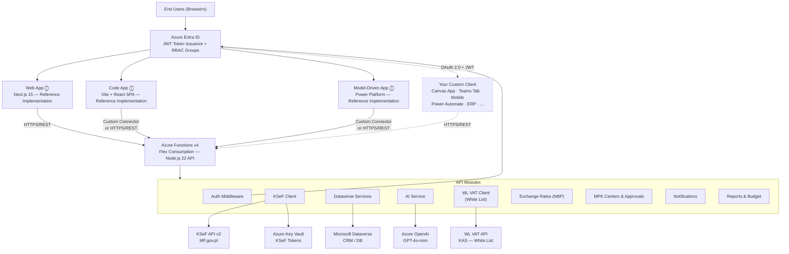

<details>
<summary>ASCII fallback (click to expand)</summary>

```
┌────────────────────────────────────────────────────────────────────┐
│                       End Users (Browsers)                         │
└────────────────────────────────────────────────────────────────────┘
                               │
                               ▼
┌────────────────────────────────────────────────────────────────────┐
│                 Azure Entra ID (Authentication)                    │
│              JWT Token Issuance + RBAC Groups                      │
└────────────────────────────────────────────────────────────────────┘
                               │
                               ▼
┌────────────────────────────────────────────────────────────────────┐
│            Azure Static Web App (Next.js 15 Frontend)              │
│    • Dashboard UI                                                  │
│    • Invoice Management                                            │
│    • Settings & Configuration                                      │
│    • Role-based UI rendering                                       │
└────────────────────────────────────────────────────────────────────┘
                               │
                          HTTPS/REST
                               ▼
┌────────────────────────────────────────────────────────────────────┐
│          Azure Functions v4 (Node.js 20+ REST API)                │
│                                                                    │
│  ┌──────────────┐  ┌──────────────┐  ┌──────────────┐           │
│  │   Auth       │  │   KSeF       │  │  Dataverse   │           │
│  │   Middleware │  │   Client     │  │  Services    │           │
│  └──────────────┘  └──────────────┘  └──────────────┘           │
│                                                                    │
│  ┌──────────────┐  ┌──────────────┐  ┌──────────────┐           │
│  │   AI         │  │   WL VAT     │  │  Document    │           │
│  │   Service    │  │   Client     │  │  Parser      │           │
│  └──────────────┘  └──────────────┘  └──────────────┘           │
└────────────────────────────────────────────────────────────────────┘
         │                  │                  │
         ▼                  ▼                  ▼
┌──────────────┐  ┌──────────────┐  ┌──────────────┐
│   Azure      │  │     KSeF     │  │  Microsoft   │
│   OpenAI     │  │   API v2     │  │  Dataverse   │
│  (GPT-4o)    │  │ (MF.gov.pl)  │  │  (CRM/DB)    │
└──────────────┘  └──────────────┘  └──────────────┘
                        │
                        ▼
                 ┌──────────────┐
                 │ Azure Key    │
                 │ Vault        │
                 │ (KSeF Tokens)│
                 └──────────────┘
```

</details>

---

## Component Design

### 1. Frontend Layer (web/) — *Reference Implementation*

> **Note:** The web app is one of the reference client implementations. It demonstrates the integration pattern with the API via direct HTTP calls with an MSAL token. You can build your own client instead of using this app — see [Build Your Own Frontend](#build-your-own-frontend).

**Technology**: Next.js 15 with App Router, React 19, TypeScript 5.7

**Structure**:
```
web/
├── app/                    # App Router pages
│   ├── api/               # API route handlers (NextAuth)
│   ├── dashboard/         # Dashboard pages
│   ├── invoices/          # Invoice management
│   ├── settings/          # Settings UI
│   └── layout.tsx         # Root layout with auth
├── components/            # React components
│   ├── ui/               # shadcn/ui components
│   ├── invoices/         # Invoice-specific components
│   ├── dashboard/        # Dashboard widgets
│   └── layout/           # Layout components (nav, header)
└── lib/
    ├── api-client.ts     # API client (fetch wrapper)
    ├── auth.ts           # NextAuth configuration
    └── utils.ts          # Utility functions
```

**Key Features**:
- Server-side rendering for SEO and performance
- Role-based UI component rendering
- Optimistic UI updates for better UX
- Real-time invoice status polling
- Responsive design with Tailwind CSS

**State Management**:
- React Server Components for data fetching
- Client-side state with React hooks
- NextAuth session management

---

### 2. API Layer (api/)

**Technology**: Azure Functions v4, Node.js 20+, TypeScript 5.7

**Structure**:
```
api/
├── src/
│   ├── functions/              # HTTP-triggered functions (27 modules, 92 endpoints)
│   │   ├── health.ts          # Health check endpoint
│   │   ├── settings.ts        # Settings CRUD
│   │   ├── sessions.ts        # KSeF session management
│   │   ├── ksef-invoices.ts   # KSeF invoice operations
│   │   ├── ksef-sync.ts       # KSeF synchronization
│   │   ├── invoices.ts        # Invoice management
│   │   ├── attachments.ts     # File attachments
│   │   ├── ai-categorize.ts   # AI categorization
│   │   ├── dashboard.ts       # Analytics
│   │   ├── mpk-centers.ts     # MPK center CRUD & approvers
│   │   ├── approvals.ts       # Approval workflow operations
│   │   ├── approval-sla-check.ts # Timer: SLA breach detection
│   │   ├── budget.ts          # Budget summary & details
│   │   ├── notifications.ts   # Notification management
│   │   ├── reports.ts         # Approval & budget reports
│   │   ├── vat.ts             # WL VAT (White List) integration
│   │   ├── exchange-rates.ts  # NBP exchange rates
│   │   ├── forecast.ts        # Invoice forecasting
│   │   ├── anomalies.ts       # Anomaly detection
│   │   ├── documents.ts       # Document processing
│   │   ├── suppliers.ts       # Supplier registry CRUD (8 endpoints)
│   │   ├── sb-agreements.ts   # Self-billing agreement CRUD (7 endpoints)
│   │   ├── sb-templates.ts    # Self-billing template CRUD (5 endpoints)
│   │   ├── self-billing-invoices.ts # Self-billing invoices + generate + import (12 endpoints)
│   │   ├── sb-agreement-expiry-check.ts # Timer: expiring SB agreements
│   │   └── ksef-testdata.ts   # Test data (generation, cleanup)
│   │
│   └── lib/                   # Core libraries
│       ├── auth/              # Authentication & authorization
│       │   └── middleware.ts  # JWT validation, RBAC
│       │
│       ├── dataverse/         # Dataverse integration
│       │   ├── client.ts      # HTTP client
│       │   ├── entities.ts    # Entity definitions
│       │   └── services/      # CRUD services
│       │       ├── invoice.service.ts
│       │       ├── setting.service.ts
│       │       ├── session.service.ts
│       │       ├── synclog.service.ts
│       │       ├── mpkcenter.service.ts
│       │       ├── approver.service.ts
│       │       └── notification.service.ts
│       │
│       ├── ksef/              # KSeF API integration
│       │   ├── client.ts      # HTTP client
│       │   ├── invoices.ts    # Invoice operations
│       │   ├── session.ts     # Session management
│       │   └── parser.ts      # XML parsing
│       │
│       ├── ai/                # AI services
│       │   └── categorizer.ts # OpenAI categorization
│       │
│       ├── vat/               # WL VAT (White List) API client
│       │   └── client.ts      # Company lookup (NIP)
│       │
│       └── storage/           # Azure Storage
│           └── blobs.ts       # Blob operations
│
└── tests/                     # Unit & integration tests
    ├── entities.test.ts       # Entity tests
    ├── parser.test.ts         # XML parser tests
    └── config.test.ts         # Config validation tests
```

**Architectural Patterns**:
- **Service Layer Pattern**: Business logic encapsulated in services
- **Repository Pattern**: Data access abstracted through Dataverse services
- **Middleware Pattern**: Authentication/authorization via middleware
- **Factory Pattern**: Entity and client instantiation
- **Dependency Injection**: Services receive dependencies (client, config)

---

### 3. Authentication & Authorization

**Flow**:

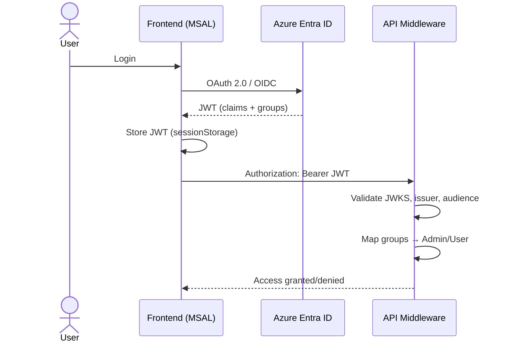

<details>
<summary>Text fallback (click to expand)</summary>

```
1. User authenticates via Azure Entra ID (OAuth 2.0 / OIDC)
   ↓
2. Entra ID issues JWT with user claims + security groups
   ↓
3. Frontend stores JWT in session (NextAuth)
   ↓
4. Frontend sends JWT in Authorization header to API
   ↓
5. API middleware validates JWT:
   - Verifies signature using JWKS from Entra ID
   - Checks issuer, audience, expiration
   - Maps security groups to app roles (Admin/User)
   ↓
6. API grants/denies access based on role requirements
```

</details>

**Security Groups → Role Mapping**:
```typescript
// Environment variables
ADMIN_GROUP_ID=<Azure Entra ID Group Object ID>
USER_GROUP_ID=<Azure Entra ID Group Object ID>

// Middleware logic (api/src/lib/auth/middleware.ts)
if (groups.includes(ADMIN_GROUP_ID)) {
  roles.push('Admin')
}
if (groups.includes(USER_GROUP_ID)) {
  roles.push('User')
}
```

**Role Requirements**:
- **Admin**: CRUD operations, AI categorization, sync operations
- **User**: Read-only access, limited updates (invoice metadata)

---

### 4. Data Layer (Microsoft Dataverse)

**Entities**:

#### InvoiceEntity (`dvlp_ksefinvoices`)
Stores KSeF invoices with categorization metadata.
```typescript
{
  dvlp_ksefinvoiceid: string       // Primary key (GUID)
  dvlp_sellernip: string            // Tenant/company NIP
  dvlp_ksefreferencenumber: string  // KSeF unique reference
  dvlp_name: string                 // Invoice number
  dvlp_buyernip: string             // Supplier NIP
  dvlp_buyername: string            // Supplier name
  dvlp_invoicedate: DateTime        // Invoice date
  dvlp_grossamount: Money           // Gross amount
  dvlp_paymentstatus: Choice        // Payment status (pending/paid)
  dvlp_mpk: Choice                  // Cost center (MPK)
  dvlp_category: string             // Category
  dvlp_aimpksuggestion: Choice      // AI MPK suggestion
  dvlp_aicategorysuggestion: string // AI category suggestion
  dvlp_aiconfidence: Decimal        // AI confidence score
  dvlp_xml: string                  // Original XML
  _dvlp_settingid_value: Lookup     // Foreign key to SettingEntity
}
```

#### SettingEntity (`dvlp_ksefsettings`)
Tenant/company configuration.
```typescript
{
  dvlp_ksefsettingid: string     // Primary key (GUID)
  dvlp_nip: string                // Company NIP
  dvlp_name: string               // Company name
  dvlp_tokensecretname: string    // Key Vault secret name
  dvlp_isactive: boolean          // Active status
}
```

#### SessionEntity (`dvlp_ksefsessions`)
KSeF session tokens.
```typescript
{
  dvlp_ksefsessionid: string     // Primary key (GUID)
  dvlp_nip: string                // Company NIP
  dvlp_sessiontoken: string       // KSeF session token
  dvlp_expiresat: DateTime        // Expiration timestamp
  dvlp_isactive: boolean          // Active status
}
```

#### SyncLogEntity (`dvlp_ksefsynclog`)
Synchronization history.
```typescript
{
  dvlp_ksefsynclogid: string     // Primary key (GUID)
  dvlp_starttime: DateTime        // Sync start time
  dvlp_endtime: DateTime          // Sync end time
  dvlp_status: Choice             // Status (success/failed/partial)
  dvlp_totalcount: Integer        // Total invoices processed
  dvlp_successcount: Integer      // Successfully imported
  dvlp_errorcount: Integer        // Failed imports
  dvlp_errormessage: string       // Error details
  _dvlp_settingid_value: Lookup   // Foreign key to SettingEntity
}
```

#### AIFeedbackEntity (`dvlp_ksefaifeedback`)
AI categorization feedback for model improvement.
```typescript
{
  dvlp_ksefaifeedbackid: string  // Primary key (GUID)
  dvlp_feedbacktype: Choice       // Type (applied/modified/rejected)
  dvlp_originalsuggestion: string // AI's original suggestion
  dvlp_finalvalue: string         // User's final value
  dvlp_timestamp: DateTime        // Feedback timestamp
  _dvlp_invoiceid_value: Lookup   // Foreign key to InvoiceEntity
}
```

#### MpkCenterEntity (`dvlp_ksefmpkcenter`)
MPK (Cost Center) configuration per tenant.
```typescript
{
  dvlp_ksefmpkcenterid: string   // Primary key (GUID)
  dvlp_name: string               // MPK center name
  dvlp_description: string        // Description
  dvlp_isactive: boolean          // Active status
  dvlp_approvalrequired: boolean  // Requires approval workflow
  dvlp_approvalslahours: Integer  // SLA hours for approval
  dvlp_approvaleffectivefrom: DateOnly // Only invoices issued on/after this date require approval
  dvlp_budgetamount: Decimal      // Budget amount
  dvlp_budgetperiod: Choice       // Budget period (monthly/quarterly/half-yearly/annual)
  dvlp_budgetstartdate: DateTime  // Budget start date
  _dvlp_settingid_value: Lookup   // Foreign key to SettingEntity
}
```

#### MpkApproverEntity (`dvlp_ksefmpkapprover`)
Approver assignments per MPK center.
```typescript
{
  dvlp_ksefmpkapproverid: string // Primary key (GUID)
  dvlp_name: string               // Approver display name
  dvlp_systemuserid: string       // Entra ID object ID
  _dvlp_mpkcenterid_value: Lookup // Foreign key to MpkCenterEntity
}
```

#### NotificationEntity (`dvlp_ksefnotification`)
User notifications for approval and budget events.
```typescript
{
  dvlp_ksefnotificationid: string // Primary key (GUID)
  dvlp_name: string                // Notification title
  dvlp_recipientid: string         // Recipient user OID
  dvlp_type: Choice                // Type (approval_requested, sla_exceeded, budget_warning, etc.)
  dvlp_message: string             // Notification message
  dvlp_isread: boolean             // Read status
  dvlp_isdismissed: boolean        // Dismissed status
  _dvlp_settingid_value: Lookup    // Foreign key to SettingEntity
  _dvlp_invoiceid_value: Lookup    // Foreign key to InvoiceEntity (optional)
  _dvlp_mpkcenterid_value: Lookup  // Foreign key to MpkCenterEntity (optional)
}
```

#### SupplierEntity (`dvlp_ksefsupplier`)
Supplier registry — master data, VAT status, invoice statistics.
```typescript
{
  dvlp_ksefsupplierid: string     // Primary key (GUID)
  dvlp_nip: string                 // Supplier NIP (10 digits)
  dvlp_name: string                // Supplier name
  dvlp_city: string                // City
  dvlp_vatstatus: string           // VAT status from White List
  dvlp_hasselfbillingagreement: boolean // Has active SB agreement
  dvlp_totalinvoicecount: Integer  // Cached invoice count
  dvlp_totalgrossamount: Money     // Cached total gross
  dvlp_status: Choice              // Status (Active/Inactive/Blocked)
  dvlp_source: Choice              // Source (KSeF/Manual/VatApi)
  _dvlp_settingid_value: Lookup    // Foreign key to SettingEntity
}
```

#### SbAgreementEntity (`dvlp_ksefsbagrement`)
Self-billing agreements between buyer and supplier.
```typescript
{
  dvlp_ksefsbagrementid: string   // Primary key (GUID)
  dvlp_name: string                // Agreement name
  dvlp_agreementdate: DateTime     // Agreement signing date
  dvlp_validfrom: DateTime         // Valid from
  dvlp_validto: DateTime           // Valid to (nullable)
  dvlp_status: Choice              // Status (Active/Expired/Terminated)
  dvlp_hasdocument: boolean        // Has attached document
  _dvlp_supplierid_value: Lookup   // Foreign key to SupplierEntity
  _dvlp_settingid_value: Lookup    // Foreign key to SettingEntity
}
```

#### SbTemplateEntity (`dvlp_ksefselfbillingtemplate`)
Self-billing invoice line item templates per supplier.
```typescript
{
  dvlp_ksefselfbillingtemplateid: string // Primary key (GUID)
  dvlp_name: string                      // Template name
  dvlp_itemdescription: string           // Line item description
  dvlp_quantity: Decimal                 // Default quantity
  dvlp_unit: string                      // Unit of measure
  dvlp_unitprice: Money                  // Unit price
  dvlp_vatrate: Integer                  // VAT rate (%)
  dvlp_currency: string                  // Currency (default PLN)
  dvlp_isactive: boolean                 // Active status
  dvlp_sortorder: Integer                // Display sort order
  _dvlp_supplierid_value: Lookup         // Foreign key to SupplierEntity
  _dvlp_settingid_value: Lookup          // Foreign key to SettingEntity
}
```

**Relationships**:
- `SettingEntity 1:N InvoiceEntity` (one tenant, many invoices)
- `SettingEntity 1:N SyncLogEntity` (one tenant, many sync logs)
- `InvoiceEntity 1:N AIFeedbackEntity` (one invoice, multiple feedback entries)
- `SettingEntity 1:N MpkCenterEntity` (one tenant, many MPK centers)
- `MpkCenterEntity 1:N MpkApproverEntity` (one center, many approvers)
- `MpkCenterEntity 1:N InvoiceEntity` (one center, many invoices via lookup)
- `MpkCenterEntity 1:N NotificationEntity` (one center, many notifications)
- `SettingEntity 1:N NotificationEntity` (one tenant, many notifications)
- `InvoiceEntity 1:N NotificationEntity` (one invoice, many notifications)
- `SettingEntity 1:N SupplierEntity` (one tenant, many suppliers)
- `SupplierEntity 1:N InvoiceEntity` (one supplier, many invoices via supplierId)
- `SupplierEntity 1:N SbAgreementEntity` (one supplier, many SB agreements)
- `SbAgreementEntity 1:N SbTemplateEntity` (one agreement, many line item templates)

#### Self-Billing Module — Data Flow

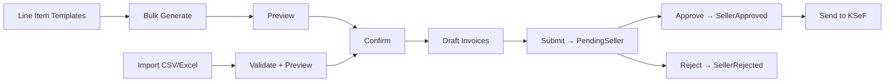

#### Invoice Approval Workflow

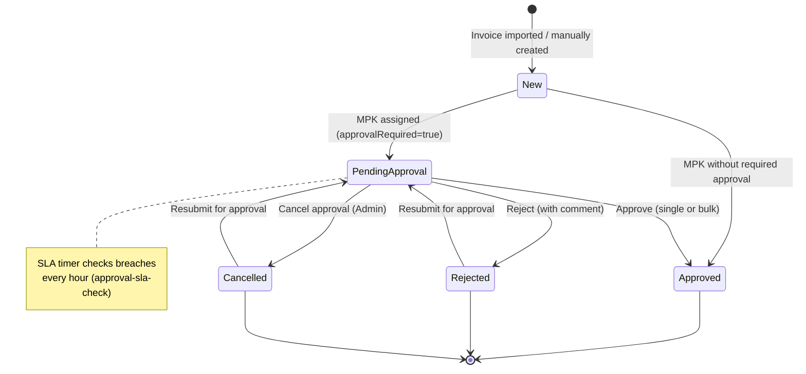

#### Self-Billing Invoice Full Lifecycle (Extended)

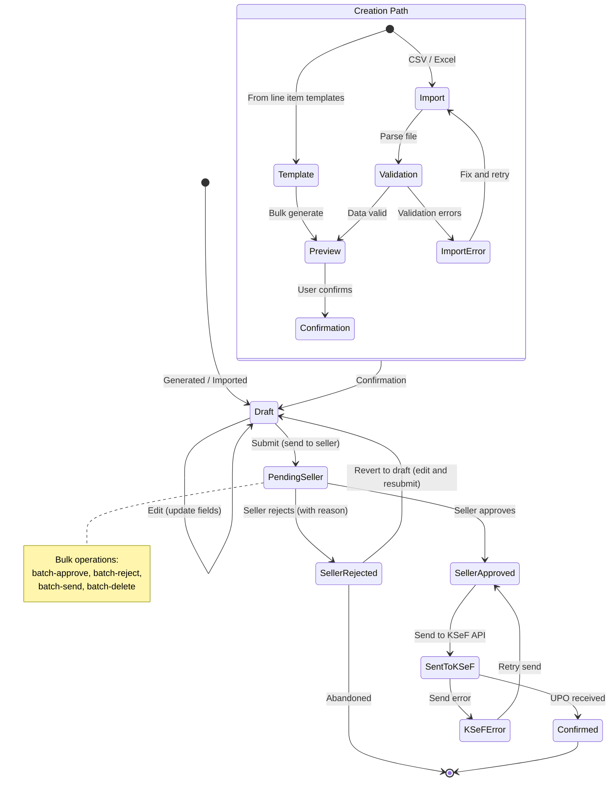

#### Sync Flow — Incoming vs Self-Billing Mode

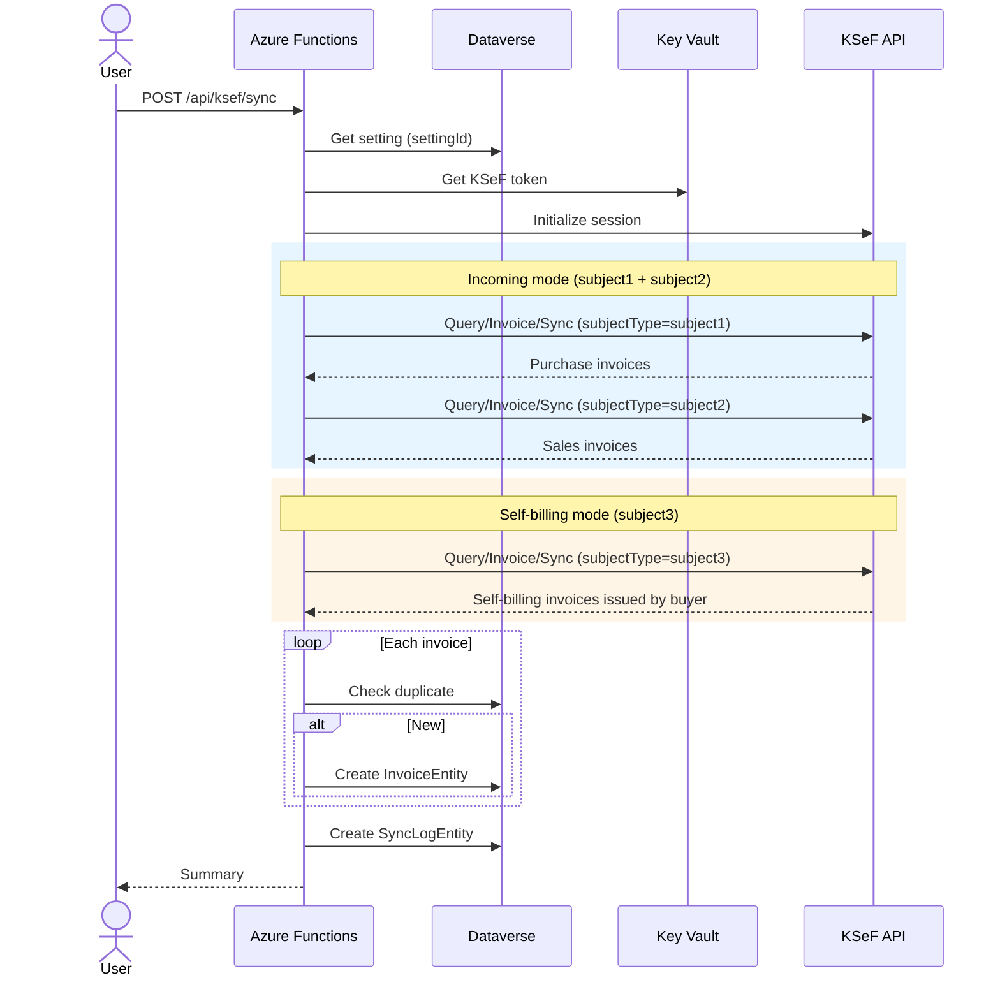

#### Dashboard Architecture

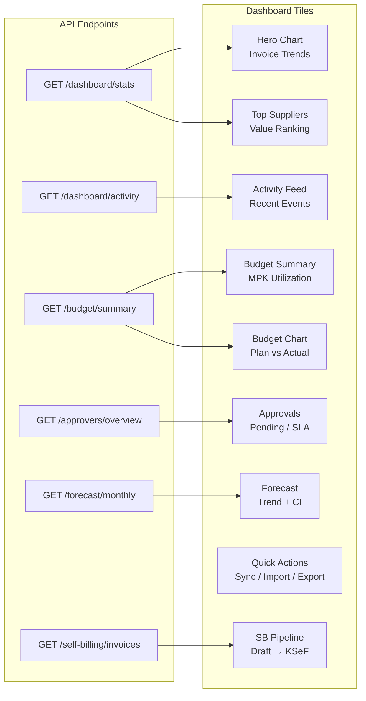

#### Multi-Company Flow (settingId Routing)

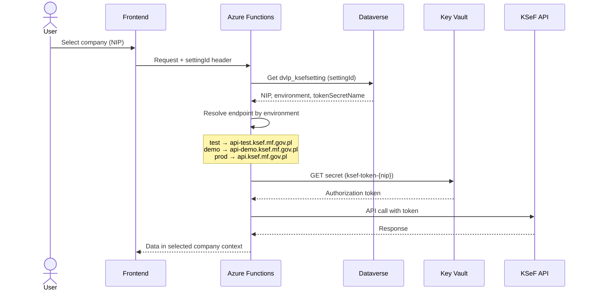

---

### 5. External Integrations

#### KSeF API (MF.gov.pl)
Polish National e-Invoice System integration.

**Endpoints Used**:
- `POST /api/online/Session/InitToken` - Initialize session
- `POST /api/online/Session/Terminate` - Terminate session
- `GET /api/online/Invoice/Get/{referenceNumber}` - Get invoice
- `POST /api/online/Query/Invoice/Sync` - Query invoices
- `POST /api/online/Invoice/Send` - Send invoice
- `GET /api/online/Invoice/Status/{elementReferenceNumber}` - Check status
- `GET /api/online/Invoice/Upo/{referenceNumber}` - Get UPO

**Authentication**:
- Token-based authentication stored in Azure Key Vault
- Session management with automatic renewal
- Support for test, demo, and production environments

**Error Handling**:
- Retry logic for transient failures (network, 5xx errors)
- Exponential backoff strategy
- Detailed error logging to Application Insights

#### Azure OpenAI (GPT-4o)
AI-powered invoice categorization.

**Model**: GPT-4o (configurable)

**Prompt Strategy**:
```typescript
const prompt = `
You are an expert accountant. Categorize the following invoice:
- Supplier: ${invoice.supplierName}
- Description: ${invoice.description}
- Amount: ${invoice.grossAmount}

Available cost centers:
- Consultants (100000000)
- BackOffice (100000001)
- Management (100000002)
- Cars (100000003)
- Legal (100000100)
- Marketing (100000005)
- Sales (100000006)
- Delivery (100000007)
- Finance (100000008)
- Other (100000009)

Return JSON: { "mpk": <value>, "category": "<string>", "confidence": <0-1> }
`
```

**Response Processing**:
- Parse JSON response
- Validate MPK value exists in Dataverse choice
- Store suggestion + confidence in invoice record
- Track user feedback (applied/modified/rejected)

#### WL VAT API (White List / NIP Lookup)
Polish White List VAT API integration for supplier validation.

**Capabilities**:
- NIP validation and existence check
- Company name lookup
- Address and REGON retrieval
- Company status verification

---

## Data Flow

### Invoice Synchronization Flow

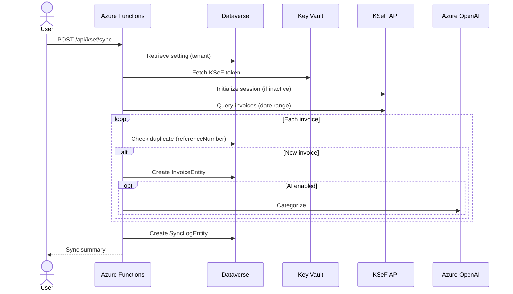

<details>
<summary>Text fallback (click to expand)</summary>

```
1. User initiates sync (POST /api/ksef/sync)
   ↓
2. API retrieves setting (tenant) from Dataverse
   ↓
3. API fetches KSeF token from Azure Key Vault
   ↓
4. API initializes KSeF session (if not active)
   ↓
5. API queries KSeF for invoices (date range)
   ↓
6. For each invoice:
   a. Check if already exists in Dataverse (by referenceNumber)
   b. If new:
      - Parse XML
      - Create InvoiceEntity record in Dataverse
      - Trigger AI categorization (if enabled)
   ↓
7. Create SyncLogEntity record with stats
   ↓
8. Return sync summary to user
```

</details>

### AI Categorization Flow

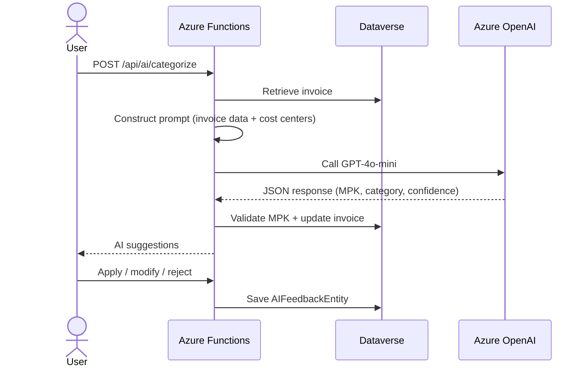

<details>
<summary>Text fallback (click to expand)</summary>

```
1. User triggers categorization (POST /api/ai/categorize)
   ↓
2. API retrieves invoice from Dataverse
   ↓
3. API constructs prompt with invoice data + cost centers
   ↓
4. API calls Azure OpenAI (GPT-4o)
   ↓
5. API parses JSON response
   ↓
6. API validates MPK value exists in Dataverse
   ↓
7. API updates invoice with:
   - dvlp_aimpksuggestion
   - dvlp_aicategorysuggestion
   - dvlp_aiconfidence
   ↓
8. Return suggestions to user
   ↓
9. User applies/modifies/rejects
   ↓
10. API creates AIFeedbackEntity record for model training
```

</details>

### Authentication Flow

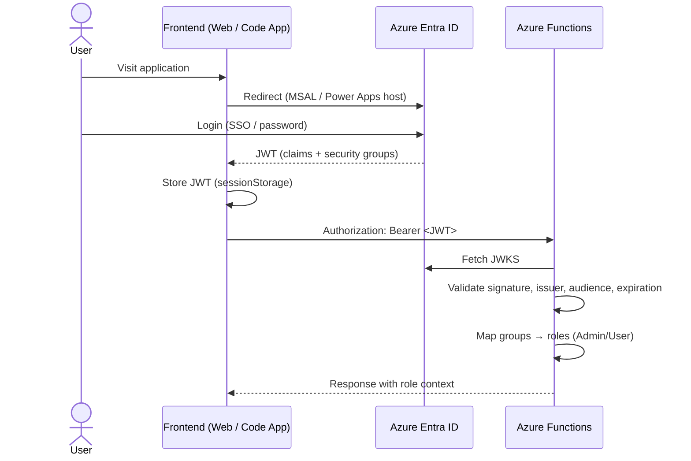

<details>
<summary>Text fallback (click to expand)</summary>

```
1. User visits frontend (Next.js app)
   ↓
2. NextAuth redirects to Azure Entra ID
   ↓
3. User authenticates (username/password or SSO)
   ↓
4. Entra ID issues JWT with:
   - User claims (oid, name, email)
   - Security groups (Admin/User)
   ↓
5. NextAuth stores JWT in session cookie
   ↓
6. Frontend makes API call with Authorization: Bearer <JWT>
   ↓
7. API middleware verifies JWT:
   - Fetches JWKS from Entra ID
   - Validates signature, issuer, audience, expiration
   - Maps groups to roles (Admin/User)
   ↓
8. API executes request with role context
   ↓
9. Response returned to frontend
```

</details>

### Forecasting and Anomaly Detection

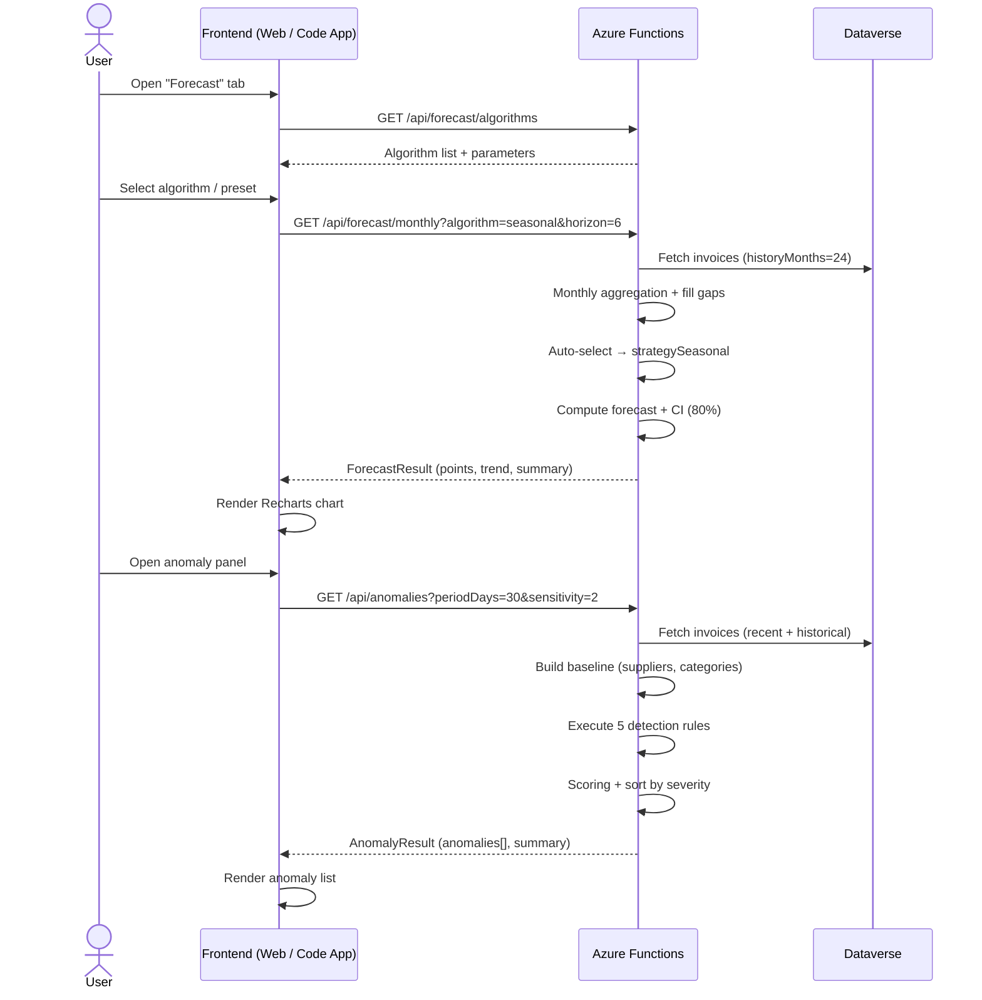

<details>
<summary>Text fallback (click to expand)</summary>

```
1. User opens "Forecast" tab
   ↓
2. Frontend fetches algorithm list from /api/forecast/algorithms
   ↓
3. User selects algorithm/preset, frontend calls /api/forecast/monthly
   ↓
4. API fetches invoices from Dataverse (24 months default)
   ↓
5. API aggregates monthly, fills gaps, runs selected strategy
   ↓
6. API returns ForecastResult with points, CI, trend, summary
   ↓
7. Frontend renders chart (Recharts)
   ↓
8. For anomalies: API fetches recent + historical invoices
   ↓
9. API builds supplier/category baselines
   ↓
10. API runs 5 detection rules, scores & sorts results
   ↓
11. Frontend renders anomaly list with severity indicators
```

</details>

---

## Security Architecture

### Defense in Depth

**Layer 1: Network**
- Azure Functions behind Application Gateway (optional)
- HTTPS/TLS 1.2+ only
- CORS configured for frontend origin only

**Layer 2: Authentication**
- Azure Entra ID OAuth 2.0 / OIDC
- JWT with cryptographic signature validation (RS256)
- Short-lived tokens (1 hour default)
- No anonymous access (except `/api/health`)

**Layer 3: Authorization**
- Role-Based Access Control (RBAC)
- Security group membership from Entra ID
- Fine-grained permissions per endpoint
- Startup validation: crashes if `SKIP_AUTH=true` in production (see below)

> ⚠️ **`SKIP_AUTH=true`** (dev only): Bypasses the **entire authentication and authorization pipeline** — does not read the `Authorization` header, does not verify the JWT, does not map groups to roles. Instead, it returns a hardcoded `dev-user` with the `Admin` role. In production (`NODE_ENV=production`), setting this flag causes an **immediate crash on startup**.

**Layer 4: Data**
- Sensitive data (KSeF tokens) in Azure Key Vault
- Managed Identity for Key Vault access (no credentials)
- Dataverse field-level security (configurable)
- Encryption at rest (Azure default)

**Layer 5: Application**
- Input validation with Zod schemas
- SQL injection prevention (OData queries sanitized)
- XSS prevention (React auto-escaping)
- CSRF protection (NextAuth)

### Key Management

- **KSeF Tokens**: Stored in Azure Key Vault as secrets
- **Secret Naming**: `ksef-token-{nip}` convention
- **Rotation**: Manual via settings UI (Admin only)
- **Access**: Managed Identity with least privilege

### Secrets & Environment Variables

**Critical Secrets** (never commit):
- `AZURE_CLIENT_SECRET`
- `AZURE_KEY_VAULT_URL`
- `DATAVERSE_URL`
- `AZURE_OPENAI_KEY`

**Configuration**:
- Local: `api/local.settings.json` (gitignored)
- Azure: Application Settings (encrypted at rest)

---

## Deployment Architecture

### Azure Resources

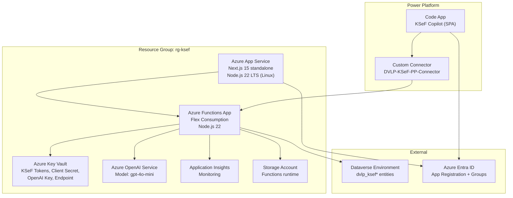

<details>
<summary>Text fallback (click to expand)</summary>

```
Resource Group: dvlp-ksef-prod
├── Azure Functions App (API)
│   ├── App Service Plan (Flex Consumption)
│   ├── Application Insights (monitoring)
│   └── Storage Account (function runtime)
├── Azure App Service (Frontend)
│   └── Next.js 15 standalone
├── Azure Key Vault
│   └── Managed Identity access
├── Azure OpenAI Service
│   └── GPT-4o-mini model deployment
├── Dataverse Environment (existing)
│   └── dvlp_ksef* entities
└── Azure Entra ID App Registration
    ├── API permissions (Dataverse, Graph)
    └── Security groups (Admin, User)
```

</details>

## Build Your Own Frontend

The solution’s API is **fully self-contained and independent of any frontend**. Any application supporting OAuth 2.0 (Azure Entra ID) and the HTTP/REST protocol can consume the API.

### What You Need

1. **Authentication** — obtain a JWT token from Azure Entra ID (MSAL, Power Platform managed auth, or any OIDC library)
2. **API calls** — HTTP/REST with `Authorization: Bearer <JWT>` header to Azure Functions endpoints
3. **Optionally: Custom Connector** — for clients within the Power Platform ecosystem (Canvas Apps, Power Automate, Copilot Studio)

### Example Client Types

| Client Type | Integration Pattern | Example Use Case |
|---|---|---|
| **Power Apps Canvas App** | Custom Connector | Simplified UI for a specific process |
| **Model-Driven App (MDA)** | Dataverse natively + Custom Connector | Full data view with native CRUD |
| **Power Automate Flow** | Custom Connector | Automated periodic synchronization |
| **Copilot Studio** | Custom Connector / HTTP | Chatbot for querying invoice status |
| **Teams Tab / Bot** | MSAL + HTTP/REST | Invoice notifications in Teams |
| **Mobile App** | MSAL + HTTP/REST | Approving invoices in the field |
| **External ERP System** | Service-to-service token + HTTP/REST | Importing invoices into accounting |
| **Custom SPA / PWA** | MSAL + HTTP/REST | Dedicated supplier portal |

> Entry point: [API Documentation](./API.md) contains the full specification of endpoints, parameters, and responses.

---

## Technology Stack

### Backend (API)
- **Runtime**: Node.js 20.x LTS
- **Framework**: Azure Functions v4 (HTTP triggers)
- **Language**: TypeScript 5.7 (strict mode)
- **HTTP Client**: `axios` (with retry interceptors)
- **Validation**: `zod` schemas
- **JWT**: `jose` library (JWKS validation)
- **Testing**: Vitest 2.1.9
- **Linting**: ESLint 9 with TypeScript rules

### Reference Frontend Implementations

> The technologies below pertain to the provided reference implementations. Your own client can use any technology stack.

**Web (Next.js)**:
- **Framework**: Next.js 15 with App Router
- **Runtime**: React 19
- **Language**: TypeScript 5.7
- **Styling**: Tailwind CSS 3
- **UI Components**: shadcn/ui (Radix UI primitives)
- **Auth**: NextAuth.js v5 (Azure AD provider)
- **State**: React Server Components + hooks
- **Forms**: React Hook Form + Zod
- **Testing**: Vitest + React Testing Library

**Code App (Vite + React)**:
- **Framework**: Vite + React 19
- **Language**: TypeScript
- **Styling**: Tailwind CSS + shadcn/ui
- **Cache / mutations**: TanStack Query
- **i18n**: react-intl (PL/EN)
- **Deployment**: Power Platform (`pac code push`)

**Model-Driven App (MDA)**:
- **Platform**: Power Platform
- **Views / forms**: Declarative Dataverse configuration
- **API integration**: Custom Connector (DVLP-KSeF-PP-Connector)

### Infrastructure
- **Compute**: Azure Functions (Consumption/Premium)
- **Frontend**: Azure Static Web Apps
- **Database**: Microsoft Dataverse
- **Secrets**: Azure Key Vault
- **AI**: Azure OpenAI (GPT-4o)
- **Monitoring**: Application Insights
- **Storage**: Azure Blob Storage
- **IaC**: Bicep (planned)

### DevOps
- **Version Control**: Git + GitHub

- **Package Manager**: npm
- **Security Scanning**: Trivy, Dependabot
- **Pre-commit**: Husky (typecheck + lint)

---

## Design Patterns

### 1. Service Layer Pattern
Business logic encapsulated in reusable services.
```typescript
// api/src/lib/dataverse/services/invoice.service.ts
export class InvoiceService {
  async getById(id: string): Promise<Invoice> { ... }
  async query(filter: string): Promise<Invoice[]> { ... }
  async create(data: CreateInvoice): Promise<Invoice> { ... }
  async update(id: string, data: UpdateInvoice): Promise<Invoice> { ... }
}
```

### 2. Middleware Pattern
Cross-cutting concerns (auth, logging) via middleware.
```typescript
// api/src/lib/auth/middleware.ts
export async function verifyAuth(req: HttpRequest, context: InvocationContext) {
  const token = extractToken(req)
  const decoded = await jose.jwtVerify(token, JWKS, { ... })
  return { user: decoded.payload, roles: extractRoles(decoded.payload) }
}

// Usage in function
app.http('invoices-get', {
  handler: async (req, context) => {
    const auth = await verifyAuth(req, context)
    requireRole(auth, 'User')
    // ...
  }
})
```

### 3. Repository Pattern
Data access abstraction through Dataverse services.
```typescript
// Abstracts Dataverse OData queries
const invoices = await invoiceService.query(`dvlp_sellernip eq '${nip}'`)
```

### 4. Factory Pattern
Consistent entity instantiation.
```typescript
export function createInvoiceEntity(data: KSeFInvoice): Partial<InvoiceEntity> {
  return {
    dvlp_ksefreferencenumber: data.referenceNumber,
    dvlp_name: data.invoiceNumber,
    // ...
  }
}
```

### 5. Dependency Injection
Services receive dependencies, enabling testability.
```typescript
export class InvoiceService {
  constructor(
    private client: DataverseClient,
    private entity: typeof InvoiceEntity
  ) {}
}
```

---

## Performance & Scalability

### Performance Optimizations

**API**:
- Serverless auto-scaling (Azure Functions Consumption)
- Dataverse query optimization (select only needed fields)
- Caching: Session tokens cached in Dataverse (avoid Key Vault roundtrips)
- Async/await for concurrent operations
- Streaming responses for large datasets

**Frontend**:
- React Server Components (reduced client JS)
- Code splitting (Next.js automatic)
- Image optimization (next/image)
- CDN delivery (Azure Static Web Apps)

### Scalability Strategy

**Horizontal Scaling**:
- Azure Functions auto-scale based on load (Consumption plan)
- Static Web App globally distributed via CDN

**Vertical Scaling**:
- Upgrade to Premium plan for dedicated instances
- Increase Dataverse throughput (contact Microsoft)

**Database Scaling**:
- Dataverse handles scaling automatically
- Indexing: Ensure dvlp_ksefreferencenumber, dvlp_sellernip indexed
- Pagination: Use $top + $skip for large datasets

### Monitoring & Observability

**Application Insights**:
- Request/response telemetry
- Exception tracking
- Custom events (sync operations, AI categorization)
- Performance metrics (response times, dependencies)

**Logging**:
- Structured logging with `context.log()`
- Log levels: Info, Warning, Error
- Correlation IDs for distributed tracing

**Alerts**:
- Function execution failures (>5% error rate)
- High latency (>2s p95)
- Key Vault access failures
- Dataverse throttling

---

## Future Enhancements

### Planned Architecture Improvements

1. **Event-Driven Architecture**:
   - Azure Event Grid for invoice synchronization events
   - Webhooks for real-time notifications

2. **Caching Layer**:
   - Redis for frequent queries (cost centers, settings)
   - Reduce Dataverse load

3. **Batch Processing**:
   - Azure Durable Functions for long-running sync jobs
   - Progress reporting via orchestration

4. **Multitenancy**:
   - Tenant isolation at Dataverse level
   - Dedicated storage containers per tenant

5. **Infrastructure as Code**:
   - Complete Bicep templates for one-click deployment
   - Managed Identity automation

6. **Advanced AI**:
   - Fine-tuned models with user feedback data
   - Anomaly detection for suspicious invoices

---

## Related Documentation

- [API Reference](./API.md) - Detailed endpoint documentation
- [README](../README.md) - Getting started guide
- [SECURITY](../SECURITY.md) - Security policy and best practices
- [CONTRIBUTING](../CONTRIBUTING.md) - Development guidelines


