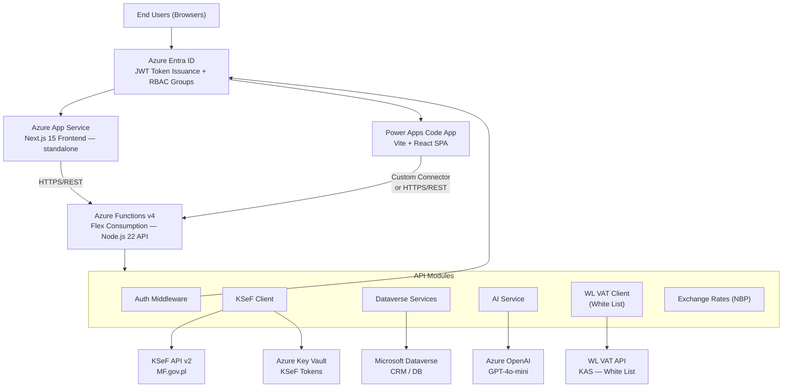
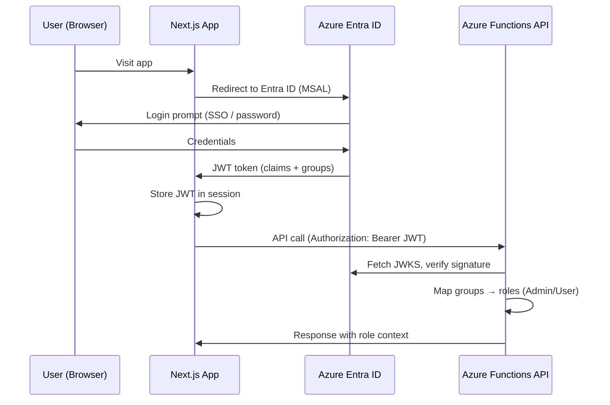
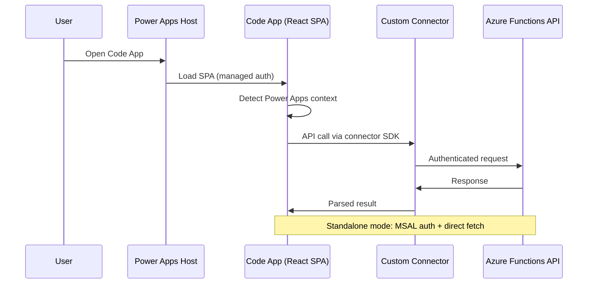
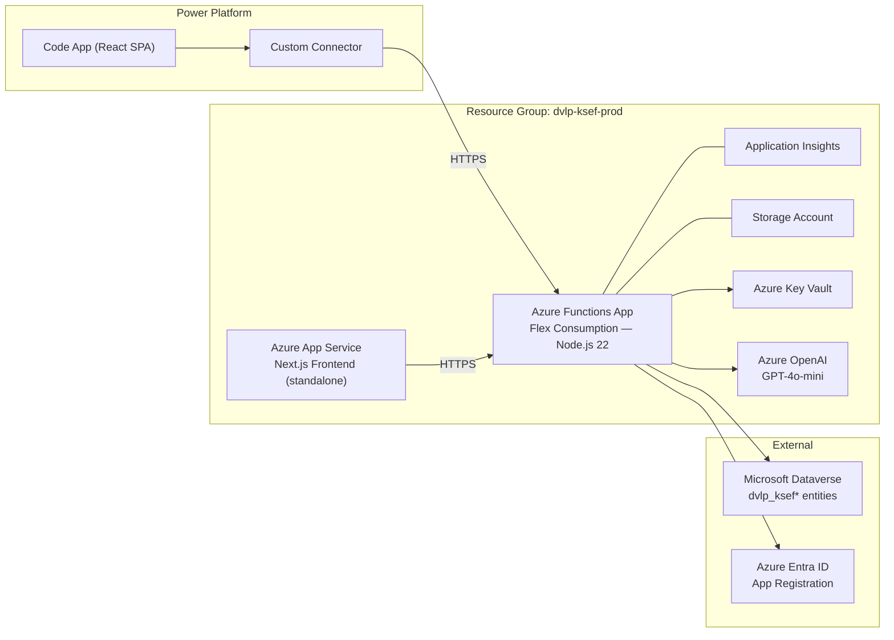

# Architecture Documentation

## Table of Contents
- [Overview](#overview)
- [System Architecture](#system-architecture)
- [Component Design](#component-design)
- [Data Flow](#data-flow)
- [Security Architecture](#security-architecture)
- [Deployment Architecture](#deployment-architecture)
- [Technology Stack](#technology-stack)
- [Design Patterns](#design-patterns)
- [Performance & Scalability](#performance--scalability)

---

## Overview

**dvlp-ksef** is a cloud-native integration platform for the Polish National e-Invoice System (KSeF) with AI-powered categorization and Microsoft Dataverse backend. The system follows a serverless, microservices-based architecture deployed on Azure.

### Key Architectural Principles
- **Serverless-First**: Azure Functions for compute, Azure Storage for persistence
- **API-Driven**: RESTful API with comprehensive endpoint coverage
- **Security by Design**: Zero-trust with Entra ID authentication, JWT validation, RBAC
- **Cloud-Native**: Built for Azure with PaaS services (Functions, Dataverse, Key Vault, OpenAI)
- **Separation of Concerns**: Clear boundaries between API, frontend, and external integrations
- **Data Sovereignty**: All data stored in Microsoft Dataverse (EU compliance ready)

---

## System Architecture

### High-Level Architecture



---

## Component Design

### 1a. Frontend Layer — Web (web/)

**Technology**: Next.js 15 with App Router, React 19, TypeScript 5.7  
**Deployment**: Azure App Service (standalone mode)

**Structure**:
```
web/
├── app/                    # App Router pages
│   ├── api/               # API route handlers (NextAuth)
│   ├── dashboard/         # Dashboard pages
│   ├── invoices/          # Invoice management
│   ├── settings/          # Settings UI
│   └── layout.tsx         # Root layout with auth
├── components/            # React components
│   ├── ui/               # shadcn/ui components
│   ├── invoices/         # Invoice-specific components
│   ├── dashboard/        # Dashboard widgets
│   └── layout/           # Layout components (nav, header)
└── lib/
    ├── api-client.ts     # API client (fetch wrapper)
    ├── auth.ts           # NextAuth configuration
    └── utils.ts          # Utility functions
```

**Key Features**:
- Server-side rendering for SEO and performance
- Role-based UI component rendering
- Optimistic UI updates for better UX
- Real-time invoice status polling
- Responsive design with Tailwind CSS

**State Management**:
- React Server Components for data fetching
- Client-side state with React hooks
- NextAuth session management

---

### 1b. Frontend Layer — Code App (code-app/)

**Technology**: Vite + React 19, TypeScript, TanStack Query  
**Deployment**: Power Platform (`pac code push`)

**Structure**:
```
code-app/
├── src/
│   ├── pages/              # SPA pages (React Router)
│   ├── components/         # React components (auth, invoices, dashboard, layout)
│   ├── lib/
│   │   ├── api.ts         # Direct fetch API client (MSAL auth)
│   │   ├── api-connector.ts # Power Apps Custom Connector adapter
│   │   ├── nip-utils.ts   # NIP checksum validation (offline)
│   │   └── power-apps-host.ts # Power Apps context detection
│   ├── generated/         # Auto-generated connector models & services
│   └── messages/          # i18n (PL/EN)
├── power.config.json      # Power Apps SDK metadata
└── vite.config.ts         # Vite + powerApps() plugin
```

**Key Features**:
- **Dual-mode auth**: MSAL standalone + Power Apps managed auth
- **Custom Connector**: API routing through Power Platform connector (lazy loading)
- **Web parity**: Dashboard KPIs, overdue badges, exchange rate edit, AI trigger
- Responsive design with Tailwind CSS + shadcn/ui
- TanStack Query for cache and mutations
- i18n (PL/EN) via `react-intl`

---

### 2. API Layer (api/)

**Technology**: Azure Functions v4, Node.js 20+, TypeScript 5.7

**Structure**:
```
api/
├── src/
│   ├── functions/              # HTTP-triggered functions
│   │   ├── health.ts          # Health check endpoint
│   │   ├── settings.ts        # Settings CRUD
│   │   ├── sessions.ts        # KSeF session management
│   │   ├── ksef-invoices.ts   # KSeF invoice operations
│   │   ├── ksef-sync.ts       # KSeF synchronization
│   │   ├── invoices.ts        # Invoice management
│   │   ├── attachments.ts     # File attachments
│   │   ├── ai-categorize.ts   # AI categorization
│   │   ├── dashboard.ts       # Analytics
│   │   ├── vat.ts             # WL VAT integration (White List)
│   │   ├── exchange-rates.ts  # Exchange rates NBP
│   │   └── documents.ts       # Document processing
│   │
│   └── lib/                   # Core libraries
│       ├── auth/              # Authentication & authorization
│       │   └── middleware.ts  # JWT validation, RBAC
│       │
│       ├── dataverse/         # Dataverse integration
│       │   ├── client.ts      # HTTP client
│       │   ├── entities.ts    # Entity definitions
│       │   └── services/      # CRUD services
│       │       ├── invoice.service.ts
│       │       ├── setting.service.ts
│       │       ├── session.service.ts
│       │       └── synclog.service.ts
│       │
│       ├── ksef/              # KSeF API integration
│       │   ├── client.ts      # HTTP client
│       │   ├── invoices.ts    # Invoice operations
│       │   ├── session.ts     # Session management
│       │   └── parser.ts      # XML parsing
│       │
│       ├── ai/                # AI services
│       │   └── categorizer.ts # OpenAI categorization
│       │
│       ├── vat/               # WL VAT API client (White List)
│       │   ├── client.ts      # NIP/REGON lookup, bank account check
│       │   ├── types.ts       # WL VAT API types
│       │   └── index.ts       # Public exports
│       │
│       └── storage/           # Azure Storage
│           └── blobs.ts       # Blob operations
│
└── tests/                     # Unit & integration tests
    ├── entities.test.ts       # Entity tests
    ├── parser.test.ts         # XML parser tests
    └── config.test.ts         # Config validation tests
```

**Architectural Patterns**:
- **Service Layer Pattern**: Business logic encapsulated in services
- **Repository Pattern**: Data access abstracted through Dataverse services
- **Middleware Pattern**: Authentication/authorization via middleware
- **Factory Pattern**: Entity and client instantiation
- **Dependency Injection**: Services receive dependencies (client, config)

---

### 3. Authentication & Authorization

**Flow**:
```
1. User authenticates via Azure Entra ID (OAuth 2.0 / OIDC)
   ↓
2. Entra ID issues JWT with user claims + security groups
   ↓
3. Frontend stores JWT in session (NextAuth)
   ↓
4. Frontend sends JWT in Authorization header to API
   ↓
5. API middleware validates JWT:
   - Verifies signature using JWKS from Entra ID
   - Checks issuer, audience, expiration
   - Maps security groups to app roles (Admin/User)
   ↓
6. API grants/denies access based on role requirements
```

**Security Groups → Role Mapping**:
```typescript
// Environment variables
ADMIN_GROUP_ID=<Azure Entra ID Group Object ID>
USER_GROUP_ID=<Azure Entra ID Group Object ID>

// Middleware logic (api/src/lib/auth/middleware.ts)
if (groups.includes(ADMIN_GROUP_ID)) {
  roles.push('Admin')
}
if (groups.includes(USER_GROUP_ID)) {
  roles.push('User')
}
```

**Role Requirements**:
- **Admin**: CRUD operations, AI categorization, sync operations
- **User**: Read-only access, limited updates (invoice metadata)

---

### 4. Data Layer (Microsoft Dataverse)

**Entities**:

#### InvoiceEntity (`dvlp_ksefinvoices`)
Stores KSeF invoices with categorization metadata.
```typescript
{
  dvlp_ksefinvoiceid: string       // Primary key (GUID)
  dvlp_sellernip: string            // Tenant/company NIP
  dvlp_ksefreferencenumber: string  // KSeF unique reference
  dvlp_name: string                 // Invoice number
  dvlp_buyernip: string             // Supplier NIP
  dvlp_buyername: string            // Supplier name
  dvlp_invoicedate: DateTime        // Invoice date
  dvlp_grossamount: Money           // Gross amount
  dvlp_paymentstatus: Choice        // Payment status (pending/paid)
  dvlp_mpk: Choice                  // Cost center (MPK)
  dvlp_category: string             // Category
  dvlp_aimpksuggestion: Choice      // AI MPK suggestion
  dvlp_aicategorysuggestion: string // AI category suggestion
  dvlp_aiconfidence: Decimal        // AI confidence score
  dvlp_xml: string                  // Original XML
  _dvlp_settingid_value: Lookup     // Foreign key to SettingEntity
}
```

#### SettingEntity (`dvlp_ksefsettings`)
Tenant/company configuration.
```typescript
{
  dvlp_ksefsettingid: string     // Primary key (GUID)
  dvlp_nip: string                // Company NIP
  dvlp_name: string               // Company name
  dvlp_tokensecretname: string    // Key Vault secret name
  dvlp_isactive: boolean          // Active status
}
```

#### SessionEntity (`dvlp_ksefsessions`)
KSeF session tokens.
```typescript
{
  dvlp_ksefsessionid: string     // Primary key (GUID)
  dvlp_nip: string                // Company NIP
  dvlp_sessiontoken: string       // KSeF session token
  dvlp_expiresat: DateTime        // Expiration timestamp
  dvlp_isactive: boolean          // Active status
}
```

#### SyncLogEntity (`dvlp_ksefsynclog`)
Synchronization history.
```typescript
{
  dvlp_ksefsynclogid: string     // Primary key (GUID)
  dvlp_starttime: DateTime        // Sync start time
  dvlp_endtime: DateTime          // Sync end time
  dvlp_status: Choice             // Status (success/failed/partial)
  dvlp_totalcount: Integer        // Total invoices processed
  dvlp_successcount: Integer      // Successfully imported
  dvlp_errorcount: Integer        // Failed imports
  dvlp_errormessage: string       // Error details
  _dvlp_settingid_value: Lookup   // Foreign key to SettingEntity
}
```

#### AIFeedbackEntity (`dvlp_ksefaifeedback`)
AI categorization feedback for model improvement.
```typescript
{
  dvlp_ksefaifeedbackid: string  // Primary key (GUID)
  dvlp_feedbacktype: Choice       // Type (applied/modified/rejected)
  dvlp_originalsuggestion: string // AI's original suggestion
  dvlp_finalvalue: string         // User's final value
  dvlp_timestamp: DateTime        // Feedback timestamp
  _dvlp_invoiceid_value: Lookup   // Foreign key to InvoiceEntity
}
```

**Relationships**:
- `SettingEntity 1:N InvoiceEntity` (one tenant, many invoices)
- `SettingEntity 1:N SyncLogEntity` (one tenant, many sync logs)
- `InvoiceEntity 1:N AIFeedbackEntity` (one invoice, multiple feedback entries)

---

### 5. External Integrations

#### KSeF API (MF.gov.pl)
Polish National e-Invoice System integration.

**Endpoints Used**:
- `POST /api/online/Session/InitToken` - Initialize session
- `POST /api/online/Session/Terminate` - Terminate session
- `GET /api/online/Invoice/Get/{referenceNumber}` - Get invoice
- `POST /api/online/Query/Invoice/Sync` - Query invoices
- `POST /api/online/Invoice/Send` - Send invoice
- `GET /api/online/Invoice/Status/{elementReferenceNumber}` - Check status
- `GET /api/online/Invoice/Upo/{referenceNumber}` - Get UPO

**Authentication**:
- Token-based authentication stored in Azure Key Vault
- Session management with automatic renewal
- Support for test, demo, and production environments

**Error Handling**:
- Retry logic for transient failures (network, 5xx errors)
- Exponential backoff strategy
- Detailed error logging to Application Insights

#### Azure OpenAI (GPT-4o)
AI-powered invoice categorization.

**Model**: GPT-4o (configurable)

**Prompt Strategy**:
```typescript
const prompt = `
You are an expert accountant. Categorize the following invoice:
- Supplier: ${invoice.supplierName}
- Description: ${invoice.description}
- Amount: ${invoice.grossAmount}

Available cost centers:
- Consultants (100000000)
- BackOffice (100000001)
- Management (100000002)
- Cars (100000003)
- Legal (100000100)
- Marketing (100000005)
- Sales (100000006)
- Delivery (100000007)
- Finance (100000008)
- Other (100000009)

Return JSON: { "mpk": <value>, "category": "<string>", "confidence": <0-1> }
`
```

**Response Processing**:
- Parse JSON response
- Validate MPK value exists in Dataverse choice
- Store suggestion + confidence in invoice record
- Track user feedback (applied/modified/rejected)

#### WL VAT API — White List of VAT Taxpayers (KAS)
Polish tax administration registry for VAT taxpayer verification.

**API**: `https://wl-api.mf.gov.pl` (production) | `https://wl-test.mf.gov.pl` (test)  
**Authentication**: None — public API, no key required  
**Limits**: 100 search queries/day, 5000 check queries/day

**Capabilities**:
- NIP or REGON lookup — company data, VAT status, addresses
- NIP checksum validation (offline algorithm)
- Bank account verification against the White List
- Registered bank accounts retrieval

---

## Data Flow

### Invoice Synchronization Flow

```
1. User initiates sync (POST /api/ksef/sync)
   ↓
2. API retrieves setting (tenant) from Dataverse
   ↓
3. API fetches KSeF token from Azure Key Vault
   ↓
4. API initializes KSeF session (if not active)
   ↓
5. API queries KSeF for invoices (date range)
   ↓
6. For each invoice:
   a. Check if already exists in Dataverse (by referenceNumber)
   b. If new:
      - Parse XML
      - Create InvoiceEntity record in Dataverse
      - Trigger AI categorization (if enabled)
   ↓
7. Create SyncLogEntity record with stats
   ↓
8. Return sync summary to user
```

### AI Categorization Flow

```
1. User triggers categorization (POST /api/ai/categorize)
   ↓
2. API retrieves invoice from Dataverse
   ↓
3. API constructs prompt with invoice data + cost centers
   ↓
4. API calls Azure OpenAI (GPT-4o)
   ↓
5. API parses JSON response
   ↓
6. API validates MPK value exists in Dataverse
   ↓
7. API updates invoice with:
   - dvlp_aimpksuggestion
   - dvlp_aicategorysuggestion
   - dvlp_aiconfidence
   ↓
8. Return suggestions to user
   ↓
9. User applies/modifies/rejects
   ↓
10. API creates AIFeedbackEntity record for model training
```

### Authentication Flow

#### Web App (Next.js)



#### Code App (Power Platform)



---

## Security Architecture

### Defense in Depth

**Layer 1: Network**
- Azure Functions behind Application Gateway (optional)
- HTTPS/TLS 1.2+ only
- CORS configured for frontend origin only

**Layer 2: Authentication**
- Azure Entra ID OAuth 2.0 / OIDC
- JWT with cryptographic signature validation (RS256)
- Short-lived tokens (1 hour default)
- No anonymous access (except `/api/health`)

**Layer 3: Authorization**
- Role-Based Access Control (RBAC)
- Security group membership from Entra ID
- Fine-grained permissions per endpoint
- Startup validation: crashes if `SKIP_AUTH=true` in production

**Layer 4: Data**
- Sensitive data (KSeF tokens) in Azure Key Vault
- Managed Identity for Key Vault access (no credentials)
- Dataverse field-level security (configurable)
- Encryption at rest (Azure default)

**Layer 5: Application**
- Input validation with Zod schemas
- SQL injection prevention (OData queries sanitized)
- XSS prevention (React auto-escaping)
- CSRF protection (NextAuth)

### Key Management

- **KSeF Tokens**: Stored in Azure Key Vault as secrets
- **Secret Naming**: `ksef-token-{nip}` convention
- **Rotation**: Manual via settings UI (Admin only)
- **Access**: Managed Identity with least privilege

### Secrets & Environment Variables

**Critical Secrets** (never commit):
- `AZURE_CLIENT_SECRET`
- `AZURE_KEY_VAULT_URL`
- `DATAVERSE_URL`
- `AZURE_OPENAI_KEY`

**Configuration**:
- Local: `api/local.settings.json` (gitignored)
- Azure: Application Settings (encrypted at rest)

---

## Deployment Architecture

### Azure Resources



### CI/CD Pipeline

**GitHub Actions** (`.github/workflows/`):
- `ci.yml`: Type check, lint, test, build, security scan (Trivy)
- `deploy-api.yml`: Deploy Azure Functions
- `deploy-web.yml`: Deploy Static Web App

**Deployment Strategy**:
- **Staging**: Auto-deploy from `develop` branch
- **Production**: Manual approval required from `main` branch
- **Rollback**: Previous deployment slot swap

### Environment Configuration

| Environment | Branch    | URL                                    |
|-------------|-----------|----------------------------------------|
| Development | `develop` | `https://dev-ksef.azurewebsites.net`  |
| Staging     | `staging` | `https://staging-ksef.azurewebsites.net` |
| Production  | `main`    | `https://ksef.azurewebsites.net`      |

---

## Technology Stack

### Backend (API)
- **Runtime**: Node.js 22.x LTS
- **Framework**: Azure Functions v4 (Flex Consumption, HTTP triggers)
- **Language**: TypeScript 5.7 (strict mode)
- **HTTP Client**: `axios` (with retry interceptors)
- **Validation**: `zod` schemas
- **JWT**: `jose` library (JWKS validation)
- **Testing**: Vitest 2.1.9
- **Linting**: ESLint 9 with TypeScript rules

### Frontend — Web (web/)
- **Framework**: Next.js 15 with App Router
- **Runtime**: React 19
- **Language**: TypeScript 5.7
- **Styling**: Tailwind CSS 3
- **UI Components**: shadcn/ui (Radix UI primitives)
- **Auth**: MSAL (Azure Entra ID)
- **State**: React Server Components + hooks
- **Forms**: React Hook Form + Zod
- **Testing**: Vitest + React Testing Library

### Frontend — Code App (code-app/)
- **Bundler**: Vite 6 + Power Apps plugin
- **Runtime**: React 19
- **Language**: TypeScript 5.7
- **Styling**: Tailwind CSS 3 + shadcn/ui
- **Auth**: MSAL (standalone) / Power Apps managed
- **State**: TanStack Query v5 + React hooks
- **i18n**: react-intl (PL/EN)
- **Deployment**: `pac code push` → Power Platform

### Infrastructure
- **Compute**: Azure Functions (Flex Consumption)
- **Frontend Web**: Azure App Service (standalone)
- **Frontend Code App**: Power Platform code component
- **Database**: Microsoft Dataverse
- **Secrets**: Azure Key Vault
- **AI**: Azure OpenAI (GPT-4o-mini)
- **Monitoring**: Application Insights
- **Storage**: Azure Blob Storage
- **IaC**: Bicep (planned)

### DevOps
- **Version Control**: Git + GitHub
- **CI/CD**: GitHub Actions
- **Package Manager**: pnpm 9+
- **Security Scanning**: Trivy, Dependabot
- **Pre-commit**: Husky (typecheck + lint)

---

## Design Patterns

### 1. Service Layer Pattern
Business logic encapsulated in reusable services.
```typescript
// api/src/lib/dataverse/services/invoice.service.ts
export class InvoiceService {
  async getById(id: string): Promise<Invoice> { ... }
  async query(filter: string): Promise<Invoice[]> { ... }
  async create(data: CreateInvoice): Promise<Invoice> { ... }
  async update(id: string, data: UpdateInvoice): Promise<Invoice> { ... }
}
```

### 2. Middleware Pattern
Cross-cutting concerns (auth, logging) via middleware.
```typescript
// api/src/lib/auth/middleware.ts
export async function verifyAuth(req: HttpRequest, context: InvocationContext) {
  const token = extractToken(req)
  const decoded = await jose.jwtVerify(token, JWKS, { ... })
  return { user: decoded.payload, roles: extractRoles(decoded.payload) }
}

// Usage in function
app.http('invoices-get', {
  handler: async (req, context) => {
    const auth = await verifyAuth(req, context)
    requireRole(auth, 'User')
    // ...
  }
})
```

### 3. Repository Pattern
Data access abstraction through Dataverse services.
```typescript
// Abstracts Dataverse OData queries
const invoices = await invoiceService.query(`dvlp_sellernip eq '${nip}'`)
```

### 4. Factory Pattern
Consistent entity instantiation.
```typescript
export function createInvoiceEntity(data: KSeFInvoice): Partial<InvoiceEntity> {
  return {
    dvlp_ksefreferencenumber: data.referenceNumber,
    dvlp_name: data.invoiceNumber,
    // ...
  }
}
```

### 5. Dependency Injection
Services receive dependencies, enabling testability.
```typescript
export class InvoiceService {
  constructor(
    private client: DataverseClient,
    private entity: typeof InvoiceEntity
  ) {}
}
```

---

## Performance & Scalability

### Performance Optimizations

**API**:
- Serverless auto-scaling (Azure Functions Consumption)
- Dataverse query optimization (select only needed fields)
- Caching: Session tokens cached in Dataverse (avoid Key Vault roundtrips)
- Async/await for concurrent operations
- Streaming responses for large datasets

**Frontend**:
- React Server Components (reduced client JS)
- Code splitting (Next.js automatic)
- Image optimization (next/image)
- CDN delivery (Azure Static Web Apps)

### Scalability Strategy

**Horizontal Scaling**:
- Azure Functions auto-scale based on load (Consumption plan)
- Static Web App globally distributed via CDN

**Vertical Scaling**:
- Upgrade to Premium plan for dedicated instances
- Increase Dataverse throughput (contact Microsoft)

**Database Scaling**:
- Dataverse handles scaling automatically
- Indexing: Ensure dvlp_ksefreferencenumber, dvlp_sellernip indexed
- Pagination: Use $top + $skip for large datasets

### Monitoring & Observability

**Application Insights**:
- Request/response telemetry
- Exception tracking
- Custom events (sync operations, AI categorization)
- Performance metrics (response times, dependencies)

**Logging**:
- Structured logging with `context.log()`
- Log levels: Info, Warning, Error
- Correlation IDs for distributed tracing

**Alerts**:
- Function execution failures (>5% error rate)
- High latency (>2s p95)
- Key Vault access failures
- Dataverse throttling

---

## Future Enhancements

### Planned Architecture Improvements

1. **Event-Driven Architecture**:
   - Azure Event Grid for invoice synchronization events
   - Webhooks for real-time notifications

2. **Caching Layer**:
   - Redis for frequent queries (cost centers, settings)
   - Reduce Dataverse load

3. **Batch Processing**:
   - Azure Durable Functions for long-running sync jobs
   - Progress reporting via orchestration

4. **Multitenancy**:
   - Tenant isolation at Dataverse level
   - Dedicated storage containers per tenant

5. **Infrastructure as Code**:
   - Complete Bicep templates for one-click deployment
   - Managed Identity automation

6. **Advanced AI**:
   - Fine-tuned models with user feedback data
   - Anomaly detection for suspicious invoices

---

## Related Documentation

- [API Reference](./API.md) - Detailed endpoint documentation
- [README](../README.md) - Getting started guide
- [SECURITY](../SECURITY.md) - Security policy and best practices
- [CONTRIBUTING](../CONTRIBUTING.md) - Development guidelines

---

**Last Updated**: 2026-02-14  
**Version**: 3.0  
**Maintainer**: dvlp-dev team
