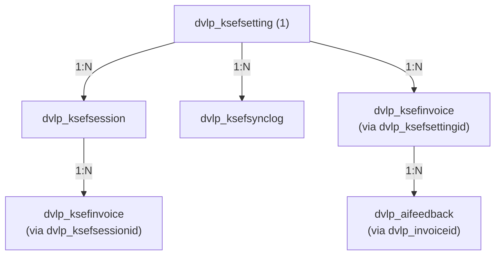

# Dataverse Schema

> **Polish version:** [DATAVERSE_SCHEMAT.md](../pl/DATAVERSE_SCHEMAT.md) | **English version:** [DATAVERSE_SCHEMA.md](./DATAVERSE_SCHEMA.md)

## Table of Contents
- [Overview](#overview)
- [Publisher](#publisher)
- [Solution](#solution)
- [Tables](#tables)
  - [dvlp_ksefsetting](#dvlp_ksefsetting)
  - [dvlp_ksefsession](#dvlp_ksefsession)
  - [dvlp_ksefsynclog](#dvlp_ksefsynclog)
  - [dvlp_ksefinvoice](#dvlp_ksefinvoice)
  - [dvlp_aifeedback](#dvlp_aifeedback)
- [Option Sets (Choices)](#option-sets-choices)
- [Relationships](#relationships)
- [Security Roles](#security-roles)
- [Indexes and Performance](#indexes-and-performance)
- [Data Migration](#data-migration)
- [AI Fields Deployment](#ai-fields-deployment)
- [Code Changes After AI Deployment](#code-changes-after-ai-deployment)
- [Table Creation Order](#table-creation-order)
- [Changelog](#changelog)

---

## Overview

This document describes the complete Dataverse schema for the dvlp-ksef solution — tables, attributes, relationships, option sets, security roles, and indexes.

### Design Principles

1. **Dedicated tables** — a separate `dvlp_ksefinvoice` table instead of extending standard Invoice
2. **Simplicity** — ~22 columns per table instead of 50+
3. **Decimal instead of Currency** — simpler for single-currency scenarios (PLN)
4. **MPK and Category as OptionSets** — consistency, easy filtering, localized labels
5. **AI fields read-only** — AI suggestions are locked, users can only accept/modify/reject

### Entity-Relationship Summary

```
dvlp_ksefsetting (1) ──┬──► (N) dvlp_ksefsession
                        ├──► (N) dvlp_ksefsynclog
                        └──► (N) dvlp_ksefinvoice ──► (N) dvlp_aifeedback
```

---

## Publisher

| Property | Value |
|----------|-------|
| Display Name | Developico |
| Name | dvlp |
| Prefix | dvlp |
| Option Value Prefix | 44660 |

---

## Solution

| Property | Value |
|----------|-------|
| Display Name | Developico KSeF |
| Unique Name | DevelopicoKSeF |
| Version | 1.0.0.8 |
| Publisher | dvlp (Developico) |
| Type | Unmanaged (development) / Managed (production) |

---

## Tables

### dvlp_ksefsetting

**Display Name:** KSeF Settings / Ustawienia KSeF  
**Logical Name:** `dvlp_ksefsetting`  
**Collection Name:** `dvlp_ksefsettings`  
**Ownership Type:** Organization  
**Description:** Configuration per company (NIP) — KSeF environment, tokens, access settings

#### Attributes

| Logical Name | Display Name | Type | Required | Description |
|-------------|-------------|------|----------|-------------|
| `dvlp_ksefsettingid` | ID | Uniqueidentifier | Auto | Primary key |
| `dvlp_name` | Name | String(100) | ✅ | Setting name (Primary Name), e.g. "Company ABC" |
| `dvlp_nip` | NIP | String(10) | ✅ | Company tax identification number (unique) |
| `dvlp_environment` | Environment | OptionSet | ✅ | KSeF environment: test/demo/production |
| `dvlp_isactive` | Active | Boolean | ✅ | Whether the setting is active |
| `dvlp_tokenkeyvaultref` | Token Key Vault Ref | String(200) | ❌ | Key Vault secret name for the KSeF token |
| `dvlp_description` | Description | Memo | ❌ | Additional notes |
| `dvlp_lastsyncdate` | Last Sync Date | DateTime | ❌ | Last successful synchronization |
| `dvlp_autosyncenabled` | Auto Sync | Boolean | ❌ | Automatic synchronization enabled |

#### Alternate Keys

| Name | Attributes | Description |
|------|-----------|-------------|
| `dvlp_nip_key` | `dvlp_nip` | NIP uniqueness |

#### Relationships

| Type | Related Table | Relationship Name |
|------|---------------|-------------------|
| 1:N | dvlp_ksefsession | `dvlp_ksefsetting_sessions` |
| 1:N | dvlp_ksefsynclog | `dvlp_ksefsetting_synclogs` |
| 1:N | dvlp_ksefinvoice | `dvlp_ksefsetting_invoices` |

---

### dvlp_ksefsession

**Display Name:** KSeF Session / Sesja KSeF  
**Logical Name:** `dvlp_ksefsession`  
**Collection Name:** `dvlp_ksefsessions`  
**Ownership Type:** Organization  
**Description:** Communication sessions with the KSeF API

#### Attributes

| Logical Name | Display Name | Type | Required | Description |
|-------------|-------------|------|----------|-------------|
| `dvlp_ksefsessionid` | ID | Uniqueidentifier | Auto | Primary key |
| `dvlp_sessionreference` | Session Reference | String(100) | ✅ | Session ID from KSeF (Primary Name) |
| `dvlp_ksefsettingid` | KSeF Setting | Lookup | ✅ | Link to configuration |
| `dvlp_nip` | NIP | String(10) | ✅ | Company NIP (denormalized) |
| `dvlp_sessiontoken` | Session Token | String(500) | ❌ | Encrypted token |
| `dvlp_sessiontype` | Session Type | OptionSet | ✅ | interactive/batch |
| `dvlp_startedat` | Started At | DateTime | ✅ | Session start time |
| `dvlp_expiresat` | Expires At | DateTime | ❌ | Expiration time |
| `dvlp_terminatedat` | Terminated At | DateTime | ❌ | Termination time |
| `dvlp_status` | Status | OptionSet | ✅ | active/expired/terminated/error |
| `dvlp_invoicesprocessed` | Invoices Processed | Integer | ❌ | Invoice counter |
| `dvlp_errormessage` | Error Message | String(2000) | ❌ | Error description (if any) |

#### Relationships

| Type | Related Table | Relationship Name |
|------|---------------|-------------------|
| N:1 | dvlp_ksefsetting | `dvlp_ksefsetting_sessions` |

---

### dvlp_ksefsynclog

**Display Name:** KSeF Sync Log / Log synchronizacji KSeF  
**Logical Name:** `dvlp_ksefsynclog`  
**Collection Name:** `dvlp_ksefsynclog`  
**Ownership Type:** Organization  
**Description:** History of synchronization operations with KSeF

#### Attributes

| Logical Name | Display Name | Type | Required | Description |
|-------------|-------------|------|----------|-------------|
| `dvlp_ksefsynclogid` | ID | Uniqueidentifier | Auto | Primary key |
| `dvlp_name` | Name | String(100) | Auto | Auto: "{NIP}-{timestamp}" |
| `dvlp_ksefsettingid` | KSeF Setting | Lookup | ✅ | Link to configuration |
| `dvlp_ksefsessionid` | KSeF Session | Lookup | ❌ | Link to session |
| `dvlp_operationtype` | Operation Type | OptionSet | ✅ | sync_incoming/sync_outgoing/send/status_check |
| `dvlp_startedat` | Started At | DateTime | ✅ | Start time |
| `dvlp_completedat` | Completed At | DateTime | ❌ | Completion time |
| `dvlp_status` | Status | OptionSet | ✅ | in_progress/success/partial/error |
| `dvlp_invoicesprocessed` | Processed | Integer | ❌ | Number of processed invoices |
| `dvlp_invoicesfailed` | Failed | Integer | ❌ | Number of failed invoices |
| `dvlp_errormessage` | Error Message | Memo | ❌ | Error details |
| `dvlp_requestpayload` | Request | Memo | ❌ | Request payload (debug) |
| `dvlp_responsepayload` | Response | Memo | ❌ | Response payload (debug) |

---

### dvlp_ksefinvoice

**Display Name:** KSeF Invoice / Faktura KSeF  
**Logical Name:** `dvlp_ksefinvoice`  
**Collection Name:** `dvlp_ksefinvoices`  
**Ownership Type:** Organization  
**Description:** Cost invoices downloaded from the Polish National e-Invoice System (KSeF)

#### Table Configuration

| Setting | Value | Description |
|---------|-------|-------------|
| Track changes | ✅ | Change tracking for synchronization |
| Enable auditing | ✅ | Audit trail |
| Enable for mobile | ❌ | Desktop/web only |
| Enable activities | ❌ | No activities |
| Enable notes | ✅ | Notes/attachments |
| Enable connections | ❌ | No connections |
| Enable queues | ❌ | No queues |
| Enable duplicate detection | ✅ | Duplicate detection |
| Enable for offline | ❌ | No offline mode |
| Enable quick create | ✅ | Quick create form |
| Primary image | ❌ | No image |
| Color | #2E7D32 | Green (invoices) |
| Icon | 📄 | Document icon |

#### Attributes — Primary Key and Name

| Logical Name | Display Name | Type | Required | Description |
|-------------|-------------|------|----------|-------------|
| `dvlp_ksefinvoiceid` | ID | Uniqueidentifier | Auto | Primary key (GUID) |
| `dvlp_name` | Invoice Number | String(100) | ✅ | Primary Name — invoice number from the issuer |

#### Attributes — Basic Invoice Data

| Logical Name | Display Name | Type | Required | Description |
|-------------|-------------|------|----------|-------------|
| `dvlp_invoicedate` | Invoice Date | Date | ✅ | Date the invoice was issued |
| `dvlp_saledate` | Sale Date | Date | ❌ | Date of sale / service delivery |
| `dvlp_duedate` | Due Date | Date | ❌ | Payment due date |
| `dvlp_invoicetype` | Invoice Type | OptionSet | ✅ | Document type (VAT, corrective, advance) |
| `dvlp_description` | Description | String(500) | ❌ | Additional description/comment |

#### Attributes — Seller Data

| Logical Name | Display Name | Type | Required | Description |
|-------------|-------------|------|----------|-------------|
| `dvlp_sellernip` | Seller NIP | String(10) | ✅ | Seller's tax ID |
| `dvlp_sellername` | Seller Name | String(500) | ✅ | Full seller name/company |

#### Attributes — Buyer Data

| Logical Name | Display Name | Type | Required | Description |
|-------------|-------------|------|----------|-------------|
| `dvlp_buyernip` | Buyer NIP | String(10) | ✅ | Buyer's tax ID (our NIP) |

#### Attributes — Amounts

| Logical Name | Display Name | Type | Required | Description |
|-------------|-------------|------|----------|-------------|
| `dvlp_netamount` | Net Amount | Decimal(12,2) | ✅ | Total net value |
| `dvlp_vatamount` | VAT Amount | Decimal(12,2) | ✅ | Total VAT amount |
| `dvlp_grossamount` | Gross Amount | Decimal(12,2) | ✅ | Total gross value |
| `dvlp_currency` | Currency | OptionSet | ✅ | Invoice currency (PLN by default) |

#### Attributes — Payment Status

| Logical Name | Display Name | Type | Required | Description |
|-------------|-------------|------|----------|-------------|
| `dvlp_paymentstatus` | Payment Status | OptionSet | ✅ | pending/paid/overdue |
| `dvlp_paidat` | Paid At | DateTime | ❌ | When payment was made |

#### Attributes — Categorization

| Logical Name | Display Name | Type | Required | Description |
|-------------|-------------|------|----------|-------------|
| `dvlp_category` | Category | String(100) | ❌ | Cost category (text) |
| `dvlp_costcenter` | Cost Center (MPK) | OptionSet (dvlp_costcenter) | ❌ | Cost Center |

#### Attributes — AI Categorization

| # | Logical Name | Display Name (EN) | Display Name (PL) | Type | Required | Description |
|---|-------------|-------------------|-------------------|------|----------|-------------|
| 1 | `dvlp_aimpksuggestion` | AI MPK Suggestion | Sugestia MPK (AI) | OptionSet (dvlp_costcenter) | ❌ | MPK suggested by AI |
| 2 | `dvlp_aicategorysuggestion` | AI Category Suggestion | Sugestia kategorii (AI) | String(100) | ❌ | Category suggested by AI |
| 3 | `dvlp_aidescription` | AI Description | Opis (AI) | String(500) | ❌ | Short invoice description generated by AI |
| 4 | `dvlp_airationale` | AI Rationale | Uzasadnienie (AI) | String(500) | ❌ | AI categorization reasoning |
| 5 | `dvlp_aiconfidence` | AI Confidence | Pewność AI | Decimal(3,2) | ❌ | AI confidence level (0.00–1.00) |
| 6 | `dvlp_aiprocessedat` | AI Processed At | Przetworzono przez AI | DateTime | ❌ | Timestamp when AI processed the invoice |

##### AI Field Configuration in Dataverse

**1. dvlp_aimpksuggestion**

```yaml
Display Name: AI MPK Suggestion / Sugestia MPK (AI)
Schema Name: dvlp_aimpksuggestion
Data Type: Choice (OptionSet)
Option Set: dvlp_costcenter (use existing or create new)
Required: No
Searchable: Yes
Description: MPK suggested by AI categorization. User can accept or override.
Audit: Yes
```

**2. dvlp_aicategorysuggestion**

```yaml
Display Name: AI Category Suggestion / Sugestia kategorii (AI)
Schema Name: dvlp_aicategorysuggestion
Data Type: Single Line of Text
Format: Text
Max Length: 100
Required: No
Searchable: Yes
Description: Cost category suggested by AI. Examples: "Software licenses", "Hosting services"
Audit: Yes
```

**3. dvlp_aidescription**

```yaml
Display Name: AI Description / Opis (AI)
Schema Name: dvlp_aidescription
Data Type: Single Line of Text
Format: Text Area
Max Length: 500
Required: No
Searchable: No
Description: Short description of the invoice generated by AI for easier identification.
Audit: No
```

**4. dvlp_airationale**

```yaml
Display Name: AI Rationale / Uzasadnienie (AI)
Schema Name: dvlp_airationale
Data Type: Single Line of Text
Format: Text Area
Max Length: 500
Required: No
Searchable: No
Description: AI reasoning for the categorization decision.
Audit: No
```

**5. dvlp_aiconfidence**

```yaml
Display Name: AI Confidence / Pewność AI
Schema Name: dvlp_aiconfidence
Data Type: Decimal Number
Precision: 2
Minimum Value: 0
Maximum Value: 1
Required: No
Searchable: No
Description: AI model confidence score (0.00 = uncertain, 1.00 = very confident)
Audit: No
```

**6. dvlp_aiprocessedat**

```yaml
Display Name: AI Processed At / Przetworzono przez AI
Schema Name: dvlp_aiprocessedat
Data Type: Date and Time
Format: Date and Time
Behavior: User Local
Required: No
Searchable: No
Description: Timestamp when AI categorization was performed on this invoice.
Audit: No
```

#### Attributes — KSeF Metadata

| Logical Name | Display Name | Type | Required | Description |
|-------------|-------------|------|----------|-------------|
| `dvlp_ksefreferencenumber` | KSeF Reference Number | String(50) | ❌ | Unique identifier from KSeF |
| `dvlp_ksefstatus` | KSeF Status | OptionSet | ❌ | KSeF synchronization status |
| `dvlp_ksefdirection` | Direction | OptionSet | ✅ | incoming / outgoing |
| `dvlp_ksefdownloadedat` | Downloaded from KSeF | DateTime | ❌ | When downloaded from KSeF |
| `dvlp_ksefrawxml` | Invoice XML | Memo | ❌ | Raw XML in FA(2) format |

#### Attributes — Relationships

| Logical Name | Display Name | Type | Required | Description |
|-------------|-------------|------|----------|-------------|
| `dvlp_ksefsettingid` | KSeF Setting | Lookup | ✅ | Company configuration (per NIP) |
| `dvlp_parentinvoiceid` | Parent Invoice | Lookup | ❌ | For corrections — original invoice |
| `statecode` | Status | State | Auto | Active/Inactive |
| `statuscode` | Status Reason | Status | Auto | Status reason |

#### Alternate Keys

| Name | Attributes | Description |
|------|-----------|-------------|
| `dvlp_ksefref_key` | `dvlp_ksefreferencenumber` | KSeF reference number uniqueness |
| `dvlp_invoice_composite_key` | `dvlp_sellernip`, `dvlp_name`, `dvlp_invoicedate` | Invoice uniqueness (NIP + number + date) |

#### Views

| Name | Type | Filter | Default Columns |
|------|------|--------|-----------------|
| All Invoices | Public | — | Number, Date, Seller, Gross, Payment Status |
| Active Invoices | Public | `statecode = 0` | Number, Date, Seller, Gross, Status |
| Pending Payment | Public | `dvlp_paymentstatus = pending` | Number, Date, Seller, Gross, Due Date |
| Paid | Public | `dvlp_paymentstatus = paid` | Number, Date, Seller, Gross, Paid Date |
| Overdue | Public | `dvlp_paymentstatus = overdue` | Number, Date, Seller, Gross, Due Date |
| Incoming Invoices | Public | `dvlp_ksefdirection = incoming` | Number, Date, Seller, Gross |
| KSeF Errors | Public | `dvlp_ksefstatus = error` | Number, Date, Seller, KSeF Status |
| Quick Find | QuickFind | — | Number, Seller, NIP |
| Invoices for AI Categorization | Public | `dvlp_aiprocessedat = null AND dvlp_category = null` | Number, Seller, Gross, Date |
| AI Categorized | Public | `dvlp_aiprocessedat != null` | Number, Seller, AI MPK Suggestion, AI Confidence |
| Low AI Confidence | Public | `dvlp_aiconfidence < 0.7` | Number, Seller, Suggestion, Confidence |

#### Forms

| Name | Type | Description |
|------|------|-------------|
| KSeF Invoice | Main | Main edit form |
| Invoice — Quick Create | Quick Create | Quick create form |
| Invoice — Card | Card | Card view |

**Main form structure:**

```
┌─────────────────────────────────────────────────────────────────┐
│ HEADER                                                           │
│ [Invoice Number] [Payment Status] [KSeF Status]                 │
├─────────────────────────────────────────────────────────────────┤
│ TAB: General                                                     │
│ ┌─────────────────────────┬─────────────────────────┐           │
│ │ SECTION: Invoice Data    │ SECTION: Seller          │           │
│ │ - Invoice Number         │ - Seller NIP            │           │
│ │ - Invoice Date           │ - Seller Name           │           │
│ │ - Sale Date              │                         │           │
│ │ - Due Date               │                         │           │
│ │ - Invoice Type           │                         │           │
│ └─────────────────────────┴─────────────────────────┘           │
│ ┌─────────────────────────┬─────────────────────────┐           │
│ │ SECTION: Amounts         │ SECTION: Payment         │           │
│ │ - Net Amount             │ - Payment Status        │           │
│ │ - VAT Amount             │ - Paid Date             │           │
│ │ - Gross Amount           │                         │           │
│ │ - Currency               │                         │           │
│ └─────────────────────────┴─────────────────────────┘           │
├─────────────────────────────────────────────────────────────────┤
│ TAB: Categorization                                              │
│ ┌─────────────────────────────────────────────────────────────┐ │
│ │ SECTION: Manual Categorization                              │ │
│ │ ┌─────────────────────┬─────────────────────┐               │ │
│ │ │ Category            │ Cost Center (MPK)   │               │ │
│ │ │ [dvlp_category]     │ [dvlp_costcenter]   │               │ │
│ │ └─────────────────────┴─────────────────────┘               │ │
│ └─────────────────────────────────────────────────────────────┘ │
│ ┌─────────────────────────────────────────────────────────────┐ │
│ │ SECTION: AI Suggestions                      [Read-only]    │ │
│ │ ┌─────────────────────┬─────────────────────┐               │ │
│ │ │ Category Suggestion │ MPK Suggestion      │               │ │
│ │ │ [dvlp_aicategory..] │ [dvlp_aimpksugge..] │               │ │
│ │ ├─────────────────────┴─────────────────────┤               │ │
│ │ │ AI Description                            │               │ │
│ │ │ [dvlp_aidescription]                      │               │ │
│ │ ├─────────────────────┬─────────────────────┤               │ │
│ │ │ AI Confidence       │ Processed At        │               │ │
│ │ │ [dvlp_aiconfidence] │ [dvlp_aiprocessed..]│               │ │
│ │ └─────────────────────┴─────────────────────┘               │ │
│ │                                                              │ │
│ │ [🤖 Run AI Categorization] [✓ Accept Suggestion]            │ │
│ └─────────────────────────────────────────────────────────────┘ │
├─────────────────────────────────────────────────────────────────┤
│ TAB: KSeF                                                        │
│ - KSeF Reference Number                                          │
│ - KSeF Status                                                    │
│ - Direction                                                      │
│ - Downloaded from KSeF                                           │
│ - Invoice XML (read-only)                                        │
├─────────────────────────────────────────────────────────────────┤
│ TAB: Relationships                                               │
│ - Parent Invoice (for corrections)                               │
│ - KSeF Setting                                                   │
├─────────────────────────────────────────────────────────────────┤
│ FOOTER: Timeline/Notes                                           │
└─────────────────────────────────────────────────────────────────┘
```

#### Charts

| Name | Type | Description |
|------|------|-------------|
| Invoices by Payment Status | Pie Chart | Breakdown: pending/paid/overdue |
| Monthly Invoices | Bar Chart | Invoice count per month |
| Monthly Amounts | Line Chart | Gross total per month |
| Top 10 Suppliers | Horizontal Bar | Largest suppliers by amount |
| Invoices by Category | Pie Chart | Cost breakdown by category |

#### Business Rules

| Name | Condition | Action |
|------|-----------|--------|
| Lock XML editing | `dvlp_ksefrawxml != null` | Lock field `dvlp_ksefrawxml` |
| Auto-set paid date | `dvlp_paymentstatus = paid AND dvlp_paidat = null` | Set `dvlp_paidat = Now()` |
| Lock AI fields | Always | Lock: `dvlp_aimpksuggestion`, `dvlp_aicategorysuggestion`, `dvlp_aidescription`, `dvlp_airationale`, `dvlp_aiconfidence`, `dvlp_aiprocessedat` |
| Show AI confidence as % | `dvlp_aiconfidence != null` | Format as percentage in UI |

#### Indexes

| Name | Attributes | Type | Justification |
|------|-----------|------|---------------|
| `PK_ksefinvoice` | `dvlp_ksefinvoiceid` | Primary | Primary key |
| `AK_ksefref` | `dvlp_ksefreferencenumber` | Unique | KSeF reference lookup |
| `AK_composite` | `dvlp_sellernip`, `dvlp_name`, `dvlp_invoicedate` | Unique | Deduplication |
| `IX_paymentstatus` | `dvlp_paymentstatus`, `dvlp_duedate` | Non-unique | Payment filtering |
| `IX_sellernip` | `dvlp_sellernip` | Non-unique | Supplier search |
| `IX_invoicedate` | `dvlp_invoicedate` | Non-unique | Date sorting/filtering |
| `IX_ksefsetting` | `dvlp_ksefsettingid` | Non-unique | Configuration relationship |

---

### dvlp_aifeedback

**Display Name:** AI Feedback / Feedback AI  
**Logical Name:** `dvlp_aifeedback`  
**Collection Name:** `dvlp_aifeedbacks`  
**Ownership Type:** Organization  
**Description:** History of user corrections to AI suggestions — used for model learning

#### Purpose

This table stores information about how users respond to AI suggestions:
- **applied** — user accepted the AI suggestion without changes
- **modified** — user changed the AI suggestion to a different value
- **rejected** — user rejected the suggestion and set their own value

This data is used to build context in AI prompts (few-shot learning).

#### How Learning Works

1. User clicks "Categorize with AI" → AI generates a suggestion
2. User accepts or modifies the suggestion
3. On invoice save, the system creates a record in `dvlp_aifeedback`
4. On the next categorization of the same supplier:
   - System retrieves history from `dvlp_aifeedback`
   - Adds to prompt: "For supplier X, users typically choose MPK=Y, Category=Z"
   - AI takes this into account during categorization

#### Attributes — Main

| Logical Name | Display Name | Type | Required | Description |
|-------------|-------------|------|----------|-------------|
| `dvlp_aifeedbackid` | ID | Uniqueidentifier | Auto | Primary key |
| `dvlp_name` | Name | String(100) | Auto | Auto: "{SupplierName} - {Date}" |
| `dvlp_invoiceid` | Invoice | Lookup (dvlp_ksefinvoice) | ✅ | Link to source invoice |
| `dvlp_tenantnip` | Company NIP | String(10) | ✅ | Company (tenant) NIP |
| `dvlp_suppliernip` | Supplier NIP | String(15) | ✅ | Supplier NIP |
| `dvlp_suppliername` | Supplier Name | String(250) | ✅ | Supplier name |
| `dvlp_invoicedescription` | Invoice Context | Memo(500) | ❌ | Fragment of invoice description/line items |

#### Attributes — AI Suggestions

| Logical Name | Display Name | Type | Required | Description |
|-------------|-------------|------|----------|-------------|
| `dvlp_aimpksuggestion` | AI MPK Suggestion | String(50) | ❌ | MPK suggested by AI |
| `dvlp_aicategorysuggestion` | AI Category Suggestion | String(100) | ❌ | Category suggested by AI |
| `dvlp_aiconfidence` | AI Confidence | Decimal(3,2) | ❌ | AI confidence level (0.00–1.00) |

#### Attributes — User Choices

| Logical Name | Display Name | Type | Required | Description |
|-------------|-------------|------|----------|-------------|
| `dvlp_usermpk` | Chosen MPK | String(50) | ❌ | MPK chosen by user |
| `dvlp_usercategory` | Chosen Category | String(100) | ❌ | Category chosen by user |
| `dvlp_feedbacktype` | Feedback Type | OptionSet | ✅ | applied/modified/rejected |

#### Attributes — System

| Logical Name | Display Name | Type | Required | Description |
|-------------|-------------|------|----------|-------------|
| `createdon` | Created On | DateTime | Auto | Record creation date |
| `createdby` | Created By | Lookup (User) | Auto | User who saved the feedback |
| `statecode` | Status | State | Auto | Active/Inactive |
| `statuscode` | Status Reason | Status | Auto | Status reason |

#### Option Set — dvlp_feedbacktype

**Display Name:** AI Feedback Type  
**Type:** Local OptionSet (or Global)

| Value | Label (EN) | Label (PL) | Color | Description |
|-------|-----------|-----------|-------|-------------|
| 100000000 | Applied | Zaakceptowano | Green | User accepted AI suggestion |
| 100000001 | Modified | Zmieniono | Orange | User changed AI suggestion |
| 100000002 | Rejected | Odrzucono | Red | User rejected AI suggestion |

#### Indexes

| Name | Attributes | Type | Justification |
|------|-----------|------|---------------|
| `PK_aifeedback` | `dvlp_aifeedbackid` | Primary | Primary key |
| `IX_tenant_supplier` | `dvlp_tenantnip`, `dvlp_suppliernip` | Non-unique | Per-supplier aggregation |
| `IX_createdon` | `createdon` | Non-unique | Chronological sorting |
| `IX_feedbacktype` | `dvlp_feedbacktype` | Non-unique | Feedback type filtering |

#### Views

| Name | Type | Filter | Default Columns |
|------|------|--------|-----------------|
| All Feedback | Public | — | Supplier, AI Suggestion, User Choice, Type, Date |
| Applied | Public | `feedbacktype = applied` | Supplier, MPK, Category |
| Modified | Public | `feedbacktype = modified` | Supplier, AI Suggestion, User Choice |
| Per Supplier | Public | GROUP BY suppliernip | Supplier, Count, Avg Confidence |

#### Security

- **Read**: All KSeF users
- **Create**: System (via API) on invoice save
- **Update**: None (records are immutable)
- **Delete**: Admin only

---

## Option Sets (Choices)

### dvlp_ksefenvironment

**Display Name:** KSeF Environment  
**Type:** Global OptionSet

| Value | Label (EN) | Label (PL) | Description |
|-------|-----------|-----------|-------------|
| 100000001 | Test | Test | KSeF test environment |
| 100000002 | Demo | Demo | KSeF demo environment |
| 100000003 | Production | Produkcja | KSeF production environment |

---

### dvlp_ksefstatus

**Display Name:** KSeF Status  
**Type:** Global OptionSet

| Value | Label (EN) | Label (PL) | Color | Description |
|-------|-----------|-----------|-------|-------------|
| 100000001 | Draft | Szkic | Gray | Invoice created, not sent |
| 100000002 | Pending | Oczekuje | Yellow | Being sent |
| 100000003 | Sent | Wysłano | Blue | Sent, awaiting confirmation |
| 100000004 | Accepted | Zaakceptowano | Green | Accepted by KSeF |
| 100000005 | Rejected | Odrzucono | Red | Rejected by KSeF |
| 100000006 | Error | Błąd | Red | Technical error |

---

### dvlp_ksefdirection

**Display Name:** Invoice Direction  
**Type:** Global OptionSet

| Value | Label (EN) | Label (PL) | Icon |
|-------|-----------|-----------|------|
| 100000001 | Incoming | Przychodzące | ⬇️ |
| 100000002 | Outgoing | Wychodzące | ⬆️ |

---

### dvlp_sessionstatus

**Display Name:** Session Status  
**Type:** Global OptionSet

| Value | Label (EN) | Label (PL) |
|-------|-----------|-----------|
| 100000001 | Active | Aktywna |
| 100000002 | Expired | Wygasła |
| 100000003 | Terminated | Zakończona |
| 100000004 | Error | Błąd |

---

### dvlp_sessiontype

**Display Name:** Session Type  
**Type:** Global OptionSet

| Value | Label (EN) | Label (PL) | Description |
|-------|-----------|-----------|-------------|
| 100000001 | Interactive | Interaktywna | User session |
| 100000002 | Batch | Wsadowa | Automated session |

---

### dvlp_syncoperationtype

**Display Name:** Sync Operation Type  
**Type:** Global OptionSet

| Value | Label (EN) | Label (PL) |
|-------|-----------|-----------|
| 100000001 | Sync Incoming | Pobierz przychodzące |
| 100000002 | Sync Outgoing | Synchronizuj wychodzące |
| 100000003 | Send Invoice | Wyślij fakturę |
| 100000004 | Check Status | Sprawdź status |
| 100000005 | Download UPO | Pobierz UPO |

---

### dvlp_syncstatus

**Display Name:** Sync Status  
**Type:** Global OptionSet

| Value | Label (EN) | Label (PL) |
|-------|-----------|-----------|
| 100000001 | In Progress | W trakcie |
| 100000002 | Success | Sukces |
| 100000003 | Partial | Częściowy |
| 100000004 | Error | Błąd |

---

### dvlp_paymentstatus

**Display Name:** Payment Status  
**Type:** Global OptionSet

| Value | Label (EN) | Label (PL) | Color |
|-------|-----------|-----------|-------|
| 100000001 | Pending | Oczekuje | Yellow |
| 100000002 | Paid | Opłacona | Green |
| 100000003 | Overdue | Przeterminowana | Red |

---

### dvlp_invoicetype

**Display Name:** Invoice Type  
**Type:** Global OptionSet

| Value | Label (EN) | Label (PL) |
|-------|-----------|-----------|
| 100000001 | VAT Invoice | Faktura VAT |
| 100000002 | Corrective | Faktura korygująca |
| 100000003 | Advance | Faktura zaliczkowa |

---

### dvlp_currency

**Display Name:** Currency  
**Type:** Global OptionSet

| Value | Label (EN) | Label (PL) |
|-------|-----------|-----------|
| 100000000 | PLN | PLN |
| 100000001 | USD | USD |
| 100000002 | EUR | EUR |

---

### dvlp_category

**Display Name:** Cost Category  
**Type:** Global OptionSet

| Value | Label (EN) | Label (PL) |
|-------|-----------|-----------|
| 100000001 | IT & Software | IT i oprogramowanie |
| 100000002 | Office | Biuro |
| 100000003 | Marketing | Marketing |
| 100000004 | Travel | Podróże |
| 100000005 | Utilities | Media |
| 100000006 | Professional Services | Usługi profesjonalne |
| 100000007 | Equipment | Sprzęt |
| 100000008 | Materials | Materiały |
| 100000009 | Other | Inne |

---

### dvlp_costcenter

**Display Name:** Cost Center (MPK — Miejsce Powstawania Kosztów)  
**Type:** Global OptionSet  
**Description:** Cost Centers for categorization

| Value | Label (EN) | Label (PL) | Description |
|-------|-----------|-----------|-------------|
| 100000001 | Consultants | Konsultanci | Consulting, training, outsourcing |
| 100000002 | BackOffice | Back Office | Office, administration, cleaning |
| 100000003 | Management | Zarząd | Board, strategy, representation |
| 100000004 | Cars | Samochody | Vehicles, fuel, service, insurance |
| 100000005 | Legal | Prawne | Legal, notary, compliance |
| 100000006 | Marketing | Marketing | Advertising, promotion, events |
| 100000007 | Sales | Sprzedaż | Sales, CRM, lead generation |
| 100000008 | Delivery | Realizacja | Projects, developer tools |
| 100000009 | Finance | Finanse | Accounting, audit, banking |
| 100000010 | Other | Inne | Everything else |

#### MPK Enum → Dataverse OptionSet Mapping

| MPK (TypeScript) | Dataverse Value |
|------------------|-----------------|
| `Consultants` | 100000001 |
| `BackOffice` | 100000002 |
| `Management` | 100000003 |
| `Cars` | 100000004 |
| `Legal` | 100000005 |
| `Marketing` | 100000006 |
| `Sales` | 100000007 |
| `Delivery` | 100000008 |
| `Finance` | 100000009 |
| `Other` | 100000010 |

---

### dvlp_feedbacktype

**Display Name:** AI Feedback Type  
**Type:** Global OptionSet

| Value | Label (EN) | Label (PL) | Color | Description |
|-------|-----------|-----------|-------|-------------|
| 100000000 | Applied | Zaakceptowano | Green | User accepted AI suggestion without changes |
| 100000001 | Modified | Zmieniono | Orange | User changed AI suggestion |
| 100000002 | Rejected | Odrzucono | Red | User rejected AI suggestion |

---

### dvlp_invoicesource

**Display Name:** Invoice Source  
**Type:** Global OptionSet

| Value | Label (EN) | Label (PL) | Description |
|-------|-----------|-----------|-------------|
| 100000001 | KSeF Sync | Synchronizacja KSeF | Automatically downloaded from KSeF |
| 100000002 | Manual | Ręczne | Manually entered |
| 100000003 | Import | Import | Imported from file |

---

## Relationships

### Relationship Diagram



<details>
<summary>ASCII fallback (click to expand)</summary>

```
dvlp_ksefsetting (1)
    │
    ├──── (N) dvlp_ksefsession
    │           │
    │           └──── (N) dvlp_ksefinvoice (via dvlp_ksefsessionid)
    │
    ├──── (N) dvlp_ksefsynclog
    │
    └──── (N) dvlp_ksefinvoice (via dvlp_ksefsettingid)
                    │
                    └──── (N) dvlp_aifeedback (via dvlp_invoiceid)
```

</details>

### Relationship Definitions

| Relationship | Type | Parent | Child | Cascade |
|-------------|------|--------|-------|---------|
| `dvlp_ksefsetting_sessions` | 1:N | dvlp_ksefsetting | dvlp_ksefsession | Delete: Cascade |
| `dvlp_ksefsetting_synclogs` | 1:N | dvlp_ksefsetting | dvlp_ksefsynclog | Delete: Cascade |
| `dvlp_ksefsetting_invoices` | 1:N | dvlp_ksefsetting | dvlp_ksefinvoice | Delete: Restrict |
| `dvlp_ksefsession_synclogs` | 1:N | dvlp_ksefsession | dvlp_ksefsynclog | Delete: RemoveLink |
| `dvlp_ksefsession_invoices` | 1:N | dvlp_ksefsession | dvlp_ksefinvoice | Delete: RemoveLink |
| `dvlp_ksefinvoice_parent` | 1:N | dvlp_ksefinvoice | dvlp_ksefinvoice | Delete: RemoveLink |
| `dvlp_ksefinvoice_feedbacks` | 1:N | dvlp_ksefinvoice | dvlp_aifeedback | Delete: Cascade |

---

## Security Roles

### KSeF Admin

Full access to all KSeF operations.

| Table | Create | Read | Write | Delete | Append | AppendTo |
|-------|--------|------|-------|--------|--------|----------|
| dvlp_ksefsetting | ✅ Org | ✅ Org | ✅ Org | ✅ Org | ✅ Org | ✅ Org |
| dvlp_ksefsession | ✅ Org | ✅ Org | ✅ Org | ✅ Org | ✅ Org | ✅ Org |
| dvlp_ksefsynclog | ✅ Org | ✅ Org | ✅ Org | ✅ Org | ✅ Org | ✅ Org |
| dvlp_ksefinvoice | ✅ Org | ✅ Org | ✅ Org | ✅ Org | ✅ Org | ✅ Org |
| dvlp_aifeedback | ✅ Org | ✅ Org | ✅ Org | ✅ Org | ✅ Org | ✅ Org |

### KSeF Reader

Read-only access.

| Table | Create | Read | Write | Delete | Append | AppendTo |
|-------|--------|------|-------|--------|--------|----------|
| dvlp_ksefsetting | ❌ | ✅ Org | ❌ | ❌ | ❌ | ❌ |
| dvlp_ksefsession | ❌ | ✅ Org | ❌ | ❌ | ❌ | ❌ |
| dvlp_ksefsynclog | ❌ | ✅ Org | ❌ | ❌ | ❌ | ❌ |
| dvlp_ksefinvoice | ❌ | ✅ Org | ❌ | ❌ | ❌ | ❌ |
| dvlp_aifeedback | ❌ | ✅ Org | ❌ | ❌ | ❌ | ❌ |

### KSeF Operator

Can perform synchronization and manage invoices, but cannot change configuration.

| Table | Create | Read | Write | Delete | Append | AppendTo |
|-------|--------|------|-------|--------|--------|----------|
| dvlp_ksefsetting | ❌ | ✅ Org | ❌ | ❌ | ❌ | ✅ Org |
| dvlp_ksefsession | ✅ Org | ✅ Org | ✅ Org | ❌ | ✅ Org | ✅ Org |
| dvlp_ksefsynclog | ✅ Org | ✅ Org | ✅ Org | ❌ | ✅ Org | ✅ Org |
| dvlp_ksefinvoice | ✅ Org | ✅ Org | ✅ Org | ❌ | ✅ Org | ✅ Org |
| dvlp_aifeedback | ✅ Org | ✅ Org | ❌ | ❌ | ✅ Org | ✅ Org |

### KSeF Approver

Can approve invoices for payment.

| Table | Create | Read | Write | Delete | Append | AppendTo |
|-------|--------|------|-------|--------|--------|----------|
| dvlp_ksefsetting | ❌ | ✅ Org | ❌ | ❌ | ❌ | ❌ |
| dvlp_ksefsession | ❌ | ✅ Org | ❌ | ❌ | ❌ | ❌ |
| dvlp_ksefsynclog | ❌ | ✅ Org | ❌ | ❌ | ❌ | ❌ |
| dvlp_ksefinvoice | ❌ | ✅ Org | ✅ Org | ❌ | ❌ | ❌ |
| dvlp_aifeedback | ❌ | ✅ Org | ❌ | ❌ | ❌ | ❌ |

---

## Indexes and Performance

### Recommended Indexes

| Table | Index | Attributes | Justification |
|-------|-------|-----------|---------------|
| dvlp_ksefsetting | PK | `dvlp_ksefsettingid` | Auto |
| dvlp_ksefsetting | AK_NIP | `dvlp_nip` | NIP lookup |
| dvlp_ksefsession | IX_NIP_Status | `dvlp_nip`, `dvlp_status` | Active sessions per NIP |
| dvlp_ksefsession | IX_ExpiredAt | `dvlp_expiresat` | Expired session cleanup |
| dvlp_ksefsynclog | IX_Setting_Date | `dvlp_ksefsettingid`, `dvlp_startedat` | Sync history |
| dvlp_ksefinvoice | PK | `dvlp_ksefinvoiceid` | Primary key |
| dvlp_ksefinvoice | AK_KSeFRef | `dvlp_ksefreferencenumber` | KSeF reference lookup |
| dvlp_ksefinvoice | AK_Composite | `dvlp_sellernip`, `dvlp_name`, `dvlp_invoicedate` | Deduplication |
| dvlp_ksefinvoice | IX_PaymentStatus | `dvlp_paymentstatus`, `dvlp_duedate` | Payment filtering |
| dvlp_ksefinvoice | IX_SellerNIP | `dvlp_sellernip` | Supplier search |
| dvlp_ksefinvoice | IX_InvoiceDate | `dvlp_invoicedate` | Date sorting/filtering |
| dvlp_aifeedback | IX_tenant_supplier | `dvlp_tenantnip`, `dvlp_suppliernip` | Per-supplier aggregation for learning |
| dvlp_aifeedback | IX_createdon | `createdon` | Chronological sorting |

### Data Partitioning (Extended)

For large volumes (>100k invoices):

```
Partition by: dvlp_invoicedate (monthly)
Retention: 7 years (legal requirements for invoices)
Archival: After 2 years to cold storage
```

---

## Data Migration

### Initial Import

1. **KSeF Settings** — manual configuration per company
2. **KSeF Invoices** — creating new `dvlp_ksefinvoice` table

### Mapping Script (example)

```javascript
// KSeF status mapping
const ksefStatusMapping = {
  'NEW': 100000001,       // Draft
  'SENT': 100000003,      // Sent
  'CONFIRMED': 100000004, // Accepted
  'FAILED': 100000006     // Error
};

// Direction mapping
const directionMapping = {
  'IN': 100000001,   // Incoming
  'OUT': 100000002   // Outgoing
};

// Payment status mapping
const paymentStatusMapping = {
  'UNPAID': 100000001,    // Pending
  'PAID': 100000002,      // Paid
  'OVERDUE': 100000003    // Overdue
};

// Invoice type mapping
const invoiceTypeMapping = {
  'VAT': 100000001,        // VAT Invoice
  'CORRECTION': 100000002, // Corrective
  'ADVANCE': 100000003     // Advance
};

// Currency mapping
const currencyMapping = {
  'PLN': 100000000,
  'USD': 100000001,
  'EUR': 100000002
};

// MPK (Cost Center) mapping
const costCenterMapping = {
  'Consultants': 100000001,
  'BackOffice': 100000002,
  'Management': 100000003,
  'Cars': 100000004,
  'Legal': 100000005,
  'Marketing': 100000006,
  'Sales': 100000007,
  'Delivery': 100000008,
  'Finance': 100000009,
  'Other': 100000010
};
```

### Post-Migration Validation

```sql
-- Check consistency — sent/accepted invoices should have KSeF reference
SELECT COUNT(*) as total,
       SUM(CASE WHEN dvlp_ksefreferencenumber IS NULL THEN 1 ELSE 0 END) as missing_ref
FROM dvlp_ksefinvoice
WHERE dvlp_ksefstatus IN (100000003, 100000004) -- Sent, Accepted

-- Check duplicates
SELECT dvlp_sellernip, dvlp_name, dvlp_invoicedate, COUNT(*) as cnt
FROM dvlp_ksefinvoice
GROUP BY dvlp_sellernip, dvlp_name, dvlp_invoicedate
HAVING COUNT(*) > 1

-- Check setting relationship
SELECT i.dvlp_name, i.dvlp_buyernip
FROM dvlp_ksefinvoice i
LEFT JOIN dvlp_ksefsetting s ON i.dvlp_ksefsettingid = s.dvlp_ksefsettingid
WHERE s.dvlp_ksefsettingid IS NULL
```

---

## AI Fields Deployment

### Step-by-Step

#### Step 1: Create Option Set `dvlp_costcenter` (if it doesn't exist)

1. Go to **Power Apps** → **Solutions** → **dvlp-ksef**
2. Add a new **Choice** (Global OptionSet):
   - Name: `dvlp_costcenter`
   - Display Name: `Cost Center / MPK`
   - Add values per the table in [dvlp_costcenter](#dvlp_costcenter) section

#### Step 2: Create Option Set `dvlp_feedbacktype`

1. Add a new **Choice** (Global OptionSet):
   - Name: `dvlp_feedbacktype`
   - Display Name: `AI Feedback Type`
   - Add values: Applied (100000000), Modified (100000001), Rejected (100000002)

#### Step 3: Add AI fields to `dvlp_ksefinvoice` table

1. Navigate to table **dvlp_ksefinvoice**
2. Click **+ New column** for each AI field
3. Fill in per the configuration in [Attributes — AI Categorization](#attributes--ai-categorization) section
4. **Save** after each field

#### Step 4: Create `dvlp_aifeedback` table

1. Create the table per the specification in [dvlp_aifeedback](#dvlp_aifeedback) section
2. Add all attributes, indexes, and views

#### Step 5: Update the form

1. Open the main **KSeF Invoice** form
2. Add a new "AI Suggestions" section in the Categorization tab
3. Drag the new AI fields into the section
4. Set AI fields as **Read-only**
5. **Save and Publish**

#### Step 6: Create AI views

1. Add views: "Invoices for AI Categorization", "AI Categorized", "Low AI Confidence"
2. Configure filters and columns per specification

#### Step 7: Publish changes

1. Click **Publish all customizations**
2. Verify in **Solutions** that the version has been incremented

### Deployment Checklist

- [ ] Option Set `dvlp_costcenter` created with 10 values
- [ ] Option Set `dvlp_feedbacktype` created with 3 values
- [ ] Field `dvlp_aimpksuggestion` added as Choice
- [ ] Field `dvlp_aicategorysuggestion` added as Text(100)
- [ ] Field `dvlp_aidescription` added as Text(500)
- [ ] Field `dvlp_airationale` added as Text(500)
- [ ] Field `dvlp_aiconfidence` added as Decimal(3,2)
- [ ] Field `dvlp_aiprocessedat` added as DateTime
- [ ] Form updated with "AI Suggestions" section
- [ ] AI views created (for categorization, categorized, low confidence)
- [ ] Table `dvlp_aifeedback` created
- [ ] Customizations published
- [ ] Code updated (config.ts, mappers.ts, ai-categorize.ts)
- [ ] Tests passed

### Estimated Deployment Time

| Task | Time |
|------|------|
| Create Option Set `dvlp_costcenter` | 5 min |
| Create Option Set `dvlp_feedbacktype` | 5 min |
| Add 6 AI fields in `dvlp_ksefinvoice` | 15 min |
| Update form | 10 min |
| Create views | 10 min |
| Create `dvlp_aifeedback` table | 15 min |
| Publish | 2 min |
| Update code | 15 min |
| Tests | 15 min |
| **Total** | **~1h 30min** |

---

## Code Changes After AI Deployment

### 1. Update config.ts

```typescript
// api/src/lib/dataverse/config.ts

// In the invoice section add:
invoice: {
  // ... existing fields ...
  
  // AI Categorization fields
  aiMpkSuggestion: process.env.DV_FIELD_INVOICE_AI_MPK || 'dvlp_aimpksuggestion',
  aiCategorySuggestion: process.env.DV_FIELD_INVOICE_AI_CATEGORY || 'dvlp_aicategorysuggestion',
  aiDescription: process.env.DV_FIELD_INVOICE_AI_DESC || 'dvlp_aidescription',
  aiConfidence: process.env.DV_FIELD_INVOICE_AI_CONFIDENCE || 'dvlp_aiconfidence',
  aiProcessedAt: process.env.DV_FIELD_INVOICE_AI_PROCESSED || 'dvlp_aiprocessedat',
}
```

### 2. Update mappers.ts

```typescript
// api/src/lib/dataverse/mappers.ts

// In mapDvInvoiceToApp — replace undefined with actual mapping:
export function mapDvInvoiceToApp(raw: DvInvoice): Invoice {
  // ... existing code ...
  
  // AI fields — change from undefined to:
  aiMpkSuggestion: mapDvCostCenterToMpk(raw[s.aiMpkSuggestion]),
  aiCategorySuggestion: raw[s.aiCategorySuggestion] as string | undefined,
  aiDescription: raw[s.aiDescription] as string | undefined,
  aiConfidence: raw[s.aiConfidence] as number | undefined,
  aiProcessedAt: raw[s.aiProcessedAt] as string | undefined,
}

// In mapAppInvoiceToDv — uncomment:
export function mapAppInvoiceToDv(app: Partial<Invoice>): Record<string, unknown> {
  // ... existing code ...
  
  // AI fields
  if (app.aiMpkSuggestion !== undefined) payload[s.aiMpkSuggestion] = mapMpkToDvCostCenter(app.aiMpkSuggestion)
  if (app.aiCategorySuggestion !== undefined) payload[s.aiCategorySuggestion] = app.aiCategorySuggestion
  if (app.aiDescription !== undefined) payload[s.aiDescription] = app.aiDescription
  if (app.aiConfidence !== undefined) payload[s.aiConfidence] = app.aiConfidence
  if (app.aiProcessedAt !== undefined) payload[s.aiProcessedAt] = app.aiProcessedAt
}
```

### 3. Uncomment in ai-categorize.ts

```typescript
// api/src/functions/ai-categorize.ts

// Uncomment the blocks that save to Dataverse:
await invoiceService.update(invoiceId, {
  aiMpkSuggestion: categorization.mpk as MPK,
  aiCategorySuggestion: categorization.category,
  aiDescription: categorization.description,
  aiConfidence: categorization.confidence,
  aiProcessedAt: new Date().toISOString(),
})
```

---

## Table Creation Order

### 1. Create Global Option Sets

Create all global option sets first:

1. `dvlp_ksefenvironment` — KSeF Environment
2. `dvlp_ksefstatus` — KSeF Status
3. `dvlp_ksefdirection` — Invoice Direction
4. `dvlp_sessionstatus` — Session Status
5. `dvlp_sessiontype` — Session Type
6. `dvlp_syncoperationtype` — Sync Operation Type
7. `dvlp_syncstatus` — Sync Status
8. `dvlp_paymentstatus` — Payment Status
9. `dvlp_invoicetype` — Invoice Type
10. `dvlp_currency` — Currency
11. `dvlp_category` — Cost Category
12. `dvlp_costcenter` — Cost Center (MPK)
13. `dvlp_feedbacktype` — AI Feedback Type

### 2. Create Tables in Order

1. `dvlp_ksefsetting` — KSeF Settings (no relationships)
2. `dvlp_ksefsession` — KSeF Sessions (with relationship to dvlp_ksefsetting)
3. `dvlp_ksefinvoice` — KSeF Invoices (with relationship to dvlp_ksefsetting + AI fields)
4. `dvlp_ksefsynclog` — Sync Logs (with relationships to the above)
5. `dvlp_aifeedback` — AI Feedback (with relationship to dvlp_ksefinvoice)

### 3. Create Alternate Keys

- `dvlp_ksefsetting`: `dvlp_nip_key`
- `dvlp_ksefinvoice`: `dvlp_ksefref_key`, `dvlp_invoice_composite_key`

### 4. Create Views, Forms, and Charts

As specified for each table.

---

## Changelog

| Version | Date | Description |
|---------|------|-------------|
| 1.0.0 | 2026-01 | Initial version |
| 1.1.0 | 2026-01 | Changed from Invoice extension to new table dvlp_ksefinvoice |
| 1.2.0 | 2026-01 | Simplified structure: 22 columns instead of 50+, Decimal instead of Currency, MPK/Category as OptionSet |
| 1.3.0 | 2026-02 | Merged AI field specification: dvlp_aimpksuggestion, dvlp_aicategorysuggestion, dvlp_aidescription, dvlp_airationale, dvlp_aiconfidence, dvlp_aiprocessedat + dvlp_aifeedback table + detailed dvlp_costcenter + deployment instructions |

---

## Related Documents

- [Architecture](./ARCHITECTURE.md) — system overview
- [API Reference](./API.md) — endpoints operating on these tables
- [Entra ID Configuration](../../deployment/azure/ENTRA_ID_KONFIGURACJA.md) — Dataverse role, Application User
- [Dataverse Deployment](../../deployment/dataverse/README.md) — deployment instructions

---

**Last updated:** 2026-02-11  
**Version:** 1.3  
**Maintainer:** dvlp-dev team
