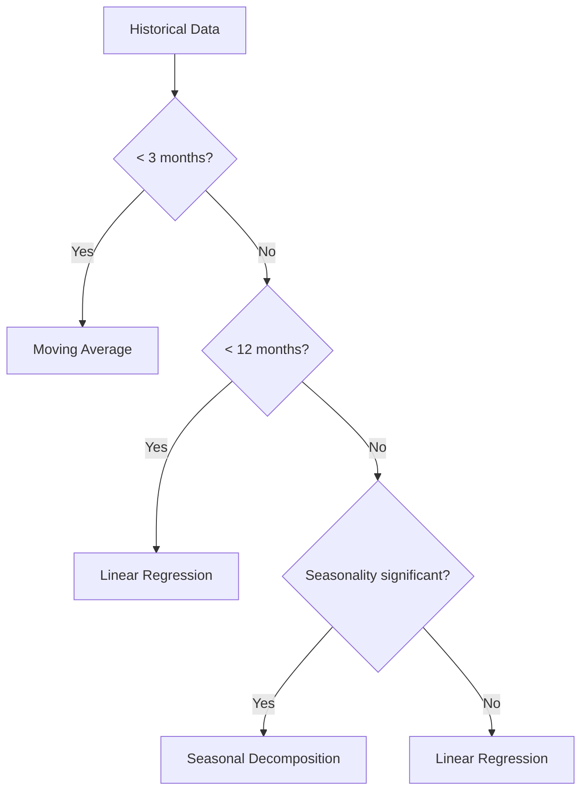
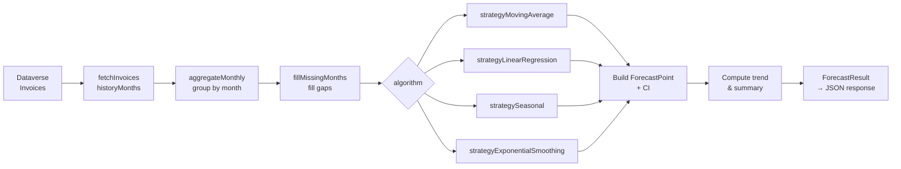
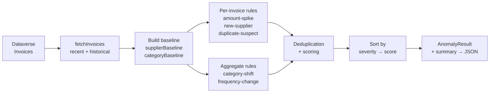

# Expense Forecasting and Anomaly Detection

> Documentation of forecasting algorithms, anomaly detection rules, configuration parameters, and presets.

---

## Table of Contents

- [Overview](#overview)
- [Forecasting Algorithms](#forecasting-algorithms)
  - [Auto-select](#auto-select)
  - [Weighted Moving Average](#weighted-moving-average)
  - [Linear Regression](#linear-regression)
  - [Seasonal Decomposition](#seasonal-decomposition)
  - [Exponential Smoothing](#exponential-smoothing)
- [Forecast Presets](#forecast-presets)
- [Confidence Interval](#confidence-interval)
- [Forecasting Pipeline](#forecasting-pipeline)
- [Anomaly Detection Rules](#anomaly-detection-rules)
  - [Amount Spike](#amount-spike)
  - [New Supplier](#new-supplier)
  - [Duplicate Suspect](#duplicate-suspect)
  - [Category Shift](#category-shift)
  - [Frequency Change](#frequency-change)
- [Anomaly Presets](#anomaly-presets)
- [Anomaly Detection Pipeline](#anomaly-detection-pipeline)
- [Architecture and Source Files](#architecture-and-source-files)
- [Related Documents](#related-documents)

---

## Overview

The system provides two analytical modules running server-side (Azure Functions) with no external computational dependencies:

1. **Expense Forecasting** — statistical prediction of future costs based on Dataverse invoice history. Supports 5 algorithms with configurable parameters.
2. **Anomaly Detection** — identification of unusual patterns in invoices: amount spikes, new suppliers, duplicates, category spending shifts, and invoicing frequency changes.

Both modules are exposed via REST API and rendered in the web interface ("Expense Forecast" tab) and the Power Apps Code Component.

---

## Forecasting Algorithms

### Summary

| Algorithm | Min. Data | Best For | Base Confidence |
|-----------|-----------|----------|-----------------|
| Auto-select | 1 month | General use | Depends on selected |
| Moving Average | 1 month | Stable, low-variance data | 0.30 |
| Linear Regression | 3 months | Data with clear linear trend | 0.40–0.80 |
| Seasonal | 12 months | Data with repeatable annual pattern | 0.50–0.85 |
| Exponential Smoothing | 2 months | Rapidly changing data | 0.35–0.75 |

---

### Auto-select

Default mode (`algorithm: 'auto'`). The engine automatically selects the best algorithm based on available data volume:

**Logic:**
- **< 3 months** → Weighted Moving Average (insufficient data, low confidence)
- **3–11 months** → Linear Regression with MA blending
- **≥ 12 months** → Seasonality test → if significant: Seasonal Decomposition, otherwise Linear Regression

---

### Weighted Moving Average

**ID:** `moving-average`  
**Minimum history:** 1 month  
**Base confidence:** 0.30

Computes a weighted average of the last `windowSize` months, assigning higher weight to more recent observations. The forecast is flat — the same value for every future month.

**Formula:**

$$\hat{y} = \frac{\sum_{i=1}^{w} i \cdot x_{n-w+i}}{\sum_{i=1}^{w} i}$$

Where:
- $w$ — window size (`windowSize`)
- $x_i$ — gross amount in month $i$
- Weights: $1, 2, 3, \ldots, w$ (most recent month = highest weight)

**Parameters:**

| Parameter | Type | Range | Default | Description |
|-----------|------|-------|---------|-------------|
| `windowSize` | number | 2–12 | 3 | Number of months to include |

**When to use:**
- Data with no clear trend
- Low expense variance
- Scarce historical data (< 3 months)

---

### Linear Regression

**ID:** `linear-regression`  
**Minimum history:** 3 months  
**Base confidence:** 0.40 + R² × 0.40 (max 0.80)

Forecast based on OLS (Ordinary Least Squares) linear regression blended with a moving average. The `blendRatio` parameter controls the proportion:

$$\hat{y}_t = r \cdot (\text{slope} \cdot t + \text{intercept}) + (1 - r) \cdot \text{MA}_6$$

Where:
- $r$ — `blendRatio` (0 = pure MA, 1 = pure regression)
- $\text{MA}_6$ — weighted moving average of last 6 months
- `slope`, `intercept` — OLS coefficients

**Coefficient of determination R²** — measures how well the regression line fits the data (0–1). Higher R² means better fit and higher confidence.

**Parameters:**

| Parameter | Type | Range | Default | Description |
|-----------|------|-------|---------|-------------|
| `blendRatio` | number | 0–1 | 0.6 | Regression vs moving average weight |

**When to use:**
- Clear upward or downward trend
- 3+ months of data
- No strong seasonality

---

### Seasonal Decomposition

**ID:** `seasonal`  
**Minimum history:** 12 months  
**Base confidence:** 0.50 + R² × 0.35 (max 0.85)

Three-stage algorithm:
1. **Compute seasonal indices** — for each calendar month (1–12), compute the ratio of average amount in that month to the overall average.
2. **Deseasonalize** — divide data by seasonal indices.
3. **Regression on deseasonalized data** — base forecast via OLS.
4. **Re-apply seasonality** — multiply the base forecast by the seasonal index of the target month.

$$\text{SeasonalIndex}_m = \frac{\overline{X_m}}{\overline{X}}$$

$$\hat{y}_t = (\text{slope} \cdot t + \text{intercept}) \times \text{SeasonalIndex}_{m(t)}$$

**Seasonality significance test:**  
The algorithm checks the variance of seasonal indices. If $\text{Var}(\text{indices}) < \text{significanceThreshold}$, seasonality is not significant and the engine falls back to Linear Regression.

**Parameters:**

| Parameter | Type | Range | Default | Description |
|-----------|------|-------|---------|-------------|
| `significanceThreshold` | number | 0.001–0.1 | 0.01 | Variance threshold for seasonal indices |

**When to use:**
- 12+ months of history
- Repeatable annual patterns (e.g., higher expenses in December)
- Data with clear seasonality (e.g., heating in winter)

---

### Exponential Smoothing

**ID:** `exponential-smoothing`  
**Minimum history:** 2 months  
**Base confidence:** 0.35 + (1 − residualCV) × 0.40 (max 0.75)

Two variants depending on the `beta` parameter:

#### Simple Exponential Smoothing (β = 0)

Updates only the level:

$$L_t = \alpha \cdot x_t + (1 - \alpha) \cdot L_{t-1}$$

Forecast: $\hat{y}_{t+h} = L_t$ (flat, no trend)

#### Holt's Double Exponential Smoothing (β > 0)

Updates level and trend:

$$L_t = \alpha \cdot x_t + (1 - \alpha) \cdot (L_{t-1} + T_{t-1})$$

$$T_t = \beta \cdot (L_t - L_{t-1}) + (1 - \beta) \cdot T_{t-1}$$

Forecast: $\hat{y}_{t+h} = L_t + h \cdot T_t$

Where:
- $L_t$ — smoothed level
- $T_t$ — smoothed trend
- $\alpha$ — level smoothing factor
- $\beta$ — trend smoothing factor (0 = disables trend)
- $h$ — horizon (months ahead)

**Parameters:**

| Parameter | Type | Range | Default | Description |
|-----------|------|-------|---------|-------------|
| `alpha` | number | 0.1–0.9 | 0.3 | Level smoothing factor — higher = more reactive |
| `beta` | number | 0–0.9 | 0 | Trend smoothing factor — 0 disables the trend component |

**When to use:**
- Rapidly changing data
- Need for responsiveness to recent changes
- High `alpha` (0.6+) → fast reaction to changes
- `beta` > 0 → accounts for trend (Holt's method)

---

## Forecast Presets

Presets are ready-made algorithm and parameter configurations. Users can select a preset instead of configuring manually.

| Preset | Algorithm | Configuration | Description |
|--------|-----------|--------------|-------------|
| **Default** | `auto` | Default parameters | Automatic algorithm selection with balanced parameters |
| **Conservative** | `moving-average` | `windowSize: 6` | Lower sensitivity, wider confidence intervals, favors averaging |
| **Aggressive** | `exponential-smoothing` | `alpha: 0.6, beta: 0.3` | High sensitivity, trend-oriented (Holt's method) |

---

## Confidence Interval

Each forecast point includes lower and upper bounds at the **80%** confidence level (≈ 1.28σ).

**Calculation:**

$$\text{interval}_h = \hat{y}_h \times \text{CV}_\text{res} \times (1 + 0.15 \cdot h) \times 1.28$$

Where:
- $\hat{y}_h$ — forecast for month $h$
- $\text{CV}_\text{res}$ — coefficient of variation of residuals (residual CV), minimum 0.05
- $h$ — month index (0, 1, 2, ...)
- Factor 0.15 — interval widens by 15% for each additional month
- 1.28 — multiplier for 80% confidence interval (normal distribution quantile)

**Confidence modifiers:**
- **Insufficient data** — if history is shorter than the algorithm's `minDataPoints`, base confidence is reduced by 50%
- **Horizon** — longer horizons reduce confidence: ×1.00 (1 month), ×0.85 (6 months), ×0.70 (12 months)

---

## Forecasting Pipeline

**Stages:**

1. **Data retrieval** — invoices from Dataverse filtered by `settingId`/`tenantNip` and date (default: 24 months back)
2. **Monthly aggregation** — sum `grossAmount` and `invoiceCount` per month. The current incomplete month is excluded.
3. **Gap filling** — `fillMissingMonths()` inserts zero data points for missing months
4. **Algorithm selection** — auto-select or forced via the `algorithm` parameter
5. **Strategy execution** — compute predicted values and residualCV
6. **Result building** — ForecastPoint with CI, trend (up/down/stable), summary KPIs

**Grouping:**  
Endpoints `/api/forecast/by-mpk`, `/by-category`, `/by-supplier` run the same pipeline but first group invoices by the chosen dimension. Each group gets an independent forecast.

---

## Anomaly Detection Rules

### Rule Summary

| Rule | Type | Granularity | Description |
|------|------|-------------|-------------|
| Amount Spike | Per-invoice | Invoice vs supplier average | Amount exceeds Z-score threshold |
| New Supplier | Per-invoice | New supplier vs history | First invoice from unknown supplier |
| Duplicate Suspect | Per-pair | Invoice vs others in period | Suspected duplicate (supplier + amount + date) |
| Category Shift | Aggregate | Category vs monthly average | Category spending above average |
| Frequency Change | Aggregate | Supplier vs historical frequency | Sudden increase in invoicing frequency |

### Scoring and Severity

Each anomaly receives a **score** (0–100) and **severity**:

| Score | Severity |
|-------|----------|
| 0–39 | low |
| 40–59 | medium |
| 60–79 | high |
| 80–100 | critical |

---

### Amount Spike

**ID:** `amount-spike`  
**Granularity:** per-invoice

For each invoice in the analyzed period, computes the deviation from the supplier average in standard deviation units (Z-score):

$$Z = \frac{x - \mu_s}{\sigma_s}$$

Where:
- $x$ — invoice gross amount
- $\mu_s$ — supplier's average amount (from history)
- $\sigma_s$ — supplier's standard deviation

An anomaly is flagged when $Z \geq \text{zScoreThreshold}$.

**Required minimum:** 3 invoices from the supplier in the baseline.

**Score:** $\min(100, \lfloor Z \times 25 \rfloor)$

**Parameters:**

| Parameter | Type | Range | Default | Description |
|-----------|------|-------|---------|-------------|
| `zScoreThreshold` | number | 1.0–5.0 | 2.0 | Z-score threshold above which an invoice is an anomaly |

---

### New Supplier

**ID:** `new-supplier`  
**Granularity:** per-invoice

Flags invoices from suppliers that do not appear in historical data (baseline), provided the gross amount exceeds `amountThreshold`.

**Score:** $\min(100, \lfloor \frac{x}{\text{threshold}} \times 20 \rfloor)$

**Parameters:**

| Parameter | Type | Range | Default | Description |
|-----------|------|-------|---------|-------------|
| `amountThreshold` | number | 1,000–100,000 | 10,000 | Minimum gross amount (PLN) to flag |

---

### Duplicate Suspect

**ID:** `duplicate-suspect`  
**Granularity:** per-invoice pair  
**Fixed severity:** `high` (score: 80)

Identifies pairs of invoices that meet **all** criteria:
1. Same supplier (NIP)
2. Amount difference ≤ `amountTolerancePct`%
3. Date difference ≤ `dayWindow` days

**Parameters:**

| Parameter | Type | Range | Default | Description |
|-----------|------|-------|---------|-------------|
| `amountTolerancePct` | number | 1–20 | 5 | Maximum amount difference (%) |
| `dayWindow` | number | 1–14 | 3 | Maximum date difference (days) |

---

### Category Shift

**ID:** `category-shift`  
**Granularity:** per-category (aggregate)

Compares total spending in a given category during the analyzed period with the monthly average from history:

$$\text{deviation\%} = \frac{\text{recentTotal} - \overline{X_\text{monthly}}}{\overline{X_\text{monthly}}} \times 100$$

An anomaly is flagged when $\text{deviation\%} \geq \text{shiftThresholdPct}$.

**Score:** $\min(100, \lfloor \text{deviation\%} / 3 \rfloor)$

**Representative invoice:** the invoice with the highest gross amount from the flagged category.

**Parameters:**

| Parameter | Type | Range | Default | Description |
|-----------|------|-------|---------|-------------|
| `shiftThresholdPct` | number | 10–200 | 50 | Percentage threshold above average |

---

### Frequency Change

**ID:** `frequency-change`  
**Granularity:** per-supplier (aggregate)

Compares the number of invoices from a supplier in the analyzed period with the historical average invoices per month:

$$\text{flag when:} \quad \text{recentCount} \geq \text{avgPerMonth} \times \text{frequencyMultiplier}$$

**Required minimum:** 3 months of supplier activity in the baseline.

**Score:** $\min(100, \lfloor \text{deviation\%} / 3 \rfloor)$

**Parameters:**

| Parameter | Type | Range | Default | Description |
|-----------|------|-------|---------|-------------|
| `frequencyMultiplier` | number | 1.5–5.0 | 2.0 | Expected frequency multiplier |

---

## Anomaly Presets

| Preset | Active Rules | Key Overrides | Description |
|--------|-------------|---------------|-------------|
| **Default** | All 5 | Default parameters | Balanced detection with standard thresholds |
| **Conservative** | amount-spike, new-supplier, duplicate-suspect | Z-score: 3.0, amount: 25,000 PLN, tolerance: 3%, window: 2 days | Higher thresholds — only obvious anomalies, fewer false positives |
| **Aggressive** | All 5 | Z-score: 1.5, amount: 5,000 PLN, tolerance: 10%, window: 5 days, shift: 30%, freq: 1.5× | Lower thresholds — more detected anomalies but also more false positives |

---

## Anomaly Detection Pipeline

**Stages:**

1. **Data retrieval** — two sets: "recent" (analyzed period, default 30 days) and "historical" (12 months back from the start of the analyzed period)
2. **Baseline building** — per-supplier statistics (mean, std dev, frequency) and per-category statistics (monthly average)
3. **Per-invoice rule execution** — Amount Spike, New Supplier, Duplicate Suspect — iterate over invoices from the analyzed period
4. **Aggregate rule execution** — Category Shift (by category), Frequency Change (by supplier)
5. **Deduplication** — remove duplicates by `anomaly.id`
6. **Sorting** — by severity (critical → low) first, then by score descending
7. **Summary** — `AnomalySummary` with counts per severity, counts per type, total amount

---

## Architecture and Source Files

| File | Layer | Description |
|------|-------|-------------|
| `api/src/lib/forecast/engine.ts` | Backend | Forecasting algorithms, types, descriptors |
| `api/src/lib/forecast/anomalies.ts` | Backend | Anomaly rules, descriptors, presets |
| `api/src/functions/forecast.ts` | Backend | HTTP handlers for forecasts + route registration |
| `api/src/functions/anomalies.ts` | Backend | HTTP handlers for anomalies + route registration |
| `web/src/lib/forecast-metadata.ts` | Frontend | Fallback metadata (when API unavailable) |
| `web/src/hooks/use-api.ts` | Frontend | React Query hooks (`useForecastAlgorithms`, `useAnomalyRules`) |
| `web/src/components/forecast/` | Frontend | Forecast and anomaly UI components |
| `web/src/app/api/forecast/algorithms/route.ts` | Frontend | Next.js route handler with fallback |
| `web/src/app/api/anomalies/rules/route.ts` | Frontend | Next.js route handler with fallback |

---

## Related Documents

- [API Documentation](./API.md) — REST endpoints (sections: Expense Forecast, Anomaly Detection)
- [Architecture](./ARCHITECTURE.md) — forecasting module data flow diagram
- [Polish version](../pl/PROGNOZOWANIE_I_ANOMALIE.md) — Wersja polska

---

**Last updated:** 2026-02-23  
**Version:** 1.0  
**Maintainer:** dvlp-dev team
