# Dokumentacja architektury

## Spis treści
- [Przegląd](#przegląd)
- [Architektura systemu](#architektura-systemu)
- [Projekt komponentów](#projekt-komponentów)
- [Przepływy danych](#przepływy-danych)
- [Architektura bezpieczeństwa](#architektura-bezpieczeństwa)
- [Architektura wdrożenia](#architektura-wdrożenia)
- [Budowanie własnego klienta](#budowanie-własnego-klienta)
- [Stos technologiczny](#stos-technologiczny)
- [Wzorce projektowe](#wzorce-projektowe)
- [Wydajność i skalowalność](#wydajność-i-skalowalność)

---

## Przegląd

**dvlp-ksef** to natywna chmurowo platforma integracji z Krajowym Systemem e-Faktur (KSeF) z kategoryzacją AI i backendem Microsoft Dataverse. System oparty jest na architekturze serverless, wdrożony na Azure.

### Priorytet: Power Platform i Dataverse

Podstawowym założeniem architektonicznym było **maksymalne wykorzystanie ekosystemu Microsoft Power Platform i Dataverse**:

- **Dataverse jako jedyne źródło prawdy** — model danych, persystencja, bezpieczeństwo na poziomie rekordów, audyt i zgodność z wymogami regulacyjnymi (EU data sovereignty).
- **Power Platform jako kanał dystrybucji** — Custom Connector, Model-Driven Apps (MDA), Canvas Apps, Power Automate, Copilot Studio — wszystkie te narzędzia mogą natywnie konsumować API rozwiązania.
- **Azure Functions jako warstwa integracji** — łącząca Dataverse z systemami zewnętrznymi (KSeF, Azure OpenAI, NBP, Biała Lista VAT).

Ten wybór oznacza, że każda organizacja korzystająca z Microsoft 365 / Power Platform ma gotową infrastrukturę do uruchomienia rozwiązania.

### Filozofia API-First

**API jest produktem.** Warstwa REST API (Azure Functions) stanowi rdzeń rozwiązania i jest w pełni niezależna od jakiegokolwiek frontendu. Dostarczone aplikacje klienckie — web (Next.js), code app (Vite + React SPA), aplikacja MDA na Power Platform — to **implementacje referencyjne**, których celem jest:

- Zademonstrowanie wzorców integracji z API (bezpośredni fetch, Custom Connector, Power Platform managed auth)
- Dostarczenie gotowego UI do natychmiastowego użycia
- Służenie jako punkt startowy do budowy własnych klientów

> **Możesz zbudować własnego klienta.** Każda aplikacja obsługująca OAuth 2.0 / Entra ID i HTTP/REST może konsumować API — Power Apps canvas app, Teams tab, aplikacja mobilna, Power Automate flow, zewnętrzny system ERP, czy dowolne inne rozwiązanie.

### Kluczowe zasady architektoniczne
- **Serverless-First**: Azure Functions (Flex Consumption) dla compute, Azure Storage dla persystencji
- **API-Driven**: RESTful API z 65+ endpointami (22 moduły)
- **Frontend-Agnostic**: API zaprojektowane niezależnie od frontendu; dostarczone aplikacje klienckie (web, code app, MDA) to implementacje referencyjne
- **Security by Design**: Zero-trust z autentykacją Entra ID, walidacją JWT, RBAC
- **Cloud-Native**: Usługi PaaS (Functions, Dataverse, Key Vault, OpenAI)
- **Separation of Concerns**: Jasny podział między API, frontend i integracje zewnętrzne
- **Data Sovereignty**: Wszystkie dane w Microsoft Dataverse (zgodność z wymogami EU)

---

## Architektura systemu

### Architektura wysokopoziomowa


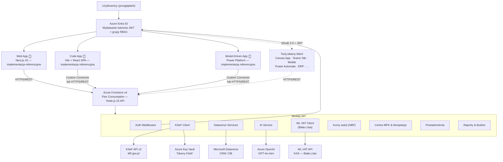

---

## Projekt komponentów

### 1a. Warstwa frontendowa — Web (web/) — *implementacja referencyjna*

> **Uwaga:** Aplikacja web to jedna z referencyjnych implementacji klienckich. Demonstruje wzorzec integracji z API poprzez bezpośrednie wywołania HTTP z tokenem MSAL. Możesz zbudować własnego klienta zamiast korzystać z tej aplikacji — patrz [Budowanie własnego klienta](#budowanie-własnego-klienta).

**Technologia**: Next.js 15 z App Router, React 19, TypeScript 5.7  
**Wdrożenie**: Azure App Service (tryb standalone)

**Struktura**:
```
web/
├── app/                    # Strony App Router
│   ├── api/               # Route handlery (NextAuth proxy)
│   ├── dashboard/         # Strony dashboardu
│   ├── invoices/          # Zarządzanie fakturami
│   ├── settings/          # UI ustawień
│   └── layout.tsx         # Root layout z auth
├── components/            # Komponenty React
│   ├── ui/               # Komponenty shadcn/ui
│   ├── invoices/         # Komponenty faktur
│   ├── dashboard/        # Widgety dashboardu
│   └── layout/           # Komponenty layoutu (nav, header)
└── lib/
    ├── api-client.ts     # Klient API (wrapper fetch)
    ├── auth.ts           # Konfiguracja MSAL
    └── utils.ts          # Funkcje narzędziowe
```

**Kluczowe cechy**:
- Renderowanie po stronie serwera (SSR) — wydajność i SEO
- Renderowanie komponentów UI oparte na rolach (RBAC)
- Optymistyczne aktualizacje UI
- Ładowanie danych przy użyciu React Server Components
- Responsywny design z Tailwind CSS
- Autentykacja przez MSAL (Microsoft Authentication Library)

**Zarządzanie stanem**:
- React Server Components do pobierania danych
- Stan kliencki przez hooki React
- Sesja MSAL (sessionStorage/localStorage)

---

### 1b. Warstwa frontendowa — Code App (code-app/) — *implementacja referencyjna*

> **Uwaga:** Code App to druga z referencyjnych implementacji klienckich, osadzona w Power Platform. Demonstruje wzorzec dual-mode auth (MSAL standalone + Power Apps managed auth) oraz routing API przez Custom Connector. Trzecią referencyjną implementacją jest **aplikacja Model-Driven (MDA)** na Power Platform, która korzysta z danych Dataverse bezpośrednio oraz z Custom Connector do wywołań API. Możesz zbudować kolejne klienty — patrz [Budowanie własnego klienta](#budowanie-własnego-klienta).

**Technologia**: Vite + React 19, TypeScript, TanStack Query  
**Wdrożenie**: Power Platform (`pac code push`)

**Struktura**:
```
code-app/
├── src/
│   ├── pages/              # Strony SPA (React Router)
│   │   ├── dashboard.tsx   # Dashboard z animowanymi KPI
│   │   ├── invoices.tsx    # Lista faktur z filtrami
│   │   ├── invoice-detail  # Szczegóły faktury
│   │   ├── manual-invoice  # Ręczne tworzenie faktury
│   │   ├── sync.tsx        # Synchronizacja KSeF
│   │   ├── settings.tsx    # Ustawienia
│   │   ├── forecast.tsx    # Prognoza wydatków
│   │   └── reports.tsx     # Raporty
│   ├── components/         # Komponenty React
│   │   ├── ui/            # shadcn/ui
│   │   ├── invoices/      # Komponenty faktur
│   │   ├── dashboard/     # Widgety KPI
│   │   ├── auth/          # Auth Provider (MSAL / Power Apps)
│   │   ├── layout/        # Sidebar, header, changelog
│   │   └── health/        # System status badge
│   ├── lib/
│   │   ├── api.ts         # Klient API (bezpośredni fetch + MSAL)
│   │   ├── api-connector.ts # Adapter Power Apps Custom Connector
│   │   ├── nip-utils.ts   # Walidacja NIP (checksum offline)
│   │   ├── export.ts      # Eksport CSV/PDF
│   │   └── power-apps-host.ts # Detekcja kontekstu Power Apps
│   ├── generated/         # Auto-generowane modele i serwisy connectora
│   └── messages/          # i18n (PL/EN)
├── power.config.json      # Metadane Power Apps SDK
└── vite.config.ts         # Vite + powerApps() plugin
```

**Kluczowe cechy**:
- **Dual-mode auth**: MSAL standalone + Power Apps managed auth
- **Custom Connector**: Routing API przez Power Platform connector (lazy loading)
- **Parytet z webem**: Dashboard KPI, overdue badges, edycja kursu walut, AI trigger
- Responsywny design z Tailwind CSS + shadcn/ui
- TanStack Query do cache i mutacji
- i18n (PL/EN) przez `react-intl`

**Architektura routingu API**:

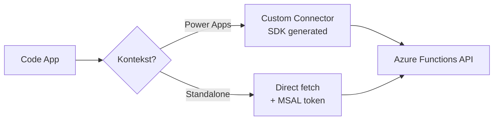

---

### 2. Warstwa API (api/)

**Technologia**: Azure Functions v4 (Flex Consumption), Node.js 22, TypeScript 5.7

**Struktura**:
```
api/
├── src/
│   ├── functions/              # Funkcje HTTP-triggered (21 modułów, 62 endpointy)
│   │   ├── health.ts          # Health check
│   │   ├── settings.ts        # CRUD ustawień
│   │   ├── sessions.ts        # Zarządzanie sesjami KSeF
│   │   ├── ksef-invoices.ts   # Operacje na fakturach KSeF
│   │   ├── ksef-sync.ts       # Synchronizacja KSeF
│   │   ├── invoices.ts        # Zarządzanie fakturami
│   │   ├── attachments.ts     # Załączniki plików
│   │   ├── ai-categorize.ts   # Kategoryzacja AI
│   │   ├── dashboard.ts       # Analityka
│   │   ├── mpk-centers.ts     # CRUD centrów MPK i akceptantów
│   │   ├── approvals.ts       # Operacje workflow akceptacji
│   │   ├── approval-sla-check.ts # Timer: wykrywanie przekroczeń SLA
│   │   ├── budget.ts          # Podsumowanie i szczegóły budżetu
│   │   ├── notifications.ts   # Zarządzanie powiadomieniami
│   │   ├── reports.ts         # Raporty akceptacji i budżetu
│   │   ├── vat.ts             # Integracja WL VAT (Biała Lista)
│   │   ├── exchange-rates.ts  # Kursy walut NBP
│   │   └── documents.ts       # Przetwarzanie dokumentów
│   │
│   └── lib/                   # Biblioteki rdzeniowe
│       ├── auth/              # Autentykacja i autoryzacja
│       │   └── middleware.ts  # Walidacja JWT, RBAC
│       ├── dataverse/         # Integracja z Dataverse
│       │   ├── client.ts      # Klient HTTP
│       │   ├── entities.ts    # Definicje encji
│       │   └── services/      # Serwisy CRUD
│       ├── ksef/              # Integracja z API KSeF
│       │   ├── client.ts      # Klient HTTP
│       │   ├── invoices.ts    # Operacje na fakturach
│       │   ├── session.ts     # Zarządzanie sesjami
│       │   └── parser.ts      # Parsowanie XML
│       ├── ai/                # Usługi AI
│       │   └── categorizer.ts # Kategoryzacja OpenAI
│       ├── vat/               # Klient API Biała Lista VAT
│       │   ├── client.ts      # Wyszukiwanie firm (NIP/REGON)
│       │   ├── types.ts       # Typy API WL VAT
│       │   └── index.ts       # Eksport publiczny
│       ├── prompts/           # Szablony promptów AI (.prompt.md)
│       └── storage/           # Azure Storage
│           └── blobs.ts       # Operacje na blobachach
│
└── tests/                     # Testy jednostkowe i integracyjne
```

**Wzorce architektoniczne**:
- **Service Layer Pattern**: Logika biznesowa w serwisach
- **Repository Pattern**: Dostęp do danych abstrakcyjny przez serwisy Dataverse
- **Middleware Pattern**: Autentykacja/autoryzacja jako middleware
- **Factory Pattern**: Tworzenie encji i klientów
- **Dependency Injection**: Serwisy otrzymują zależności (klient, konfiguracja)

---

### 3. Autentykacja i autoryzacja

**Przepływ**:

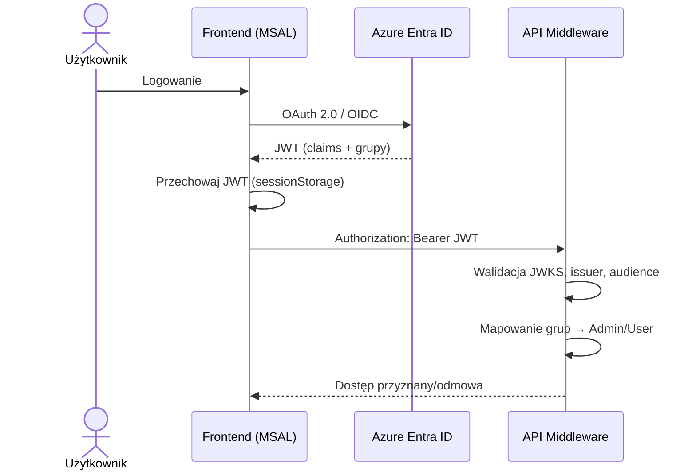

**Mapowanie grup bezpieczeństwa → ról**:
```typescript
// Zmienne środowiskowe
ADMIN_GROUP_ID=<Azure Entra ID Group Object ID>
USER_GROUP_ID=<Azure Entra ID Group Object ID>

// Logika middleware (api/src/lib/auth/middleware.ts)
if (groups.includes(ADMIN_GROUP_ID)) {
  roles.push('Admin')
}
if (groups.includes(USER_GROUP_ID)) {
  roles.push('User')
}
```

**Wymagania ról**:
- **Admin**: CRUD, kategoryzacja AI, synchronizacja, ustawienia
- **User**: Dostęp read-only, ograniczone aktualizacje (metadane faktur)

> Szczegóły konfiguracji: [Entra ID — konfiguracja](./ENTRA_ID_KONFIGURACJA.md)

---

### 4. Warstwa danych (Microsoft Dataverse)

Pełna specyfikacja encji, relacji, OptionSetów i indeksów znajduje się w: [Schemat Dataverse](./DATAVERSE_SCHEMA.md)

**Główne encje**:

| Encja | Opis |
|-------|------|
| `dvlp_ksefsetting` | Konfiguracja per firma (NIP, środowisko, sync) |
| `dvlp_ksefsession` | Sesje komunikacji z API KSeF |
| `dvlp_ksefinvoice` | Faktury KSeF + metadane + kategoryzacja AI |
| `dvlp_ksefsynclog` | Historia synchronizacji |
| `dvlp_aifeedback` | Feedback użytkownika dla uczenia AI |
| `dvlp_ksefmpkcenter` | Centra MPK — konfiguracja, budżety, workflow akceptacji |
| `dvlp_ksefmpkapprover` | Akceptanci przypisani do centrów MPK |
| `dvlp_ksefnotification` | Powiadomienia o akceptacjach, SLA, budżetach |
| `dvlp_ksefsupplier` | Rejestr dostawców — dane, NIP, VAT, statystyki faktur |
| `dvlp_ksefsbagrement` | Umowy samofakturowania — daty ważności, status, załączniki |
| `dvlp_ksefselfbillingtemplate` | Szablony pozycji samofaktur — opis, cena, VAT, waluta |

**Relacje**:
- `SettingEntity 1:N InvoiceEntity` (jedna firma, wiele faktur)
- `SettingEntity 1:N SyncLogEntity` (jedna firma, wiele operacji sync)
- `InvoiceEntity 1:N AIFeedbackEntity` (jedna faktura, wiele feedbacków)
- `SettingEntity 1:N MpkCenterEntity` (jedna firma, wiele centrów MPK)
- `MpkCenterEntity 1:N MpkApproverEntity` (jedno centrum, wielu akceptantów)
- `MpkCenterEntity 1:N InvoiceEntity` (jedno centrum, wiele faktur via lookup)
- `MpkCenterEntity 1:N NotificationEntity` (jedno centrum, wiele powiadomień)
- `SettingEntity 1:N NotificationEntity` (jedna firma, wiele powiadomień)
- `InvoiceEntity 1:N NotificationEntity` (jedna faktura, wiele powiadomień)
- `SettingEntity 1:N SupplierEntity` (jedna firma, wielu dostawców)
- `SupplierEntity 1:N InvoiceEntity` (jeden dostawca, wiele faktur via supplierId)
- `SupplierEntity 1:N SbAgreementEntity` (jeden dostawca, wiele umów SF)
- `SbAgreementEntity 1:N SbTemplateEntity` (jedna umowa, wiele szablonów pozycji)

#### Moduł Samofakturowania — przepływ danych

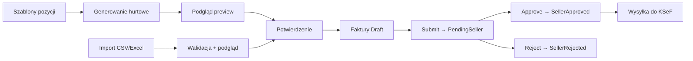

#### Workflow akceptacji faktur

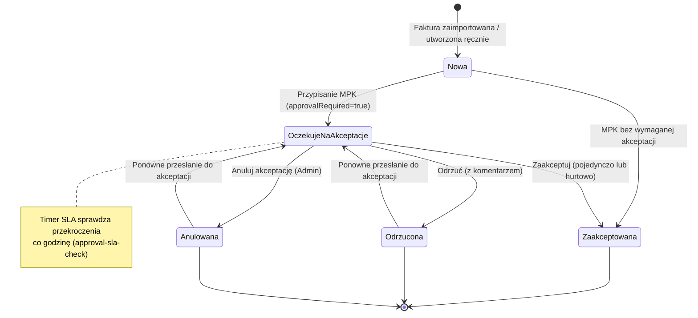

#### Pełny cykl życia samofaktury (rozbudowany)

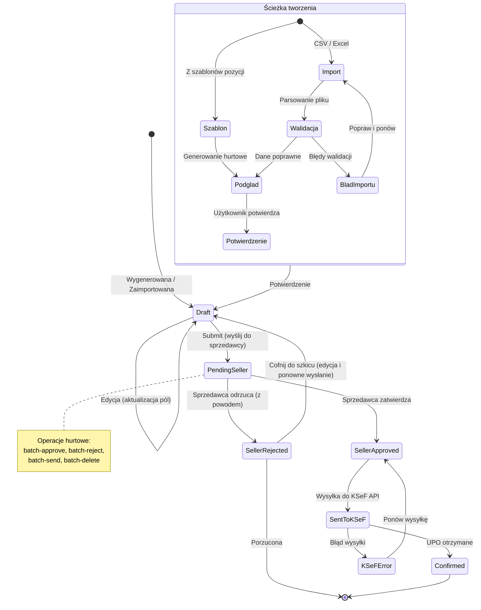

#### Przepływ synchronizacji — tryb incoming vs self-billing

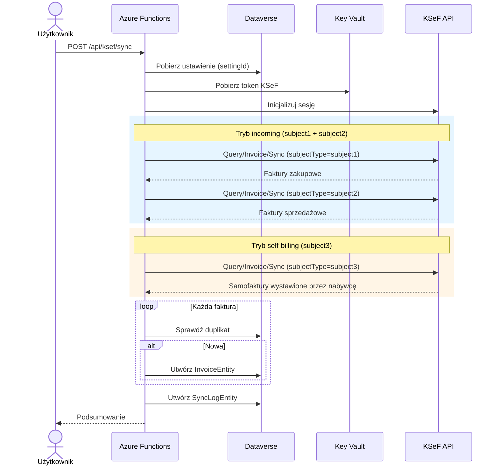

#### Architektura dashboardu

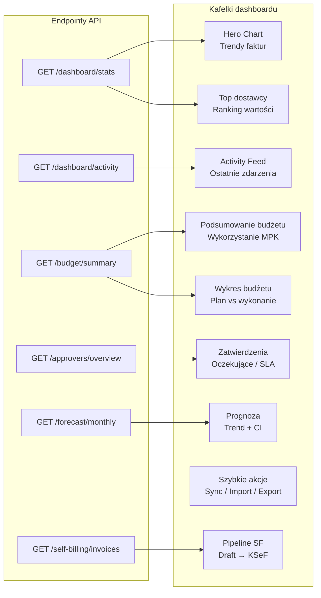

#### Przepływ multi-company (routing po settingId)

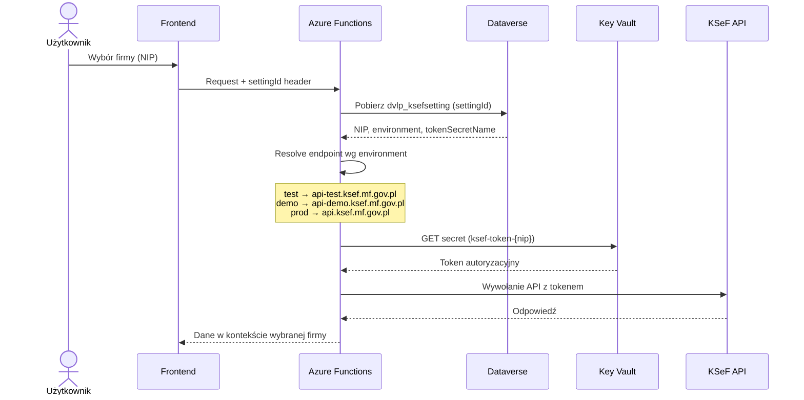

---

### 5. Integracje zewnętrzne

#### KSeF API (MF.gov.pl)
Integracja z Krajowym Systemem e-Faktur.

**Używane endpointy**:
- `POST /api/online/Session/InitToken` — inicjalizacja sesji
- `POST /api/online/Session/Terminate` — zakończenie sesji
- `GET /api/online/Invoice/Get/{referenceNumber}` — pobranie faktury
- `POST /api/online/Query/Invoice/Sync` — zapytanie o faktury
- `POST /api/online/Invoice/Send` — wysłanie faktury
- `GET /api/online/Invoice/Status/{elementReferenceNumber}` — status
- `GET /api/online/Invoice/Upo/{referenceNumber}` — pobranie UPO

**Środowiska**:
- **Produkcja**: `https://ksef.mf.gov.pl/api/`
- **Demo**: `https://ksef-demo.mf.gov.pl/api/`
- **Test**: `https://ksef-test.mf.gov.pl/api/`

**Obsługa błędów**: Retry z exponential backoff, logowanie do Application Insights.

#### Azure OpenAI (GPT-4o-mini)
Kategoryzacja faktur z użyciem AI.

**Model**: GPT-4o-mini (konfigurowalny)  
**Funkcje**: Sugestia MPK, kategorii, generowanie opisu faktury  
**Feedback**: Śledzenie applied/modified/rejected, cache dostawca → kategoria

> Szczegóły konfiguracji: [AI Kategoryzacja](./AI_CATEGORIZATION_SETUP.md)

#### WL VAT API — Biała Lista Podatników VAT (KAS)
Weryfikacja podmiotów w rejestrze Białej Listy VAT prowadzonym przez Krajową Administrację Skarbową.

**API**: `https://wl-api.mf.gov.pl` (produkcja) | `https://wl-test.mf.gov.pl` (test)  
**Autentykacja**: Brak — API publiczne, bez klucza  
**Limity**: 100 zapytań wyszukiwania/dzień, 5000 zapytań weryfikacji/dzień

**Możliwości**:
- Wyszukiwanie po NIP lub REGON — dane firmy, status VAT, adresy
- Walidacja NIP (algorytm checksum, offline)
- Weryfikacja rachunku bankowego w Białej Liście
- Pobieranie zarejestrowanych rachunków bankowych

#### NBP API
Pobieranie kursów walut z Narodowego Banku Polskiego.

---

## Przepływy danych

### Synchronizacja faktur

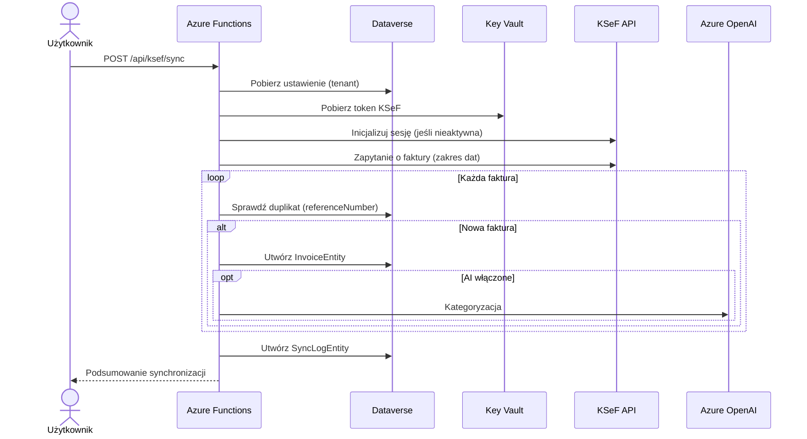

### Kategoryzacja AI

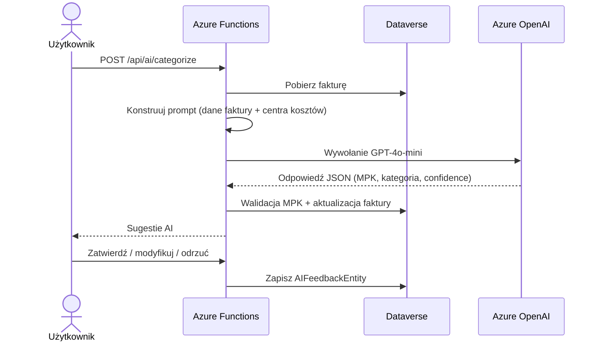

### Autentykacja

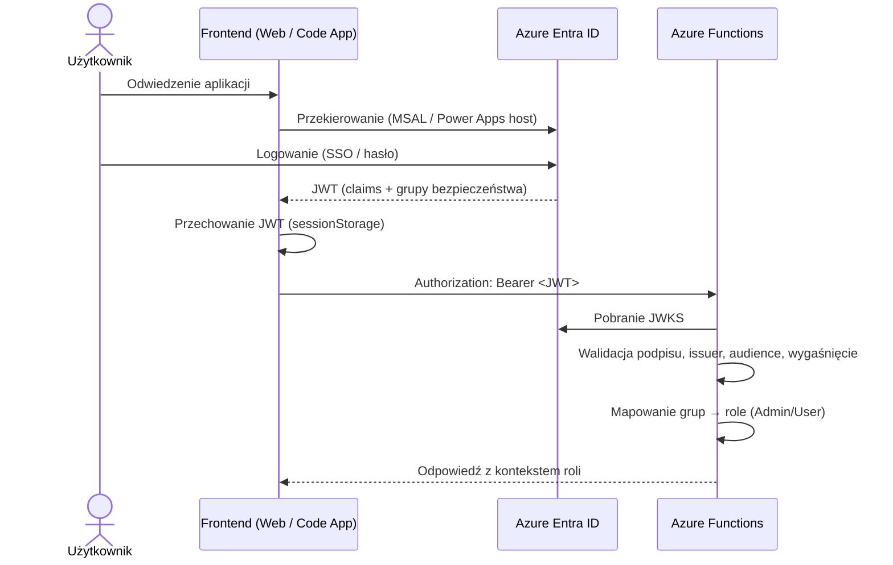

### Prognozowanie i wykrywanie anomalii

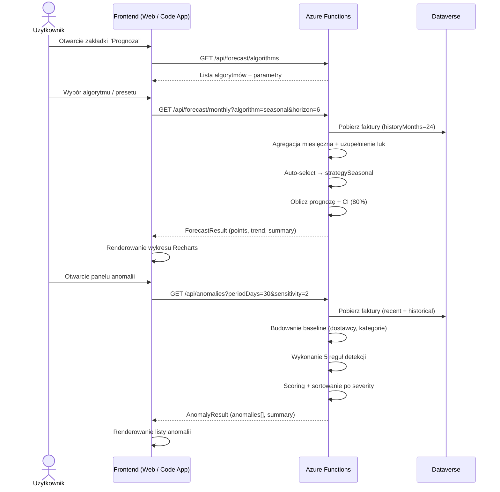

---

## Architektura bezpieczeństwa

### Obrona warstwowa (Defense in Depth)

**Warstwa 1: Sieć**
- HTTPS/TLS 1.2+ wyłącznie
- CORS skonfigurowany tylko dla originu frontendu

**Warstwa 2: Autentykacja**
- Azure Entra ID OAuth 2.0 / OIDC
- JWT z kryptograficzną walidacją podpisu (RS256)
- Krótkotrwałe tokeny (domyślnie 1 godzina)
- Brak dostępu anonymous (z wyjątkiem `/api/health`)

**Warstwa 3: Autoryzacja**
- RBAC (Role-Based Access Control)
- Członkostwo w grupach z Entra ID
- Szczegółowe uprawnienia per endpoint
- Walidacja startowa: crash jeśli `SKIP_AUTH=true` w produkcji (patrz poniżej)

> ⚠️ **`SKIP_AUTH=true`** (tylko dev): Pomija **cały proces autentykacji i autoryzacji** — nie odczytuje nagłówka `Authorization`, nie weryfikuje JWT, nie mapuje grup na role. Zamiast tego zwraca hardcoded użytkownika `dev-user` z rolą `Admin`. W produkcji (`NODE_ENV=production`) ustawienie tej flagi powoduje **natychmiastowy crash aplikacji przy starcie**.

**Warstwa 4: Dane**
- Wrażliwe dane (tokeny KSeF) w Azure Key Vault
- Managed Identity do dostępu Key Vault (bez credentials)
- Szyfrowanie w spoczynku (domyślnie Azure)

**Warstwa 5: Aplikacja**
- Walidacja danych wejściowych (Zod schemas)
- Zapobieganie SQL injection (sanityzacja zapytań OData)
- Zapobieganie XSS (React auto-escaping)

### Zarządzanie sekretami

- **Tokeny KSeF**: Przechowywane w Azure Key Vault jako sekrety
- **Konwencja nazewnictwa**: `ksef-token-{nip}`
- **Rotacja**: Ręczna przez UI ustawień (tylko Admin)
- **Dostęp**: Managed Identity z minimalnymi uprawnieniami

> Szczegóły: [Zmienne środowiskowe](./ZMIENNE_SRODOWISKOWE.md)

---

## Architektura wdrożenia

### Zasoby Azure

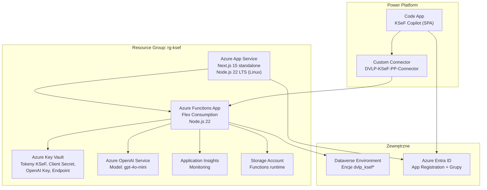

> Szczegóły wdrożenia: [API Deployment](./API_DEPLOYMENT.md) | [Web Deployment](./WEB_DEPLOYMENT.md) | [Code Apps Wdrożenie](./CODE_APPS_WDROZENIE.md)


---

## Budowanie własnego klienta

API rozwiązania jest **w pełni samodzielne i niezależne od frontendów**. Każda aplikacja obsługująca standard OAuth 2.0 (Azure Entra ID) i protokół HTTP/REST może konsumować API.

### Co jest potrzebne

1. **Autentykacja** — uzyskanie tokenu JWT z Azure Entra ID (MSAL, Power Platform managed auth, lub dowolna biblioteka OIDC)
2. **Wywołania API** — HTTP/REST z nagłówkiem `Authorization: Bearer <JWT>` na endpointy Azure Functions
3. **Opcjonalnie: Custom Connector** — dla klientów w ekosystemie Power Platform (Canvas Apps, Power Automate, Copilot Studio)

### Przykłady możliwych klientów

| Typ klienta | Wzorzec integracji | Przykład zastosowania |
|---|---|---|
| **Power Apps Canvas App** | Custom Connector | Uproszczony UI dla konkretnego procesu |
| **Model-Driven App (MDA)** | Dataverse natywnie + Custom Connector | Pełny widok danych z natywnym CRUD |
| **Power Automate Flow** | Custom Connector | Automatyczna synchronizacja cykliczna |
| **Copilot Studio** | Custom Connector / HTTP | Chatbot do odpytywania statusu faktur |
| **Teams Tab / Bot** | MSAL + HTTP/REST | Powiadomienia o fakturach w Teams |
| **Aplikacja mobilna** | MSAL + HTTP/REST | Zatwierdzanie faktur w terenie |
| **Zewnętrzny system ERP** | Service-to-service token + HTTP/REST | Import faktur do systemu księgowego |
| **Custom SPA / PWA** | MSAL + HTTP/REST | Dedykowany portal dla dostawców |

> Punkt wejścia: [Dokumentacja API](./API_PL.md) zawiera pełną specyfikację endpointów, parametrów i odpowiedzi.

---

## Stos technologiczny

### Backend (API)
- **Runtime**: Node.js 22 LTS
- **Framework**: Azure Functions v4 (Flex Consumption, HTTP triggers)
- **Język**: TypeScript 5.7 (strict mode)
- **Klient HTTP**: `axios` (z retry interceptors)
- **Walidacja**: `zod` schemas
- **JWT**: `jose` (walidacja JWKS)
- **Testowanie**: Vitest 2.1.9
- **Linting**: ESLint 9 z regułami TypeScript

### Referencyjne implementacje frontendowe

> Poniższe technologie dotyczą dostarczonych implementacji referencyjnych. Własny klient może używać dowolnego stosu technologicznego.

**Web (Next.js)**:
- **Framework**: Next.js 15 z App Router (tryb standalone)
- **Runtime**: React 19
- **Język**: TypeScript 5.7
- **Stylowanie**: Tailwind CSS 3
- **Komponenty UI**: shadcn/ui (Radix UI primitives)
- **Autentykacja**: MSAL (Microsoft Authentication Library)
- **Stan**: React Server Components + hooki
- **Formularze**: React Hook Form + Zod

**Code App (Vite + React)**:
- **Framework**: Vite + React 19
- **Język**: TypeScript
- **Stylowanie**: Tailwind CSS + shadcn/ui
- **Cache / mutacje**: TanStack Query
- **i18n**: react-intl (PL/EN)
- **Wdrożenie**: Power Platform (`pac code push`)

**Model-Driven App (MDA)**:
- **Platforma**: Power Platform
- **Widoki / formularze**: Konfiguracja deklaratywna Dataverse
- **Integracja API**: Custom Connector (DVLP-KSeF-PP-Connector)

### Infrastruktura
- **Compute API**: Azure Functions (Flex Consumption)
- **Compute Web**: Azure App Service (Linux, Node.js 22)
- **Baza danych**: Microsoft Dataverse
- **Sekrety**: Azure Key Vault (RBAC)
- **AI**: Azure OpenAI (GPT-4o-mini)
- **Monitoring**: Application Insights
- **Storage**: Azure Blob Storage

### DevOps
- **Kontrola wersji**: Git + GitHub
- **CI/CD**: GitHub Actions
- **Menadżer pakietów**: npm (workspaces)
- **Skanowanie bezpieczeństwa**: Trivy, Dependabot
- **Pre-commit**: Husky (typecheck + lint)

---

## Wzorce projektowe

### 1. Service Layer Pattern
Logika biznesowa zakapulowana w wielokrotnie używalnych serwisach.
```typescript
export class InvoiceService {
  async getById(id: string): Promise<Invoice> { ... }
  async query(filter: string): Promise<Invoice[]> { ... }
  async create(data: CreateInvoice): Promise<Invoice> { ... }
}
```

### 2. Middleware Pattern
Autentykacja i autoryzacja jako middleware.
```typescript
export async function verifyAuth(req: HttpRequest, context: InvocationContext) {
  const token = extractToken(req)
  const decoded = await jose.jwtVerify(token, JWKS, { ... })
  return { user: decoded.payload, roles: extractRoles(decoded.payload) }
}
```

### 3. Repository Pattern
Abstrakcja dostępu do danych przez serwisy Dataverse.

### 4. Factory Pattern
Spójne tworzenie instancji encji.

### 5. Dependency Injection
Serwisy otrzymują zależności, umożliwiając testowalność.

---

## Wydajność i skalowalność

### Optymalizacje wydajności

**API**:
- Serverless auto-scaling (Azure Functions Flex Consumption)
- Optymalizacja zapytań Dataverse (select tylko potrzebnych pól)
- Cache: Tokeny sesji w Dataverse (unikanie roundtripów Key Vault)
- Async/await dla równoczesnych operacji

**Frontend**:
- React Server Components (redukcja klienckiego JS)
- Code splitting (automatyczny Next.js)
- Optymalizacja obrazów (next/image)
- Tryb standalone (~40 MB vs ~500 MB z pełnym node_modules)

### Monitoring i obserwacja

**Application Insights**:
- Telemetria żądań/odpowiedzi
- Śledzenie wyjątków
- Custom events (synchronizacja, kategoryzacja AI)
- Metryki wydajności (czasy odpowiedzi, zależności)

**Alerty**:
- Awarie wykonania funkcji (>5% error rate)
- Wysoka latencja (>2s p95)
- Błędy dostępu Key Vault
- Throttling Dataverse

---

## Planowane ulepszenia

1. **Architektura event-driven** — Azure Event Grid dla zdarzeń synchronizacji
2. **Warstwa cache** — Redis dla częstych zapytań
3. **Przetwarzanie wsadowe** — Azure Durable Functions dla długotrwałych operacji sync
4. **Infrastructure as Code** — Kompletne szablony Bicep
5. **Zaawansowane AI** — Fine-tuning modeli z danymi feedbacków, wykrywanie anomalii

---

## Powiązane dokumenty

- [Dokumentacja API](./API_PL.md) — pełna dokumentacja endpointów
- [Schemat Dataverse](./DATAVERSE_SCHEMA.md) — model danych
- [Code Apps — Wdrożenie](./CODE_APPS_WDROZENIE.md) — deploy na Power Platform
- [Custom Connector](./POWER_PLATFORM_CUSTOM_CONNECTOR.md) — konfiguracja connectora
- [Wersja angielska](./en/ARCHITECTURE.md) — English version
- [README](../README.md) — quick start
- [SECURITY](../SECURITY.md) — polityka bezpieczeństwa

