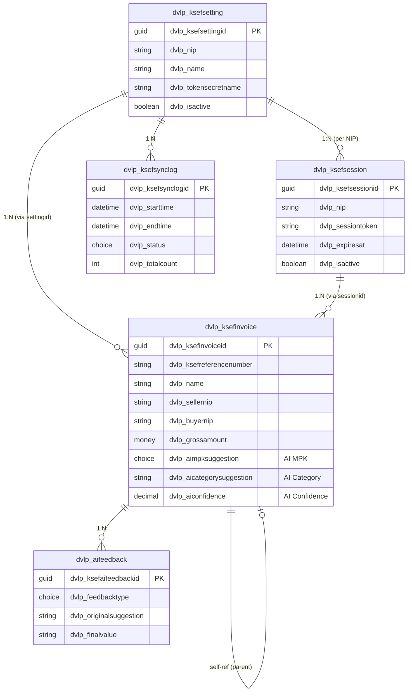
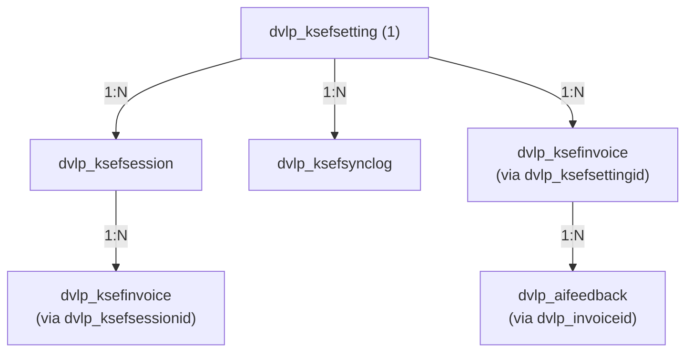

# Dataverse Schema - KSeF Integration

Specyfikacja modelu danych dla integracji z Krajowym Systemem e-Faktur (KSeF).

## Spis treści

1. [Przegląd](#przegląd)
2. [Publisher](#publisher)
3. [Tabele (Entities)](#tabele-entities)
   - [dvlp_ksefsetting](#dvlp_ksefsetting)
   - [dvlp_ksefsession](#dvlp_ksefsession)
   - [dvlp_ksefsynclog](#dvlp_ksefsynclog)
   - [dvlp_ksefinvoice](#dvlp_ksefinvoice)
   - [dvlp_aifeedback](#dvlp_aifeedback)
4. [Option Sets (Choices)](#option-sets-choices)
5. [Relacje](#relacje)
6. [Role bezpieczeństwa](#role-bezpieczeństwa)
7. [Indeksy i wydajność](#indeksy-i-wydajność)
8. [Migracja danych](#migracja-danych)
9. [Wdrożenie pól AI](#wdrożenie-pól-ai)
10. [Zmiany w kodzie po wdrożeniu AI](#zmiany-w-kodzie-po-wdrożeniu-ai)

---

## Przegląd

### Architektura danych



<details>
<summary>ASCII fallback (kliknij aby rozwinąć)</summary>

```
┌─────────────────────────────────────────────────────────────────┐
│                        Dataverse                                 │
├─────────────────────────────────────────────────────────────────┤
│                                                                  │
│  ┌─────────────────┐     ┌─────────────────┐                    │
│  │ dvlp_ksefsetting│     │ dvlp_ksefsession│                    │
│  │   (per NIP)     │     │  (per session)  │                    │
│  └────────┬────────┘     └────────┬────────┘                    │
│           │                       │                              │
│           │    1:N                │    1:N                       │
│           ▼                       ▼                              │
│  ┌─────────────────────────────────────────┐                    │
│  │          dvlp_ksefinvoice               │                    │
│  │  (pełna tabela faktur KSeF)             │                    │
│  │  + Dane podstawowe faktury              │                    │
│  │  + Dane sprzedawcy/nabywcy              │                    │
│  │  + Pozycje i sumy                       │                    │
│  │  + Metadane KSeF                        │                    │
│  │  + Status płatności                     │                    │
│  │  + Kategoryzacja AI                     │                    │
│  │    ├── dvlp_aimpksuggestion (OptionSet) │                    │
│  │    ├── dvlp_aicategorysuggestion (Text) │                    │
│  │    ├── dvlp_aidescription (Text)        │                    │
│  │    ├── dvlp_airationale (Text)          │                    │
│  │    ├── dvlp_aiconfidence (Decimal)      │                    │
│  │    └── dvlp_aiprocessedat (DateTime)    │                    │
│  └─────────────────────────────────────────┘                    │
│                        │                                         │
│                        │ 1:N                                     │
│                        ▼                                         │
│  ┌─────────────────────────────────────────┐                    │
│  │          dvlp_ksefsynclog               │                    │
│  │      (historia synchronizacji)          │                    │
│  └─────────────────────────────────────────┘                    │
│                                                                  │
│  ┌─────────────────────────────────────────┐                    │
│  │          dvlp_aifeedback                │                    │
│  │    (feedback dla uczenia AI)            │                    │
│  │  + Sugestie AI vs wybory użytkownika    │                    │
│  │  + Historia poprawek per dostawca       │                    │
│  └─────────────────────────────────────────┘                    │
│                                                                  │
└─────────────────────────────────────────────────────────────────┘
```

</details>

### Konwencje nazewnictwa

| Element | Wzorzec | Przykład |
|---------|---------|----------|
| Prefix | `dvlp_` | `dvlp_ksefsetting` |
| Tabela | `dvlp_{moduł}{obiekt}` | `dvlp_ksefsession` |
| Pole | `dvlp_{nazwa}` | `dvlp_companyname` |
| OptionSet | `dvlp_{obiekt}{cecha}` | `dvlp_ksefstatus` |
| Relacja | `dvlp_{parent}_{child}` | `dvlp_ksefsetting_invoices` |

---

## Publisher

```yaml
UniqueName: developico
DisplayName: Developico
Description: Developico sp. z o.o.
CustomizationPrefix: dvlp
OptionValuePrefix: 10000
```

---

## Tabele (Entities)

### dvlp_ksefsetting

**Nazwa wyświetlana:** Ustawienia KSeF / KSeF Setting  
**Nazwa logiczna:** `dvlp_ksefsetting`  
**Nazwa zestawu:** `dvlp_ksefsettings`  
**Typ własności:** Organization  
**Opis:** Konfiguracja integracji KSeF dla każdej firmy (NIP)

#### Atrybuty

| Nazwa logiczna | Nazwa wyświetlana | Typ | Wymagane | Opis |
|----------------|-------------------|-----|----------|------|
| `dvlp_ksefsettingid` | ID | Uniqueidentifier | Auto | Klucz główny |
| `dvlp_nip` | NIP | String(10) | ✅ | NIP firmy (Primary Name) |
| `dvlp_companyname` | Nazwa firmy | String(250) | ✅ | Pełna nazwa firmy |
| `dvlp_environment` | Środowisko KSeF | OptionSet | ✅ | test/demo/prod |
| `dvlp_autosync` | Automatyczna synchronizacja | Boolean | ❌ | Domyślnie: false |
| `dvlp_syncinterval` | Interwał synchronizacji | Integer | ❌ | Minuty (5-1440) |
| `dvlp_lastsyncat` | Ostatnia synchronizacja | DateTime | ❌ | Czas ostatniego sync |
| `dvlp_lastsyncstatus` | Status ostatniej sync | OptionSet | ❌ | success/error |
| `dvlp_keyvaultsecretname` | Nazwa sekretu Key Vault | String(100) | ✅ | ksef-token-{NIP} |
| `dvlp_tokenexpiresat` | Wygaśnięcie tokenu | DateTime | ❌ | Czas wygaśnięcia tokenu |
| `dvlp_isactive` | Aktywna | Boolean | ❌ | Domyślnie: true |
| `dvlp_invoiceprefix` | Prefix numeracji | String(10) | ❌ | Prefix dla faktur |
| `dvlp_defaultcategory` | Domyślna kategoria | Lookup | ❌ | Kategoria dla nowych faktur |

#### Klucze alternatywne

| Nazwa | Atrybuty |
|-------|----------|
| `dvlp_nip_key` | `dvlp_nip` |

#### Widoki

| Nazwa | Filtr | Domyślne kolumny |
|-------|-------|------------------|
| Aktywne ustawienia | `dvlp_isactive = true` | NIP, Nazwa firmy, Środowisko, Ostatnia sync |
| Wszystkie ustawienia | - | NIP, Nazwa firmy, Środowisko, Aktywna |
| Wymagające uwagi | `dvlp_lastsyncstatus = error` | NIP, Nazwa firmy, Status sync |

---

### dvlp_ksefsession

**Nazwa wyświetlana:** Sesja KSeF / KSeF Session  
**Nazwa logiczna:** `dvlp_ksefsession`  
**Nazwa zestawu:** `dvlp_ksefsessions`  
**Typ własności:** Organization  
**Opis:** Sesje komunikacji z API KSeF

#### Atrybuty

| Nazwa logiczna | Nazwa wyświetlana | Typ | Wymagane | Opis |
|----------------|-------------------|-----|----------|------|
| `dvlp_ksefsessionid` | ID | Uniqueidentifier | Auto | Klucz główny |
| `dvlp_sessionreference` | Referencja sesji | String(100) | ✅ | ID sesji z KSeF (Primary Name) |
| `dvlp_ksefsettingid` | Ustawienie KSeF | Lookup | ✅ | Powiązanie z konfiguracją |
| `dvlp_nip` | NIP | String(10) | ✅ | NIP firmy (denormalizacja) |
| `dvlp_sessiontoken` | Token sesji | String(500) | ❌ | Zaszyfrowany token |
| `dvlp_sessiontype` | Typ sesji | OptionSet | ✅ | interactive/batch |
| `dvlp_startedat` | Rozpoczęta | DateTime | ✅ | Czas rozpoczęcia |
| `dvlp_expiresat` | Wygasa | DateTime | ❌ | Czas wygaśnięcia |
| `dvlp_terminatedat` | Zakończona | DateTime | ❌ | Czas zakończenia |
| `dvlp_status` | Status | OptionSet | ✅ | active/expired/terminated/error |
| `dvlp_invoicesprocessed` | Przetworzono faktur | Integer | ❌ | Licznik faktur |
| `dvlp_errormessage` | Komunikat błędu | String(2000) | ❌ | Opis błędu (jeśli wystąpił) |

#### Relacje

| Typ | Powiązana tabela | Nazwa relacji |
|-----|------------------|---------------|
| N:1 | dvlp_ksefsetting | `dvlp_ksefsetting_sessions` |

---

### dvlp_ksefsynclog

**Nazwa wyświetlana:** Log synchronizacji KSeF / KSeF Sync Log  
**Nazwa logiczna:** `dvlp_ksefsynclog`  
**Nazwa zestawu:** `dvlp_ksefsynclog`  
**Typ własności:** Organization  
**Opis:** Historia operacji synchronizacji z KSeF

#### Atrybuty

| Nazwa logiczna | Nazwa wyświetlana | Typ | Wymagane | Opis |
|----------------|-------------------|-----|----------|------|
| `dvlp_ksefsynclogid` | ID | Uniqueidentifier | Auto | Klucz główny |
| `dvlp_name` | Nazwa | String(100) | Auto | Auto: "{NIP}-{timestamp}" |
| `dvlp_ksefsettingid` | Ustawienie KSeF | Lookup | ✅ | Powiązanie z konfiguracją |
| `dvlp_ksefsessionid` | Sesja KSeF | Lookup | ❌ | Powiązanie z sesją |
| `dvlp_operationtype` | Typ operacji | OptionSet | ✅ | sync_incoming/sync_outgoing/send/status_check |
| `dvlp_startedat` | Rozpoczęto | DateTime | ✅ | Czas rozpoczęcia |
| `dvlp_completedat` | Zakończono | DateTime | ❌ | Czas zakończenia |
| `dvlp_status` | Status | OptionSet | ✅ | in_progress/success/partial/error |
| `dvlp_invoicesprocessed` | Przetworzono | Integer | ❌ | Liczba przetworzonych |
| `dvlp_invoicesfailed` | Błędne | Integer | ❌ | Liczba z błędami |
| `dvlp_errormessage` | Komunikat błędu | Memo | ❌ | Szczegóły błędu |
| `dvlp_requestpayload` | Request | Memo | ❌ | Payload żądania (debug) |
| `dvlp_responsepayload` | Response | Memo | ❌ | Payload odpowiedzi (debug) |

---

### dvlp_ksefinvoice

**Nazwa wyświetlana:** Faktura KSeF / KSeF Invoice  
**Nazwa logiczna:** `dvlp_ksefinvoice`  
**Nazwa zestawu:** `dvlp_ksefinvoices`  
**Typ własności:** Organization  
**Opis:** Faktury kosztowe pobrane z Krajowego Systemu e-Faktur (KSeF)

#### Konfiguracja tabeli

| Ustawienie | Wartość | Opis |
|------------|---------|------|
| Track changes | ✅ | Śledzenie zmian dla synchronizacji |
| Enable auditing | ✅ | Audyt zmian |
| Enable for mobile | ❌ | Tylko desktop/web |
| Enable activities | ❌ | Bez aktywności |
| Enable notes | ✅ | Notatki/załączniki |
| Enable connections | ❌ | Bez połączeń |
| Enable queues | ❌ | Bez kolejek |
| Enable duplicate detection | ✅ | Wykrywanie duplikatów |
| Enable for offline | ❌ | Bez trybu offline |
| Enable quick create | ✅ | Szybkie tworzenie |
| Primary image | ❌ | Bez obrazka |
| Color | #2E7D32 | Zielony (faktury) |
| Icon | 📄 | Ikona dokumentu |

#### Atrybuty - Klucz główny i nazwa

| Nazwa logiczna | Nazwa wyświetlana | Typ | Wymagane | Opis |
|----------------|-------------------|-----|----------|------|
| `dvlp_ksefinvoiceid` | ID | Uniqueidentifier | Auto | Klucz główny (GUID) |
| `dvlp_name` | Numer faktury | String(100) | ✅ | Primary Name - numer faktury od wystawcy |

#### Atrybuty - Dane podstawowe faktury

| Nazwa logiczna | Nazwa wyświetlana | Typ | Wymagane | Opis |
|----------------|-------------------|-----|----------|------|
| `dvlp_invoicedate` | Data wystawienia | Date | ✅ | Data wystawienia faktury |
| `dvlp_saledate` | Data sprzedaży | Date | ❌ | Data sprzedaży/wykonania usługi |
| `dvlp_duedate` | Termin płatności | Date | ❌ | Data zapadalności |
| `dvlp_invoicetype` | Typ faktury | OptionSet | ✅ | Typ dokumentu (VAT, korygująca, zaliczkowa) |
| `dvlp_description` | Opis | String(500) | ❌ | Dodatkowy opis/komentarz |

#### Atrybuty - Dane sprzedawcy

| Nazwa logiczna | Nazwa wyświetlana | Typ | Wymagane | Opis |
|----------------|-------------------|-----|----------|------|
| `dvlp_sellernip` | NIP sprzedawcy | String(10) | ✅ | Numer NIP sprzedawcy |
| `dvlp_sellername` | Nazwa sprzedawcy | String(500) | ✅ | Pełna nazwa/firma sprzedawcy |

#### Atrybuty - Dane nabywcy

| Nazwa logiczna | Nazwa wyświetlana | Typ | Wymagane | Opis |
|----------------|-------------------|-----|----------|------|
| `dvlp_buyernip` | NIP nabywcy | String(10) | ✅ | Numer NIP nabywcy (nasz NIP) |

#### Atrybuty - Kwoty

| Nazwa logiczna | Nazwa wyświetlana | Typ | Wymagane | Opis |
|----------------|-------------------|-----|----------|------|
| `dvlp_netamount` | Kwota netto | Decimal(12,2) | ✅ | Suma wartości netto |
| `dvlp_vatamount` | Kwota VAT | Decimal(12,2) | ✅ | Suma podatku VAT |
| `dvlp_grossamount` | Kwota brutto | Decimal(12,2) | ✅ | Suma wartości brutto |
| `dvlp_currency` | Waluta | OptionSet | ✅ | Waluta faktury (PLN domyślnie) |

#### Atrybuty - Status płatności

| Nazwa logiczna | Nazwa wyświetlana | Typ | Wymagane | Opis |
|----------------|-------------------|-----|----------|------|
| `dvlp_paymentstatus` | Status płatności | OptionSet | ✅ | pending/paid/overdue |
| `dvlp_paidat` | Data płatności | DateTime | ❌ | Kiedy zapłacono |

#### Atrybuty - Kategoryzacja

| Nazwa logiczna | Nazwa wyświetlana | Typ | Wymagane | Opis |
|----------------|-------------------|-----|----------|------|
| `dvlp_category` | Kategoria | String(100) | ❌ | Kategoria kosztowa (tekst) |
| `dvlp_costcenter` | MPK | OptionSet (dvlp_costcenter) | ❌ | Miejsce Powstawania Kosztów |

#### Atrybuty - Kategoryzacja AI

| # | Nazwa logiczna | Nazwa wyświetlana (EN) | Nazwa wyświetlana (PL) | Typ | Wymagane | Opis |
|---|----------------|------------------------|------------------------|-----|----------|------|
| 1 | `dvlp_aimpksuggestion` | AI MPK Suggestion | Sugestia MPK (AI) | OptionSet (dvlp_costcenter) | ❌ | MPK zasugerowane przez AI |
| 2 | `dvlp_aicategorysuggestion` | AI Category Suggestion | Sugestia kategorii (AI) | String(100) | ❌ | Kategoria zasugerowana przez AI |
| 3 | `dvlp_aidescription` | AI Description | Opis (AI) | String(500) | ❌ | Krótki opis faktury wygenerowany przez AI |
| 4 | `dvlp_airationale` | AI Rationale | Uzasadnienie (AI) | String(500) | ❌ | Uzasadnienie decyzji kategoryzacji AI |
| 5 | `dvlp_aiconfidence` | AI Confidence | Pewność AI | Decimal(3,2) | ❌ | Poziom pewności AI (0.00-1.00) |
| 6 | `dvlp_aiprocessedat` | AI Processed At | Przetworzono przez AI | DateTime | ❌ | Timestamp kiedy AI przetworzyło fakturę |

##### Konfiguracja pól AI w Dataverse

**1. dvlp_aimpksuggestion**

```yaml
Display Name: AI MPK Suggestion / Sugestia MPK (AI)
Schema Name: dvlp_aimpksuggestion
Data Type: Choice (OptionSet)
Option Set: dvlp_costcenter (use existing or create new)
Required: No
Searchable: Yes
Description: MPK suggested by AI categorization. User can accept or override.
Audit: Yes
```

**2. dvlp_aicategorysuggestion**

```yaml
Display Name: AI Category Suggestion / Sugestia kategorii (AI)
Schema Name: dvlp_aicategorysuggestion
Data Type: Single Line of Text
Format: Text
Max Length: 100
Required: No
Searchable: Yes
Description: Cost category suggested by AI. Examples: "Licencje software", "Usługi hostingowe"
Audit: Yes
```

**3. dvlp_aidescription**

```yaml
Display Name: AI Description / Opis (AI)
Schema Name: dvlp_aidescription
Data Type: Single Line of Text
Format: Text Area
Max Length: 500
Required: No
Searchable: No
Description: Short description of the invoice generated by AI for easier identification.
Audit: No
```

**4. dvlp_airationale**

```yaml
Display Name: AI Rationale / Uzasadnienie (AI)
Schema Name: dvlp_airationale
Data Type: Single Line of Text
Format: Text Area
Max Length: 500
Required: No
Searchable: No
Description: AI reasoning for the categorization decision.
Audit: No
```

**5. dvlp_aiconfidence**

```yaml
Display Name: AI Confidence / Pewność AI
Schema Name: dvlp_aiconfidence
Data Type: Decimal Number
Precision: 2
Minimum Value: 0
Maximum Value: 1
Required: No
Searchable: No
Description: AI model confidence score (0.00 = uncertain, 1.00 = very confident)
Audit: No
```

**6. dvlp_aiprocessedat**

```yaml
Display Name: AI Processed At / Przetworzono przez AI
Schema Name: dvlp_aiprocessedat
Data Type: Date and Time
Format: Date and Time
Behavior: User Local
Required: No
Searchable: No
Description: Timestamp when AI categorization was performed on this invoice.
Audit: No
```

#### Atrybuty - Metadane KSeF

| Nazwa logiczna | Nazwa wyświetlana | Typ | Wymagane | Opis |
|----------------|-------------------|-----|----------|------|
| `dvlp_ksefreferencenumber` | Numer referencyjny KSeF | String(50) | ❌ | Unikalny identyfikator z KSeF |
| `dvlp_ksefstatus` | Status KSeF | OptionSet | ❌ | Status synchronizacji z KSeF |
| `dvlp_ksefdirection` | Kierunek | OptionSet | ✅ | incoming / outgoing |
| `dvlp_ksefdownloadedat` | Pobrano z KSeF | DateTime | ❌ | Kiedy pobrano z KSeF |
| `dvlp_ksefrawxml` | XML faktury | Memo | ❌ | Surowy XML w formacie FA(2) |

#### Atrybuty - Relacje

| Nazwa logiczna | Nazwa wyświetlana | Typ | Wymagane | Opis |
|----------------|-------------------|-----|----------|------|
| `dvlp_ksefsettingid` | Ustawienie KSeF | Lookup | ✅ | Konfiguracja firmy (per NIP) |
| `dvlp_parentinvoiceid` | Faktura źródłowa | Lookup | ❌ | Dla korekt - oryginalna faktura |
| `statecode` | Status | State | Auto | Active/Inactive |
| `statuscode` | Status Reason | Status | Auto | Powód statusu |

#### Klucze alternatywne

| Nazwa | Atrybuty | Opis |
|-------|----------|------|
| `dvlp_ksefref_key` | `dvlp_ksefreferencenumber` | Unikalność numeru KSeF |
| `dvlp_invoice_composite_key` | `dvlp_sellernip`, `dvlp_name`, `dvlp_invoicedate` | Unikalność faktury (NIP+numer+data) |

#### Widoki (Views)

| Nazwa | Typ | Filtr | Domyślne kolumny |
|-------|-----|-------|------------------|
| Wszystkie faktury | Public | - | Numer, Data, Sprzedawca, Brutto, Status płatności |
| Aktywne faktury | Public | `statecode = 0` | Numer, Data, Sprzedawca, Brutto, Status |
| Faktury do zapłaty | Public | `dvlp_paymentstatus = pending` | Numer, Data, Sprzedawca, Brutto, Termin |
| Opłacone | Public | `dvlp_paymentstatus = paid` | Numer, Data, Sprzedawca, Brutto, Data płatności |
| Przeterminowane | Public | `dvlp_paymentstatus = overdue` | Numer, Data, Sprzedawca, Brutto, Termin |
| Faktury przychodzące | Public | `dvlp_ksefdirection = incoming` | Numer, Data, Sprzedawca, Brutto |
| Błędy KSeF | Public | `dvlp_ksefstatus = error` | Numer, Data, Sprzedawca, Status KSeF |
| Quick Find | QuickFind | - | Numer, Sprzedawca, NIP |
| Faktury do kategoryzacji AI | Public | `dvlp_aiprocessedat = null AND dvlp_category = null` | Numer, Sprzedawca, Brutto, Data |
| Skategoryzowane przez AI | Public | `dvlp_aiprocessedat != null` | Numer, Sprzedawca, Sugestia MPK, Pewność AI |
| Niska pewność AI | Public | `dvlp_aiconfidence < 0.7` | Numer, Sprzedawca, Sugestia, Pewność |

#### Formularze (Forms)

| Nazwa | Typ | Opis |
|-------|-----|------|
| Faktura KSeF | Main | Główny formularz edycji |
| Faktura - Quick Create | Quick Create | Szybkie tworzenie |
| Faktura - Card | Card | Widok karty |

**Struktura głównego formularza (Main):**

```
┌─────────────────────────────────────────────────────────────────┐
│ HEADER                                                           │
│ [Numer faktury] [Status płatności] [Status KSeF]                │
├─────────────────────────────────────────────────────────────────┤
│ TAB: Ogólne                                                      │
│ ┌─────────────────────────┬─────────────────────────┐           │
│ │ SEKCJA: Dane faktury    │ SEKCJA: Sprzedawca      │           │
│ │ - Numer faktury         │ - NIP sprzedawcy        │           │
│ │ - Data wystawienia      │ - Nazwa sprzedawcy      │           │
│ │ - Data sprzedaży        │                         │           │
│ │ - Termin płatności      │                         │           │
│ │ - Typ faktury           │                         │           │
│ └─────────────────────────┴─────────────────────────┘           │
│ ┌─────────────────────────┬─────────────────────────┐           │
│ │ SEKCJA: Kwoty           │ SEKCJA: Płatność        │           │
│ │ - Kwota netto           │ - Status płatności      │           │
│ │ - Kwota VAT             │ - Data płatności        │           │
│ │ - Kwota brutto          │                         │           │
│ │ - Waluta                │                         │           │
│ └─────────────────────────┴─────────────────────────┘           │
├─────────────────────────────────────────────────────────────────┤
│ TAB: Kategoryzacja                                               │
│ ┌─────────────────────────────────────────────────────────────┐ │
│ │ SEKCJA: Ręczna kategoryzacja                                │ │
│ │ ┌─────────────────────┬─────────────────────┐               │ │
│ │ │ Kategoria           │ MPK                 │               │ │
│ │ │ [dvlp_category]     │ [dvlp_costcenter]   │               │ │
│ │ └─────────────────────┴─────────────────────┘               │ │
│ └─────────────────────────────────────────────────────────────┘ │
│ ┌─────────────────────────────────────────────────────────────┐ │
│ │ SEKCJA: Sugestie AI                          [Read-only]    │ │
│ │ ┌─────────────────────┬─────────────────────┐               │ │
│ │ │ Sugestia kategorii  │ Sugestia MPK        │               │ │
│ │ │ [dvlp_aicategory..] │ [dvlp_aimpksugge..] │               │ │
│ │ ├─────────────────────┴─────────────────────┤               │ │
│ │ │ Opis (AI)                                 │               │ │
│ │ │ [dvlp_aidescription]                      │               │ │
│ │ ├─────────────────────┬─────────────────────┤               │ │
│ │ │ Pewność AI          │ Przetworzono        │               │ │
│ │ │ [dvlp_aiconfidence] │ [dvlp_aiprocessed..]│               │ │
│ │ └─────────────────────┴─────────────────────┘               │ │
│ │                                                              │ │
│ │ [🤖 Uruchom kategoryzację AI] [✓ Akceptuj sugestię]         │ │
│ └─────────────────────────────────────────────────────────────┘ │
├─────────────────────────────────────────────────────────────────┤
│ TAB: KSeF                                                        │
│ - Numer referencyjny KSeF                                        │
│ - Status KSeF                                                    │
│ - Kierunek                                                       │
│ - Pobrano z KSeF                                                 │
│ - XML faktury (read-only)                                        │
├─────────────────────────────────────────────────────────────────┤
│ TAB: Powiązania                                                  │
│ - Faktura źródłowa (dla korekt)                                  │
│ - Ustawienie KSeF                                                │
├─────────────────────────────────────────────────────────────────┤
│ FOOTER: Timeline/Notes                                           │
└─────────────────────────────────────────────────────────────────┘
```

#### Wykresy (Charts)

| Nazwa | Typ | Opis |
|-------|-----|------|
| Faktury wg statusu płatności | Pie Chart | Podział: oczekujące/opłacone/przeterminowane |
| Faktury miesięcznie | Bar Chart | Liczba faktur per miesiąc |
| Kwoty miesięcznie | Line Chart | Suma brutto per miesiąc |
| Top 10 dostawców | Horizontal Bar | Najwięksi dostawcy wg kwoty |
| Faktury wg kategorii | Pie Chart | Podział kosztów na kategorie |

#### Business Rules

| Nazwa | Warunek | Akcja |
|-------|---------|-------|
| Blokuj edycję XML | `dvlp_ksefrawxml != null` | Lock field `dvlp_ksefrawxml` |
| Auto-ustaw datę płatności | `dvlp_paymentstatus = paid AND dvlp_paidat = null` | Set `dvlp_paidat = Now()` |
| Lock AI fields | Always | Lock: `dvlp_aimpksuggestion`, `dvlp_aicategorysuggestion`, `dvlp_aidescription`, `dvlp_airationale`, `dvlp_aiconfidence`, `dvlp_aiprocessedat` |
| Show AI confidence as % | `dvlp_aiconfidence != null` | Format as percentage in UI |

#### Indeksy

| Nazwa | Atrybuty | Typ | Uzasadnienie |
|-------|----------|-----|--------------|
| `PK_ksefinvoice` | `dvlp_ksefinvoiceid` | Primary | Klucz główny |
| `AK_ksefref` | `dvlp_ksefreferencenumber` | Unique | Wyszukiwanie po numerze KSeF |
| `AK_composite` | `dvlp_sellernip`, `dvlp_name`, `dvlp_invoicedate` | Unique | Deduplikacja |
| `IX_paymentstatus` | `dvlp_paymentstatus`, `dvlp_duedate` | Non-unique | Filtrowanie płatności |
| `IX_sellernip` | `dvlp_sellernip` | Non-unique | Wyszukiwanie po dostawcy |
| `IX_invoicedate` | `dvlp_invoicedate` | Non-unique | Sortowanie/filtrowanie dat |
| `IX_ksefsetting` | `dvlp_ksefsettingid` | Non-unique | Relacja z konfiguracją |

---

### dvlp_aifeedback

**Nazwa wyświetlana:** AI Feedback / Feedback AI  
**Nazwa logiczna:** `dvlp_aifeedback`  
**Nazwa zestawu:** `dvlp_aifeedbacks`  
**Typ własności:** Organization  
**Opis:** Historia poprawek użytkowników do sugestii AI - używana do uczenia modelu

#### Cel

Tabela przechowuje informacje o tym jak użytkownicy reagują na sugestie AI:
- **applied** - użytkownik zaakceptował sugestię AI bez zmian
- **modified** - użytkownik zmienił sugestię AI na inną wartość
- **rejected** - użytkownik odrzucił sugestię i ustawił własną wartość

Te dane są wykorzystywane do budowania kontekstu w promptach AI (few-shot learning).

#### Jak działa uczenie

1. Użytkownik klika "Kategoryzuj z AI" → AI generuje sugestię
2. Użytkownik akceptuje lub modyfikuje sugestię
3. Przy zapisie faktury system tworzy rekord w `dvlp_aifeedback`
4. Przy kolejnej kategoryzacji tego samego dostawcy:
   - System pobiera historię z `dvlp_aifeedback`
   - Dodaje do promptu: "Dla dostawcy X użytkownicy zazwyczaj wybierają MPK=Y, Kategoria=Z"
   - AI bierze to pod uwagę przy kategoryzacji

#### Atrybuty - Główne

| Nazwa logiczna | Nazwa wyświetlana | Typ | Wymagane | Opis |
|----------------|-------------------|-----|----------|------|
| `dvlp_aifeedbackid` | ID | Uniqueidentifier | Auto | Klucz główny |
| `dvlp_name` | Nazwa | String(100) | Auto | Auto: "{SupplierName} - {Date}" |
| `dvlp_invoiceid` | Faktura | Lookup (dvlp_ksefinvoice) | ✅ | Powiązanie z fakturą źródłową |
| `dvlp_tenantnip` | NIP Firmy | String(10) | ✅ | NIP firmy (tenant) |
| `dvlp_suppliernip` | NIP Dostawcy | String(15) | ✅ | NIP dostawcy |
| `dvlp_suppliername` | Nazwa Dostawcy | String(250) | ✅ | Nazwa dostawcy |
| `dvlp_invoicedescription` | Kontekst faktury | Memo(500) | ❌ | Fragment opisu/pozycji faktury |

#### Atrybuty - Sugestie AI

| Nazwa logiczna | Nazwa wyświetlana | Typ | Wymagane | Opis |
|----------------|-------------------|-----|----------|------|
| `dvlp_aimpksuggestion` | Sugestia MPK (AI) | String(50) | ❌ | MPK zasugerowane przez AI |
| `dvlp_aicategorysuggestion` | Sugestia kategorii (AI) | String(100) | ❌ | Kategoria zasugerowana przez AI |
| `dvlp_aiconfidence` | Pewność AI | Decimal(3,2) | ❌ | Poziom pewności AI (0.00-1.00) |

#### Atrybuty - Wybory użytkownika

| Nazwa logiczna | Nazwa wyświetlana | Typ | Wymagane | Opis |
|----------------|-------------------|-----|----------|------|
| `dvlp_usermpk` | Wybrane MPK | String(50) | ❌ | MPK wybrane przez użytkownika |
| `dvlp_usercategory` | Wybrana kategoria | String(100) | ❌ | Kategoria wybrana przez użytkownika |
| `dvlp_feedbacktype` | Typ feedbacku | OptionSet | ✅ | applied/modified/rejected |

#### Atrybuty - Systemowe

| Nazwa logiczna | Nazwa wyświetlana | Typ | Wymagane | Opis |
|----------------|-------------------|-----|----------|------|
| `createdon` | Utworzono | DateTime | Auto | Data utworzenia rekordu |
| `createdby` | Utworzył | Lookup (User) | Auto | Użytkownik który zapisał feedback |
| `statecode` | Status | State | Auto | Active/Inactive |
| `statuscode` | Status Reason | Status | Auto | Powód statusu |

#### Option Set - dvlp_feedbacktype

**Nazwa wyświetlana:** Typ Feedback AI  
**Typ:** Local OptionSet (lub Global)

| Wartość | Label (EN) | Label (PL) | Kolor | Opis |
|---------|------------|------------|-------|------|
| 100000000 | Applied | Zaakceptowano | Green | Użytkownik zaakceptował sugestię AI |
| 100000001 | Modified | Zmieniono | Orange | Użytkownik zmienił sugestię AI |
| 100000002 | Rejected | Odrzucono | Red | Użytkownik odrzucił sugestię AI |

#### Indeksy

| Nazwa | Atrybuty | Typ | Uzasadnienie |
|-------|----------|-----|--------------|
| `PK_aifeedback` | `dvlp_aifeedbackid` | Primary | Klucz główny |
| `IX_tenant_supplier` | `dvlp_tenantnip`, `dvlp_suppliernip` | Non-unique | Agregacja per dostawca |
| `IX_createdon` | `createdon` | Non-unique | Sortowanie chronologiczne |
| `IX_feedbacktype` | `dvlp_feedbacktype` | Non-unique | Filtrowanie typów feedbacku |

#### Widoki (Views)

| Nazwa | Typ | Filtr | Domyślne kolumny |
|-------|-----|-------|------------------|
| Wszystkie feedbacki | Public | - | Dostawca, Sugestia AI, Wybór usera, Typ, Data |
| Zaakceptowane | Public | `feedbacktype = applied` | Dostawca, MPK, Kategoria |
| Zmienione | Public | `feedbacktype = modified` | Dostawca, Sugestia AI, Wybór usera |
| Per dostawca | Public | GROUP BY suppliernip | Dostawca, Count, Avg confidence |

#### Bezpieczeństwo

- **Read**: Wszyscy użytkownicy KSeF
- **Create**: System (via API) przy zapisie faktury
- **Update**: Brak (rekordy są immutable)
- **Delete**: Admin only

---

## Option Sets (Choices)

### dvlp_ksefenvironment

**Nazwa wyświetlana:** Środowisko KSeF  
**Typ:** Global OptionSet

| Wartość | Label (EN) | Label (PL) | Opis |
|---------|------------|------------|------|
| 100000001 | Test | Test | Środowisko testowe KSeF |
| 100000002 | Demo | Demo | Środowisko demo KSeF |
| 100000003 | Production | Produkcja | Środowisko produkcyjne KSeF |

---

### dvlp_ksefstatus

**Nazwa wyświetlana:** Status KSeF  
**Typ:** Global OptionSet

| Wartość | Label (EN) | Label (PL) | Kolor | Opis |
|---------|------------|------------|-------|------|
| 100000001 | Draft | Szkic | Gray | Faktura utworzona, nie wysłana |
| 100000002 | Pending | Oczekuje | Yellow | W trakcie wysyłki |
| 100000003 | Sent | Wysłano | Blue | Wysłano, oczekuje na potwierdzenie |
| 100000004 | Accepted | Zaakceptowano | Green | Zaakceptowano przez KSeF |
| 100000005 | Rejected | Odrzucono | Red | Odrzucono przez KSeF |
| 100000006 | Error | Błąd | Red | Błąd techniczny |

---

### dvlp_ksefdirection

**Nazwa wyświetlana:** Kierunek faktury  
**Typ:** Global OptionSet

| Wartość | Label (EN) | Label (PL) | Ikona |
|---------|------------|------------|-------|
| 100000001 | Incoming | Przychodzące | ⬇️ |
| 100000002 | Outgoing | Wychodzące | ⬆️ |

---

### dvlp_sessionstatus

**Nazwa wyświetlana:** Status sesji  
**Typ:** Global OptionSet

| Wartość | Label (EN) | Label (PL) |
|---------|------------|------------|
| 100000001 | Active | Aktywna |
| 100000002 | Expired | Wygasła |
| 100000003 | Terminated | Zakończona |
| 100000004 | Error | Błąd |

---

### dvlp_sessiontype

**Nazwa wyświetlana:** Typ sesji  
**Typ:** Global OptionSet

| Wartość | Label (EN) | Label (PL) | Opis |
|---------|------------|------------|------|
| 100000001 | Interactive | Interaktywna | Sesja użytkownika |
| 100000002 | Batch | Wsadowa | Sesja automatyczna |

---

### dvlp_syncoperationtype

**Nazwa wyświetlana:** Typ operacji synchronizacji  
**Typ:** Global OptionSet

| Wartość | Label (EN) | Label (PL) |
|---------|------------|------------|
| 100000001 | Sync Incoming | Pobierz przychodzące |
| 100000002 | Sync Outgoing | Synchronizuj wychodzące |
| 100000003 | Send Invoice | Wyślij fakturę |
| 100000004 | Check Status | Sprawdź status |
| 100000005 | Download UPO | Pobierz UPO |

---

### dvlp_syncstatus

**Nazwa wyświetlana:** Status synchronizacji  
**Typ:** Global OptionSet

| Wartość | Label (EN) | Label (PL) |
|---------|------------|------------|
| 100000001 | In Progress | W trakcie |
| 100000002 | Success | Sukces |
| 100000003 | Partial | Częściowy |
| 100000004 | Error | Błąd |

---

### dvlp_paymentstatus

**Nazwa wyświetlana:** Status płatności  
**Typ:** Global OptionSet

| Wartość | Label (EN) | Label (PL) | Kolor |
|---------|------------|------------|-------|
| 100000001 | Pending | Oczekuje | Yellow |
| 100000002 | Paid | Opłacona | Green |
| 100000003 | Overdue | Przeterminowana | Red |

---

### dvlp_invoicetype

**Nazwa wyświetlana:** Typ faktury  
**Typ:** Global OptionSet

| Wartość | Label (EN) | Label (PL) |
|---------|------------|------------|
| 100000000 | VAT Invoice | Faktura VAT |
| 100000001 | Corrective | Faktura korygująca |
| 100000002 | Advance | Faktura zaliczkowa |

---

### dvlp_currency

**Nazwa wyświetlana:** Waluta  
**Typ:** Global OptionSet

| Wartość | Label (EN) | Label (PL) |
|---------|------------|------------|
| 100000000 | PLN | PLN |
| 100000001 | USD | USD |
| 100000002 | EUR | EUR |

---

### dvlp_category

**Nazwa wyświetlana:** Kategoria kosztowa  
**Typ:** Global OptionSet

| Wartość | Label (EN) | Label (PL) |
|---------|------------|------------|
| 100000001 | IT & Software | IT i oprogramowanie |
| 100000002 | Office | Biuro |
| 100000003 | Marketing | Marketing |
| 100000004 | Travel | Podróże |
| 100000005 | Utilities | Media |
| 100000006 | Professional Services | Usługi profesjonalne |
| 100000007 | Equipment | Sprzęt |
| 100000008 | Materials | Materiały |
| 100000009 | Other | Inne |

---

### dvlp_costcenter

**Nazwa wyświetlana:** MPK / Cost Center (Miejsce Powstawania Kosztów)  
**Typ:** Global OptionSet  
**Opis:** Miejsca Powstawania Kosztów dla kategoryzacji

| Wartość | Label (EN) | Label (PL) | Opis |
|---------|------------|------------|------|
| 100000001 | Consultants | Konsultanci | Usługi konsultingowe, szkolenia, outsourcing |
| 100000002 | BackOffice | Back Office | Biuro, administracja, sprzątanie |
| 100000003 | Management | Zarząd | Zarząd, strategia, reprezentacja |
| 100000004 | Cars | Samochody | Pojazdy, paliwo, serwis, ubezpieczenia |
| 100000005 | Legal | Prawne | Usługi prawne, notarialne, compliance |
| 100000006 | Marketing | Marketing | Reklama, promocja, eventy |
| 100000007 | Sales | Sprzedaż | Sprzedaż, CRM, lead generation |
| 100000008 | Delivery | Realizacja | Projekty, narzędzia developerskie |
| 100000009 | Finance | Finanse | Księgowość, audyt, bankowość |
| 100000010 | Other | Inne | Wszystko inne |

#### Mapowanie MPK enum → Dataverse OptionSet

| MPK (TypeScript) | Wartość Dataverse |
|------------------|-------------------|
| `Consultants` | 100000001 |
| `BackOffice` | 100000002 |
| `Management` | 100000003 |
| `Cars` | 100000004 |
| `Legal` | 100000005 |
| `Marketing` | 100000006 |
| `Sales` | 100000007 |
| `Delivery` | 100000008 |
| `Finance` | 100000009 |
| `Other` | 100000010 |

---

### dvlp_feedbacktype

**Nazwa wyświetlana:** Typ Feedback AI  
**Typ:** Global OptionSet

| Wartość | Label (EN) | Label (PL) | Kolor | Opis |
|---------|------------|------------|-------|------|
| 100000000 | Applied | Zaakceptowano | Green | Użytkownik zaakceptował sugestię AI bez zmian |
| 100000001 | Modified | Zmieniono | Orange | Użytkownik zmienił sugestię AI |
| 100000002 | Rejected | Odrzucono | Red | Użytkownik odrzucił sugestię AI |

---

### dvlp_invoicesource

**Nazwa wyświetlana:** Źródło faktury  
**Typ:** Global OptionSet

| Wartość | Label (EN) | Label (PL) | Opis |
|---------|------------|------------|------|
| 100000001 | KSeF Sync | Synchronizacja KSeF | Pobrano automatycznie z KSeF |
| 100000002 | Manual | Ręczne | Wprowadzono ręcznie |
| 100000003 | Import | Import | Zaimportowano z pliku |

---

## Relacje

### Diagram relacji



<details>
<summary>ASCII fallback (kliknij aby rozwinąć)</summary>

```
dvlp_ksefsetting (1)
    │
    ├──── (N) dvlp_ksefsession
    │           │
    │           └──── (N) dvlp_ksefinvoice (via dvlp_ksefsessionid)
    │
    ├──── (N) dvlp_ksefsynclog
    │
    └──── (N) dvlp_ksefinvoice (via dvlp_ksefsettingid)
                    │
                    └──── (N) dvlp_aifeedback (via dvlp_invoiceid)
```

</details>

### Definicje relacji

| Relacja | Typ | Parent | Child | Cascade |
|---------|-----|--------|-------|---------|
| `dvlp_ksefsetting_sessions` | 1:N | dvlp_ksefsetting | dvlp_ksefsession | Delete: Cascade |
| `dvlp_ksefsetting_synclogs` | 1:N | dvlp_ksefsetting | dvlp_ksefsynclog | Delete: Cascade |
| `dvlp_ksefsetting_invoices` | 1:N | dvlp_ksefsetting | dvlp_ksefinvoice | Delete: Restrict |
| `dvlp_ksefsession_synclogs` | 1:N | dvlp_ksefsession | dvlp_ksefsynclog | Delete: RemoveLink |
| `dvlp_ksefsession_invoices` | 1:N | dvlp_ksefsession | dvlp_ksefinvoice | Delete: RemoveLink |
| `dvlp_ksefinvoice_parent` | 1:N | dvlp_ksefinvoice | dvlp_ksefinvoice | Delete: RemoveLink |
| `dvlp_ksefinvoice_feedbacks` | 1:N | dvlp_ksefinvoice | dvlp_aifeedback | Delete: Cascade |

---

## Role bezpieczeństwa

### KSeF Admin

Pełny dostęp do wszystkich operacji KSeF.

| Tabela | Create | Read | Write | Delete | Append | AppendTo |
|--------|--------|------|-------|--------|--------|----------|
| dvlp_ksefsetting | ✅ Org | ✅ Org | ✅ Org | ✅ Org | ✅ Org | ✅ Org |
| dvlp_ksefsession | ✅ Org | ✅ Org | ✅ Org | ✅ Org | ✅ Org | ✅ Org |
| dvlp_ksefsynclog | ✅ Org | ✅ Org | ✅ Org | ✅ Org | ✅ Org | ✅ Org |
| dvlp_ksefinvoice | ✅ Org | ✅ Org | ✅ Org | ✅ Org | ✅ Org | ✅ Org |
| dvlp_aifeedback | ✅ Org | ✅ Org | ✅ Org | ✅ Org | ✅ Org | ✅ Org |

### KSeF Reader

Dostęp tylko do odczytu.

| Tabela | Create | Read | Write | Delete | Append | AppendTo |
|--------|--------|------|-------|--------|--------|----------|
| dvlp_ksefsetting | ❌ | ✅ Org | ❌ | ❌ | ❌ | ❌ |
| dvlp_ksefsession | ❌ | ✅ Org | ❌ | ❌ | ❌ | ❌ |
| dvlp_ksefsynclog | ❌ | ✅ Org | ❌ | ❌ | ❌ | ❌ |
| dvlp_ksefinvoice | ❌ | ✅ Org | ❌ | ❌ | ❌ | ❌ |
| dvlp_aifeedback | ❌ | ✅ Org | ❌ | ❌ | ❌ | ❌ |

### KSeF Operator

Może wykonywać synchronizację i zarządzać fakturami, ale nie może zmieniać konfiguracji.

| Tabela | Create | Read | Write | Delete | Append | AppendTo |
|--------|--------|------|-------|--------|--------|----------|
| dvlp_ksefsetting | ❌ | ✅ Org | ❌ | ❌ | ❌ | ✅ Org |
| dvlp_ksefsession | ✅ Org | ✅ Org | ✅ Org | ❌ | ✅ Org | ✅ Org |
| dvlp_ksefsynclog | ✅ Org | ✅ Org | ✅ Org | ❌ | ✅ Org | ✅ Org |
| dvlp_ksefinvoice | ✅ Org | ✅ Org | ✅ Org | ❌ | ✅ Org | ✅ Org |
| dvlp_aifeedback | ✅ Org | ✅ Org | ❌ | ❌ | ✅ Org | ✅ Org |

### KSeF Approver

Może akceptować faktury do płatności.

| Tabela | Create | Read | Write | Delete | Append | AppendTo |
|--------|--------|------|-------|--------|--------|----------|
| dvlp_ksefsetting | ❌ | ✅ Org | ❌ | ❌ | ❌ | ❌ |
| dvlp_ksefsession | ❌ | ✅ Org | ❌ | ❌ | ❌ | ❌ |
| dvlp_ksefsynclog | ❌ | ✅ Org | ❌ | ❌ | ❌ | ❌ |
| dvlp_ksefinvoice | ❌ | ✅ Org | ✅ Org | ❌ | ❌ | ❌ |
| dvlp_aifeedback | ❌ | ✅ Org | ❌ | ❌ | ❌ | ❌ |

---

## Indeksy i wydajność

### Zalecane indeksy

| Tabela | Indeks | Atrybuty | Uzasadnienie |
|--------|--------|----------|--------------|
| dvlp_ksefsetting | PK | `dvlp_ksefsettingid` | Auto |
| dvlp_ksefsetting | AK_NIP | `dvlp_nip` | Wyszukiwanie po NIP |
| dvlp_ksefsession | IX_NIP_Status | `dvlp_nip`, `dvlp_status` | Aktywne sesje dla NIP |
| dvlp_ksefsession | IX_ExpiredAt | `dvlp_expiresat` | Czyszczenie wygasłych |
| dvlp_ksefsynclog | IX_Setting_Date | `dvlp_ksefsettingid`, `dvlp_startedat` | Historia sync |
| dvlp_ksefinvoice | PK | `dvlp_ksefinvoiceid` | Klucz główny |
| dvlp_ksefinvoice | AK_KSeFRef | `dvlp_ksefreferencenumber` | Wyszukiwanie po numerze KSeF |
| dvlp_ksefinvoice | AK_Composite | `dvlp_sellernip`, `dvlp_name`, `dvlp_invoicedate` | Deduplikacja |
| dvlp_ksefinvoice | IX_PaymentStatus | `dvlp_paymentstatus`, `dvlp_duedate` | Filtrowanie płatności |
| dvlp_ksefinvoice | IX_SellerNIP | `dvlp_sellernip` | Wyszukiwanie po dostawcy |
| dvlp_ksefinvoice | IX_InvoiceDate | `dvlp_invoicedate` | Sortowanie/filtrowanie dat |
| dvlp_aifeedback | IX_tenant_supplier | `dvlp_tenantnip`, `dvlp_suppliernip` | Agregacja per dostawca dla uczenia |
| dvlp_aifeedback | IX_createdon | `createdon` | Sortowanie chronologiczne |

### Partycjonowanie danych (Extended)

Dla dużych wolumenów (>100k faktur):

```
Partycja po: dvlp_invoicedate (miesięcznie)
Retencja: 7 lat (wymagania prawne dla faktur)
Archiwizacja: Po 2 latach do cold storage
```

---

## Migracja danych

### Import początkowy

1. **Ustawienia KSeF** - ręczna konfiguracja per firma
2. **Faktury KSeF** - tworzenie nowej tabeli `dvlp_ksefinvoice`

### Skrypt mapowania (przykład)

```javascript
// Mapowanie statusów KSeF
const ksefStatusMapping = {
  'NEW': 100000001,       // Draft
  'SENT': 100000003,      // Sent
  'CONFIRMED': 100000004, // Accepted
  'FAILED': 100000006     // Error
};

// Mapowanie kierunku
const directionMapping = {
  'IN': 100000001,   // Incoming
  'OUT': 100000002   // Outgoing
};

// Mapowanie statusów płatności
const paymentStatusMapping = {
  'UNPAID': 100000001,    // Pending
  'PAID': 100000002,      // Paid
  'OVERDUE': 100000003    // Overdue
};

// Mapowanie typów faktur
const invoiceTypeMapping = {
  'VAT': 100000000,        // VAT Invoice
  'CORRECTION': 100000001, // Corrective
  'ADVANCE': 100000002     // Advance
};

// Mapowanie walut
const currencyMapping = {
  'PLN': 100000000,
  'USD': 100000001,
  'EUR': 100000002
};

// Mapowanie MPK (Cost Center)
const costCenterMapping = {
  'Consultants': 100000001,
  'BackOffice': 100000002,
  'Management': 100000003,
  'Cars': 100000004,
  'Legal': 100000005,
  'Marketing': 100000006,
  'Sales': 100000007,
  'Delivery': 100000008,
  'Finance': 100000009,
  'Other': 100000010
};
```

### Walidacja po migracji

```sql
-- Sprawdzenie spójności - faktury z KSeF powinny mieć numer referencyjny
SELECT COUNT(*) as total,
       SUM(CASE WHEN dvlp_ksefreferencenumber IS NULL THEN 1 ELSE 0 END) as missing_ref
FROM dvlp_ksefinvoice
WHERE dvlp_ksefstatus IN (100000003, 100000004) -- Sent, Accepted

-- Sprawdzenie duplikatów
SELECT dvlp_sellernip, dvlp_name, dvlp_invoicedate, COUNT(*) as cnt
FROM dvlp_ksefinvoice
GROUP BY dvlp_sellernip, dvlp_name, dvlp_invoicedate
HAVING COUNT(*) > 1

-- Sprawdzenie relacji z konfiguracją
SELECT i.dvlp_name, i.dvlp_buyernip
FROM dvlp_ksefinvoice i
LEFT JOIN dvlp_ksefsetting s ON i.dvlp_ksefsettingid = s.dvlp_ksefsettingid
WHERE s.dvlp_ksefsettingid IS NULL
```

---

## Wdrożenie pól AI

### Kolejność kroków

#### Krok 1: Utwórz Option Set `dvlp_costcenter` (jeśli nie istnieje)

1. Przejdź do **Power Apps** → **Solutions** → **dvlp-ksef**
2. Dodaj nowy **Choice** (Global OptionSet):
   - Name: `dvlp_costcenter`
   - Display Name: `Cost Center / MPK`
   - Dodaj wartości wg tabeli w sekcji [dvlp_costcenter](#dvlp_costcenter)

#### Krok 2: Utwórz Option Set `dvlp_feedbacktype`

1. Dodaj nowy **Choice** (Global OptionSet):
   - Name: `dvlp_feedbacktype`
   - Display Name: `Typ Feedback AI`
   - Dodaj wartości: Applied (100000000), Modified (100000001), Rejected (100000002)

#### Krok 3: Dodaj pola AI do tabeli `dvlp_ksefinvoice`

1. Przejdź do tabeli **dvlp_ksefinvoice**
2. Kliknij **+ New column** dla każdego pola AI
3. Wypełnij wg konfiguracji w sekcji [Atrybuty - Kategoryzacja AI](#atrybuty---kategoryzacja-ai)
4. **Save** po każdym polu

#### Krok 4: Utwórz tabelę `dvlp_aifeedback`

1. Utwórz tabelę wg specyfikacji w sekcji [dvlp_aifeedback](#dvlp_aifeedback)
2. Dodaj wszystkie atrybuty, indeksy i widoki

#### Krok 5: Zaktualizuj formularz

1. Otwórz główny formularz **Faktura KSeF**
2. Dodaj nową sekcję "Sugestie AI" w zakładce Kategoryzacja
3. Przeciągnij nowe pola AI do sekcji
4. Ustaw pola AI jako **Read-only**
5. **Save and Publish**

#### Krok 6: Utwórz widoki AI

1. Dodaj widoki: "Faktury do kategoryzacji AI", "Skategoryzowane przez AI", "Niska pewność AI"
2. Skonfiguruj filtry i kolumny wg specyfikacji

#### Krok 7: Opublikuj zmiany

1. Kliknij **Publish all customizations**
2. Zweryfikuj w **Solutions** że wersja się zwiększyła

### Checklist wdrożenia

- [ ] Option Set `dvlp_costcenter` utworzony z 10 wartościami
- [ ] Option Set `dvlp_feedbacktype` utworzony z 3 wartościami
- [ ] Pole `dvlp_aimpksuggestion` dodane jako Choice
- [ ] Pole `dvlp_aicategorysuggestion` dodane jako Text(100)
- [ ] Pole `dvlp_aidescription` dodane jako Text(500)
- [ ] Pole `dvlp_airationale` dodane jako Text(500)
- [ ] Pole `dvlp_aiconfidence` dodane jako Decimal(3,2)
- [ ] Pole `dvlp_aiprocessedat` dodane jako DateTime
- [ ] Formularz zaktualizowany z sekcją "Sugestie AI"
- [ ] Widoki AI utworzone (do kategoryzacji, skategoryzowane, niska pewność)
- [ ] Tabela `dvlp_aifeedback` utworzona
- [ ] Customizations opublikowane
- [ ] Kod zaktualizowany (config.ts, mappers.ts, ai-categorize.ts)
- [ ] Testy przeszły

### Szacowany czas wdrożenia

| Zadanie | Czas |
|---------|------|
| Utworzenie Option Set `dvlp_costcenter` | 5 min |
| Utworzenie Option Set `dvlp_feedbacktype` | 5 min |
| Dodanie 6 pól AI w `dvlp_ksefinvoice` | 15 min |
| Aktualizacja formularza | 10 min |
| Utworzenie widoków | 10 min |
| Utworzenie tabeli `dvlp_aifeedback` | 15 min |
| Publikacja | 2 min |
| Aktualizacja kodu | 15 min |
| Testy | 15 min |
| **RAZEM** | **~1h 30min** |

---

## Zmiany w kodzie po wdrożeniu AI

### 1. Aktualizacja config.ts

```typescript
// api/src/lib/dataverse/config.ts

// W sekcji invoice dodaj:
invoice: {
  // ... istniejące pola ...
  
  // AI Categorization fields
  aiMpkSuggestion: process.env.DV_FIELD_INVOICE_AI_MPK || 'dvlp_aimpksuggestion',
  aiCategorySuggestion: process.env.DV_FIELD_INVOICE_AI_CATEGORY || 'dvlp_aicategorysuggestion',
  aiDescription: process.env.DV_FIELD_INVOICE_AI_DESC || 'dvlp_aidescription',
  aiConfidence: process.env.DV_FIELD_INVOICE_AI_CONFIDENCE || 'dvlp_aiconfidence',
  aiProcessedAt: process.env.DV_FIELD_INVOICE_AI_PROCESSED || 'dvlp_aiprocessedat',
}
```

### 2. Aktualizacja mappers.ts

```typescript
// api/src/lib/dataverse/mappers.ts

// W mapDvInvoiceToApp - zamień undefined na prawdziwe mapowanie:
export function mapDvInvoiceToApp(raw: DvInvoice): Invoice {
  // ... istniejący kod ...
  
  // AI fields - zmień z undefined na:
  aiMpkSuggestion: mapDvCostCenterToMpk(raw[s.aiMpkSuggestion]),
  aiCategorySuggestion: raw[s.aiCategorySuggestion] as string | undefined,
  aiDescription: raw[s.aiDescription] as string | undefined,
  aiConfidence: raw[s.aiConfidence] as number | undefined,
  aiProcessedAt: raw[s.aiProcessedAt] as string | undefined,
}

// W mapAppInvoiceToDv - odkomentuj:
export function mapAppInvoiceToDv(app: Partial<Invoice>): Record<string, unknown> {
  // ... istniejący kod ...
  
  // AI fields
  if (app.aiMpkSuggestion !== undefined) payload[s.aiMpkSuggestion] = mapMpkToDvCostCenter(app.aiMpkSuggestion)
  if (app.aiCategorySuggestion !== undefined) payload[s.aiCategorySuggestion] = app.aiCategorySuggestion
  if (app.aiDescription !== undefined) payload[s.aiDescription] = app.aiDescription
  if (app.aiConfidence !== undefined) payload[s.aiConfidence] = app.aiConfidence
  if (app.aiProcessedAt !== undefined) payload[s.aiProcessedAt] = app.aiProcessedAt
}
```

### 3. Odkomentuj w ai-categorize.ts

```typescript
// api/src/functions/ai-categorize.ts

// Odkomentuj bloki zapisujące do Dataverse:
await invoiceService.update(invoiceId, {
  aiMpkSuggestion: categorization.mpk as MPK,
  aiCategorySuggestion: categorization.category,
  aiDescription: categorization.description,
  aiConfidence: categorization.confidence,
  aiProcessedAt: new Date().toISOString(),
})
```

---

## Tworzenie tabeli - Kolejność kroków

### 1. Utworzenie Global Option Sets

Utwórz najpierw wszystkie globalne zestawy opcji:

1. `dvlp_ksefenvironment` - Środowisko KSeF
2. `dvlp_ksefstatus` - Status KSeF
3. `dvlp_ksefdirection` - Kierunek faktury
4. `dvlp_sessionstatus` - Status sesji
5. `dvlp_sessiontype` - Typ sesji
6. `dvlp_syncoperationtype` - Typ operacji synchronizacji
7. `dvlp_syncstatus` - Status synchronizacji
8. `dvlp_paymentstatus` - Status płatności
9. `dvlp_invoicetype` - Typ faktury
10. `dvlp_currency` - Waluta
11. `dvlp_category` - Kategoria kosztowa
12. `dvlp_costcenter` - MPK
13. `dvlp_feedbacktype` - Typ Feedback AI

### 2. Utworzenie tabel w kolejności

1. `dvlp_ksefsetting` - Ustawienia KSeF (bez relacji)
2. `dvlp_ksefsession` - Sesje KSeF (z relacją do dvlp_ksefsetting)
3. `dvlp_ksefinvoice` - Faktury KSeF (z relacją do dvlp_ksefsetting + pola AI)
4. `dvlp_ksefsynclog` - Logi synchronizacji (z relacjami do powyższych)
5. `dvlp_aifeedback` - Feedback AI (z relacją do dvlp_ksefinvoice)

### 3. Utworzenie kluczy alternatywnych

- `dvlp_ksefsetting`: `dvlp_nip_key`
- `dvlp_ksefinvoice`: `dvlp_ksefref_key`, `dvlp_invoice_composite_key`

### 4. Utworzenie widoków, formularzy i wykresów

Zgodnie ze specyfikacją dla każdej tabeli.

---

## Changelog

| Wersja | Data | Opis zmian |
|--------|------|------------|
| 1.0.0 | 2026-01 | Wersja początkowa |
| 1.1.0 | 2026-01 | Zmiana z rozszerzenia Invoice na nową tabelę dvlp_ksefinvoice |
| 1.2.0 | 2026-01 | Uproszczenie struktury: 22 kolumny zamiast 50+, Decimal zamiast Currency, MPK/Kategoria jako OptionSet |
| 1.3.0 | 2026-02 | Połączenie ze specyfikacją pól AI: dvlp_aimpksuggestion, dvlp_aicategorysuggestion, dvlp_aidescription, dvlp_airationale, dvlp_aiconfidence, dvlp_aiprocessedat + tabela dvlp_aifeedback + dvlp_costcenter szczegółowy + instrukcja wdrożenia |

---

## Powiązane dokumenty

- [Architektura](./ARCHITEKTURA.md) — przegląd systemu
- [API REST](./API_PL.md) — endpointy operujące na tych tabelach
- [Konfiguracja Entra ID](./ENTRA_ID_KONFIGURACJA.md) — rola Dataverse, Application User
- [deployment/dataverse/README.md](../deployment/dataverse/README.md) — instrukcja wdrożenia

---

**Ostatnia aktualizacja:** 2026-02-11  
**Wersja:** 1.3  
**Opiekun:** dvlp-dev team
