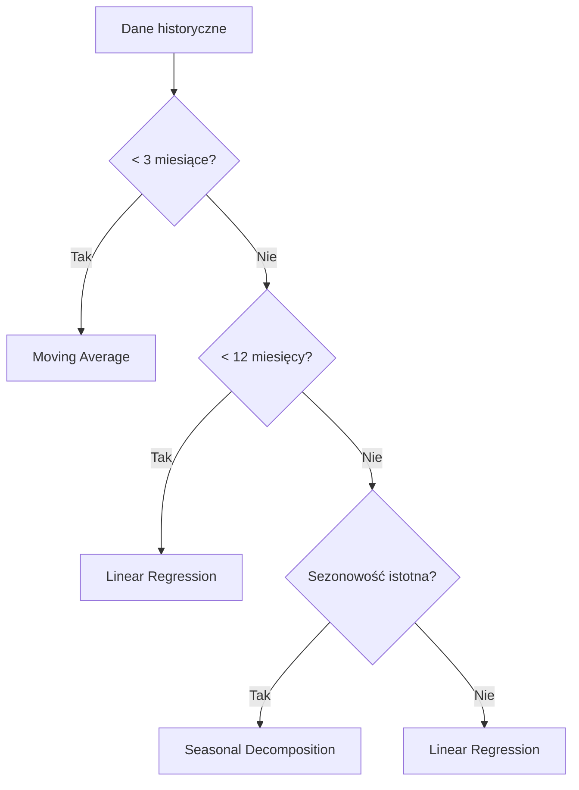
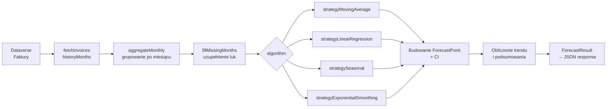
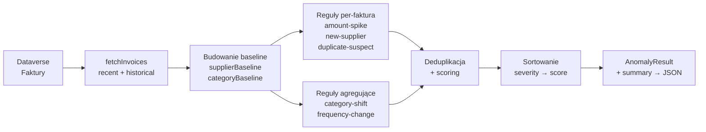

# Prognozowanie wydatków i wykrywanie anomalii

> Dokumentacja algorytmów prognozowania, reguł wykrywania anomalii, parametrów konfiguracyjnych i presetów.

---

## Spis treści

- [Prognozowanie wydatków i wykrywanie anomalii](#prognozowanie-wydatków-i-wykrywanie-anomalii)
  - [Spis treści](#spis-treści)
  - [Przegląd](#przegląd)
  - [Algorytmy prognozowania](#algorytmy-prognozowania)
    - [Podsumowanie](#podsumowanie)
    - [Auto-select (automatyczny wybór)](#auto-select-automatyczny-wybór)
    - [Weighted Moving Average (średnia krocząca ważona)](#weighted-moving-average-średnia-krocząca-ważona)
    - [Linear Regression (regresja liniowa)](#linear-regression-regresja-liniowa)
    - [Seasonal Decomposition (dekompozycja sezonowa)](#seasonal-decomposition-dekompozycja-sezonowa)
    - [Exponential Smoothing (wygładzanie wykładnicze)](#exponential-smoothing-wygładzanie-wykładnicze)
      - [Simple Exponential Smoothing (β = 0)](#simple-exponential-smoothing-β--0)
      - [Holt's Double Exponential Smoothing (β \> 0)](#holts-double-exponential-smoothing-β--0)
  - [Presety prognoz](#presety-prognoz)
  - [Przedział ufności](#przedział-ufności)
  - [Pipeline prognozowania](#pipeline-prognozowania)
  - [Reguły wykrywania anomalii](#reguły-wykrywania-anomalii)
    - [Podsumowanie reguł](#podsumowanie-reguł)
    - [Scoring i ważność](#scoring-i-ważność)
    - [Amount Spike (skok kwoty)](#amount-spike-skok-kwoty)
    - [New Supplier (nowy dostawca)](#new-supplier-nowy-dostawca)
    - [Duplicate Suspect (podejrzenie duplikatu)](#duplicate-suspect-podejrzenie-duplikatu)
    - [Category Shift (zmiana kategorii)](#category-shift-zmiana-kategorii)
    - [Frequency Change (zmiana częstotliwości)](#frequency-change-zmiana-częstotliwości)
  - [Presety anomalii](#presety-anomalii)
  - [Pipeline wykrywania anomalii](#pipeline-wykrywania-anomalii)
  - [Architektura i pliki źródłowe](#architektura-i-pliki-źródłowe)
  - [Powiązane dokumenty](#powiązane-dokumenty)

---

## Przegląd

System oferuje dwa moduły analityczne działające po stronie serwera (Azure Functions) bez zewnętrznych zależności obliczeniowych:

1. **Prognozowanie wydatków** — statystyczna predykcja przyszłych kosztów na podstawie historii faktur z Dataverse. Obsługuje 5 algorytmów z konfigurowalnymi parametrami.
2. **Wykrywanie anomalii** — identyfikacja nietypowych wzorców w fakturach: skoki kwot, nowi dostawcy, duplikaty, zmiany kategorii wydatków, zmiany częstotliwości fakturowania.

Oba moduły są dostępne przez REST API i renderowane w interfejsie webowym (zakładka „Prognoza wydatków") oraz w Power Apps Code Component.

---

## Algorytmy prognozowania

### Podsumowanie

| Algorytm | Min. danych | Najlepszy dla | Bazowa pewność |
|----------|-------------|---------------|----------------|
| Auto-select | 1 mies. | Ogólne użycie | Zależna od wybranego |
| Moving Average | 1 mies. | Stabilne, niskowanariancyjne dane | 0.30 |
| Linear Regression | 3 mies. | Dane z wyraźnym trendem liniowym | 0.40–0.80 |
| Seasonal | 12 mies. | Dane z powtarzalnym wzorcem rocznym | 0.50–0.85 |
| Exponential Smoothing | 2 mies. | Szybko zmieniające się dane | 0.35–0.75 |

---

### Auto-select (automatyczny wybór)

Tryb domyślny (`algorithm: 'auto'`). Silnik automatycznie wybiera najlepszy algorytm na podstawie ilości dostępnych danych:

**Logika:**
- **< 3 miesiące** → Weighted Moving Average (mało danych, niska pewność)
- **3–11 miesięcy** → Linear Regression z blendingiem MA
- **≥ 12 miesięcy** → Test sezonowości → jeśli istotna: Seasonal Decomposition, w przeciwnym razie Linear Regression

---

### Weighted Moving Average (średnia krocząca ważona)

**ID:** `moving-average`  
**Minimalna historia:** 1 miesiąc  
**Bazowa pewność:** 0.30

Oblicza średnią ważoną z ostatnich `windowSize` miesięcy, przypisując wyższą wagę nowszym obserwacjom. Prognoza jest stała (flat) — ten sam wynik dla każdego przyszłego miesiąca.

**Wzór:**

$$\hat{y} = \frac{\sum_{i=1}^{w} i \cdot x_{n-w+i}}{\sum_{i=1}^{w} i}$$

Gdzie:
- $w$ — rozmiar okna (`windowSize`)
- $x_i$ — kwota brutto w miesiącu $i$
- Wagi: $1, 2, 3, \ldots, w$ (ostatni miesiąc = najwyższa waga)

**Parametry:**

| Parametr | Typ | Zakres | Domyślnie | Opis |
|----------|-----|--------|-----------|------|
| `windowSize` | number | 2–12 | 3 | Liczba miesięcy do uwzględnienia |

**Kiedy stosować:**
- Dane bez wyraźnego trendu
- Niska wariancja wydatków
- Mało danych historycznych (< 3 miesiące)

---

### Linear Regression (regresja liniowa)

**ID:** `linear-regression`  
**Minimalna historia:** 3 miesiące  
**Bazowa pewność:** 0.40 + R² × 0.40 (maks. 0.80)

Prognoza oparta na regresji liniowej OLS (Ordinary Least Squares) zblendowanej ze średnią kroczącą. Parametr `blendRatio` kontroluje proporcję:

$$\hat{y}_t = r \cdot (\text{slope} \cdot t + \text{intercept}) + (1 - r) \cdot \text{MA}_6$$

Gdzie:
- $r$ — `blendRatio` (0 = czysta MA, 1 = czysta regresja)
- $\text{MA}_6$ — średnia krocząca ważona z ostatnich 6 miesięcy
- `slope`, `intercept` — współczynniki OLS

**Współczynnik determinacji R²** — mierzy jak dobrze linia regresji dopasowuje się do danych (0–1). Wyższy R² oznacza lepsze dopasowanie i wyższą pewność.

**Parametry:**

| Parametr | Typ | Zakres | Domyślnie | Opis |
|----------|-----|--------|-----------|------|
| `blendRatio` | number | 0–1 | 0.6 | Waga regresji vs średniej kroczącej |

**Kiedy stosować:**
- Wyraźny trend wzrostowy lub spadkowy
- 3+ miesięcy danych
- Brak silnej sezonowości

---

### Seasonal Decomposition (dekompozycja sezonowa)

**ID:** `seasonal`  
**Minimalna historia:** 12 miesięcy  
**Bazowa pewność:** 0.50 + R² × 0.35 (maks. 0.85)

Trzyetapowy algorytm:
1. **Obliczanie indeksów sezonowych** — dla każdego miesiąca kalendarzowego (1–12) oblicza stosunek średniej kwoty w danym miesiącu do średniej ogólnej.
2. **Desezonalizacja** — dzieli dane przez indeksy sezonowe.
3. **Regresja na desezonalizowanych danych** — prognoza bazowa z OLS.
4. **Re-aplikacja sezonowości** — mnoży prognozę bazową przez indeks sezonowy docelowego miesiąca.

$$\text{SeasonalIndex}_m = \frac{\overline{X_m}}{\overline{X}}$$

$$\hat{y}_t = (\text{slope} \cdot t + \text{intercept}) \times \text{SeasonalIndex}_{m(t)}$$

**Test istotności sezonowości:**  
Algorytm sprawdza wariancję indeksów sezonowych. Jeśli $\text{Var}(\text{indices}) < \text{significanceThreshold}$, sezonowość jest nieistotna i silnik wraca do Linear Regression.

**Parametry:**

| Parametr | Typ | Zakres | Domyślnie | Opis |
|----------|-----|--------|-----------|------|
| `significanceThreshold` | number | 0.001–0.1 | 0.01 | Próg wariancji indeksów sezonowych |

**Kiedy stosować:**
- 12+ miesięcy historii
- Powtarzalne wzorce roczne (np. wyższe wydatki w grudniu)
- Dane z wyraźną sezonowością (np. ogrzewanie zimą)

---

### Exponential Smoothing (wygładzanie wykładnicze)

**ID:** `exponential-smoothing`  
**Minimalna historia:** 2 miesiące  
**Bazowa pewność:** 0.35 + (1 − residualCV) × 0.40 (maks. 0.75)

Dwa warianty w zależności od parametru `beta`:

#### Simple Exponential Smoothing (β = 0)

Aktualizuje tylko poziom (level):

$$L_t = \alpha \cdot x_t + (1 - \alpha) \cdot L_{t-1}$$

Prognoza: $\hat{y}_{t+h} = L_t$ (stała, bez trendu)

#### Holt's Double Exponential Smoothing (β > 0)

Aktualizuje poziom i trend:

$$L_t = \alpha \cdot x_t + (1 - \alpha) \cdot (L_{t-1} + T_{t-1})$$

$$T_t = \beta \cdot (L_t - L_{t-1}) + (1 - \beta) \cdot T_{t-1}$$

Prognoza: $\hat{y}_{t+h} = L_t + h \cdot T_t$

Gdzie:
- $L_t$ — wygładzony poziom
- $T_t$ — wygładzony trend
- $\alpha$ — czynnik wygładzania poziomu
- $\beta$ — czynnik wygładzania trendu (0 = wyłącza trend)
- $h$ — horyzont (miesiące w przód)

**Parametry:**

| Parametr | Typ | Zakres | Domyślnie | Opis |
|----------|-----|--------|-----------|------|
| `alpha` | number | 0.1–0.9 | 0.3 | Czynnik wygładzania poziomu — wyższy = bardziej reaktywny |
| `beta` | number | 0–0.9 | 0 | Czynnik wygładzania trendu — 0 wyłącza komponent trendu |

**Kiedy stosować:**
- Szybko zmieniające się dane
- Potrzeba reaktywności na ostatnie zmiany
- `alpha` wysoka (0.6+) → szybka reakcja na zmiany
- `beta` > 0 → uwzględnienie trendu (Holt's method)

---

## Presety prognoz

Presety to gotowe konfiguracje algorytmu i parametrów. Użytkownik może wybrać preset zamiast ręcznej konfiguracji.

| Preset | Algorytm | Konfiguracja | Opis |
|--------|----------|-------------|------|
| **Default** | `auto` | Domyślne parametry | Automatyczny dobór algorytmu ze zbalansowanymi parametrami |
| **Conservative** | `moving-average` | `windowSize: 6` | Niższa czułość, szersze przedziały ufności, faworyzuje uśrednianie |
| **Aggressive** | `exponential-smoothing` | `alpha: 0.6, beta: 0.3` | Wysoka czułość, orientacja na trend (Holt's method) |

---

## Przedział ufności

Każdy punkt prognozy zawiera dolną (`lower`) i górną (`upper`) granicę przedziału ufności na poziomie **80%** (≈ 1.28σ).

**Obliczanie:**

$$\text{interval}_h = \hat{y}_h \times \text{CV}_\text{res} \times (1 + 0.15 \cdot h) \times 1.28$$

Gdzie:
- $\hat{y}_h$ — prognoza dla miesiąca $h$
- $\text{CV}_\text{res}$ — współczynnik zmienności reszt (residual CV), minimum 0.05
- $h$ — index miesiąca (0, 1, 2, ...)
- Faktor 0.15 — rozszerzenie przedziału o 15% na każdy kolejny miesiąc
- 1.28 — mnożnik dla 80% przedziału ufności (kwantyl rozkładu normalnego)

**Modyfikatory pewności:**
- **Niewystarczające dane** — jeśli historia jest krótsza niż `minDataPoints` algorytmu, pewność bazowa jest redukowana o 50%
- **Horyzont** — dłuższy horyzont obniża pewność: ×1.00 (1 mies.), ×0.85 (6 mies.), ×0.70 (12 mies.)

---

## Pipeline prognozowania

**Etapy:**

1. **Pobranie danych** — faktury z Dataverse filtrowane po `settingId`/`tenantNip` i dacie (domyślnie 24 miesiące wstecz)
2. **Agregacja miesięczna** — sumowanie `grossAmount` i `invoiceCount` per miesiąc. Bieżący niekompletny miesiąc jest wykluczany.
3. **Uzupełnianie luk** — `fillMissingMonths()` wstawia zerowe punkty dla brakujących miesięcy
4. **Wybór algorytmu** — auto-select lub wymuszony przez parametr `algorithm`
5. **Wykonanie strategii** — obliczenie wartości prognozowanych i residualCV
6. **Budowanie wyników** — ForecastPoint z CI, trend (up/down/stable), podsumowanie KPI

**Grupowanie:**  
Endpoint `/api/forecast/by-mpk`, `/by-category`, `/by-supplier` wykonują ten sam pipeline, ale najpierw grupują faktury po wybranym wymiarze. Każda grupa otrzymuje niezależną prognozę.

---

## Reguły wykrywania anomalii

### Podsumowanie reguł

| Reguła | Typ | Granulacja | Opis |
|--------|-----|-----------|------|
| Amount Spike | Per-faktura | Faktura vs średnia dostawcy | Skok kwoty powyżej progu Z-score |
| New Supplier | Per-faktura | Nowy dostawca vs historia | Pierwsza faktura od nieznanego dostawcy |
| Duplicate Suspect | Per-para | Faktura vs inne z okresu | Podejrzenie duplikatu (dostawca + kwota + data) |
| Category Shift | Agregat | Kategoria vs średnia miesięczna | Wydatki w kategorii powyżej średniej |
| Frequency Change | Agregat | Dostawca vs częstotliwość historyczna | Gwałtowny wzrost częstotliwości fakturowania |

### Scoring i ważność

Każda anomalia otrzymuje **score** (0–100) i **severity**:

| Score | Severity |
|-------|----------|
| 0–39 | low |
| 40–59 | medium |
| 60–79 | high |
| 80–100 | critical |

---

### Amount Spike (skok kwoty)

**ID:** `amount-spike`  
**Granulacja:** per-faktura

Dla każdej faktury w badanym okresie oblicza odchylenie od średniej dostawcy w jednostkach odchylenia standardowego (Z-score):

$$Z = \frac{x - \mu_s}{\sigma_s}$$

Gdzie:
- $x$ — kwota brutto faktury
- $\mu_s$ — średnia kwota dostawcy (z historii)
- $\sigma_s$ — odchylenie standardowe dostawcy

Anomalia jest zgłaszana gdy $Z \geq \text{zScoreThreshold}$.

**Wymagane minimum:** 3 faktury od dostawcy w historii (baseline).

**Score:** $\min(100, \lfloor Z \times 25 \rfloor)$

**Parametry:**

| Parametr | Typ | Zakres | Domyślnie | Opis |
|----------|-----|--------|-----------|------|
| `zScoreThreshold` | number | 1.0–5.0 | 2.0 | Próg Z-score powyżej którego faktura jest anomalią |

---

### New Supplier (nowy dostawca)

**ID:** `new-supplier`  
**Granulacja:** per-faktura

Flaguje faktury od dostawców, którzy nie pojawiają się w danych historycznych (baseline), pod warunkiem że kwota brutto przekracza `amountThreshold`.

**Score:** $\min(100, \lfloor \frac{x}{\text{threshold}} \times 20 \rfloor)$

**Parametry:**

| Parametr | Typ | Zakres | Domyślnie | Opis |
|----------|-----|--------|-----------|------|
| `amountThreshold` | number | 1 000–100 000 | 10 000 | Minimalna kwota brutto (PLN) do flagowania |

---

### Duplicate Suspect (podejrzenie duplikatu)

**ID:** `duplicate-suspect`  
**Granulacja:** per-para faktur  
**Stały severity:** `high` (score: 80)

Identyfikuje pary faktur, które spełniają **wszystkie** kryteria:
1. Ten sam dostawca (NIP)
2. Różnica kwot ≤ `amountTolerancePct`%
3. Różnica dat ≤ `dayWindow` dni

**Parametry:**

| Parametr | Typ | Zakres | Domyślnie | Opis |
|----------|-----|--------|-----------|------|
| `amountTolerancePct` | number | 1–20 | 5 | Maksymalna różnica kwot (%) |
| `dayWindow` | number | 1–14 | 3 | Maksymalna różnica dat (dni) |

---

### Category Shift (zmiana kategorii)

**ID:** `category-shift`  
**Granulacja:** per-kategoria (agregat)

Porównuje sumę wydatków w danej kategorii w badanym okresie ze średnią miesięczną z historii:

$$\text{deviation\%} = \frac{\text{recentTotal} - \overline{X_\text{monthly}}}{\overline{X_\text{monthly}}} \times 100$$

Anomalia jest zgłaszana gdy $\text{deviation\%} \geq \text{shiftThresholdPct}$.

**Score:** $\min(100, \lfloor \text{deviation\%} / 3 \rfloor)$

**Faktura reprezentatywna:** faktura o najwyższej kwocie brutto z danej kategorii.

**Parametry:**

| Parametr | Typ | Zakres | Domyślnie | Opis |
|----------|-----|--------|-----------|------|
| `shiftThresholdPct` | number | 10–200 | 50 | Próg procentowy powyżej średniej |

---

### Frequency Change (zmiana częstotliwości)

**ID:** `frequency-change`  
**Granulacja:** per-dostawca (agregat)

Porównuje liczbę faktur od dostawcy w badanym okresie z historyczną średnią faktur na miesiąc:

$$\text{flag gdy:} \quad \text{recentCount} \geq \text{avgPerMonth} \times \text{frequencyMultiplier}$$

**Wymagane minimum:** 3 miesiące aktywności dostawcy w historii.

**Score:** $\min(100, \lfloor \text{deviation\%} / 3 \rfloor)$

**Parametry:**

| Parametr | Typ | Zakres | Domyślnie | Opis |
|----------|-----|--------|-----------|------|
| `frequencyMultiplier` | number | 1.5–5.0 | 2.0 | Mnożnik oczekiwanej częstotliwości |

---

## Presety anomalii

| Preset | Aktywne reguły | Kluczowe nadpisania | Opis |
|--------|---------------|-------------------|------|
| **Default** | Wszystkie 5 | Domyślne parametry | Zbalansowane wykrywanie ze standardowymi progami |
| **Conservative** | amount-spike, new-supplier, duplicate-suspect | Z-score: 3.0, kwota: 25 000 PLN, tolerancja: 3%, okno: 2 dni | Wyższe progi — tylko oczywiste anomalie, mniej fałszywych alarmów |
| **Aggressive** | Wszystkie 5 | Z-score: 1.5, kwota: 5 000 PLN, tolerancja: 10%, okno: 5 dni, shift: 30%, freq: 1.5× | Niższe progi — więcej wykrytych anomalii, ale też więcej fałszywych alarmów |

---

## Pipeline wykrywania anomalii

**Etapy:**

1. **Pobranie danych** — dwa zestawy: „recent" (badany okres, domyślnie 30 dni) i „historical" (12 miesięcy wstecz od początku okresu badanego)
2. **Budowanie baseline** — statystyki per dostawca (średnia, odchylenie, częstotliwość) i per kategoria (średnia miesięczna)
3. **Wykonanie reguł per-faktura** — Amount Spike, New Supplier, Duplicate Suspect — iteracja po fakturach z badanego okresu
4. **Wykonanie reguł agregujących** — Category Shift (po kategoriach), Frequency Change (po dostawcach)
5. **Deduplikacja** — usunięcie duplikatów po `anomaly.id`
6. **Sortowanie** — najpierw po severity (critical → low), potem po score malejąco
7. **Podsumowanie** — `AnomalySummary` z liczbami per severity, per typ, łączna kwota

---

## Architektura i pliki źródłowe

| Plik | Warstwa | Opis |
|------|---------|------|
| `api/src/lib/forecast/engine.ts` | Backend | Algorytmy prognozowania, typy, deskryptory |
| `api/src/lib/forecast/anomalies.ts` | Backend | Reguły anomalii, deskryptory, presety |
| `api/src/functions/forecast.ts` | Backend | HTTP handlery prognoz + rejestracja route'ów |
| `api/src/functions/anomalies.ts` | Backend | HTTP handlery anomalii + rejestracja route'ów |
| `web/src/lib/forecast-metadata.ts` | Frontend | Fallback metadane (gdy API niedostępne) |
| `web/src/hooks/use-api.ts` | Frontend | React Query hooki (`useForecastAlgorithms`, `useAnomalyRules`) |
| `web/src/components/forecast/` | Frontend | Komponenty UI prognoz i anomalii |
| `web/src/app/api/forecast/algorithms/route.ts` | Frontend | Next.js route handler z fallbackiem |
| `web/src/app/api/anomalies/rules/route.ts` | Frontend | Next.js route handler z fallbackiem |

---

## Powiązane dokumenty

- [Dokumentacja API](./API.md) — endpointy REST (sekcje: Prognoza wydatków, Wykrywanie anomalii)
- [Architektura](./ARCHITEKTURA.md) — diagram przepływu modułu prognozowania
- [Wersja angielska](../en/FORECASTING_AND_ANOMALIES.md) — English version

---

**Ostatnia aktualizacja:** 2026-02-23  
**Wersja:** 1.0  
**Opiekun:** dvlp-dev team
